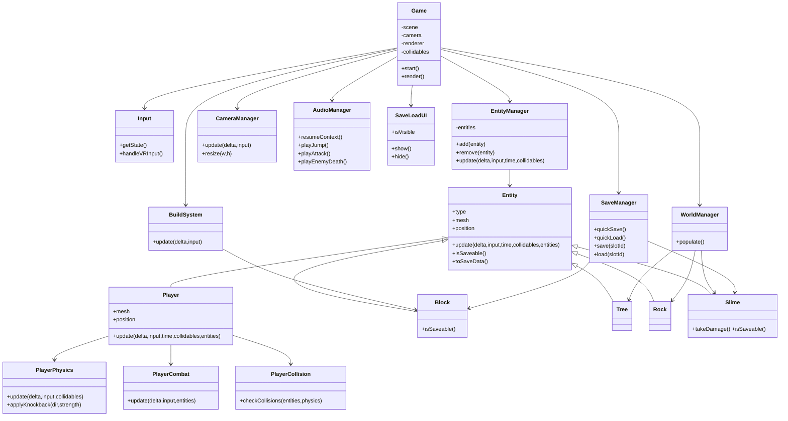

# Class Diagram

以下は主要クラスの関係を示す簡易クラス図です（Mermaid形式）。ObsidianのMermaid対応で閲覧してください。

```mermaid
classDiagram
    class Game {
      -scene
      -camera
      -renderer
      -collidables
      +start()
      +render()
    }
    class Input {
      +getState()
      +handleVRInput()
    }
    class EntityManager {
      -entities
      +add(entity)
      +remove(entity)
      +update(delta,input,time,collidables)
    }
    class Entity {
      +type
      +mesh
      +position
      +update(delta,input,time,collidables,entities)
      +isSaveable()
      +toSaveData()
    }
    class Player {
      +mesh
      +position
      +update(delta,input,time,collidables,entities)
    }
    class PlayerPhysics {
      +update(delta,input,collidables)
      +applyKnockback(dir,strength)
    }
    class PlayerCombat {
      +update(delta,input,entities)
    }
    class PlayerCollision {
      +checkCollisions(entities,physics)
    }
    class BuildSystem {
      +update(delta,input)
    }
    class WorldManager {
      +populate()
    }
    class CameraManager {
      +update(delta,input)
      +resize(w,h)
    }
    class AudioManager {
      +resumeContext()
      +playJump()
      +playAttack()
      +playEnemyDeath()
    }
    class SaveManager {
      +quickSave()
      +quickLoad()
      +save(slotId)
      +load(slotId)
    }
    class SaveLoadUI {
      +show()
      +hide()
      +isVisible
    }
    class Block { +isSaveable() }
    class Tree
    class Rock
    class Slime { +takeDamage() +isSaveable() }

    Game --> Input
    Game --> EntityManager
    Game --> CameraManager
    Game --> AudioManager
    Game --> WorldManager
    Game --> BuildSystem
    Game --> SaveManager
    Game --> SaveLoadUI

    EntityManager --> Entity
    Entity <|-- Player
    Entity <|-- Block
    Entity <|-- Tree
    Entity <|-- Rock
    Entity <|-- Slime

    Player --> PlayerPhysics
    Player --> PlayerCombat
    Player --> PlayerCollision

    BuildSystem --> Block
    WorldManager --> Tree
    WorldManager --> Rock
    WorldManager --> Slime
    SaveManager --> Block
    SaveManager --> Slime
```
