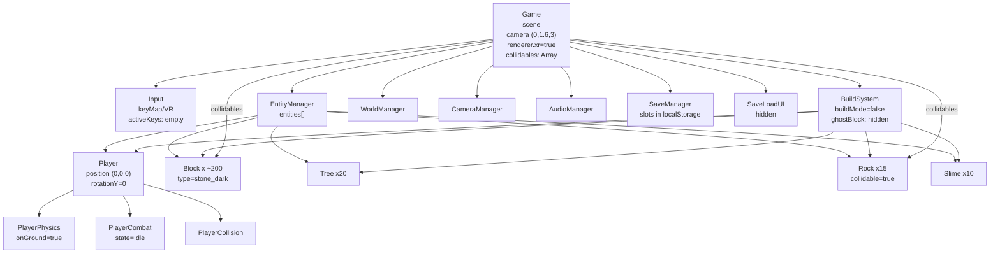

# Object Diagram (Game Start)

ゲーム起動直後の主要オブジェクト構成を示します（Mermaid）。件数の多いものはまとめています。

補足:
- `collidables` には城ブロックとRockが初期登録（Tree/Slimeは非衝突）。
- ゴーストブロックはビルドモードOFFのため非表示。
- セーブUIは非表示、通知用のDOMオーバーレイは作成済み。
- `localStorage` に既存セーブがあればスロット取得可能だが、初回は空。
