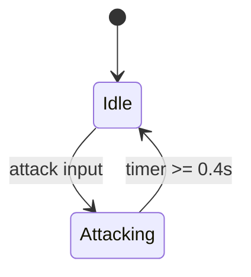
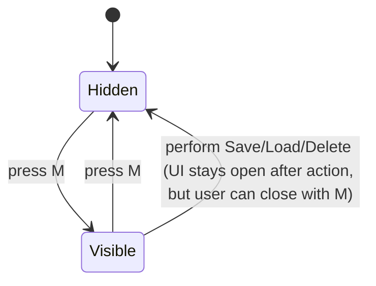
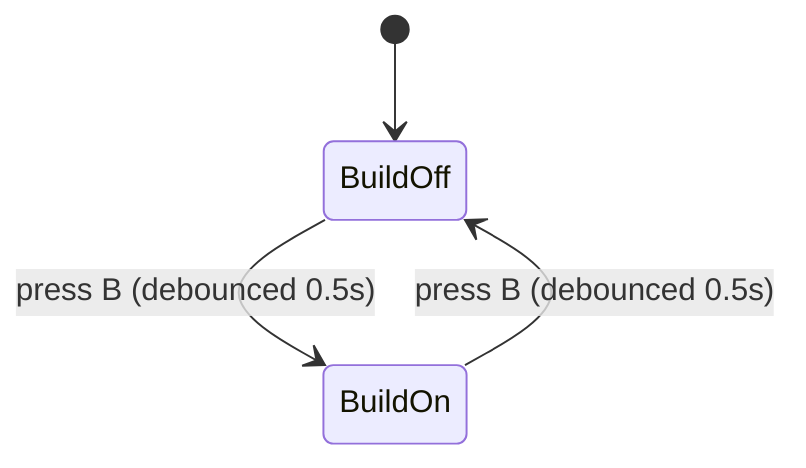
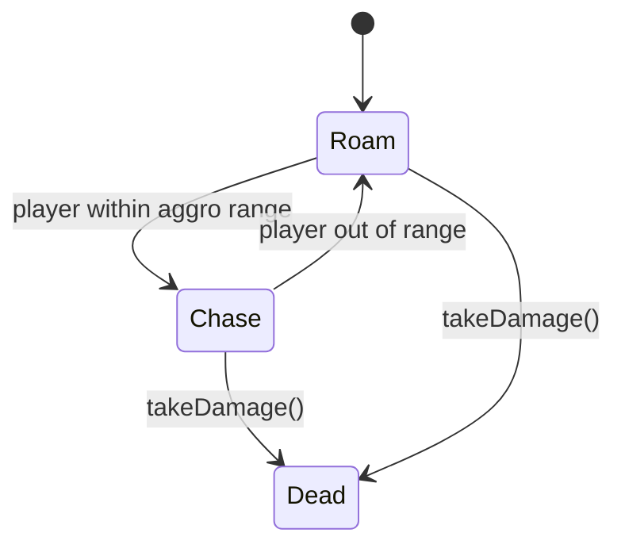

# State Diagrams

主要な状態遷移をMermaidで示します。

## Player Combat State

## Save/Load Menu Visibility

## Build Mode

## Slime (簡易挙動)

必要に応じて状態やガード条件を追加してください。`PlayerPhysics` など物理系は連続値での更新が中心のため状態機械は簡略化しています。
