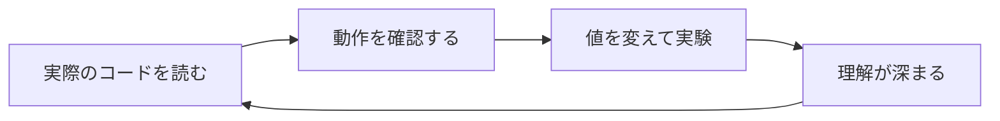

---
tags:
  - はじめに
  - 入門
  - 概要
chapter: 0
status: 完了
prev: null
next: "[[01_学習の進め方]]"
created: 2025-11-23
---

# このドキュメントについて

> [!abstract] 概要
> このドキュメントは、実際の3Dゲームのソースコードを教材として、プログラミングを実践的に学ぶための入門書です。

---

## このドキュメントの目的

このドキュメントは、**「フェルトうさぎパラディン」** という3Dゲームのソースコードを通じて、以下のスキルを身につけることを目的としています：

- **JavaScript** の基礎から応用
- **Three.js** による3Dグラフィックス
- **ゲーム開発** の基本的な考え方
- **オブジェクト指向プログラミング** の実践

> [!tip] 実践ファーストの学習
> 抽象的な説明だけでなく、**実際に動くコード**を読みながら学びます。
> 「なぜこう書くのか？」を常に意識しながら進めていきましょう。

---

## 対象読者

このドキュメントは、以下のような方を対象としています：

### 想定する読者

| レベル | 説明 |
|--------|------|
| プログラミング初心者 | 他の言語を少しだけ触ったことがある |
| JavaScript入門者 | JavaScriptを学び始めたばかり |
| ゲーム開発に興味がある | ゲームがどう作られるか知りたい |
| Three.js入門者 | 3Dグラフィックスに挑戦したい |

### 前提知識

> [!info] 最低限必要な知識
> - パソコンの基本操作ができる
> - テキストエディタを使ったことがある
> - 「変数」「関数」という言葉を聞いたことがある（詳しく知らなくてもOK）

### こんな方におすすめ

- 📚 教科書的な学習に飽きた
- 🎮 ゲームを作りながら学びたい
- 💻 実際のコードを読んでみたい
- 🔧 手を動かしながら理解したい

---

## 学習するゲームについて

### フェルトうさぎパラディン

このドキュメントで学習に使用するゲームは、**フェルトうさぎパラディン**という3Dアクションゲームです。

```
┌─────────────────────────────────────┐
│                                     │
│    🐰 フェルトうさぎパラディン      │
│                                     │
│    ・フェルト質感のキャラクター     │
│    ・3D空間を自由に探索             │
│    ・ブロックを配置して建築         │
│    ・スライムとの戦闘               │
│    ・VR対応                         │
│                                     │
└─────────────────────────────────────┘
```

### 主な機能

| 機能 | 説明 | 学べること |
|------|------|-----------|
| 3D描画 | Three.jsによる3D空間 | グラフィックスの基礎 |
| キャラクター操作 | WASDキーで移動 | 入力処理、物理演算 |
| 戦闘システム | 剣で攻撃 | ステートパターン |
| 建築機能 | ブロック配置 | レイキャスト |
| セーブ機能 | 進行状況の保存 | データ永続化 |

---

## このドキュメントの特徴

### 1. 実践的なアプローチ



理論だけでなく、**実際に動くコード**を教材にします。

### 2. 段階的な学習

簡単なファイルから複雑なファイルへ、段階的に進みます。

```
index.html → main.js → Game.js → Player.js → ...
（簡単）                              （複雑）
```

### 3. 丁寧な解説

コードの1行1行を丁寧に解説します。

```javascript
const game = new Game();  // ← この行が何をしているか説明します
game.start();             // ← この行も詳しく説明します
```

### 4. 手を動かす

各章に「実験してみよう」セクションがあります。

> [!question] 実験の例
> 「ジャンプの高さを変えてみよう」
> 「キャラクターの色を変えてみよう」

---

## ドキュメントの構成

このドキュメントは、以下のセクションで構成されています：

| セクション | 内容 |
|-----------|------|
| [[00_はじめに/_MOC_はじめに\|00 はじめに]] | 準備と概要（今ここ） |
| [[01_基礎編/_MOC_基礎編\|01 基礎編]] | HTML、npm、ES Modules |
| [[02_Three.js入門編/_MOC_Three.js入門編\|02 Three.js入門編]] | Three.jsの基本 |
| [[03_オブジェクト指向編/_MOC_オブジェクト指向編\|03 オブジェクト指向編]] | クラスと継承 |
| [[04_3Dグラフィックス編/_MOC_3Dグラフィックス編\|04 3Dグラフィックス編]] | 3Dモデル構築 |
| [[05_ゲームメカニクス編/_MOC_ゲームメカニクス編\|05 ゲームメカニクス編]] | 物理、戦闘、AI |
| [[06_システム編/_MOC_システム編\|06 システム編]] | セーブ、サウンド |
| [[07_付録/_MOC_付録\|07 付録]] | リファレンス |

---

## 表記について

このドキュメントでは、以下の表記を使用します：

### コードブロック

```javascript
// JavaScriptのコード
const message = "Hello, World!";
console.log(message);
```

### 注釈ブロック

> [!tip] ヒント
> 知っておくと便利な情報

> [!warning] 注意
> 気をつけるべきポイント

> [!info] 補足
> 追加の説明

> [!question] 考えてみよう
> 理解を深めるための問いかけ

### 用語

専門用語は **太字** で示し、初出時に説明します。
詳しくは [[07_付録/03_用語集|用語集]] を参照してください。

---

## さあ、始めましょう！

準備はいいですか？次の章で、学習の進め方を確認しましょう。

> [!success] 次のステップ
> [[01_学習の進め方]] に進んで、効果的な学習方法を確認しましょう。

---

## 関連リンク

- [[01_学習の進め方|次の章: 学習の進め方]]
- [[00_はじめに/_MOC_はじめに|セクション目次に戻る]]
- [[_MOC_入門レベル|入門レベル目次に戻る]]
