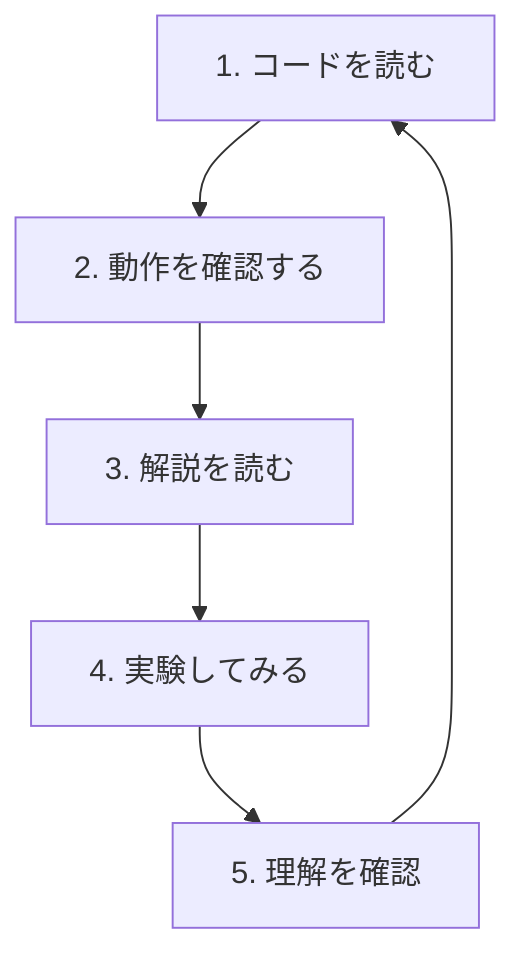

---
tags:
  - はじめに
  - 学習方法
  - ガイド
chapter: 1
status: 完了
prev: "[[00_このドキュメントについて]]"
next: "[[02_開発環境セットアップ]]"
created: 2025-11-23
---

# 学習の進め方

> [!abstract] 概要
> 効果的に学習を進めるためのガイドラインを紹介します。

---

## 学習の流れ

このドキュメントは、以下の流れで学習を進めることを想定しています：



### 1. コードを読む

まず、対象のソースコードを **じっくり読みます**。

> [!tip] 読み方のコツ
> - 最初は全体の構造を把握する
> - 分からない部分があっても、まず最後まで目を通す
> - 気になる箇所にはメモを取る

### 2. 動作を確認する

実際にゲームを動かして、**コードがどう動くか**を確認します。

```bash
# 開発サーバーを起動
npm run dev
```

ブラウザで `http://localhost:5173` を開いて動作を確認しましょう。

### 3. 解説を読む

このドキュメントの解説を読んで、**なぜそう書くのか**を理解します。

### 4. 実験してみる

値を変えたり、コードを追加したりして、**自分で試してみます**。

> [!question] 実験の例
> - 数値を変えてみる（速度、大きさ、色など）
> - console.log を追加して値を確認する
> - コメントアウトして動作の変化を見る

### 5. 理解を確認

章末の「まとめ」で、学んだことを振り返ります。

---

## おすすめの学習スタイル

### 🎯 能動的に学ぶ

```
❌ ただ読むだけ
✅ 手を動かしながら読む
```

コードを読むだけでなく、**実際に動かして**みましょう。

### 📝 メモを取る

```
❌ 読んで終わり
✅ 気づいたことをメモする
```

Obsidianを使っているなら、各ページに自分のメモを追加しましょう。

### 🔄 繰り返す

```
❌ 一度読んで完璧に理解しようとする
✅ 何度も読み返す
```

分からなくても先に進み、後で戻ってくると理解が深まります。

### ❓ 疑問を持つ

```
❌ 書いてあることをそのまま受け入れる
✅ 「なぜ？」と問いかける
```

「なぜこう書くのか？」「他の方法はないのか？」と考えましょう。

---

## 学習のペース

### 推奨ペース

| セクション | 目安 |
|-----------|------|
| 00 はじめに | 1日 |
| 01 基礎編 | 2-3日 |
| 02 Three.js入門編 | 3-4日 |
| 03 オブジェクト指向編 | 3-4日 |
| 04 3Dグラフィックス編 | 2-3日 |
| 05 ゲームメカニクス編 | 4-5日 |
| 06 システム編 | 3-4日 |

> [!info] あくまで目安です
> 自分のペースで進めてください。理解することが最優先です。

### 休憩の大切さ

```
学習 → 休憩 → 学習 → 休憩 → ...
```

- 25分学習したら5分休憩（ポモドーロテクニック）
- 疲れたら無理せず休む
- 睡眠は記憶の定着に重要

---

## つまずいたときは

### 1. まず落ち着く

> [!tip] 大丈夫です
> プログラミングは誰でも最初はつまずきます。
> それは学習の一部です。

### 2. エラーメッセージを読む

```
❌ エラーが出た！パニック！
✅ エラーメッセージを読んで原因を探る
```

エラーメッセージには、問題の原因が書いてあります。

### 3. 用語集を確認

分からない用語があれば、[[07_付録/03_用語集|用語集]] を確認しましょう。

### 4. 前の章に戻る

理解が不十分な場合は、前の章に戻って復習しましょう。

### 5. トラブルシューティングを見る

よくある問題は [[07_付録/04_トラブルシューティング|トラブルシューティング]] にまとめています。

### 6. 検索する

```
Google: "JavaScript [エラーメッセージ]"
```

エラーメッセージで検索すると、解決策が見つかることが多いです。

---

## 学習環境の準備

効果的に学習するために、以下の環境を整えましょう：

### 必須

- [ ] テキストエディタ（VS Code推奨）
- [ ] ブラウザ（Chrome推奨）
- [ ] Node.js
- [ ] このプロジェクトのソースコード

### あると便利

- [ ] デュアルモニター（コードと解説を同時に見る）
- [ ] メモ帳（紙でもデジタルでも）

詳しくは次の章 [[02_開発環境セットアップ]] で説明します。

---

## 学習チェックリスト

各章を学習したら、以下のチェックリストを確認しましょう：

- [ ] コードを読んだ
- [ ] 実際に動かして確認した
- [ ] 解説を理解した
- [ ] 「実験してみよう」を試した
- [ ] 分からない用語を調べた
- [ ] まとめを確認した

---

## モチベーションを保つコツ

### 🎮 ゲームを動かす楽しさを忘れない

学習の過程で、実際にゲームが動く瞬間を楽しみましょう。

### 📈 小さな成功を積み重ねる

```
「1行理解できた」→ 成功！
「値を変えて動いた」→ 成功！
「エラーを解決できた」→ 大成功！
```

### 🗓️ 定期的に振り返る

```
1週間前: Game.jsが分からなかった
今日: Game.jsの構造が理解できた！
```

成長を実感することで、モチベーションが維持できます。

---

## さあ、環境を整えましょう

学習の進め方が分かったら、次は開発環境のセットアップです。

> [!success] 次のステップ
> [[02_開発環境セットアップ]] に進んで、開発環境を整えましょう。

---

## 関連リンク

- [[00_このドキュメントについて|前の章: このドキュメントについて]]
- [[02_開発環境セットアップ|次の章: 開発環境セットアップ]]
- [[00_はじめに/_MOC_はじめに|セクション目次に戻る]]
- [[_MOC_入門レベル|入門レベル目次に戻る]]
