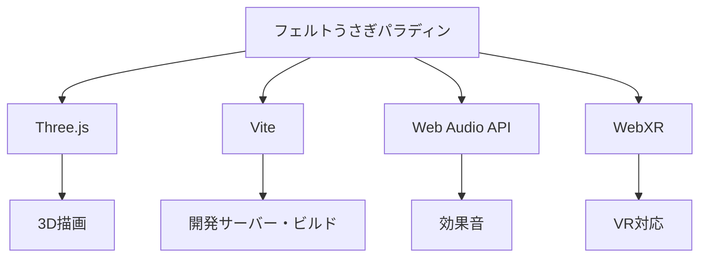
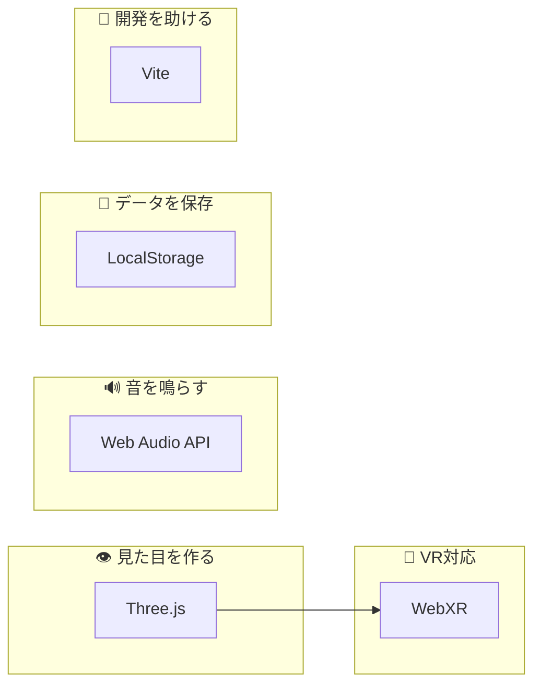
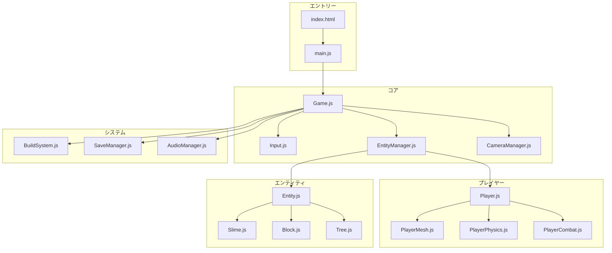
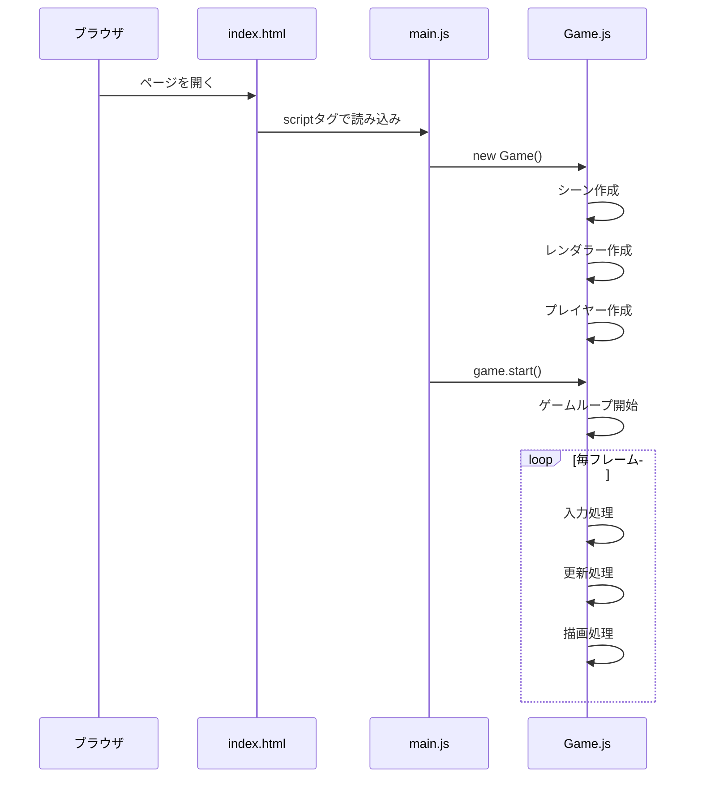
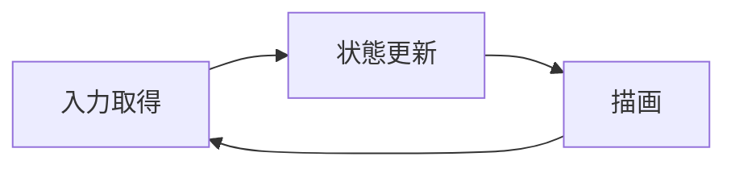
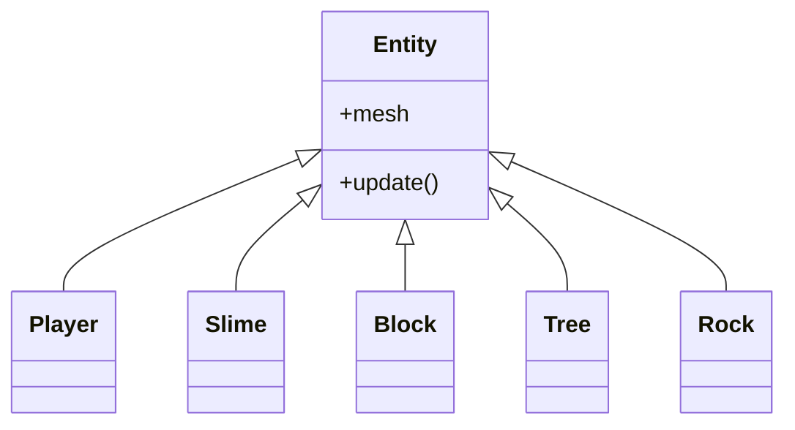
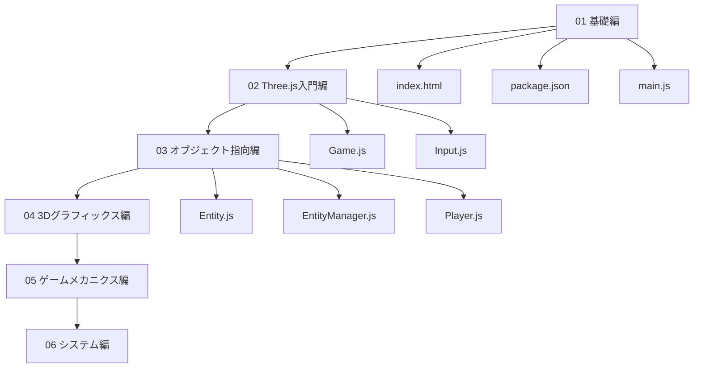

---
tags:
  - はじめに
  - プロジェクト概要
  - アーキテクチャ
chapter: 3
status: 完了
prev: "[[02_開発環境セットアップ]]"
next: "[[04_アーキテクチャ概要]]"
created: 2025-11-23
---

# プロジェクト概要

> [!abstract] 概要
> このプロジェクト「フェルトうさぎパラディン」の全体像を把握します。

---

## ゲームの紹介

### フェルトうさぎパラディン

フェルト質感のかわいいウサギを操作する3Dアクションゲームです。

```
╔════════════════════════════════════════╗
║                                        ║
║    🐰 フェルトうさぎパラディン         ║
║                                        ║
║    Three.js で作られた 3D ゲーム       ║
║                                        ║
║    ・探索・戦闘・建築が楽しめる        ║
║    ・VR にも対応                       ║
║                                        ║
╚════════════════════════════════════════╝
```

### 操作方法

| キー | 動作 |
|------|------|
| W / ↑ | 前進 |
| S / ↓ | 後退 |
| A / ← | 左回転 |
| D / → | 右回転 |
| Space | ジャンプ |
| F | 攻撃 |
| B | ビルドモード |
| V | 視点切り替え（FPS/TPS） |
| K | クイックセーブ |
| L | クイックロード |
| M | セーブメニュー |

---

## 技術スタック

このプロジェクトで使用している技術を紹介します。

> [!tip] 初めての方へ
> ここで紹介する技術をすべて理解する必要はありません。「こんな技術が使われているんだな」という程度で大丈夫です。学習を進める中で自然と身についていきます。

### 主要技術



| 技術 | 用途 | 学ぶ章 |
|------|------|--------|
| **Three.js** | 3Dグラフィックス | [[02_Three.js入門編/_MOC_Three.js入門編\|02 Three.js入門編]] |
| **Vite** | 開発サーバー・ビルド | [[01_基礎編/02_パッケージ管理_package.json\|02 パッケージ管理]] |
| **Web Audio API** | 効果音生成 | [[06_システム編/03_サウンド_AudioManager.js\|03 サウンド]] |
| **WebXR** | VR対応 | （本ドキュメントでは詳細は省略） |
| **LocalStorage** | データ保存 | [[06_システム編/02_セーブ機能_SaveManager.js\|02 セーブ機能]] |

---

### 各技術の詳しい解説

それぞれの技術が「何をするものか」「なぜ必要か」を説明します。

#### Three.js とは？

**Three.js** は、ブラウザで3Dグラフィックスを表示するためのライブラリです。

```
┌─────────────────────────────────────────────────────────┐
│  あなたのコード（JavaScript）                            │
│  「立方体を作って、赤く塗って、回転させて」              │
├─────────────────────────────────────────────────────────┤
│  Three.js                                               │
│  「了解！WebGL に翻訳して伝えるね」                      │
├─────────────────────────────────────────────────────────┤
│  WebGL（ブラウザの機能）                                │
│  「GPU に命令を送るよ」                                 │
├─────────────────────────────────────────────────────────┤
│  GPU（グラフィックカード）                              │
│  「画面に描画！」                                       │
└─────────────────────────────────────────────────────────┘
```

**Three.js の役割:**
- 3Dオブジェクト（立方体、球など）の作成
- カメラの配置と制御
- 光源（ライト）の設定
- 色や質感（マテリアル）の設定
- 毎フレームの描画処理

> [!info] なぜ Three.js を使うのか？
> WebGL を直接使うと、立方体1つ表示するのに数百行のコードが必要です。Three.js を使えば数行で同じことができます。Three.js は「難しいことを簡単に書ける」ようにしてくれる便利な道具です。

#### Vite とは？

**Vite**（ヴィート）は、開発を快適にするツールです。

```
┌─────────────────────────────────────────────────────────┐
│  Vite の役割                                            │
├─────────────────────────────────────────────────────────┤
│  1. 開発サーバー                                        │
│     → http://localhost:5173 でゲームを動かせる          │
│                                                         │
│  2. ホットリロード                                      │
│     → コードを保存すると自動でブラウザが更新される      │
│                                                         │
│  3. モジュール解決                                      │
│     → import 文を正しく処理してくれる                   │
│                                                         │
│  4. 本番ビルド                                          │
│     → 公開用にファイルを最適化してくれる                │
└─────────────────────────────────────────────────────────┘
```

#### Web Audio API とは？

**Web Audio API** は、ブラウザで音を鳴らすための機能です。

```
┌─────────────────────────────────────────────────────────┐
│  Web Audio API でできること                             │
├─────────────────────────────────────────────────────────┤
│  ・効果音を鳴らす（攻撃音、ジャンプ音など）             │
│  ・音の波形を生成する（ピー、ブー など）                │
│  ・音量を調整する                                       │
│  ・音にエフェクトをかける（エコーなど）                 │
└─────────────────────────────────────────────────────────┘
```

本プロジェクトでは、音声ファイルを使わずに **プログラムで音を生成** しています。これにより、追加のファイルなしで効果音を実現しています。

#### WebXR とは？

**WebXR** は、ブラウザでVR（仮想現実）やAR（拡張現実）を実現するための機能です。

```
┌─────────────────────────────────────────────────────────┐
│  Three.js と WebXR の関係                               │
├─────────────────────────────────────────────────────────┤
│                                                         │
│  Three.js                    WebXR                      │
│  ┌─────────────────┐        ┌─────────────────┐        │
│  │ 3Dの世界を作る   │        │ VRゴーグルと     │        │
│  │ ・オブジェクト   │───────→│ 連携する         │        │
│  │ ・カメラ         │        │ ・頭の動き追跡   │        │
│  │ ・ライト         │        │ ・両目用の描画   │        │
│  └─────────────────┘        └─────────────────┘        │
│         ↓                           ↓                  │
│    「何を表示するか」          「どう表示するか」        │
│                                                         │
└─────────────────────────────────────────────────────────┘
```

| 項目 | Three.js | WebXR |
|------|----------|-------|
| **役割** | 3Dの世界を作る | VR/AR機器と連携する |
| **担当** | オブジェクト、カメラ、ライト | ヘッドセット、コントローラー |
| **例え** | 映画のセットを作るスタッフ | 映画館の設備（スクリーン、座席） |

> [!note] 本ドキュメントでの扱い
> WebXR は発展的な内容のため、本ドキュメントでは詳細な解説を省略しています。通常のPC/スマホでのプレイに必要な Three.js の知識を優先して学びます。

#### LocalStorage とは？

**LocalStorage** は、ブラウザにデータを保存する機能です。

```
┌─────────────────────────────────────────────────────────┐
│  LocalStorage の特徴                                    │
├─────────────────────────────────────────────────────────┤
│  ・ブラウザを閉じてもデータが残る                       │
│  ・約5MBまで保存できる                                  │
│  ・文字列（テキスト）しか保存できない                   │
│    → オブジェクトは JSON に変換して保存                 │
│  ・同じブラウザ・同じサイトでのみアクセス可能           │
└─────────────────────────────────────────────────────────┘
```

本プロジェクトでは、プレイヤーの位置やブロックの配置などをセーブデータとして保存しています。

---

### 技術の役割分担まとめ



| 技術 | 一言で言うと | 本プロジェクトでの使い方 |
|------|-------------|------------------------|
| **Three.js** | 3Dを描く | ウサギ、スライム、ブロック、地面など全ての3D表示 |
| **Vite** | 開発を楽にする | コードの変更をすぐ反映、ファイルの読み込み |
| **Web Audio API** | 音を鳴らす | 攻撃音、ジャンプ音などの効果音 |
| **WebXR** | VRで遊べるようにする | VRゴーグルでの操作（発展的機能） |
| **LocalStorage** | データを保存する | セーブデータの保存と読み込み |

### 言語

- **JavaScript**（ES Modules）
- **HTML5**
- **CSS3**

---

## プロジェクト構成

### フォルダ構造

```
gemini_3d_demo_20251119_001/
│
├── index.html              ← HTMLエントリーポイント
├── package.json            ← プロジェクト設定
├── package-lock.json       ← 依存関係のロック
├── vite.config.js          ← Vite設定（ビルドツール）
├── vitest.config.js        ← テスト設定
│
├── src/                    ← ソースコード（メイン）
│   ├── main.js             ← JavaScriptエントリーポイント
│   ├── Game.js             ← ゲームのメインクラス
│   ├── Input.js            ← 入力管理
│   ├── Player.js           ← プレイヤー
│   ├── PlayerMesh.js       ← プレイヤーの3Dモデル
│   ├── PlayerPhysics.js    ← プレイヤーの物理演算
│   ├── PlayerCombat.js     ← プレイヤーの戦闘
│   ├── PlayerCollision.js  ← プレイヤーの衝突判定
│   ├── Entity.js           ← エンティティ基本クラス
│   ├── EntityManager.js    ← エンティティ管理
│   ├── Slime.js            ← スライム（敵）
│   ├── Block.js            ← 配置ブロック
│   ├── Tree.js             ← 木
│   ├── Rock.js             ← 岩
│   ├── WorldManager.js     ← ワールド生成
│   ├── BuildSystem.js      ← 建築システム
│   ├── CameraManager.js    ← カメラ管理
│   ├── SaveManager.js      ← セーブ管理
│   ├── SaveLoadUI.js       ← セーブUI
│   ├── AudioManager.js     ← 音声管理
│   └── __tests__/          ← テストファイル
│
├── public/                 ← 静的ファイル
│   └── assets/
│       └── rabbit.png
│
└── node_modules/           ← 依存パッケージ（自動生成）
```

### ファイルの役割

主要なファイルの役割を図で示します：



---

## 起動の流れ

ゲームがどのように起動するかを理解しましょう：



### コードで見る起動の流れ

**1. index.html**
```html
<script type="module" src="/src/main.js"></script>
```

**2. main.js**
```javascript
import { Game } from './Game.js';

const game = new Game();
game.start();
```

**3. Game.js（概要）**
```javascript
class Game {
    constructor() {
        // シーン、カメラ、レンダラーを作成
        // プレイヤー、エンティティを初期化
    }

    start() {
        // ゲームループを開始
    }

    render() {
        // 毎フレーム呼ばれる処理
    }
}
```

---

## ゲームループ

ゲームは **ゲームループ** によって動作します：



### 毎フレームの処理

1. **入力取得**: キーボード・マウスの状態を取得
2. **状態更新**: プレイヤー、敵、物理演算などを更新
3. **描画**: 3Dシーンをレンダリング

これが **60fps**（1秒間に60回）で繰り返されます。

> [!info] fps とは
> **fps（frames per second）** は、1秒間に何回画面が更新されるかを示します。
> 60fps なら、約16.7ミリ秒ごとに1フレーム処理されます。

---

## 主要なシステム

### 1. エンティティシステム

ゲーム内のオブジェクト（プレイヤー、敵、ブロックなど）は **エンティティ** として管理されます。



詳しくは [[03_オブジェクト指向編/01_エンティティの基礎_Entity.js|エンティティの基礎]] で学びます。

### 2. 物理演算

プレイヤーの移動、ジャンプ、衝突判定を担当します。

- 重力の適用
- 速度計算
- 衝突判定（AABB）

詳しくは [[05_ゲームメカニクス編/01_物理演算_PlayerPhysics.js|物理演算]] で学びます。

### 3. 戦闘システム

プレイヤーの攻撃と敵へのダメージ処理を担当します。

- ステートパターン（待機/攻撃）
- 攻撃アニメーション
- ダメージ判定

詳しくは [[05_ゲームメカニクス編/02_戦闘システム_PlayerCombat.js|戦闘システム]] で学びます。

### 4. 建築システム

ブロックを配置・削除する機能です。

- レイキャストによる配置位置の決定
- ゴーストブロック表示

詳しくは [[06_システム編/01_ビルドシステム_BuildSystem.js|ビルドシステム]] で学びます。

### 5. セーブシステム

ゲームの進行状況を保存・読み込みする機能です。

- LocalStorage によるデータ保存
- JSON 形式でのシリアライズ

詳しくは [[06_システム編/02_セーブ機能_SaveManager.js|セーブ機能]] で学びます。

---

## 学習の道のり

これから以下の順番で学習を進めていきます：



---

## 次のステップ

プロジェクトの全体像が把握できました。

次は、システムの設計構造（アーキテクチャ）を俯瞰しましょう。

> [!success] 次のステップ
> [[04_アーキテクチャ概要|04 アーキテクチャ概要]] に進んで、システム間の依存関係やデータの流れを理解しましょう。

---

## 関連リンク

- [[02_開発環境セットアップ|前の章: 開発環境セットアップ]]
- [[04_アーキテクチャ概要|次の章: アーキテクチャ概要]]
- [[00_はじめに/_MOC_はじめに|セクション目次に戻る]]
- [[_MOC_入門レベル|入門レベル目次に戻る]]
