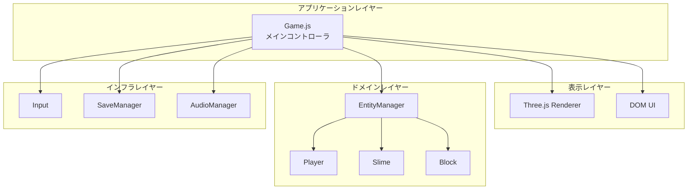
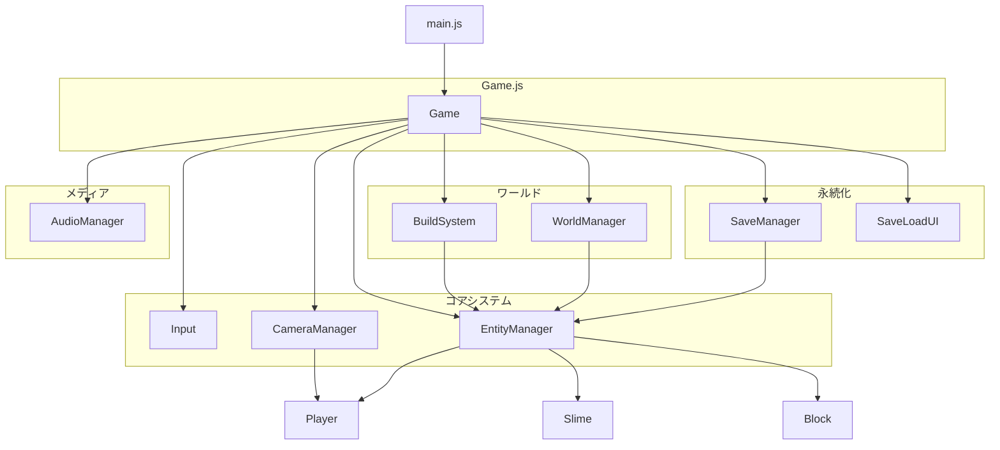
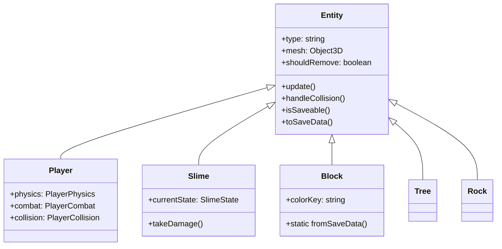
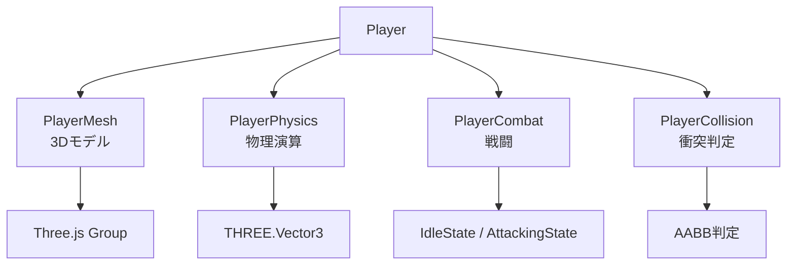
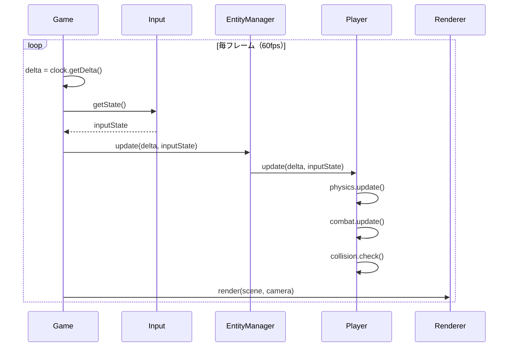
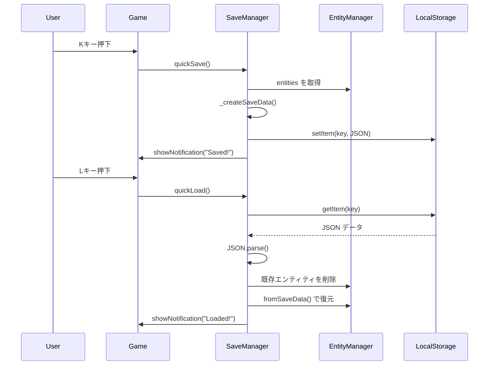
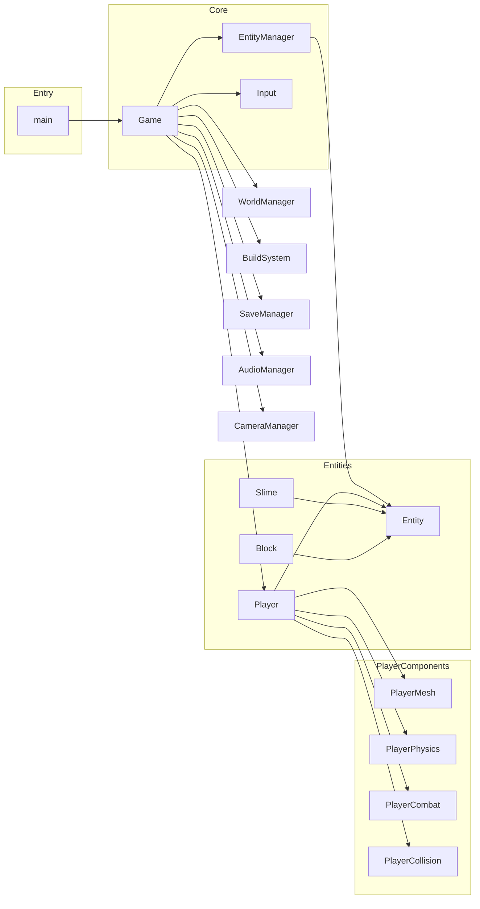
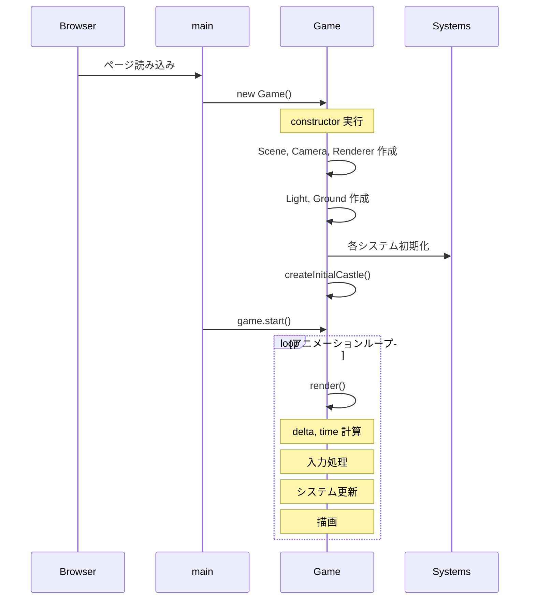
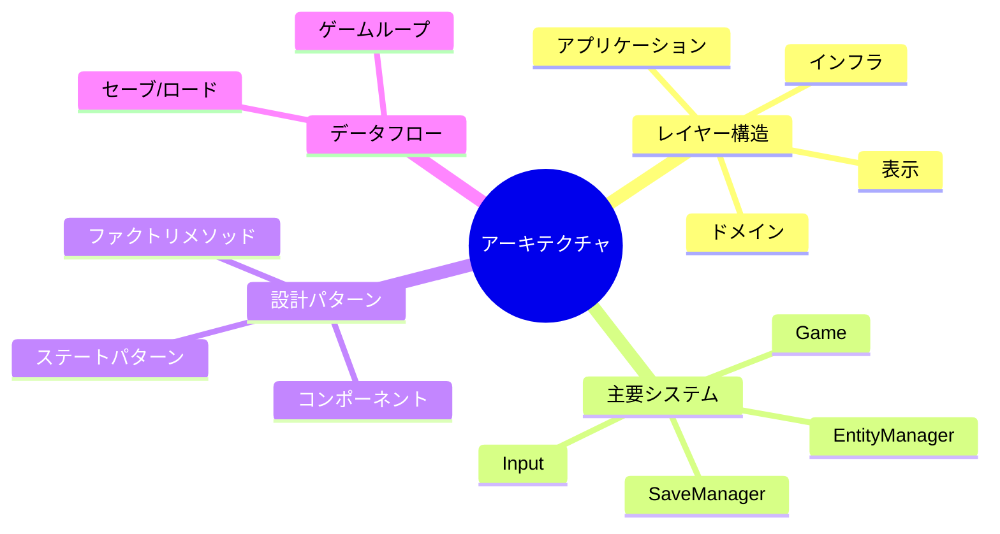

---
tags:
  - はじめに
  - アーキテクチャ
  - 設計
  - 概要
chapter: 4
status: 完了
prev: "[[03_プロジェクト概要]]"
next: "[[01_基礎編/_MOC_基礎編]]"
created: 2025-11-23
---

# 第4章: アーキテクチャ概要

> [!abstract] この章の概要
> プロジェクト全体のアーキテクチャ（設計構造）を俯瞰します。各ファイルの役割、システム間の依存関係、データの流れを理解することで、コードを読む際の見通しが良くなります。

> [!tip] この章の位置づけ
> **この章は読み飛ばしても大丈夫です！**
>
> ここで紹介する内容は、入門レベルとしてはやや発展的です。すでにプログラミング経験がある方や、全体像を先に把握したい方向けに、プロジェクト構造を俯瞰できる資料として用意しています。
>
> 初めての方は、ざっと眺める程度で [[01_基礎編/_MOC_基礎編|01 基礎編]] に進んでも問題ありません。学習を進める中で「全体像がわからなくなった」と感じたら、この章に戻ってきてください。

---

## この章で学ぶこと

- [ ] プロジェクトのレイヤー構造を理解する
- [ ] 各システムの役割と責務を把握する
- [ ] システム間の依存関係を理解する
- [ ] データの流れを追えるようになる

---

## アーキテクチャの全体像

本プロジェクトは **レイヤードアーキテクチャ** を採用しています。



| レイヤー | 役割 | 含まれるファイル |
|---------|------|-----------------|
| **表示** | 画面への描画、UI表示 | Three.js, SaveLoadUI |
| **アプリケーション** | 全体の制御、ゲームループ | Game.js |
| **ドメイン** | ゲームロジック、エンティティ | Entity, Player, Slime, Block |
| **インフラ** | 入出力、永続化、音声 | Input, SaveManager, AudioManager |

---

## ファイル構成と役割

### ソースファイル一覧

```
src/
├── main.js              # エントリーポイント
├── Game.js              # メインコントローラ
│
├── Entity.js            # エンティティ基底クラス
├── EntityManager.js     # エンティティ管理
│
├── Player.js            # プレイヤー（統合）
├── PlayerMesh.js        # プレイヤー3Dモデル
├── PlayerPhysics.js     # プレイヤー物理演算
├── PlayerCombat.js      # プレイヤー戦闘
├── PlayerCollision.js   # プレイヤー衝突判定
│
├── Slime.js             # 敵キャラクター
├── Block.js             # 配置ブロック
├── Tree.js              # 木オブジェクト
├── Rock.js              # 岩オブジェクト
│
├── Input.js             # 入力管理
├── CameraManager.js     # カメラ管理
├── WorldManager.js      # ワールド生成
├── BuildSystem.js       # ビルドモード
├── SaveManager.js       # セーブ/ロード
├── SaveLoadUI.js        # セーブUI
└── AudioManager.js      # 音声管理
```

---

## システム依存関係図

### Game.js を中心とした依存関係



---

## エンティティの継承関係



| クラス | 継承元 | 特徴 |
|--------|--------|------|
| `Entity` | - | 全エンティティの基底クラス |
| `Player` | Entity | コンポーネントベース設計 |
| `Slime` | Entity | ステートパターン |
| `Block` | Entity | 静的なワールドオブジェクト |
| `Tree` | Entity | 装飾オブジェクト |
| `Rock` | Entity | 装飾オブジェクト |

---

## Player のコンポーネント構成

Player は **コンポーネントベース設計** を採用しています。



| コンポーネント | 責務 | 主な処理 |
|--------------|------|---------|
| `PlayerMesh` | 見た目 | 3Dモデル構築、アニメーション |
| `PlayerPhysics` | 物理 | 重力、移動、ジャンプ |
| `PlayerCombat` | 戦闘 | 攻撃状態管理、ダメージ判定 |
| `PlayerCollision` | 衝突 | 地面判定、壁判定 |

> [!info] なぜコンポーネント分割？
> 1つのファイルに全機能を詰め込むと、数千行になり管理が困難です。
> 機能ごとに分割することで、各ファイルが100-200行程度に収まり、理解・修正が容易になります。

---

## データフロー

### ゲームループ内のデータフロー



### セーブ/ロードのデータフロー



---

## 主要システムの責務

### 1. Game.js（メインコントローラ）

```
責務:
├── Three.js の初期化（Scene, Camera, Renderer）
├── 各システムの初期化と保持
├── ゲームループの実行
├── グローバルな入力処理（セーブ/ロード/メニュー）
└── UI（オーバーレイ、通知）の管理
```

### 2. EntityManager.js（エンティティ管理）

```
責務:
├── エンティティの追加・削除
├── 全エンティティの update() 呼び出し
├── 衝突判定の委譲
└── 削除フラグが立ったエンティティの除去
```

### 3. Input.js（入力管理）

```
責務:
├── キーボード入力の監視
├── マウス入力の監視
├── VRコントローラー入力の監視
└── 統一された inputState の提供
```

### 4. SaveManager.js（永続化）

```
責務:
├── セーブデータの作成
├── LocalStorage への保存
├── LocalStorage からの読み込み
├── エンティティの復元
└── スロット管理
```

---

## 設計パターンの適用箇所

| パターン | 適用箇所 | 目的 |
|---------|---------|------|
| **シングルトン風** | Game | 唯一のゲームインスタンス |
| **ファクトリメソッド** | Block.fromSaveData() | セーブデータからの復元 |
| **ステートパターン** | PlayerCombat, Slime | 状態ごとの振る舞い分離 |
| **コンポーネント** | Player | 機能の分割と再利用 |
| **オブザーバー風** | addEventListener | イベント駆動 |
| **イテレータ** | EntityManager | エンティティの走査 |

---

## レイヤー間の依存ルール

```
┌─────────────────────────────────────────┐
│  表示レイヤー                            │
│  (Three.js, DOM)                        │
├─────────────────────────────────────────┤
│  アプリケーションレイヤー                 │  ↑
│  (Game.js)                              │  │ 依存の方向
├─────────────────────────────────────────┤  │
│  ドメインレイヤー                        │  │
│  (Entity, Player, Slime, Block)         │
├─────────────────────────────────────────┤
│  インフラレイヤー                        │
│  (Input, SaveManager, AudioManager)     │
└─────────────────────────────────────────┘
```

> [!warning] 依存の方向
> 上位レイヤーは下位レイヤーに依存できますが、**逆は避けるべき**です。
> 例：`Player` が `Game` を直接参照するのは避ける。

---

## ファイル間の import 関係



---

## 処理の流れ：起動からゲームプレイまで



---

## 拡張ポイント

新しい機能を追加する際のガイド：

### 新しいエンティティを追加する場合

1. `Entity` を継承した新クラスを作成
2. `update()`, `isSaveable()`, `toSaveData()` をオーバーライド
3. `EntityManager.add()` で追加
4. 必要に応じて `SaveManager._restoreSaveData()` に復元処理を追加

### 新しい入力を追加する場合

1. `Input.js` の `keyMap` にキーを追加
2. `getState()` の戻り値に追加
3. `Game.render()` または各システムで処理

### 新しいシステムを追加する場合

1. 新しいクラスファイルを作成
2. `Game.js` で初期化
3. `Game.render()` から `update()` を呼び出し

---

## まとめ



この章で学んだこと：

- ✅ レイヤードアーキテクチャの構造
- ✅ 各ファイルの役割と責務
- ✅ システム間の依存関係
- ✅ エンティティの継承関係
- ✅ Player のコンポーネント構成
- ✅ データフロー（ゲームループ、セーブ/ロード）
- ✅ 設計パターンの適用箇所

> [!success] 次のステップ
> アーキテクチャを理解したら、[[01_基礎編/_MOC_基礎編|01 基礎編]] に進んで、具体的なコードを読み始めましょう。

---

## 関連リンク

- [[03_プロジェクト概要|前の章: プロジェクト概要]]
- [[01_基礎編/_MOC_基礎編|次: 基礎編]]
- [[00_はじめに/_MOC_はじめに|セクション目次に戻る]]
- [[07_付録/05_パラダイム早見表|パラダイム早見表]]
