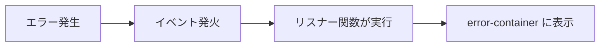
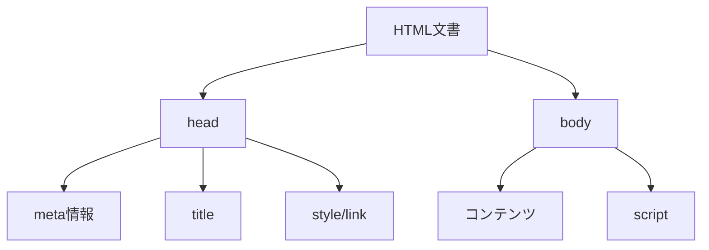
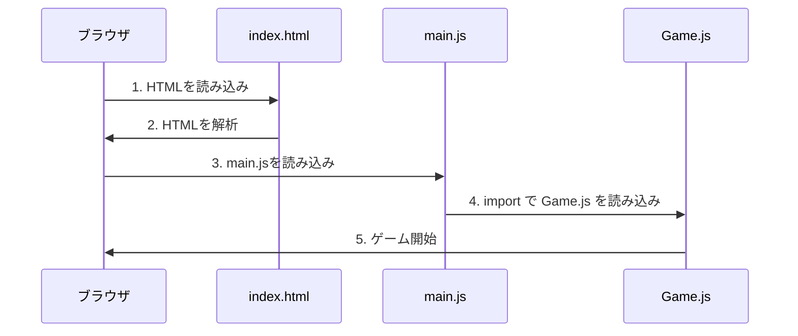

---
tags:
  - 基礎編
  - HTML
  - Canvas
  - モジュール
chapter: 1
status: 完了
prev: "[[00_はじめに/03_プロジェクト概要]]"
next: "[[02_パッケージ管理_package.json]]"
source_file: index.html
created: 2025-11-23
---

# 第1章: HTMLの基礎 - index.html

> [!abstract] この章の概要
> Webアプリケーションの入り口となる `index.html` を読み解きます。HTML の基本構造と、JavaScript モジュールの読み込み方を学びます。

---

## この章で学ぶこと

- [ ] HTML ファイルの基本構造を理解する
- [ ] `<meta>` タグの役割を理解する
- [ ] CSS の基本的な書き方を理解する
- [ ] JavaScript モジュールの読み込み方を理解する
- [ ] エラーハンドリングの仕組みを理解する

---

## ファイルの役割

> [!note] `index.html` の役割
> このファイルは **Webアプリケーションの入り口** です。
> - ブラウザが最初に読み込むファイル
> - ページの構造を定義
> - CSS（見た目）と JavaScript（動作）を読み込む

---

## コード全体

まず、ファイル全体を見てみましょう：

```html
<!DOCTYPE html>
<html lang="en">

<head>
  <meta charset="UTF-8" />
  <link rel="icon" type="image/svg+xml" href="/vite.svg" />
  <meta name="viewport" content="width=device-width, initial-scale=1.0" />
  <title>Felt Rabbit Paladin WebXR</title>
  <style>
    body {
      margin: 0;
      overflow: hidden;
    }

    canvas {
      display: block;
    }
  </style>
</head>

<body>
  <div id="app"></div>
  <div id="error-container"
    style="position: absolute; top: 0; left: 0; color: red; background: rgba(255, 255, 255, 0.9); z-index: 9999; padding: 10px; white-space: pre-wrap;">
  </div>
  <script>
    window.addEventListener('error', function (event) {
      document.getElementById('error-container').textContent += 'Error: ' + event.message + '\n' + event.filename + ':' + event.lineno + '\n';
    });
    window.addEventListener('unhandledrejection', function (event) {
      document.getElementById('error-container').textContent += 'Promise Rejection: ' + event.reason + '\n';
    });
  </script>
  <script type="module" src="/src/main.js"></script>
</body>

</html>
```

---

## コード解説

### セクション1: DOCTYPE宣言と html タグ

```html
<!DOCTYPE html>
<html lang="en">
```

| 行 | コード | 説明 |
|----|--------|------|
| 1 | `<!DOCTYPE html>` | HTML5 文書であることを宣言 |
| 2 | `<html lang="en">` | HTML文書の開始、言語は英語 |

> [!info] DOCTYPE とは
> **DOCTYPE**（Document Type）は、ブラウザにこの文書が HTML5 であることを伝えます。
> これがないと、ブラウザが古い表示モードで描画する可能性があります。

---

### セクション2: head タグ（メタ情報）

```html
<head>
  <meta charset="UTF-8" />
  <link rel="icon" type="image/svg+xml" href="/vite.svg" />
  <meta name="viewport" content="width=device-width, initial-scale=1.0" />
  <title>Felt Rabbit Paladin WebXR</title>
```

| 行 | コード | 説明 |
|----|--------|------|
| 4 | `<head>` | メタ情報の開始 |
| 5 | `<meta charset="UTF-8" />` | 文字コードを UTF-8 に設定 |
| 6 | `<link rel="icon" ...>` | ファビコン（タブのアイコン）を設定 |
| 7 | `<meta name="viewport" ...>` | モバイル対応の設定 |
| 8 | `<title>...</title>` | ブラウザのタブに表示されるタイトル |

> [!tip] viewport とは
> **viewport** は、モバイル端末での表示を制御します。
> `width=device-width` で画面幅に合わせ、`initial-scale=1.0` で拡大縮小なしで表示します。

---

### セクション3: CSS（スタイル）

```html
  <style>
    body {
      margin: 0;
      overflow: hidden;
    }

    canvas {
      display: block;
    }
  </style>
</head>
```

| セレクタ | プロパティ | 値 | 説明 |
|---------|-----------|-----|------|
| `body` | `margin` | `0` | ページ周囲の余白をなくす |
| `body` | `overflow` | `hidden` | はみ出た部分を非表示（スクロールバーを消す） |
| `canvas` | `display` | `block` | canvas要素をブロック要素として表示 |

> [!question] なぜ margin: 0 ?
> ブラウザはデフォルトで body に余白を設定します。
> 3Dゲームでは画面全体を使いたいので、余白を0にしています。

> [!question] なぜ overflow: hidden ?
> スクロールバーが表示されると、ゲーム画面が小さくなってしまいます。
> `hidden` にすることで、スクロールバーを非表示にしています。

---

### セクション4: body タグ（コンテンツ）

```html
<body>
  <div id="app"></div>
  <div id="error-container"
    style="position: absolute; top: 0; left: 0; color: red; background: rgba(255, 255, 255, 0.9); z-index: 9999; padding: 10px; white-space: pre-wrap;">
  </div>
```

| 要素 | 説明 |
|------|------|
| `<div id="app">` | アプリケーションのコンテナ（Three.js がここに描画） |
| `<div id="error-container">` | エラーメッセージ表示用の領域 |

> [!info] id 属性
> **id** は要素に一意の名前をつけます。
> JavaScript から `document.getElementById('app')` で取得できます。

**error-container のスタイル解説:**

| プロパティ | 値 | 説明 |
|-----------|-----|------|
| `position: absolute` | 絶対位置指定 | 画面の特定位置に固定 |
| `top: 0; left: 0` | 左上に配置 | |
| `color: red` | 文字色を赤に | エラーは目立つように |
| `z-index: 9999` | 最前面に表示 | 他の要素より手前に |
| `white-space: pre-wrap` | 改行を保持 | エラーメッセージの整形 |

---

### セクション5: エラーハンドリング

```html
  <script>
    window.addEventListener('error', function (event) {
      document.getElementById('error-container').textContent += 'Error: ' + event.message + '\n' + event.filename + ':' + event.lineno + '\n';
    });
    window.addEventListener('unhandledrejection', function (event) {
      document.getElementById('error-container').textContent += 'Promise Rejection: ' + event.reason + '\n';
    });
  </script>
```

> [!info] この章で学ぶパラダイム
> - **イベント駆動**: `addEventListener` でイベントを監視

**解説:**

| イベント | 発生タイミング |
|---------|---------------|
| `error` | JavaScript でエラーが発生したとき |
| `unhandledrejection` | Promise が reject され、catch されなかったとき |



> [!tip] 開発時のデバッグ
> このエラー表示機能により、開発中にエラーが画面に表示されます。
> コンソールを開かなくてもエラーを確認できて便利です。

---

### セクション6: JavaScript モジュールの読み込み

```html
  <script type="module" src="/src/main.js"></script>
</body>

</html>
```

| 属性 | 値 | 説明 |
|------|-----|------|
| `type` | `"module"` | ES Modules として読み込む |
| `src` | `"/src/main.js"` | 読み込むファイルのパス |

> [!warning] type="module" の重要性
> `type="module"` を指定しないと、`import` / `export` が使えません。
> このプロジェクトでは ES Modules を使っているため、必須です。

**ES Modules の特徴:**

| 特徴 | 説明 |
|------|------|
| `import` / `export` | 他のファイルから機能を読み込める |
| 自動的に strict mode | より安全なコード実行 |
| 遅延実行 | HTML の解析後に実行される |

---

## 重要な概念

### HTML の基本構造



### ES Modules の読み込みフロー



---

## 実験してみよう

> [!question] やってみよう
> 以下の実験を行って、動作を確認してみましょう。

### 実験1: タイトルを変更する

1. `index.html` を開く
2. `<title>` タグの中身を変更する
   ```html
   <title>マイゲーム</title>
   ```
3. ブラウザをリロードして、タブのタイトルが変わることを確認

### 実験2: エラー表示を確認する

1. `src/main.js` を開く
2. 先頭に以下を追加する
   ```javascript
   throw new Error('テストエラー');
   ```
3. ブラウザをリロードして、画面左上に赤いエラーが表示されることを確認
4. 確認後、追加した行を削除

### 実験3: margin を変えてみる

1. `<style>` 内の `margin: 0` を `margin: 20px` に変更
2. ブラウザで確認（画面の周りに余白ができる）
3. 確認後、元に戻す

---

## よくある疑問

> [!question] Q: なぜ `<div id="app">` は空なのですか？
> A: Three.js が JavaScript で動的に canvas 要素を作成し、この div の中に追加するからです。HTML で書く必要はありません。

> [!question] Q: `<script>` タグが2つあるのはなぜですか？
> A: 1つ目はエラーハンドリング用（通常のスクリプト）、2つ目はメインアプリケーション用（モジュール）です。役割が異なるため分けています。

---

## まとめ

この章で学んだこと：

- ✅ HTML の基本構造（DOCTYPE, head, body）
- ✅ メタタグの役割（charset, viewport）
- ✅ CSS でゲーム用の画面設定
- ✅ イベントリスナーによるエラーハンドリング
- ✅ ES Modules の読み込み方（`type="module"`）

> [!success] 次のステップ
> [[02_パッケージ管理_package.json]] に進んで、npm とパッケージ管理について学びましょう。

---

## 関連リンク

- [[00_はじめに/03_プロジェクト概要|前の章: プロジェクト概要]]
- [[02_パッケージ管理_package.json|次の章: パッケージ管理]]
- [[01_基礎編/_MOC_基礎編|セクション目次に戻る]]
- [[_MOC_入門レベル|入門レベル目次に戻る]]
