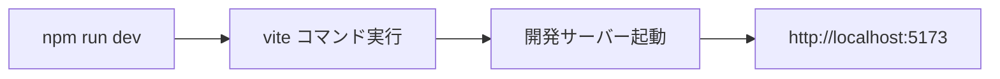
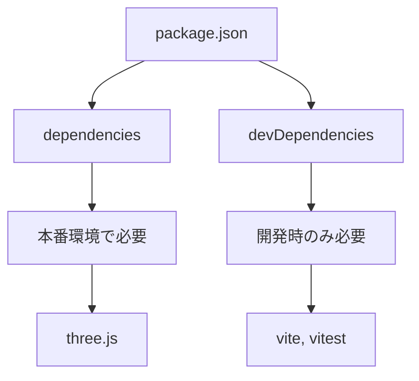
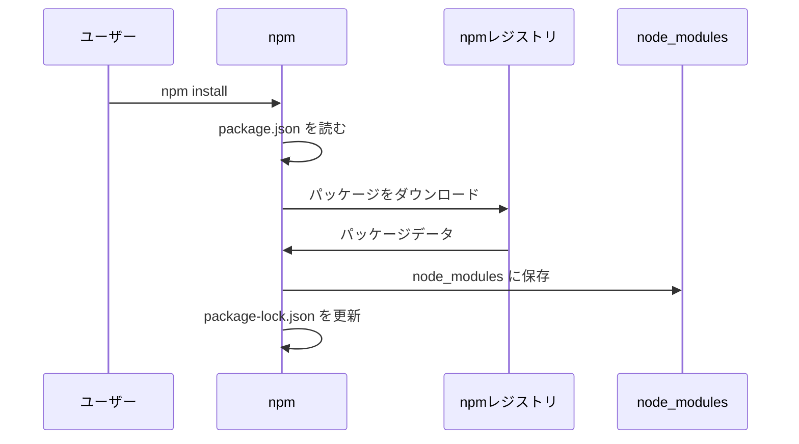

---
tags:
  - 基礎編
  - npm
  - package.json
  - 依存関係
chapter: 2
status: 完了
prev: "[[01_HTMLの基礎_index.html]]"
next: "[[03_エントリーポイント_main.js]]"
source_file: package.json
created: 2025-11-23
---

# 第2章: パッケージ管理 - package.json

> [!abstract] この章の概要
> Node.js のパッケージ管理ファイル `package.json` を読み解きます。npm の基本と依存関係の管理方法を学びます。

---

## この章で学ぶこと

- [ ] package.json の役割を理解する
- [ ] npm コマンドの基本を理解する
- [ ] 依存関係（dependencies）の仕組みを理解する
- [ ] スクリプト（scripts）の使い方を理解する

---

## ファイルの役割

> [!note] `package.json` の役割
> このファイルは **プロジェクトの設定ファイル** です。
> - プロジェクト名やバージョンの定義
> - 依存パッケージ（ライブラリ）の管理
> - npm スクリプトの定義

---

## コード全体

```json
{
  "name": "gemini-3d-demo",
  "private": true,
  "version": "0.0.0",
  "type": "module",
  "scripts": {
    "dev": "vite",
    "build": "vite build",
    "preview": "vite preview"
  },
  "devDependencies": {
    "@vitest/coverage-v8": "^4.0.13",
    "jsdom": "^27.2.0",
    "vite": "^5.0.0",
    "vitest": "^4.0.13"
  },
  "dependencies": {
    "three": "^0.160.0"
  }
}
```

---

## コード解説

### セクション1: 基本情報

```json
{
  "name": "gemini-3d-demo",
  "private": true,
  "version": "0.0.0",
  "type": "module",
```

| フィールド | 値 | 説明 |
|-----------|-----|------|
| `name` | `"gemini-3d-demo"` | プロジェクト名（npm パッケージ名） |
| `private` | `true` | npm に公開しない設定 |
| `version` | `"0.0.0"` | プロジェクトのバージョン |
| `type` | `"module"` | ES Modules を使用する設定 |

> [!info] type: "module" とは
> `"type": "module"` を設定すると、`.js` ファイルが ES Modules として扱われます。
> これにより `import` / `export` が使えるようになります。

> [!warning] private: true の意味
> `true` にすると、誤って `npm publish` してもパッケージが公開されません。
> 個人プロジェクトでは `true` にしておくのが安全です。

---

### セクション2: scripts（npm スクリプト）

```json
  "scripts": {
    "dev": "vite",
    "build": "vite build",
    "preview": "vite preview"
  },
```

| スクリプト名 | コマンド | 実行方法 | 説明 |
|------------|---------|---------|------|
| `dev` | `vite` | `npm run dev` | 開発サーバーを起動 |
| `build` | `vite build` | `npm run build` | 本番用にビルド |
| `preview` | `vite preview` | `npm run preview` | ビルド結果をプレビュー |

> [!tip] npm run の使い方
> ```bash
> npm run dev      # 開発サーバー起動
> npm run build    # 本番ビルド
> npm run preview  # プレビュー
> ```



---

### セクション3: dependencies（本番用依存関係）

```json
  "dependencies": {
    "three": "^0.160.0"
  }
```

| パッケージ | バージョン | 説明 |
|-----------|-----------|------|
| `three` | `^0.160.0` | Three.js - 3Dグラフィックスライブラリ |

> [!info] dependencies とは
> **dependencies** は、アプリケーションの実行に必要なパッケージです。
> ゲームが動作するために Three.js が必要なので、ここに記載されています。

---

### セクション4: devDependencies（開発用依存関係）

```json
  "devDependencies": {
    "@vitest/coverage-v8": "^4.0.13",
    "jsdom": "^27.2.0",
    "vite": "^5.0.0",
    "vitest": "^4.0.13"
  }
```

| パッケージ | 説明 |
|-----------|------|
| `vite` | 高速な開発サーバー・ビルドツール |
| `vitest` | テストフレームワーク |
| `@vitest/coverage-v8` | テストカバレッジ計測 |
| `jsdom` | ブラウザ環境のエミュレーション（テスト用） |

> [!info] devDependencies とは
> **devDependencies** は、開発時のみ必要なパッケージです。
> 本番環境には含まれません。

**dependencies vs devDependencies:**



---

## 重要な概念

### バージョン指定の記法

```
^0.160.0
│ │ │ └─ パッチバージョン（バグ修正）
│ │ └─── マイナーバージョン（機能追加）
│ └───── メジャーバージョン（破壊的変更）
└─────── キャレット（互換性のある更新を許可）
```

| 記法 | 意味 | 例 |
|------|------|-----|
| `^0.160.0` | マイナーアップデートまで許可 | 0.160.0 〜 0.999.999 |
| `~0.160.0` | パッチアップデートのみ許可 | 0.160.0 〜 0.160.999 |
| `0.160.0` | 完全一致 | 0.160.0 のみ |

### npm のファイル構成

```
プロジェクト/
├── package.json        ← 依存関係の定義
├── package-lock.json   ← 正確なバージョンのロック
└── node_modules/       ← 実際のパッケージファイル
```

| ファイル | 役割 |
|---------|------|
| `package.json` | 依存関係の定義（人が編集） |
| `package-lock.json` | 正確なバージョンの記録（自動生成） |
| `node_modules/` | パッケージの実体（自動生成） |

> [!warning] node_modules について
> `node_modules` フォルダは非常に大きくなります。
> Git にはコミットせず、`.gitignore` に追加するのが一般的です。

---

## npm コマンド一覧

### よく使うコマンド

| コマンド | 説明 |
|---------|------|
| `npm install` | package.json の依存関係をインストール |
| `npm run <script>` | scripts に定義されたコマンドを実行 |
| `npm install <package>` | 新しいパッケージを追加 |
| `npm uninstall <package>` | パッケージを削除 |

### インストールの流れ



---

## 実験してみよう

> [!question] やってみよう
> 以下の実験を行って、npm の動作を確認してみましょう。

### 実験1: パッケージ情報を確認する

```bash
# three.js の情報を確認
npm list three

# すべての依存関係を確認
npm list
```

### 実験2: 開発サーバーを起動する

```bash
npm run dev
```

ブラウザで `http://localhost:5173` を開いてゲームが動作することを確認。

### 実験3: 本番ビルドを作成する

```bash
npm run build
```

`dist/` フォルダが作成され、本番用のファイルが生成されることを確認。

---

## よくある疑問

> [!question] Q: package-lock.json は何のためにありますか？
> A: 全員が同じバージョンのパッケージを使えるようにするためです。`^0.160.0` だと 0.161.0 もインストールされる可能性がありますが、lock ファイルがあれば正確に同じバージョンがインストールされます。

> [!question] Q: node_modules を削除しても大丈夫ですか？
> A: はい、`npm install` で再度インストールできます。容量が大きいので、プロジェクトを整理するときに削除することもあります。

> [!question] Q: dependencies と devDependencies の違いは？
> A: **dependencies** は本番環境でも必要（例: Three.js）。**devDependencies** は開発時のみ必要（例: テストツール）。本番ビルドでは devDependencies は含まれません。

---

## まとめ

この章で学んだこと：

- ✅ package.json はプロジェクトの設定ファイル
- ✅ `type: "module"` で ES Modules を有効化
- ✅ scripts で npm コマンドを定義
- ✅ dependencies は本番用、devDependencies は開発用
- ✅ バージョン指定の記法（^, ~）

> [!success] 次のステップ
> [[03_エントリーポイント_main.js]] に進んで、JavaScript のエントリーポイントについて学びましょう。

---

## 関連リンク

- [[01_HTMLの基礎_index.html|前の章: HTMLの基礎]]
- [[03_エントリーポイント_main.js|次の章: エントリーポイント]]
- [[01_基礎編/_MOC_基礎編|セクション目次に戻る]]
- [[_MOC_入門レベル|入門レベル目次に戻る]]
