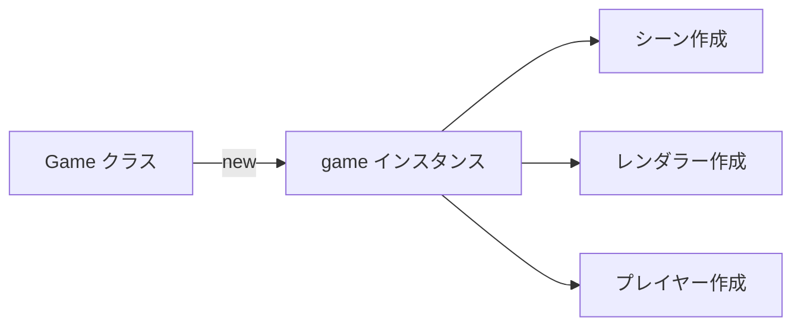
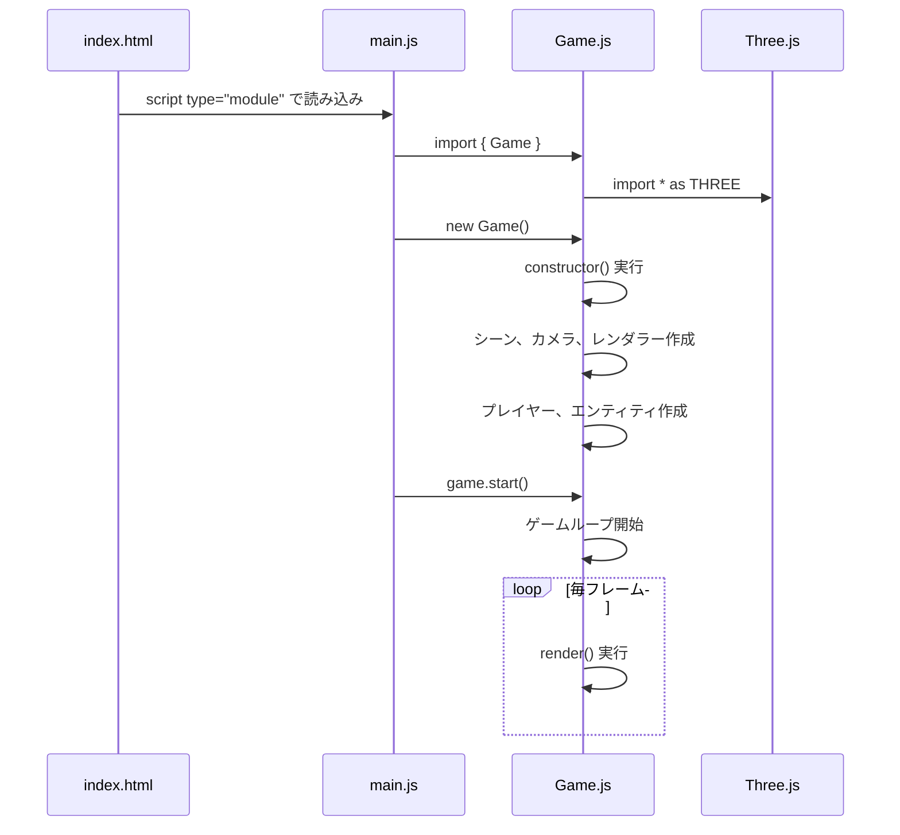
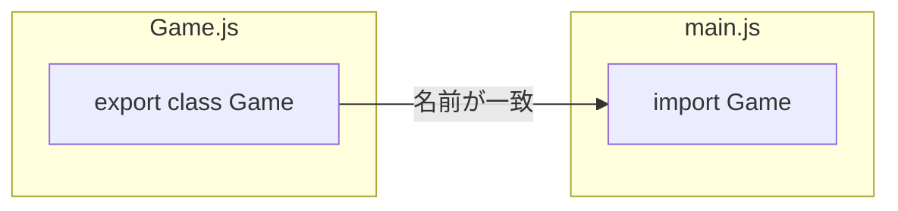

---
tags:
  - 基礎編
  - JavaScript
  - ESModules
  - import
  - エントリーポイント
chapter: 3
status: 完了
prev: "[[02_パッケージ管理_package.json]]"
next: "[[02_Three.js入門編/_MOC_Three.js入門編]]"
source_file: src/main.js
created: 2025-11-23
---

# 第3章: エントリーポイント - main.js

> [!abstract] この章の概要
> JavaScript のエントリーポイント `main.js` を読み解きます。ES Modules の `import` 文とアプリケーションの起動方法を学びます。

---

## この章で学ぶこと

- [ ] ES Modules の `import` 文を理解する
- [ ] クラスのインスタンス化を理解する
- [ ] アプリケーションの起動の流れを理解する

---

## ファイルの役割

> [!note] `main.js` の役割
> このファイルは **JavaScript のエントリーポイント** です。
> - HTML から最初に読み込まれる JavaScript ファイル
> - ゲームの初期化と起動を行う
> - たった4行で、すべてが始まる

---

## コード全体

```javascript
import { Game } from './Game.js';

const game = new Game();
game.start();
```

> [!tip] シンプルさの美学
> たった4行！しかし、この4行がゲーム全体を起動します。
> シンプルなエントリーポイントは、良い設計の証です。

---

## コード解説

### 行1: import 文

```javascript
import { Game } from './Game.js';
```

| 要素 | 説明 |
|------|------|
| `import` | 他のモジュールから機能を読み込むキーワード |
| `{ Game }` | 読み込むもの（Game クラス） |
| `from` | 読み込み元を指定 |
| `'./Game.js'` | 同じフォルダの Game.js ファイル |

> [!info] この章で学ぶパラダイム
> - **ES Modules**: `import` / `export` によるモジュール分割

**import の構文:**

```javascript
// 名前付きエクスポートの読み込み
import { Game } from './Game.js';

// デフォルトエクスポートの読み込み
import Game from './Game.js';

// 複数の読み込み
import { Game, Player, Enemy } from './Game.js';

// 別名をつける
import { Game as MyGame } from './Game.js';
```

このプロジェクトでは **名前付きエクスポート** を使用しています。

> [!question] なぜ波括弧 { } が必要？
> `Game.js` で `export class Game` と**名前付きエクスポート**されているため、読み込み側でも `{ Game }` と波括弧で囲む必要があります。

---

### 行3: インスタンス化

```javascript
const game = new Game();
```

| 要素 | 説明 |
|------|------|
| `const` | 変数宣言（再代入不可） |
| `game` | 変数名（インスタンスを格納） |
| `new` | 新しいインスタンスを作成 |
| `Game()` | Game クラスのコンストラクタを呼び出し |



> [!info] クラスとインスタンス
> - **クラス**: 設計図（Game クラス）
> - **インスタンス**: 実体（game 変数に入っているもの）
>
> `new` キーワードで、設計図から実体を作成します。

**new の動作:**

1. 新しいオブジェクトを作成
2. Game クラスの `constructor()` を実行
3. 作成したオブジェクトを返す

```javascript
// Game.js（抜粋）
export class Game {
    constructor() {
        // ここが実行される
        this.scene = new THREE.Scene();
        this.camera = new THREE.PerspectiveCamera(...);
        // ...
    }
}
```

---

### 行4: ゲーム開始

```javascript
game.start();
```

| 要素 | 説明 |
|------|------|
| `game` | 先ほど作成したインスタンス |
| `.start()` | Game クラスのメソッドを呼び出し |

> [!tip] メソッド呼び出し
> `インスタンス.メソッド名()` の形式でメソッドを呼び出します。
> `start()` メソッドがゲームループを開始します。

---

## 起動の流れ



---

## 重要な概念

### ES Modules とは

**ES Modules**（ESM）は、JavaScript の公式モジュールシステムです。

| 特徴 | 説明 |
|------|------|
| `import` | 他のファイルから機能を読み込む |
| `export` | 他のファイルに機能を公開する |
| ファイルスコープ | 各ファイルは独立したスコープを持つ |
| 静的解析 | 読み込み関係がビルド時に決定される |

**従来の方法との比較:**

```javascript
// ❌ 従来の方法（グローバル変数）
// すべてのファイルで変数が共有され、衝突の危険がある
<script src="game.js"></script>
<script src="player.js"></script>

// ✅ ES Modules
// 各ファイルが独立し、必要なものだけ読み込む
import { Game } from './Game.js';
```

### import / export の対応

**Game.js（export 側）:**
```javascript
export class Game {
    // ...
}
```

**main.js（import 側）:**
```javascript
import { Game } from './Game.js';
```



---

## 実験してみよう

> [!question] やってみよう
> 以下の実験を行って、ES Modules の動作を確認してみましょう。

### 実験1: console.log を追加する

1. `src/main.js` を開く
2. 以下のように変更する：

```javascript
import { Game } from './Game.js';

console.log('main.js が読み込まれました');

const game = new Game();
console.log('Game インスタンスが作成されました');

game.start();
console.log('ゲームが開始されました');
```

3. ブラウザの開発者ツール（F12）→ Console タブで確認
4. 実験後、追加した console.log を削除

### 実験2: import を確認する

1. `src/Game.js` の先頭を確認する
2. どのようなモジュールが import されているか観察する

```javascript
// Game.js の先頭部分を見てみよう
import * as THREE from 'three';
import { VRButton } from 'three/addons/webxr/VRButton.js';
// ...
```

### 実験3: エラーを発生させる

1. `src/main.js` の import を間違えてみる：

```javascript
import { Game } from './game.js';  // 小文字に変更
```

2. ブラウザで確認（エラーが表示される）
3. 元に戻す

---

## よくある疑問

> [!question] Q: なぜ main.js はこんなに短いのですか？
> A: **単一責任の原則**に従っているからです。main.js の責任は「ゲームを起動すること」だけ。複雑な処理は Game クラスに委譲しています。

> [!question] Q: `./` は何を意味しますか？
> A: **現在のフォルダ**を意味します。`./Game.js` は「同じフォルダにある Game.js」という意味です。`../` は「親フォルダ」を意味します。

> [!question] Q: const と let の違いは？
> A: `const` は再代入不可、`let` は再代入可能です。game 変数は一度作成したら変更しないので `const` を使っています。

```javascript
const game = new Game();
game = new Game();  // ❌ エラー！const は再代入不可

let game = new Game();
game = new Game();  // ✅ let は再代入可能
```

---

## コードの全体像

```
index.html
    │
    └── <script type="module" src="/src/main.js">
                │
                ▼
            main.js
                │
                ├── import { Game } from './Game.js'
                │       │
                │       ▼
                │   Game.js
                │       ├── import * as THREE from 'three'
                │       ├── import { VRButton } from '...'
                │       ├── import { Input } from './Input.js'
                │       ├── import { Player } from './Player.js'
                │       └── ...
                │
                ├── new Game()
                │       │
                │       ▼
                │   constructor() 実行
                │       ├── シーン作成
                │       ├── カメラ作成
                │       ├── レンダラー作成
                │       └── ...
                │
                └── game.start()
                        │
                        ▼
                    ゲームループ開始
```

---

## まとめ

この章で学んだこと：

- ✅ `import` で他のモジュールから機能を読み込む
- ✅ `{ }` は名前付きエクスポートの読み込み
- ✅ `new` でクラスからインスタンスを作成
- ✅ `インスタンス.メソッド()` でメソッドを呼び出す
- ✅ エントリーポイントはシンプルに保つ

> [!success] 基礎編完了！
> おめでとうございます！基礎編が完了しました。
> 次は [[02_Three.js入門編/_MOC_Three.js入門編|02 Three.js入門編]] に進んで、3Dグラフィックスの世界に入りましょう。

---

## 関連リンク

- [[02_パッケージ管理_package.json|前の章: パッケージ管理]]
- [[02_Three.js入門編/_MOC_Three.js入門編|次のセクション: Three.js入門編]]
- [[01_基礎編/_MOC_基礎編|セクション目次に戻る]]
- [[_MOC_入門レベル|入門レベル目次に戻る]]
