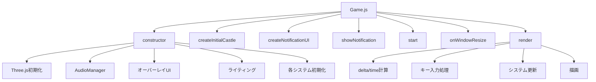
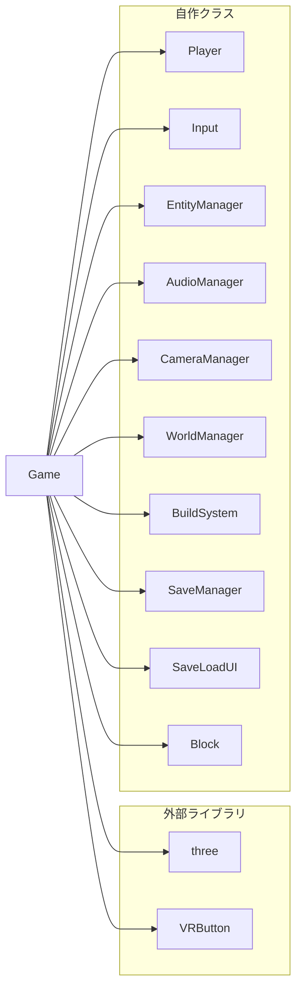
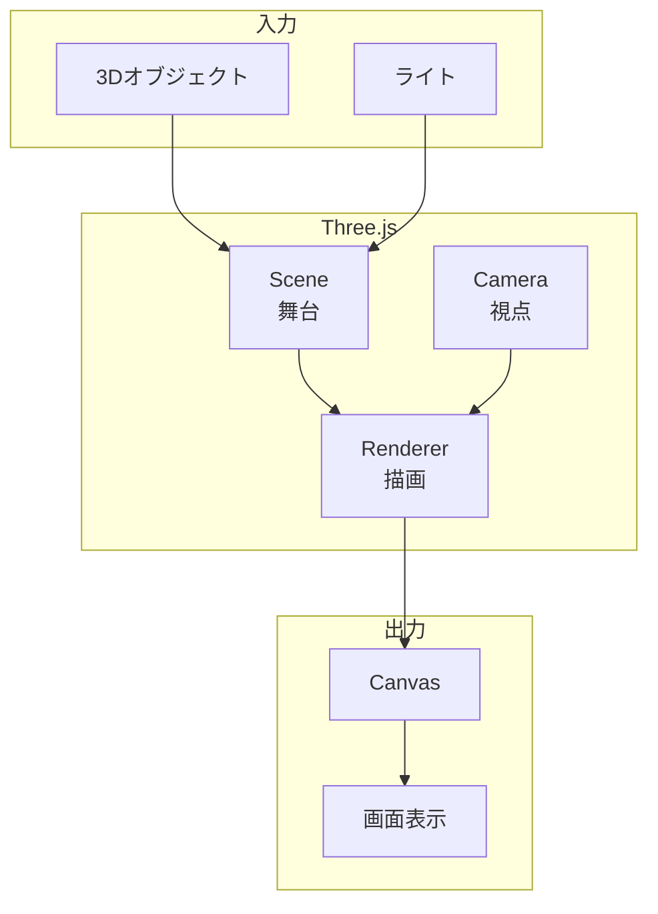
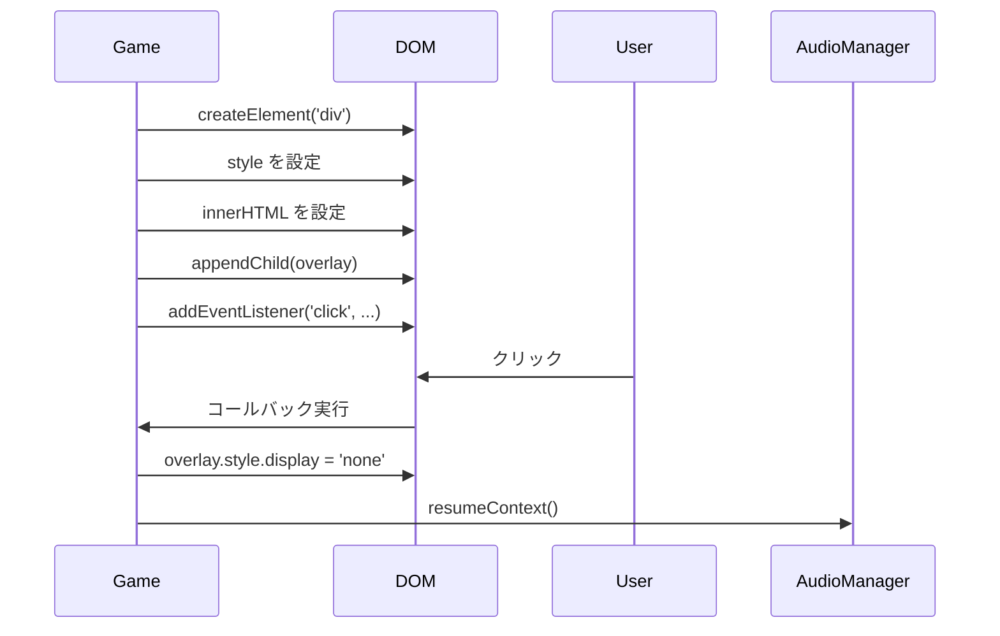
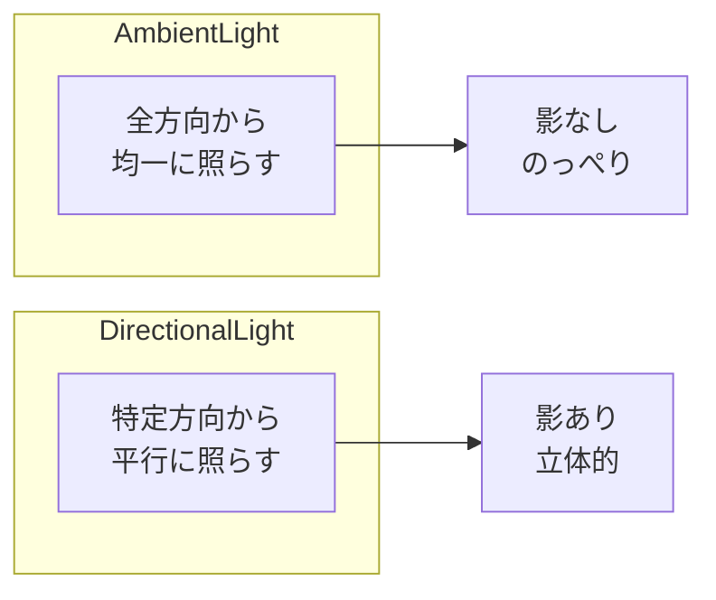
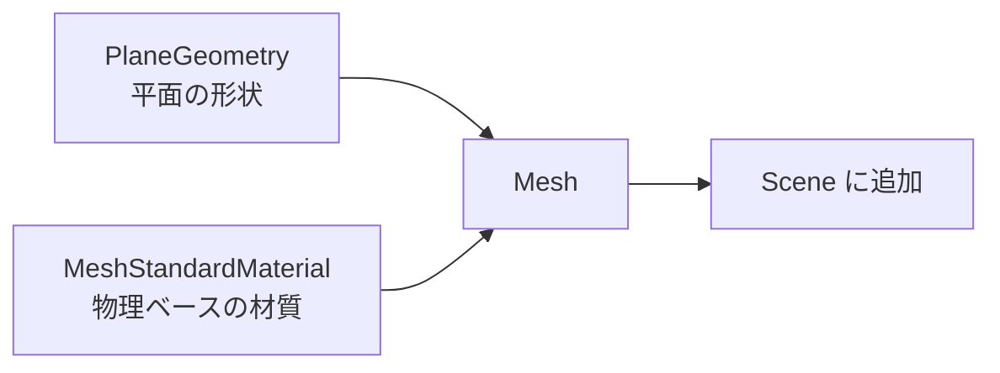
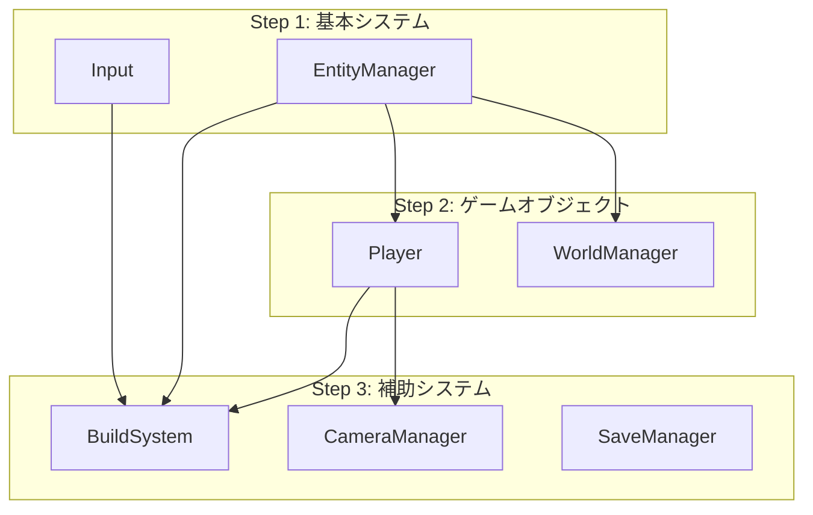
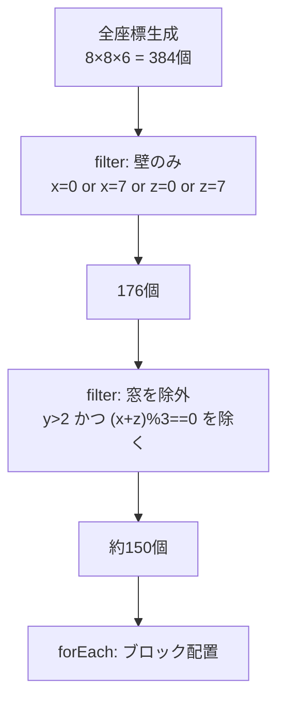
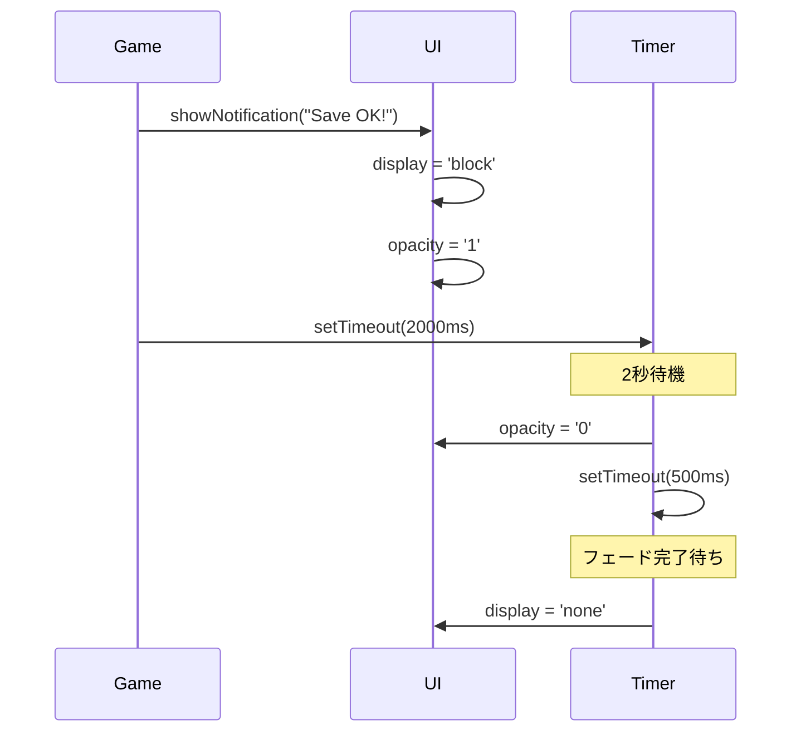
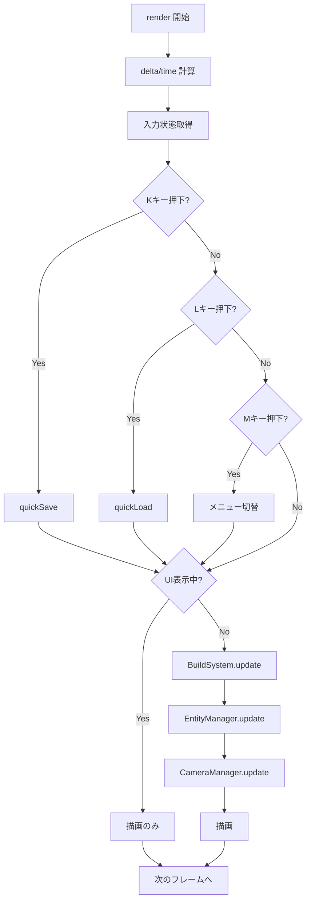

---
tags:
  - Three.js入門編
  - Three.js
  - ゲームループ
  - Scene
  - Renderer
  - 関数型
chapter: 1
status: 完了
prev: "[[01_基礎編/03_エントリーポイント_main.js]]"
next: "[[02_入力システム_Input.js]]"
source_file: src/Game.js
created: 2025-11-23
---

# 第1章: ゲームの心臓部 - Game.js

> [!abstract] この章の概要
> ゲーム全体を統括する `Game.js` を読み解きます。Three.js の基本概念（Scene、Camera、Renderer）、ゲームループの仕組み、各サブシステムの初期化と連携を学びます。

---

## この章で学ぶこと

- [ ] Three.js の基本構造（Scene、Camera、Renderer）を理解する
- [ ] ゲームループの仕組みを理解する
- [ ] 関数型プログラミングによる配列操作を理解する
- [ ] 各システムの初期化と連携を理解する
- [ ] DOM 操作による UI 作成を理解する
- [ ] エラーハンドリングの重要性を理解する

---

## この章で学ぶパラダイム

> [!info] パラダイム
> - **関数型プログラミング**: 城生成での `filter().filter().forEach()` チェーン
> - **イベント駆動**: ウィンドウリサイズ、クリックイベントの処理
> - **依存性注入**: 各システムに必要なオブジェクトを渡して初期化
> - 関連: [[07_付録/05_パラダイム早見表|パラダイム早見表]]

---

## ファイルの役割

> [!note] `Game.js` の役割
> このファイルは **ゲームの心臓部** であり、全体を統括するメインクラスです。
> - Three.js のシーン、カメラ、レンダラーを管理
> - 各サブシステム（入力、エンティティ、カメラ等）を初期化
> - ゲームループを実行
> - UI（オーバーレイ、通知）を管理
> - セーブ/ロードのキー入力を処理

---

## ファイル全体の構造

```
Game.js (約240行)
├── import文 (1-12行)
├── class Game
│   ├── constructor() - 初期化処理
│   │   ├── Three.js 基本初期化 (16-27行)
│   │   ├── AudioManager 初期化 (30行)
│   │   ├── オーバーレイUI作成 (33-59行)
│   │   ├── ライティング設定 (61-68行)
│   │   ├── 地面作成 (70-76行)
│   │   ├── 各システム初期化 (78-118行)
│   │   └── 城の生成呼び出し (118行)
│   ├── createInitialCastle() - 城の生成
│   ├── createNotificationUI() - 通知UI作成
│   ├── showNotification() - 通知表示
│   ├── start() - ゲームループ開始
│   ├── onWindowResize() - リサイズ処理
│   └── render() - ゲームループ本体
```

---

## コード構造の概要



---

## コード解説

### セクション1: import 文（1-12行）

```javascript
import * as THREE from 'three';
import { VRButton } from 'three/examples/jsm/webxr/VRButton.js';
import { Player } from './Player.js';
import { Input } from './Input.js';
import { EntityManager } from './EntityManager.js';
import { AudioManager } from './AudioManager.js';
import { CameraManager } from './CameraManager.js';
import { WorldManager } from './WorldManager.js';
import { BuildSystem } from './BuildSystem.js';
import { SaveManager } from './SaveManager.js';
import { SaveLoadUI } from './SaveLoadUI.js';
import { Block } from './Block.js';
```

**import の種類:**

| import 文 | 説明 | 種類 |
|-----------|------|------|
| `* as THREE` | Three.js の全機能を `THREE` にまとめる | 名前空間 import |
| `{ VRButton }` | VRButton クラスだけを取り出す | 名前付き import |
| `{ Player }` | 自作の Player クラス | 名前付き import |

> [!tip] `* as THREE` とは
> `*` は「すべて」を意味します。Three.js のすべての機能を `THREE` オブジェクトにまとめて読み込みます。
> 使うときは `THREE.Scene()`, `THREE.Camera()` のように `THREE.` をつけます。

**依存関係図:**



---

### セクション2: Three.js の基本初期化（16-27行）

```javascript
export class Game {
    constructor() {
        // シーン（3D空間）
        this.scene = new THREE.Scene();
        this.scene.background = new THREE.Color(0x87CEEB); // 空色

        // カメラ（視点）
        this.camera = new THREE.PerspectiveCamera(
            75,                                    // 視野角（度）
            window.innerWidth / window.innerHeight, // アスペクト比
            0.1,                                   // 近クリップ面
            1000                                   // 遠クリップ面
        );
        this.camera.position.set(0, 1.6, 3); // VR標準の目の高さ

        // レンダラー（描画エンジン）
        this.renderer = new THREE.WebGLRenderer({ antialias: true });
        this.renderer.setSize(window.innerWidth, window.innerHeight);
        this.renderer.xr.enabled = true;        // VR対応
        this.renderer.shadowMap.enabled = true; // 影を有効化
        document.body.appendChild(this.renderer.domElement);
        document.body.appendChild(VRButton.createButton(this.renderer));
```

**Three.js の3大要素:**



| 要素 | クラス名 | 役割 | 例え |
|------|---------|------|------|
| **Scene** | `THREE.Scene` | 3Dオブジェクトを配置する空間 | 舞台 |
| **Camera** | `THREE.PerspectiveCamera` | どこから見るか | 観客の視点 |
| **Renderer** | `THREE.WebGLRenderer` | 2D画像として描画 | カメラマン |

> [!info] PerspectiveCamera のパラメータ詳細
> ```javascript
> new THREE.PerspectiveCamera(fov, aspect, near, far)
> ```
>
> | パラメータ | 値 | 説明 |
> |-----------|-----|------|
> | `fov` | 75 | 視野角（Field of View）。大きいほど広角 |
> | `aspect` | 16:9など | 画面のアスペクト比（横÷縦） |
> | `near` | 0.1 | これより近いオブジェクトは描画しない |
> | `far` | 1000 | これより遠いオブジェクトは描画しない |

**視野角の違い:**

```
fov=45（望遠）       fov=75（標準）       fov=120（広角）
    ╱╲                  ╱╲                  ╱╲
   ╱  ╲                ╱  ╲                ╱  ╲
  ╱    ╲              ╱    ╲              ╱    ╲
 ╱      ╲            ╱      ╲            ╱      ╲
狭い範囲を         標準的な            広い範囲を
大きく表示         視野                歪んで表示
```

**WebGLRenderer のオプション:**

```javascript
new THREE.WebGLRenderer({
    antialias: true  // アンチエイリアス（ギザギザを滑らかに）
});
```

| オプション | 値 | 説明 |
|-----------|-----|------|
| `antialias` | true | エッジを滑らかに（パフォーマンス低下あり） |
| `alpha` | false | 背景を透明にするか |
| `preserveDrawingBuffer` | false | スクリーンショット用 |

---

### セクション3: AudioManager とオーバーレイUI（29-59行）

```javascript
        // Audio
        this.audioManager = new AudioManager();

        // Click to Start Overlay
        const overlay = document.createElement('div');
        overlay.style.position = 'absolute';
        overlay.style.top = '0';
        overlay.style.left = '0';
        overlay.style.width = '100%';
        overlay.style.height = '100%';
        overlay.style.backgroundColor = 'rgba(0,0,0,0.7)';
        overlay.style.color = 'white';
        overlay.style.display = 'flex';
        overlay.style.justifyContent = 'center';
        overlay.style.alignItems = 'center';
        overlay.style.fontSize = '24px';
        overlay.style.cursor = 'pointer';
        overlay.innerHTML = 'Click to Start<br>...操作説明...';
        document.body.appendChild(overlay);

        overlay.addEventListener('click', () => {
            overlay.style.display = 'none';
            this.audioManager.resumeContext();
            window.focus();
        });

        // Start BGM on first interaction (backup)
        window.addEventListener('keydown', () => {
            this.audioManager.resumeContext();
        }, { once: true });
```

> [!warning] なぜオーバーレイが必要？
> ブラウザのセキュリティ制限により、**ユーザーの操作なしに音を鳴らすことができません**。
> オーバーレイをクリックさせることで、`AudioContext` を有効化（`resumeContext`）しています。

**DOM 操作の流れ:**



**よく使う CSS スタイル:**

| プロパティ | 値 | 説明 |
|-----------|-----|------|
| `position: absolute` | 絶対位置指定 | 親要素を基準に配置 |
| `display: flex` | フレックスボックス | 子要素を柔軟に配置 |
| `justifyContent: center` | 水平中央揃え | |
| `alignItems: center` | 垂直中央揃え | |
| `rgba(0,0,0,0.7)` | 半透明の黒 | a=0.7 で 70% 不透明 |

> [!tip] `{ once: true }` オプション
> `addEventListener` の第3引数に `{ once: true }` を渡すと、イベントが **1回だけ** 発火した後、自動的にリスナーが削除されます。

---

### セクション4: ライティング（61-68行）

```javascript
        // Lighting
        const ambientLight = new THREE.AmbientLight(0x404040, 2);
        this.scene.add(ambientLight);

        const directionalLight = new THREE.DirectionalLight(0xffffff, 2);
        directionalLight.position.set(5, 10, 7.5);
        directionalLight.castShadow = true;
        this.scene.add(directionalLight);
```

**ライトの種類と特徴:**



| ライト | 引数 | 特徴 | 用途 |
|--------|------|------|------|
| `AmbientLight` | (色, 強度) | 全方向から均一に照らす | ベース照明、影のない部分を明るく |
| `DirectionalLight` | (色, 強度) | 太陽光のように平行に照らす | メイン光源、影を落とす |

**コード解説:**

```javascript
// 環境光: 色 0x404040（暗めのグレー）、強度 2
const ambientLight = new THREE.AmbientLight(0x404040, 2);

// 平行光源: 白色、強度 2
const directionalLight = new THREE.DirectionalLight(0xffffff, 2);
directionalLight.position.set(5, 10, 7.5);  // 右上前方に配置
directionalLight.castShadow = true;          // 影を落とす
```

> [!tip] ライティングの調整
> - **明るすぎる**: 強度を下げる（2 → 1）
> - **暗すぎる**: AmbientLight の強度を上げる
> - **影が濃すぎる**: AmbientLight を明るくする

---

### セクション5: 地面の作成（70-76行）

```javascript
        // Ground
        const groundGeo = new THREE.PlaneGeometry(100, 100);
        const groundMat = new THREE.MeshStandardMaterial({ color: 0x999999 });
        const ground = new THREE.Mesh(groundGeo, groundMat);
        ground.rotation.x = -Math.PI / 2;  // 水平に回転
        ground.receiveShadow = true;        // 影を受ける
        this.scene.add(ground);
```

**メッシュの構成:**



| 要素 | クラス | 役割 |
|------|--------|------|
| **Geometry** | `PlaneGeometry(100, 100)` | 100×100 の平面形状 |
| **Material** | `MeshStandardMaterial` | 物理ベースの材質（光の反射がリアル） |
| **Mesh** | `THREE.Mesh` | Geometry + Material の組み合わせ |

**回転の説明:**

```
PlaneGeometry は最初、XY平面に作られる（壁のように立っている）

回転前:              回転後:
   Y                    Y
   │                    │
   │ ■■■              │
   │ ■■■              └───── X
   └───── X           ■■■■■■
                      Z

rotation.x = -Math.PI / 2  (-90度)
```

---

### セクション6: 各システムの初期化（78-118行）

```javascript
        // Input
        this.input = new Input(this.renderer);

        // Entity Manager
        this.entityManager = new EntityManager(this.scene);

        // Player
        this.player = new Player(this.scene, this.audioManager);
        this.entityManager.add(this.player);

        // Environment
        this.collidables = []; // 衝突判定用配列

        // World Manager
        this.worldManager = new WorldManager(this.entityManager, this.collidables);
        this.worldManager.populate();

        // Build System
        this.buildSystem = new BuildSystem(
            this.scene, this.camera, this.entityManager, this.collidables
        );
        this.buildSystem.setPlayer(this.player);

        this.clock = new THREE.Clock();

        window.addEventListener('resize', this.onWindowResize.bind(this));

        this.camera.lookAt(this.player.position);

        // Camera Manager
        this.cameraManager = new CameraManager(this.camera, this.player, this.renderer);

        // Save Manager
        this.saveManager = new SaveManager(this);
        this.saveLoadUI = new SaveLoadUI(this, this.saveManager);
        this.lastSaveTime = 0;
        this.lastLoadTime = 0;
        this.lastMenuTime = 0;

        this.createNotificationUI();
        this.createInitialCastle();
```

**システム初期化の順序と依存関係:**



**各システムの役割:**

| システム | 役割 | 依存するもの |
|---------|------|-------------|
| `Input` | キーボード・マウス入力を管理 | renderer |
| `EntityManager` | 全エンティティを管理 | scene |
| `Player` | プレイヤーキャラクター | scene, audioManager |
| `WorldManager` | ワールド内のオブジェクト配置 | entityManager, collidables |
| `BuildSystem` | ブロック配置・削除 | scene, camera, entityManager, collidables |
| `CameraManager` | カメラ追従・回転 | camera, player, renderer |
| `SaveManager` | セーブ・ロード | game |

> [!info] 依存性注入（Dependency Injection）
> 各システムは必要なオブジェクトを **コンストラクタの引数で受け取ります**。
> これにより、システム間の結合度を下げ、テストや再利用がしやすくなります。

**clock の役割:**

```javascript
this.clock = new THREE.Clock();
```

`THREE.Clock` はゲームの時間を計測するためのクラスです。

| メソッド | 戻り値 | 説明 |
|---------|--------|------|
| `getDelta()` | 秒（小数） | 前フレームからの経過時間 |
| `getElapsedTime()` | 秒（小数） | ゲーム開始からの総経過時間 |

---

### セクション7: 城の生成 - 関数型プログラミング（121-150行）

```javascript
    createInitialCastle() {
        console.log("Creating initial castle...");

        const castleX = -10;
        const castleZ = -10;
        const size = 8;
        const height = 6;

        // 全座標を生成
        const coordinates = [];
        for (let y = 1; y <= height; y++) {
            for (let x = 0; x < size; x++) {
                for (let z = 0; z < size; z++) {
                    coordinates.push({ x, y, z });
                }
            }
        }

        // 関数型チェーンで壁と窓を生成
        coordinates
            .filter(({ x, z }) => x === 0 || x === size - 1 || z === 0 || z === size - 1)
            .filter(({ x, y, z }) => !(y > 2 && (x + z) % 3 === 0))
            .forEach(({ x, y, z }) => {
                const block = new Block(castleX + x, y, castleZ + z, 'stone_dark');
                this.entityManager.add(block);
                this.collidables.push(block.mesh);
            });

        console.log("Castle created!");
    }
```

> [!info] 関数型プログラミングの実践
> このコードは **関数型プログラミング** の良い例です。
> データの変換を `filter` → `filter` → `forEach` のチェーンで表現しています。

**処理の流れを詳しく見る:**



**各 filter の意味:**

```javascript
// 1つ目のfilter: 壁の座標だけを残す
.filter(({ x, z }) => x === 0 || x === size - 1 || z === 0 || z === size - 1)
```

```
上から見た図（Y軸方向から）:

z=7  ■ ■ ■ ■ ■ ■ ■ ■
z=6  ■ □ □ □ □ □ □ ■
z=5  ■ □ □ □ □ □ □ ■
z=4  ■ □ □ □ □ □ □ ■  ■ = 壁（残る）
z=3  ■ □ □ □ □ □ □ ■  □ = 内部（除外）
z=2  ■ □ □ □ □ □ □ ■
z=1  ■ □ □ □ □ □ □ ■
z=0  ■ ■ ■ ■ ■ ■ ■ ■
     0 1 2 3 4 5 6 7 x
```

```javascript
// 2つ目のfilter: 窓の位置を除外
.filter(({ x, y, z }) => !(y > 2 && (x + z) % 3 === 0))
```

```
横から見た図（窓のパターン）:

y=6  ■ □ □ ■ □ □ ■ □
y=5  ■ □ □ ■ □ □ ■ □
y=4  ■ □ □ ■ □ □ ■ □  □ = 窓（除外）
y=3  ■ □ □ ■ □ □ ■ □  ■ = 壁（残る）
y=2  ■ ■ ■ ■ ■ ■ ■ ■
y=1  ■ ■ ■ ■ ■ ■ ■ ■
```

**従来の書き方との比較:**

```javascript
// ❌ 命令型（ネストが深く、読みにくい）
for (let y = 1; y <= height; y++) {
    for (let x = 0; x < size; x++) {
        for (let z = 0; z < size; z++) {
            if (x === 0 || x === size - 1 || z === 0 || z === size - 1) {
                if (!(y > 2 && (x + z) % 3 === 0)) {
                    const block = new Block(...);
                    this.entityManager.add(block);
                    this.collidables.push(block.mesh);
                }
            }
        }
    }
}

// ✅ 関数型（データの変換が明確）
coordinates
    .filter(({ x, z }) => /* 壁判定 */)
    .filter(({ x, y, z }) => /* 窓判定 */)
    .forEach(({ x, y, z }) => /* 配置 */);
```

| 比較項目 | 命令型 | 関数型 |
|---------|--------|--------|
| ネストの深さ | 5段階 | 1段階 |
| 条件の追加 | if 文を追加 | filter を追加 |
| 可読性 | 低い（ネストで迷子） | 高い（パイプライン） |
| デバッグ | 難しい | 途中で確認しやすい |

---

### セクション8: 通知UI（152-180行）

```javascript
    createNotificationUI() {
        this.notification = document.createElement('div');
        this.notification.style.position = 'absolute';
        this.notification.style.top = '20px';
        this.notification.style.right = '20px';
        this.notification.style.padding = '10px 20px';
        this.notification.style.backgroundColor = 'rgba(0, 0, 0, 0.7)';
        this.notification.style.color = 'white';
        this.notification.style.borderRadius = '5px';
        this.notification.style.fontFamily = 'sans-serif';
        this.notification.style.display = 'none';
        this.notification.style.transition = 'opacity 0.5s';
        document.body.appendChild(this.notification);
    }

    showNotification(message, duration = 2000) {
        this.notification.innerText = message;
        this.notification.style.display = 'block';
        this.notification.style.opacity = '1';

        if (this.notificationTimeout) clearTimeout(this.notificationTimeout);

        this.notificationTimeout = setTimeout(() => {
            this.notification.style.opacity = '0';
            setTimeout(() => {
                this.notification.style.display = 'none';
            }, 500);
        }, duration);
    }
```

**通知のライフサイクル:**



> [!tip] CSS transition の活用
> `transition: 'opacity 0.5s'` を設定することで、opacity の変更がアニメーションになります。
> JavaScript は値を変更するだけで、アニメーションは CSS が担当します。

---

### セクション9: ゲームループの開始とリサイズ処理（182-189行）

```javascript
    start() {
        this.renderer.setAnimationLoop(this.render.bind(this));
    }

    onWindowResize() {
        this.cameraManager.resize(window.innerWidth, window.innerHeight);
        this.renderer.setSize(window.innerWidth, window.innerHeight);
    }
```

**setAnimationLoop vs requestAnimationFrame:**

| メソッド | 説明 | VR対応 |
|---------|------|--------|
| `requestAnimationFrame` | 通常の描画ループ | × |
| `setAnimationLoop` | Three.js のVR対応ループ | ○ |

> [!info] .bind(this) の意味
> `this.render.bind(this)` は、`render` メソッドが呼ばれたときに `this` が `Game` インスタンスを指すようにします。
> `bind` しないと、コールバック内で `this` が undefined になります。

---

### セクション10: ゲームループ本体（191-239行）

```javascript
    render() {
        try {
            const delta = this.clock.getDelta();      // 前フレームからの経過時間
            const time = this.clock.getElapsedTime(); // ゲーム開始からの経過時間
            const inputState = this.input.getState(); // 入力状態を取得

            // Quick Save/Load (K/L)
            if (inputState.save && time - this.lastSaveTime > 1.0) {
                this.saveManager.quickSave();
                this.lastSaveTime = time;
            }
            if (inputState.load && time - this.lastLoadTime > 1.0) {
                this.saveManager.quickLoad();
                this.lastLoadTime = time;
            }

            // Data Management Menu (M)
            if (inputState.menu && time - this.lastMenuTime > 0.5) {
                if (this.saveLoadUI.isVisible) {
                    this.saveLoadUI.hide();
                } else {
                    this.saveLoadUI.show();
                }
                this.lastMenuTime = time;
            }

            // If UI is open, skip game updates (Pause)
            if (this.saveLoadUI.isVisible) {
                this.renderer.render(this.scene, this.camera);
                return;
            }

            // システム更新
            this.buildSystem.update(delta, inputState);
            this.entityManager.update(delta, inputState, time, this.collidables);
            this.cameraManager.update(delta, inputState);

            // 描画
            this.renderer.render(this.scene, this.camera);

        } catch (e) {
            console.error("Game Loop Error:", e);
            this.renderer.setAnimationLoop(null);  // ループ停止
            alert("Game Crashed: " + e.message);
        }
    }
```

**ゲームループの詳細フロー:**



**delta と time の使い分け:**

| 変数 | 取得方法 | 用途 |
|------|---------|------|
| `delta` | `clock.getDelta()` | 移動速度の計算（フレームレート非依存） |
| `time` | `clock.getElapsedTime()` | アニメーション、クールダウン判定 |

**クールダウンの仕組み:**

```javascript
// 1秒に1回だけセーブできる
if (inputState.save && time - this.lastSaveTime > 1.0) {
    this.saveManager.quickSave();
    this.lastSaveTime = time;  // 最後にセーブした時刻を記録
}
```

```
時間軸 →
0秒     1秒     2秒     3秒
│       │       │       │
├─K押下─┤       │       │
│ ↓     │       │       │
│セーブ │       │       │
│       ├─K押下─┤       │
│       │ ↓     │       │
│       │無視   │       │  (1秒経っていない)
│       │       ├─K押下─┤
│       │       │ ↓     │
│       │       │セーブ  │ (1秒以上経過)
```

> [!warning] エラーハンドリングの重要性
> `try-catch` でゲームループを囲み、エラーが発生したらループを停止しています。
> これがないと、エラーが毎フレーム発生し、コンソールが溢れます。

---

## 実験してみよう

> [!question] やってみよう

### 実験1: 背景色を変える

```javascript
// Game.js の17行目
this.scene.background = new THREE.Color(0x87CEEB); // 空色
// ↓ 以下に変更して試してみよう
this.scene.background = new THREE.Color(0xff0000); // 赤
this.scene.background = new THREE.Color(0x000033); // 夜空
this.scene.background = new THREE.Color(0xffcc00); // 夕焼け
```

### 実験2: カメラの視野角を変える

```javascript
// 19行目
new THREE.PerspectiveCamera(75, ...)  // 標準
new THREE.PerspectiveCamera(45, ...)  // 望遠（狭い視野）
new THREE.PerspectiveCamera(120, ...) // 広角（魚眼風）
```

### 実験3: 城のサイズを変える

```javascript
// createInitialCastle() 内
const size = 8;   // → 12 に変更
const height = 6; // → 10 に変更
```

### 実験4: 窓のパターンを変える

```javascript
// 2つ目の filter を変更
.filter(({ x, y, z }) => !(y > 2 && (x + z) % 3 === 0))  // 元
.filter(({ x, y, z }) => !(y > 2 && (x + z) % 2 === 0))  // 細かい窓
.filter(({ x, y, z }) => !(y > 1))                        // 1段だけ壁
```

### 実験5: console.log でゲームループを確認

```javascript
// render() の先頭に追加
console.log('delta:', delta.toFixed(4), 'time:', time.toFixed(2));
```

### 実験6: ライティングを変える

```javascript
// 環境光を明るく
const ambientLight = new THREE.AmbientLight(0xffffff, 1);

// 平行光源の位置を変える（真上から）
directionalLight.position.set(0, 20, 0);
```

---

## よくある疑問

> [!question] Q: なぜ `setAnimationLoop` を使うのですか？
> A: VRモードに対応するためです。`requestAnimationFrame` は VR では正しく動作しません。

> [!question] Q: `delta` と `time` の違いは？
> A: `delta` は前フレームからの経過時間（約0.016秒 = 60fps）、`time` はゲーム開始からの総時間です。移動には `delta` を掛けてフレームレート非依存にし、アニメーションには `time` を使います。

> [!question] Q: なぜ `bind(this)` が必要？
> A: JavaScript では、コールバック関数内の `this` は呼び出し元によって変わります。`bind(this)` で `this` を固定しないと、`render` 内で `this.scene` などにアクセスできません。

> [!question] Q: エラーが起きたらどうなる？
> A: `try-catch` でキャッチし、ループを停止（`setAnimationLoop(null)`）してアラートを表示します。これにより、エラーの連続発生を防ぎます。

> [!question] Q: なぜオーバーレイが必要？
> A: ブラウザのセキュリティにより、ユーザー操作なしに音を鳴らせないためです。クリックで AudioContext を有効化しています。

---

## まとめ

この章で学んだこと：

- ✅ Three.js の3大要素（Scene、Camera、Renderer）
- ✅ PerspectiveCamera のパラメータ（fov, aspect, near, far）
- ✅ ライト（AmbientLight, DirectionalLight）の役割
- ✅ Mesh = Geometry + Material の構成
- ✅ 関数型プログラミング（filter/forEach チェーン）
- ✅ DOM 操作による UI 作成
- ✅ ゲームループの仕組みと delta/time
- ✅ クールダウンによる連打防止
- ✅ try-catch によるエラーハンドリング

> [!success] 次のステップ
> [[02_入力システム_Input.js]] に進んで、キーボード・マウス入力の処理を学びましょう。

---

## 関連リンク

- [[01_基礎編/03_エントリーポイント_main.js|前の章: エントリーポイント]]
- [[02_入力システム_Input.js|次の章: 入力システム]]
- [[02_Three.js入門編/_MOC_Three.js入門編|セクション目次に戻る]]
- [[07_付録/02_Three.js概念図解|Three.js概念図解]]
- [[07_付録/05_パラダイム早見表|パラダイム早見表]]
