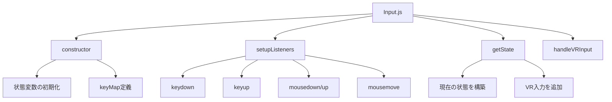
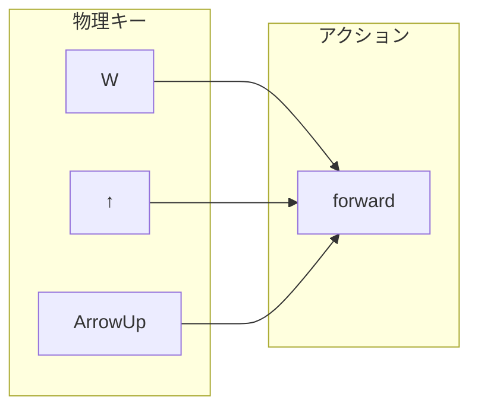
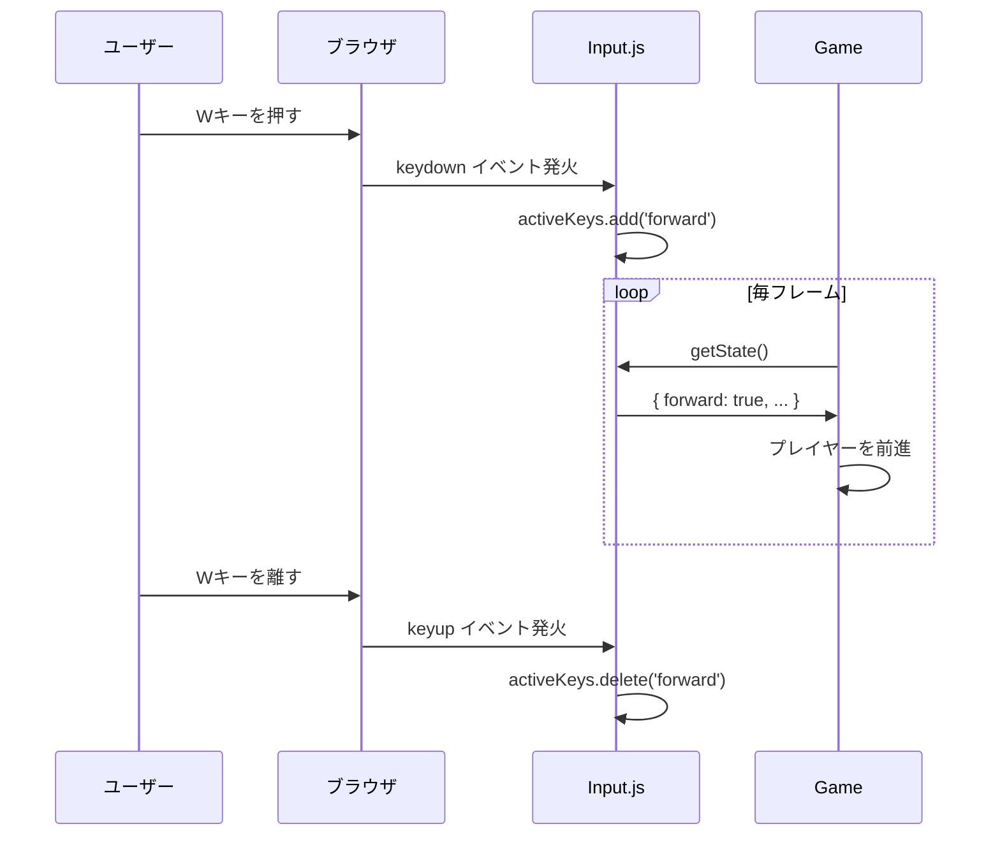
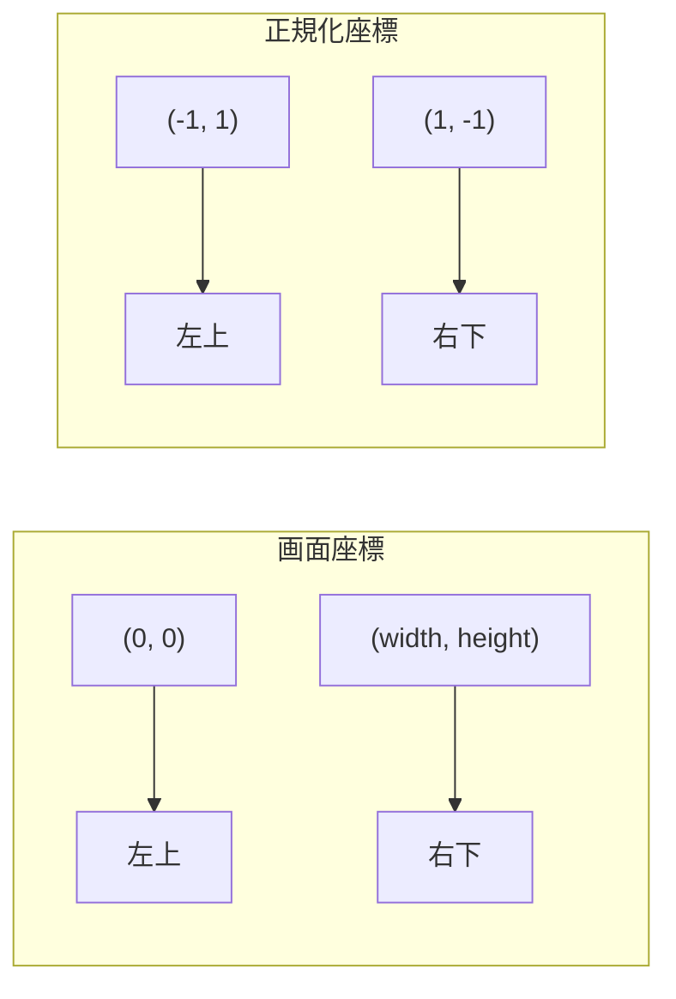
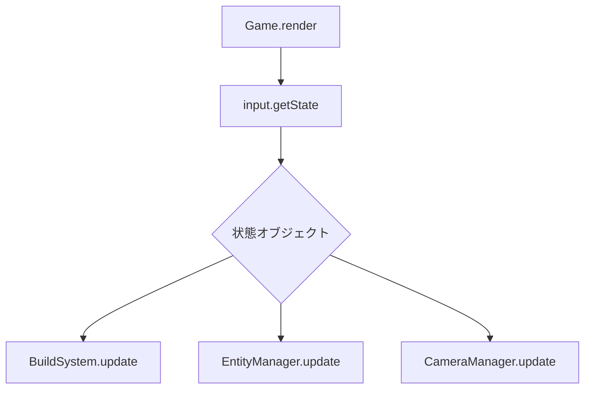
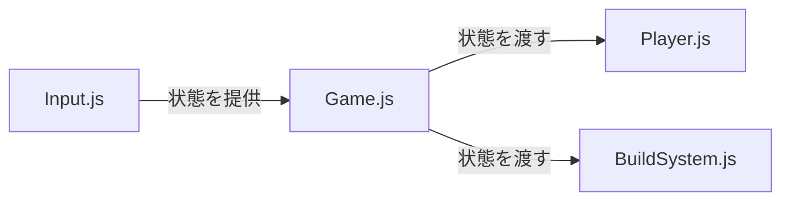

---
tags:
  - Three.js入門編
  - JavaScript
  - イベント駆動
  - データ駆動
  - 入力処理
chapter: 2
status: 完了
prev: "[[01_ゲームの心臓部_Game.js]]"
next: "[[03_設計パターン編/_MOC_設計パターン編]]"
source_file: src/Input.js
created: 2025-11-23
---

# 第2章: 入力システム - Input.js

> [!abstract] この章の概要
> キーボードとマウスの入力を処理する `Input.js` を読み解きます。イベント駆動パラダイムとデータ駆動パラダイムを学びます。

---

## この章で学ぶこと

- [ ] イベントリスナーの仕組みを理解する
- [ ] データ駆動パラダイム（keyMap）を理解する
- [ ] Set を使った状態管理を理解する
- [ ] VR コントローラーの入力処理を理解する

---

## この章で学ぶパラダイム

> [!info] パラダイム
> - **イベント駆動**: `addEventListener` によるイベント処理
> - **データ駆動**: `keyMap` オブジェクトによるキー設定
> - 関連: [[07_付録/05_パラダイム早見表#イベント駆動|パラダイム早見表]]

---

## ファイルの役割

> [!note] `Input.js` の役割
> このファイルは **入力の中央管理所** です。
> - キーボード入力を監視
> - マウス操作を監視
> - VR コントローラー入力を処理
> - 入力状態を他のシステムに提供

---

## コード構造の概要

Input.js は大きく分けて以下の部分で構成されています：



---

## コード解説

### セクション1: コンストラクタと初期化

```javascript
export class Input {
    constructor(renderer) {
        this.renderer = renderer;
        this.activeKeys = new Set();
        this.mouseDown = false;
        this.rightMouseDown = false;
        this.mouse = { x: 0, y: 0 };
```

| プロパティ | 型 | 説明 |
|-----------|-----|------|
| `renderer` | Object | Three.js レンダラー（VR 用） |
| `activeKeys` | Set | 現在押されているキーのセット |
| `mouseDown` | boolean | 左クリック状態 |
| `rightMouseDown` | boolean | 右クリック状態 |
| `mouse` | Object | マウス座標（-1 〜 1） |

> [!tip] Set とは
> `Set` は **重複を許さないコレクション** です。
> キーが押されたら `add()`、離されたら `delete()` するだけで状態管理できます。
>
> ```javascript
> const set = new Set();
> set.add('forward');  // {'forward'}
> set.add('forward');  // {'forward'}（重複しない）
> set.has('forward');  // true
> set.delete('forward'); // {}
> ```

---

### セクション2: データ駆動のキーマッピング

```javascript
        // Data-Driven Key Mapping
        this.keyMap = {
            'w': 'forward', 'arrowup': 'forward', 'up': 'forward',
            's': 'backward', 'arrowdown': 'backward', 'down': 'backward',
            'a': 'rotateLeft', 'arrowleft': 'rotateLeft', 'left': 'rotateLeft',
            'd': 'rotateRight', 'arrowright': 'rotateRight', 'right': 'rotateRight',
            ' ': 'jump',
            'f': 'attack',
            'b': 'toggleBuildMode',
            'v': 'toggleView',
            'k': 'save',
            'l': 'load',
            'm': 'menu'
        };
```

> [!info] データ駆動パラダイム
> **データ駆動** とは、ロジックをコードではなくデータで定義するパラダイムです。

**データ駆動 vs 命令型の比較:**

```javascript
// ❌ 命令型（if文の羅列）
if (key === 'w' || key === 'arrowup' || key === 'up') {
    action = 'forward';
} else if (key === 's' || key === 'arrowdown' || key === 'down') {
    action = 'backward';
} else if (key === 'a' || key === 'arrowleft' || key === 'left') {
    action = 'rotateLeft';
}
// ... 延々と続く

// ✅ データ駆動（オブジェクトで定義）
const action = this.keyMap[key];
```

| 比較項目 | 命令型 | データ駆動 |
|---------|--------|-----------|
| 行数 | 多い | 少ない |
| 変更 | コード修正 | データ修正 |
| 可読性 | 低い | 高い |
| 拡張性 | 難しい | 簡単 |

**キーマッピングの構造:**



---

### セクション3: イベントリスナーの設定

```javascript
    setupListeners() {
        window.addEventListener('keydown', (e) => {
            const key = e.key.toLowerCase();
            if (this.keyMap[key]) {
                this.activeKeys.add(this.keyMap[key]);
            }
            // Special cases that need preventDefault
            if ([' ', 'arrowup', 'arrowdown', 'arrowleft', 'arrowright'].includes(key)) {
                e.preventDefault();
            }
        });

        window.addEventListener('keyup', (e) => {
            const key = e.key.toLowerCase();
            if (this.keyMap[key]) {
                this.activeKeys.delete(this.keyMap[key]);
            }
        });
```

> [!info] イベント駆動パラダイム
> **イベント駆動** とは、イベント（キー押下、クリック等）が発生したときに処理を実行するパラダイムです。

**イベントリスナーの仕組み:**



| イベント | 発火タイミング | 処理 |
|---------|---------------|------|
| `keydown` | キーが押された | アクションを追加 |
| `keyup` | キーが離された | アクションを削除 |
| `mousedown` | マウスボタンを押した | フラグを true |
| `mouseup` | マウスボタンを離した | フラグを false |
| `mousemove` | マウスを動かした | 座標を更新 |

> [!warning] preventDefault() とは
> `e.preventDefault()` は、ブラウザのデフォルト動作を止めます。
> 例えば、スペースキーはページをスクロールしますが、ゲームではジャンプに使いたいので、デフォルト動作を止めています。

---

### セクション4: マウス入力

```javascript
        window.addEventListener('mousedown', (e) => {
            if (e.button === 0) this.mouseDown = true;
            if (e.button === 2) this.rightMouseDown = true;
        });

        window.addEventListener('mouseup', (e) => {
            if (e.button === 0) this.mouseDown = false;
            if (e.button === 2) this.rightMouseDown = false;
        });

        window.addEventListener('mousemove', (e) => {
            this.mouse.x = (e.clientX / window.innerWidth) * 2 - 1;
            this.mouse.y = -(e.clientY / window.innerHeight) * 2 + 1;
        });

        window.addEventListener('contextmenu', e => e.preventDefault());
```

| マウスボタン | e.button | 用途 |
|-------------|----------|------|
| 左クリック | 0 | 攻撃 / ブロック配置 |
| 右クリック | 2 | ブロック削除 |

**マウス座標の正規化:**

```
画面座標 (0, 0) ～ (width, height)
    ↓ 変換
正規化座標 (-1, -1) ～ (1, 1)
```



> [!tip] なぜ正規化するのか
> Three.js のレイキャスト（マウスが指す3Dオブジェクトを判定）は、-1〜1 の正規化座標を使います。

---

### セクション5: 状態の取得

```javascript
    getState() {
        // Initialize state with default values
        const state = {
            x: 0, z: 0,
            jump: this.activeKeys.has('jump'),
            attack: this.activeKeys.has('attack') || this.mouseDown,
            rotateLeft: this.activeKeys.has('rotateLeft'),
            rotateRight: this.activeKeys.has('rotateRight'),
            toggleBuildMode: this.activeKeys.has('toggleBuildMode'),
            toggleView: this.activeKeys.has('toggleView'),
            placeBlock: this.mouseDown,
            removeBlock: this.rightMouseDown,
            save: this.activeKeys.has('save'),
            load: this.activeKeys.has('load'),
            menu: this.activeKeys.has('menu'),
            mouse: { ...this.mouse }
        };

        // Calculate movement vector
        state.z += this.activeKeys.has('backward') ? 1 : 0;
        state.z -= this.activeKeys.has('forward') ? 1 : 0;

        // VR Input Handling
        this.handleVRInput(state);

        return state;
    }
```

**getState() が返すオブジェクト:**

| プロパティ | 型 | 説明 |
|-----------|-----|------|
| `x`, `z` | number | 移動ベクトル（-1〜1） |
| `jump` | boolean | ジャンプ |
| `attack` | boolean | 攻撃 |
| `rotateLeft/Right` | boolean | 回転 |
| `toggleBuildMode` | boolean | ビルドモード切替 |
| `placeBlock` | boolean | ブロック配置 |
| `removeBlock` | boolean | ブロック削除 |
| `save`, `load`, `menu` | boolean | システム操作 |
| `mouse` | Object | マウス座標 |

**入力フロー:**



---

### セクション6: VR 入力処理

```javascript
    handleVRInput(state) {
        const session = this.renderer.xr.getSession();
        if (!session) return;

        for (const source of session.inputSources) {
            if (!source.gamepad) continue;

            const axes = source.gamepad.axes;
            if (axes.length >= 4) {
                const deadzone = 0.1;
                if (Math.abs(axes[2]) > deadzone) state.x += axes[2];
                if (Math.abs(axes[3]) > deadzone) state.z += axes[3];
            }

            // Button mapping
            const buttons = source.gamepad.buttons;
            if (buttons[0]?.pressed) state.attack = true; // Trigger
            if (buttons[1]?.pressed) state.jump = true;   // Squeeze
        }
    }
```

| VR 入力 | 用途 |
|--------|------|
| スティック | 移動 (axes[2], axes[3]) |
| トリガー | 攻撃 (buttons[0]) |
| グリップ | ジャンプ (buttons[1]) |

> [!info] デッドゾーンとは
> スティックの微小な傾きを無視する閾値（0.1）です。
> これにより、スティックが中央にあるときの誤入力を防ぎます。

---

## 設計のポイント

### 1. 入力と処理の分離



> [!tip] なぜ分離するのか
> - **Input**: 「何が押されているか」だけを管理
> - **Player/BuildSystem**: 「どう反応するか」を管理
>
> これにより、入力デバイスを変えても、プレイヤーのコードは変更不要です。

### 2. キーリピートの問題

```javascript
// 毎フレーム getState() を呼ぶと...
state.toggleBuildMode  // true, true, true, ... (押している間ずっと)

// 解決策は呼び出し側で対処
// BuildSystem.js での例:
if (inputState.toggleBuildMode && !this.prevToggle) {
    this.buildMode = !this.buildMode;  // 一度だけ切り替え
}
this.prevToggle = inputState.toggleBuildMode;
```

---

## 実験してみよう

> [!question] やってみよう

### 実験1: キー入力をログに出す

```javascript
// setupListeners() の keydown 内に追加
console.log('押されたキー:', key, '→ アクション:', this.keyMap[key]);
```

### 実験2: 新しいキーを追加する

```javascript
// keyMap に追加
'e': 'interact',

// getState() に追加
interact: this.activeKeys.has('interact'),
```

### 実験3: activeKeys の中身を確認

```javascript
// getState() の先頭に追加
console.log('activeKeys:', [...this.activeKeys]);
```

---

## よくある疑問

> [!question] Q: なぜ Set を使うのですか？配列ではダメ？
> A: Set は重複を自動で排除し、`has()` の検索が高速です。配列だと `includes()` を使い、要素数が増えると遅くなります。

> [!question] Q: アロー関数 `(e) => {}` は何ですか？
> A: 関数の短縮記法です。`function(e) {}` と同じですが、`this` の扱いが異なります。クラス内では `this` を保持するためアロー関数が便利です。

> [!question] Q: `?.` は何ですか？
> A: **オプショナルチェーニング** です。`buttons[0]?.pressed` は、`buttons[0]` が存在すれば `.pressed` にアクセスし、なければ `undefined` を返します。

```javascript
// 従来の書き方
if (buttons[0] && buttons[0].pressed) { ... }

// オプショナルチェーニング
if (buttons[0]?.pressed) { ... }
```

---

## まとめ

この章で学んだこと：

- ✅ `addEventListener` でイベントを監視（イベント駆動）
- ✅ `keyMap` オブジェクトでキー設定を管理（データ駆動）
- ✅ `Set` で押下中のキーを効率的に管理
- ✅ 入力状態を `getState()` でオブジェクトとして提供
- ✅ VR コントローラーの入力処理

> [!success] Three.js入門編 完了！
> おめでとうございます！Three.js入門編が完了しました。
> 次は [[03_設計パターン編/_MOC_設計パターン編|03 設計パターン編]] に進んで、オブジェクト指向や他の設計パターンを学びましょう。

---

## 関連リンク

- [[01_ゲームの心臓部_Game.js|前の章: ゲームの心臓部]]
- [[03_設計パターン編/_MOC_設計パターン編|次のセクション: 設計パターン編]]
- [[02_Three.js入門編/_MOC_Three.js入門編|セクション目次に戻る]]
- [[07_付録/05_パラダイム早見表|パラダイム早見表]]
