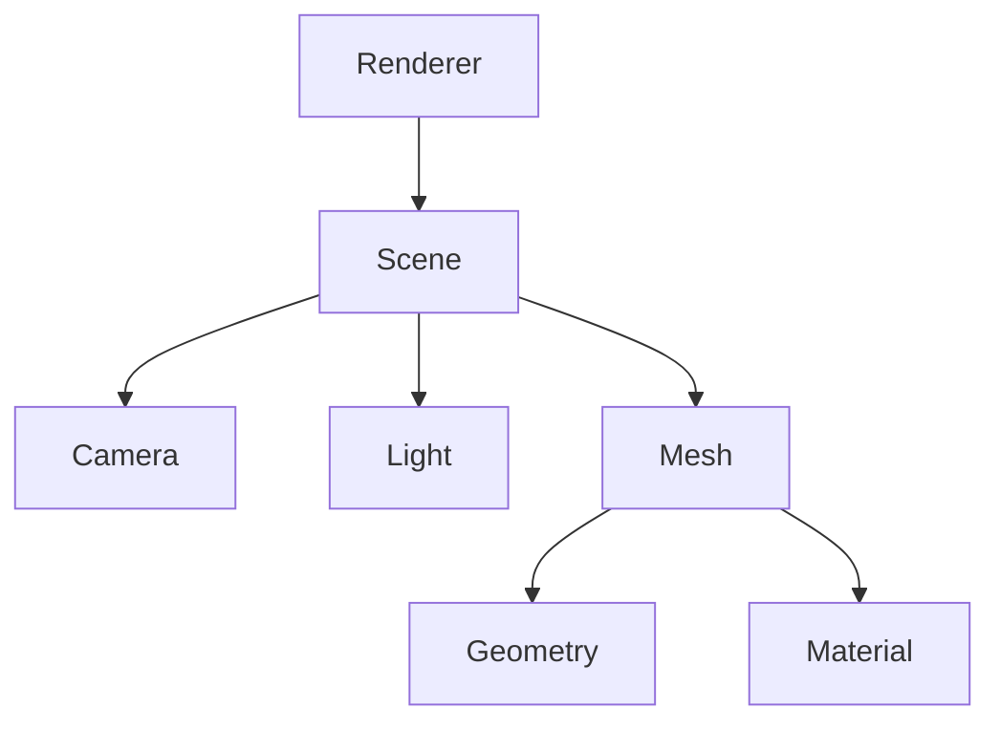
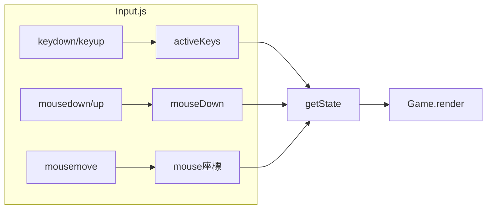

---
tags:
  - MOC
  - Three.js
  - ゲームループ
  - 3D
  - イベント駆動
  - データ駆動
created: 2025-11-23
---

# 02 Three.js入門編

> [!abstract] 概要
> 3Dグラフィックスライブラリ「Three.js」の基本概念と、ゲームの心臓部であるGame.jsを学びます。
> また、入力システムを通じてイベント駆動・データ駆動パラダイムを学びます。

---

## 章一覧

| 章 | タイトル | 対象ファイル | 学習内容 | パラダイム | 状態 |
|----|---------|-------------|---------|-----------|------|
| 01 | [[01_ゲームの心臓部_Game.js]] | `src/Game.js` | Scene、Renderer、Camera、ゲームループ | 関数型 | 🟢 |
| 02 | [[02_入力システム_Input.js]] | `src/Input.js` | イベントリスナー、キー入力、状態管理 | イベント駆動、データ駆動 | 🟢 |

---

## この章で身につくこと

- [ ] Three.jsの基本概念（Scene、Renderer、Camera）を理解する
- [ ] ゲームループの仕組みを理解する
- [ ] キーボード入力の処理方法を理解する
- [ ] イベントリスナーの使い方を理解する
- [ ] データ駆動パラダイム（keyMap）を理解する

---

## この章で学ぶパラダイム

| パラダイム | 適用箇所 | 説明 |
|-----------|---------|------|
| **関数型** | Game.js (城生成) | `filter().forEach()` チェーン |
| **イベント駆動** | Input.js | `addEventListener` |
| **データ駆動** | Input.js (keyMap) | 設定をオブジェクトで定義 |

---

## 前提知識

> [!info] この章を始める前に
> - [[01_基礎編/_MOC_基礎編\|01 基礎編]] を完了している
> - ES Modulesのimport/exportを理解している

---

## Three.jsの基本構造

---

## 入力システムの構造

---

## キーワード

#Three.js #Scene #Renderer #Camera #ゲームループ #requestAnimationFrame #addEventListener #イベント駆動 #データ駆動

---

## ナビゲーション

| 前 | 次 |
|----|-----|
| [[01_基礎編/_MOC_基礎編\|01 基礎編]] | [[03_設計パターン編/_MOC_設計パターン編\|03 設計パターン編]] |

---

## 関連リンク

- [[_MOC_入門レベル\|目次に戻る]]
- [[07_付録/02_Three.js概念図解\|Three.js概念図解]]
- [[07_付録/05_パラダイム早見表\|パラダイム早見表]]
