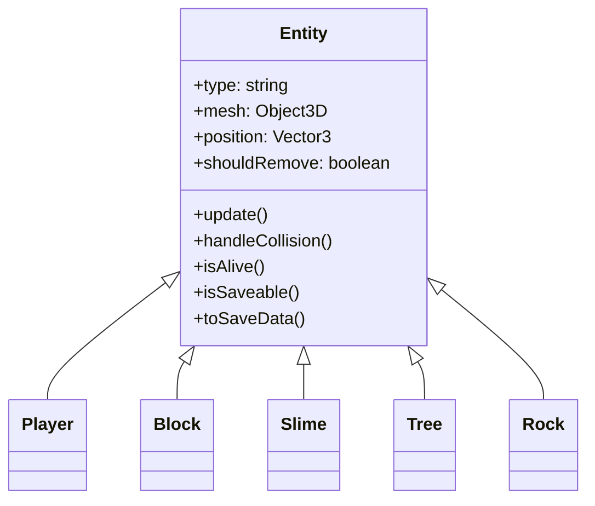
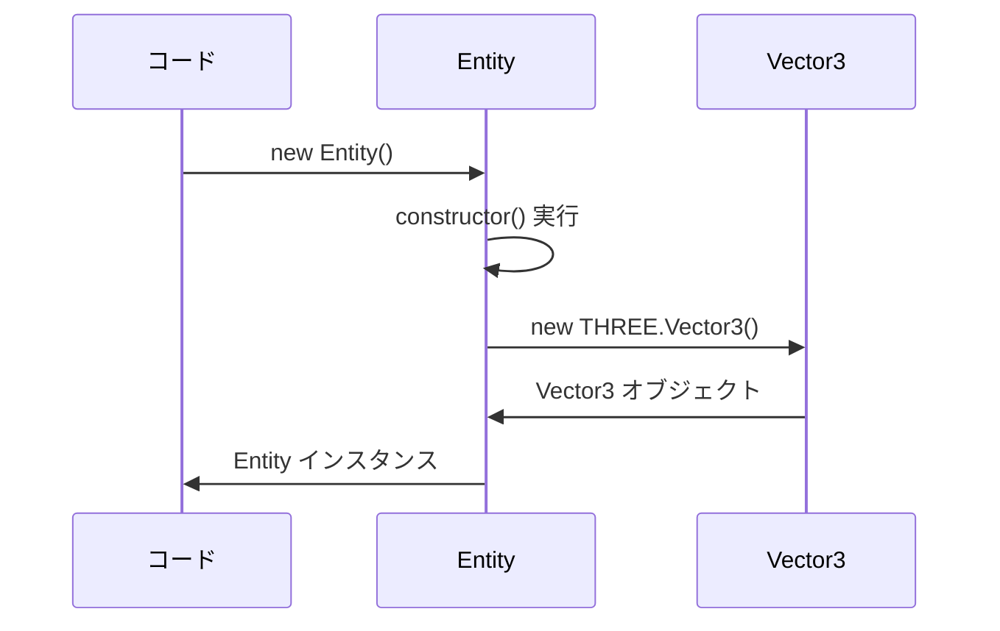
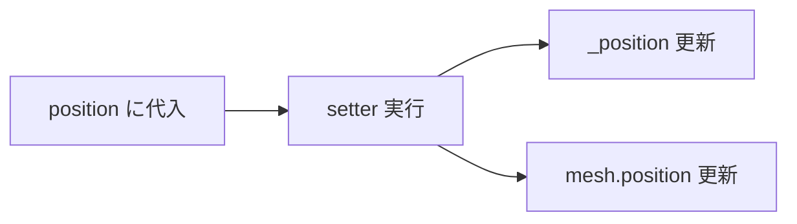
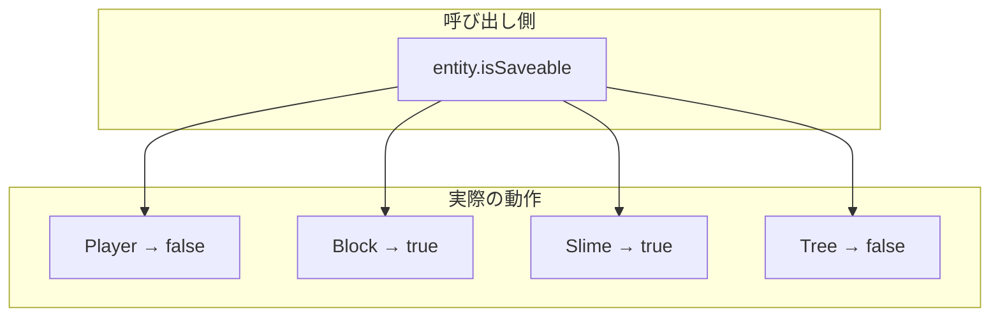
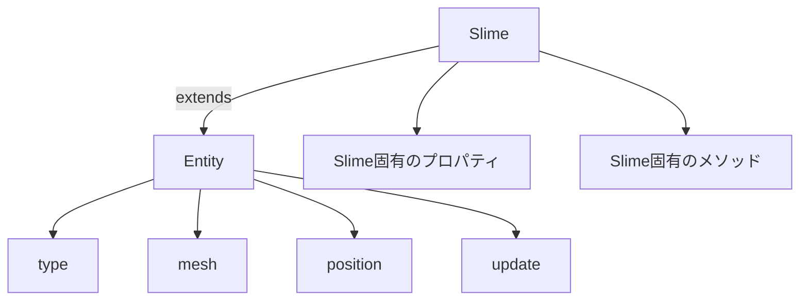

---
tags:
  - 設計パターン編
  - JavaScript
  - オブジェクト指向
  - クラス
  - 継承
  - ポリモーフィズム
chapter: 1
status: 完了
prev: "[[02_Three.js入門編/02_入力システム_Input.js]]"
next: "[[02_エンティティ管理_EntityManager.js]]"
source_file: src/Entity.js
created: 2025-11-23
---

# 第1章: エンティティの基礎 - Entity.js

> [!abstract] この章の概要
> ゲーム内のすべてのオブジェクトの基底クラス `Entity.js` を読み解きます。オブジェクト指向プログラミングの基本（クラス、継承、ポリモーフィズム）を学びます。

---

## この章で学ぶこと

- [ ] JavaScript のクラス構文を理解する
- [ ] getter / setter を理解する
- [ ] 基底クラスとサブクラスの関係を理解する
- [ ] ポリモーフィズム（多態性）を理解する

---

## この章で学ぶパラダイム

> [!info] パラダイム
> - **オブジェクト指向（OOP）**: クラス、継承、ポリモーフィズム
> - 関連: [[07_付録/05_パラダイム早見表#オブジェクト指向|パラダイム早見表]]

---

## ファイルの役割

> [!note] `Entity.js` の役割
> このファイルは **すべてのゲームオブジェクトの基底クラス** です。
> - プレイヤー、敵、ブロック、木などの共通機能を定義
> - サブクラスでオーバーライドするメソッドを提供
> - ポリモーフィズムにより統一的な扱いを可能に

---

## クラス継承の全体像



> [!tip] 継承のメリット
> 共通の機能を Entity に集約することで：
> - コードの重複を避ける
> - 統一的なインターフェースを提供
> - 新しいエンティティの追加が容易

---

## コード解説

### セクション1: import とクラス定義

```javascript
import * as THREE from 'three';

export class Entity {
    constructor() {
        this.type = 'Entity';
        this.mesh = null;
        this._position = new THREE.Vector3();
        this.shouldRemove = false;
    }
```

| プロパティ | 型 | 説明 |
|-----------|-----|------|
| `type` | string | エンティティの種類を識別 |
| `mesh` | Object3D | Three.js の 3D オブジェクト |
| `_position` | Vector3 | 位置（アンダースコアは「内部用」の慣習） |
| `shouldRemove` | boolean | 削除フラグ |

> [!info] constructor とは
> `constructor` は **クラスのインスタンスが作成されるときに実行される** 特別なメソッドです。
> `new Entity()` と書くと、この中の処理が実行されます。

**インスタンス化の流れ:**



---

### セクション2: getter と setter

```javascript
    get position() {
        return this._position;
    }

    set position(value) {
        this._position.copy(value);
        if (this.mesh) {
            this.mesh.position.copy(value);
        }
    }
```

> [!info] getter / setter とは
> **getter**: プロパティを読むときに呼ばれる
> **setter**: プロパティに書き込むときに呼ばれる
>
> 普通のプロパティのように使えますが、裏で追加の処理を実行できます。

**使用例:**

```javascript
const entity = new Entity();

// getter が呼ばれる
console.log(entity.position);  // Vector3(0, 0, 0)

// setter が呼ばれる
entity.position = new THREE.Vector3(1, 2, 3);
// → _position が更新され、mesh.position も同期される
```

**なぜ setter を使うのか:**



> [!tip] 自動同期の実現
> setter を使うことで、位置を変更するだけで 3D モデルの位置も自動的に更新されます。
> これがなければ、毎回手動で両方を更新する必要があります。

---

### セクション3: update メソッド

```javascript
    update(delta, input, time, collidables, entities) {
        // Default update: do nothing
    }
```

| 引数 | 型 | 説明 |
|-----|-----|------|
| `delta` | number | 前フレームからの経過時間（秒） |
| `input` | Object | 入力状態 |
| `time` | number | ゲーム開始からの経過時間 |
| `collidables` | Array | 衝突判定対象のリスト |
| `entities` | Array | 全エンティティのリスト |

> [!info] 空のメソッドの意味
> 基底クラスでは「何もしない」実装を提供し、サブクラスで必要に応じてオーバーライドします。
> これを **テンプレートメソッドパターン** と呼びます。

**サブクラスでのオーバーライド例:**

```javascript
// Slime.js
class Slime extends Entity {
    update(delta, input, time, collidables, entities) {
        // スライム独自の更新処理
        this.updateState(delta);
        this.moveTowardPlayer(entities);
    }
}
```

---

### セクション4: handleCollision メソッド

```javascript
    handleCollision(player, physics) {
        // Default collision: do nothing
    }
```

> [!info] ポリモーフィズムの実践
> プレイヤーがエンティティに衝突したとき、`handleCollision` が呼ばれます。
> エンティティの種類によって異なる反応をします。

**各エンティティの衝突処理:**

| エンティティ | 衝突時の処理 |
|-------------|-------------|
| Block | 何もしない |
| Slime | プレイヤーにダメージ、ノックバック |
| Tree | 何もしない |

```javascript
// Slime.js での実装
handleCollision(player, physics) {
    // プレイヤーをノックバック
    physics.knockback(/* ... */);
}
```

---

### セクション5: isAlive メソッド

```javascript
    isAlive() {
        return !this.shouldRemove;
    }
```

> [!tip] シンプルな状態チェック
> `shouldRemove` が `true` なら死亡、`false` なら生存。
> `!`（否定演算子）で反転して返します。

---

### セクション6: セーブ関連メソッド（ポリモーフィズム）

```javascript
    // Polymorphic save/load methods
    isSaveable() {
        // Override in subclass to indicate if this entity should be saved
        return false;
    }

    toSaveData() {
        // Override in subclass to return save data object
        return null;
    }

    static fromSaveData(data) {
        // Override in subclass to create entity from save data
        return null;
    }
```

> [!info] ポリモーフィズム（多態性）とは
> **同じメソッド名でも、クラスによって異なる動作をする** 仕組みです。

**ポリモーフィズムの例:**



**各サブクラスでの実装:**

```javascript
// Block.js
isSaveable() {
    return true;  // ブロックは保存対象
}

toSaveData() {
    return {
        type: 'Block',
        x: this.position.x,
        y: this.position.y,
        z: this.position.z,
        color: this.color
    };
}

// Player.js
isSaveable() {
    return false;  // プレイヤーは別途保存
}
```

> [!tip] static メソッドとは
> `static` メソッドは **インスタンスではなくクラスから直接呼び出す** メソッドです。
> ```javascript
> // インスタンスメソッド
> const entity = new Entity();
> entity.isAlive();
>
> // static メソッド
> Block.fromSaveData(data);  // new 不要
> ```

---

## 継承の仕組み

### extends キーワード

```javascript
// Slime.js（サブクラス）
export class Slime extends Entity {
    constructor(x, y, z) {
        super();  // 親クラスの constructor を呼ぶ
        this.type = 'Slime';
        // ... Slime 固有の初期化
    }
}
```



| キーワード | 説明 |
|-----------|------|
| `extends` | 親クラスを継承 |
| `super()` | 親クラスの constructor を呼び出し |

> [!warning] super() を忘れずに
> サブクラスの constructor 内では、必ず `super()` を最初に呼ぶ必要があります。
> これを忘れるとエラーになります。

---

## オブジェクト指向の3本柱

### 1. カプセル化

```javascript
// _position は内部用（慣習的に _ で表現）
this._position = new THREE.Vector3();

// 外部からは getter/setter を通じてアクセス
get position() { return this._position; }
set position(value) { /* 追加処理 */ }
```

### 2. 継承

```javascript
class Slime extends Entity {
    // Entity の機能を受け継ぐ
}
```

### 3. ポリモーフィズム

```javascript
// 同じメソッド呼び出しで異なる動作
entities.forEach(entity => {
    entity.update(delta);  // 各エンティティが自分の update を実行
});
```

---

## 設計のポイント

### なぜ基底クラスを作るのか

```javascript
// ❌ 基底クラスなし（コード重複）
class Player {
    constructor() { this.mesh = null; this.position = ...; }
    update() { ... }
}
class Slime {
    constructor() { this.mesh = null; this.position = ...; }  // 重複！
    update() { ... }
}

// ✅ 基底クラスあり
class Entity {
    constructor() { this.mesh = null; this.position = ...; }
    update() { ... }
}
class Player extends Entity { ... }
class Slime extends Entity { ... }
```

### EntityManager との連携

```javascript
// EntityManager.js
update(delta, input, time, collidables) {
    for (const entity of this.entities) {
        entity.update(delta, input, time, collidables, this.entities);
        // ↑ ポリモーフィズムにより、各エンティティが
        //   自分の update を実行
    }
}
```

---

## 実験してみよう

> [!question] やってみよう

### 実験1: プロパティを確認する

```javascript
// 任意のファイルで
const entity = new Entity();
console.log(entity.type);       // 'Entity'
console.log(entity.position);   // Vector3(0, 0, 0)
console.log(entity.isAlive());  // true
```

### 実験2: 継承を確認する

```javascript
const slime = new Slime(0, 1, 0);
console.log(slime instanceof Slime);   // true
console.log(slime instanceof Entity);  // true（継承しているので）
```

### 実験3: ポリモーフィズムを確認する

```javascript
const entities = [new Block(0,1,0,'stone'), new Slime(1,1,0)];
entities.forEach(e => console.log(e.type, e.isSaveable()));
// 'Block' true
// 'Slime' true
```

---

## よくある疑問

> [!question] Q: なぜ `_position` とアンダースコアをつけるのですか？
> A: 「このプロパティは内部用で、直接アクセスしないでね」という **慣習** です。JavaScript には private の強制力がないため、慣習で示します。

> [!question] Q: `static` メソッドはいつ使うのですか？
> A: インスタンスなしで呼べる処理、特に **ファクトリメソッド**（インスタンスを作成して返すメソッド）に使います。`fromSaveData` はデータからエンティティを復元するファクトリメソッドです。

> [!question] Q: 継承と合成（コンポジション）の違いは？
> A: **継承**は「〜である（is-a）」関係、**合成**は「〜を持つ（has-a）」関係です。
> - Slime は Entity **である** → 継承
> - Player は Physics を **持つ** → 合成（次章で詳しく）

---

## まとめ

この章で学んだこと：

- ✅ `class` と `constructor` でクラスを定義
- ✅ `get` / `set` でプロパティの読み書きをカスタマイズ
- ✅ `extends` で継承、`super()` で親を呼び出し
- ✅ ポリモーフィズムで同じメソッド名で異なる動作
- ✅ 基底クラスでコード重複を避ける

> [!success] 次のステップ
> [[02_エンティティ管理_EntityManager.js]] に進んで、複数のエンティティを管理する方法を学びましょう。

---

## 関連リンク

- [[02_Three.js入門編/02_入力システム_Input.js|前の章: 入力システム]]
- [[02_エンティティ管理_EntityManager.js|次の章: エンティティ管理]]
- [[03_設計パターン編/_MOC_設計パターン編|セクション目次に戻る]]
- [[07_付録/01_JavaScript基礎リファレンス|JavaScript基礎リファレンス]]
