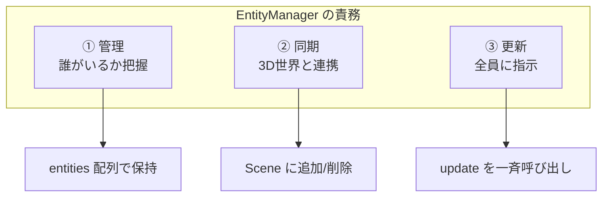
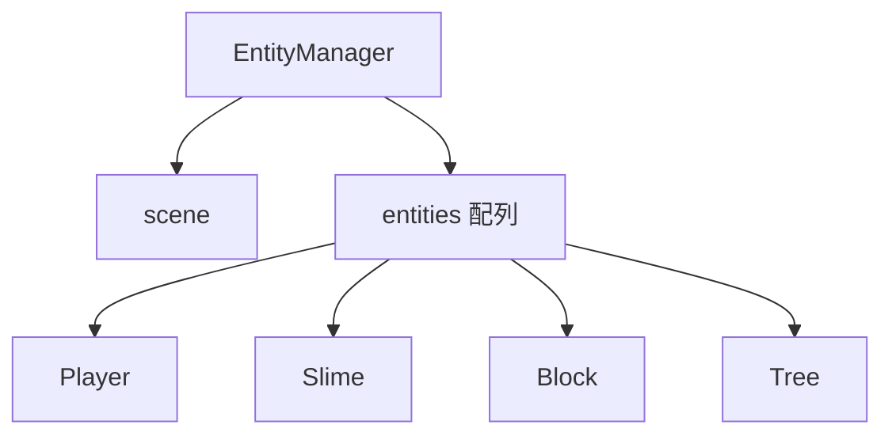
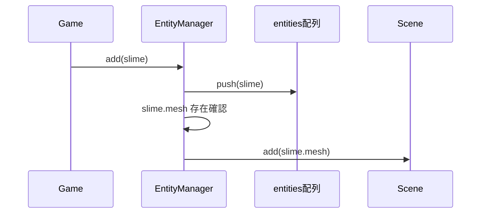
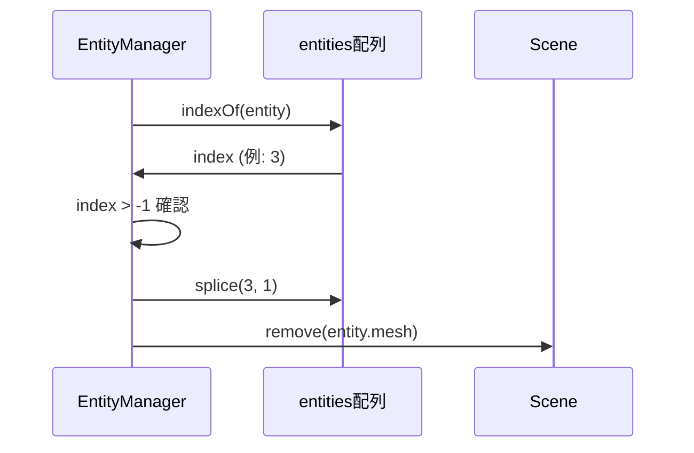
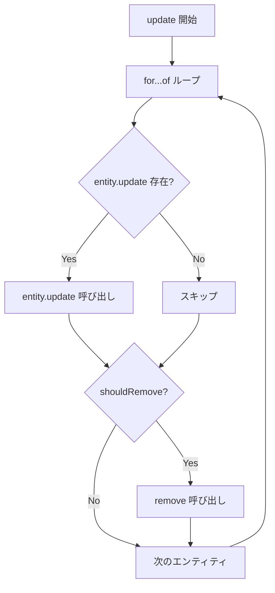
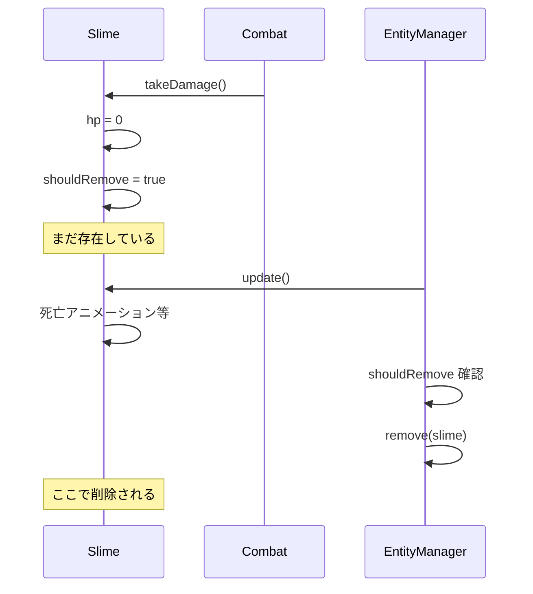
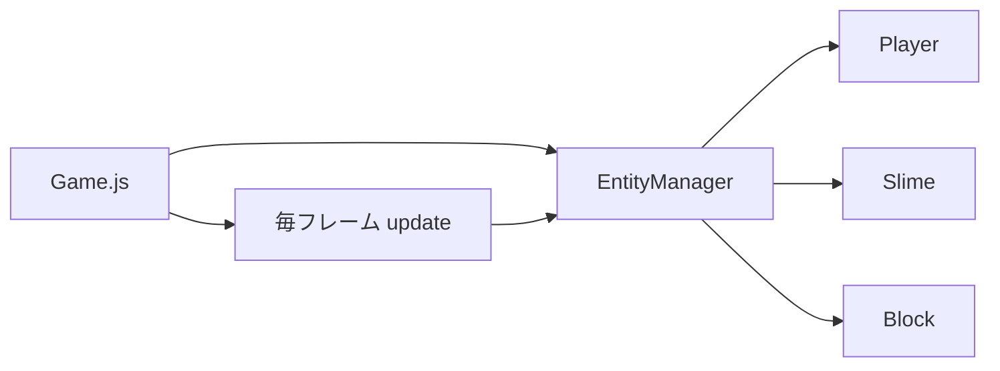

---
tags:
  - 設計パターン編
  - JavaScript
  - オブジェクト指向
  - 関数型
  - 配列操作
chapter: 2
status: 完了
prev: "[[01_エンティティの基礎_Entity.js]]"
next: "[[03_プレイヤーの設計_Player.js]]"
source_file: src/EntityManager.js
created: 2025-11-23
---

# 第2章: エンティティ管理 - EntityManager.js

> [!abstract] この章の概要
> 複数のエンティティを管理する `EntityManager.js` を読み解きます。オブジェクト指向と関数型を組み合わせたハイブリッドな設計を学びます。

---

## この章で学ぶこと

- [ ] 配列によるオブジェクト管理を理解する
- [ ] for...of ループを理解する
- [ ] 削除フラグパターンを理解する
- [ ] Scene との連携を理解する

---

## この章で学ぶパラダイム

> [!info] パラダイム
> - **オブジェクト指向**: クラスによるカプセル化
> - **関数型**: 配列操作（今回はシンプルなループ）
> - 関連: [[07_付録/05_パラダイム早見表#関数型|パラダイム早見表]]

---

## ファイルの役割

> [!note] `EntityManager.js` の役割
> このファイルは **エンティティの中央管理所** です。
> - すべてのエンティティを配列で保持
> - エンティティの追加・削除を管理
> - 毎フレーム、全エンティティの update を呼び出す
> - Three.js の Scene と同期

---

## EntityManager をもっとわかりやすく

### なぜ EntityManager が必要なのか？

ゲームには様々なオブジェクトが登場します：

```
┌─────────────────────────────────────────────────────────┐
│  ゲームの世界                                           │
├─────────────────────────────────────────────────────────┤
│                                                         │
│    🐰 プレイヤー（1体）                                 │
│    🟢 スライム（たくさん）                              │
│    🧱 ブロック（たくさん）                              │
│    🌳 木（たくさん）                                    │
│    🪨 岩（たくさん）                                    │
│                                                         │
│    → 合計で数十〜数百のオブジェクト！                  │
│                                                         │
└─────────────────────────────────────────────────────────┘
```

これらを **バラバラに管理** すると大変なことになります：

```javascript
// ❌ バラバラに管理すると...
class Game {
    constructor() {
        this.player = new Player();
        this.slime1 = new Slime();
        this.slime2 = new Slime();
        this.slime3 = new Slime();
        this.block1 = new Block();
        this.block2 = new Block();
        // ... 100個のオブジェクトを個別に書く？
    }

    update() {
        this.player.update();
        this.slime1.update();
        this.slime2.update();
        this.slime3.update();
        this.block1.update();
        this.block2.update();
        // ... 100回書く？
    }
}
```

そこで **EntityManager** の出番です：

```javascript
// ✅ EntityManager で一括管理
class Game {
    constructor() {
        this.entityManager = new EntityManager(this.scene);

        // 追加するだけ！
        this.entityManager.add(new Player());
        this.entityManager.add(new Slime());
        this.entityManager.add(new Slime());
        this.entityManager.add(new Block());
        // ... いくらでも追加可能
    }

    update() {
        // たった1行で全員を更新！
        this.entityManager.update(delta, input, time, collidables);
    }
}
```

### EntityManager を現実世界に例えると

EntityManager は **幼稚園の先生** のような存在です：

```
┌─────────────────────────────────────────────────────────┐
│  🏫 幼稚園の先生（EntityManager）の仕事                 │
├─────────────────────────────────────────────────────────┤
│                                                         │
│  📋 出席簿を管理（entities 配列）                       │
│     → 誰がいるか把握している                           │
│                                                         │
│  ➕ 入園の手続き（add メソッド）                        │
│     → 新しい子が来たら、出席簿に追加                   │
│     → 教室（Scene）に案内                              │
│                                                         │
│  ➖ 退園の手続き（remove メソッド）                     │
│     → 帰る子は出席簿から削除                           │
│     → 教室（Scene）から退出                            │
│                                                         │
│  📢 一斉に呼びかけ（update メソッド）                   │
│     → 「みんな〜、次の活動だよ〜」                     │
│     → 全員に同じ指示を出せる                           │
│                                                         │
└─────────────────────────────────────────────────────────┘
```

### EntityManager の3つの責務



| 責務 | 具体的な処理 | なぜ必要？ |
|------|-------------|-----------|
| **① 管理** | 配列にエンティティを保持 | 誰がいるか分からないと何もできない |
| **② 同期** | Scene への追加・削除 | 3D表示されないと見えない |
| **③ 更新** | 全エンティティの update 呼び出し | 動かないと何も起きない |

### add と remove の仕組み

#### add（追加）の流れ

```
┌─────────────────────────────────────────────────────────┐
│  entityManager.add(slime) を呼ぶと...                   │
├─────────────────────────────────────────────────────────┤
│                                                         │
│  ステップ1: 配列に追加                                  │
│  ┌─────────────────────────────────────┐               │
│  │ entities: [Player, Block, Block]    │               │
│  │                         ↓           │               │
│  │ entities: [Player, Block, Block, Slime] ← 追加！   │
│  └─────────────────────────────────────┘               │
│                                                         │
│  ステップ2: 3D世界（Scene）に登場                       │
│  ┌─────────────────────────────────────┐               │
│  │ Scene に slime.mesh を追加           │               │
│  │ → 画面に緑のスライムが表示される！   │               │
│  └─────────────────────────────────────┘               │
│                                                         │
└─────────────────────────────────────────────────────────┘
```

#### remove（削除）の流れ

```
┌─────────────────────────────────────────────────────────┐
│  entityManager.remove(slime) を呼ぶと...                │
├─────────────────────────────────────────────────────────┤
│                                                         │
│  ステップ1: 配列から探す                                │
│  ┌─────────────────────────────────────┐               │
│  │ entities: [Player, Block, Slime, Block]             │
│  │                           ↑                         │
│  │                     ここにいた！（index = 2）       │
│  └─────────────────────────────────────┘               │
│                                                         │
│  ステップ2: 配列から削除                                │
│  ┌─────────────────────────────────────┐               │
│  │ entities: [Player, Block, Block] ← Slime 消えた！  │
│  └─────────────────────────────────────┘               │
│                                                         │
│  ステップ3: 3D世界（Scene）から退場                     │
│  ┌─────────────────────────────────────┐               │
│  │ Scene から slime.mesh を削除         │               │
│  │ → 画面からスライムが消える！         │               │
│  └─────────────────────────────────────┘               │
│                                                         │
└─────────────────────────────────────────────────────────┘
```

### update の仕組み

毎フレーム（1秒に60回）呼ばれる `update` メソッドは、全エンティティに「動け！」と指示を出します：

```
┌─────────────────────────────────────────────────────────┐
│  entityManager.update() が呼ばれると...                 │
├─────────────────────────────────────────────────────────┤
│                                                         │
│  entities: [Player, Slime, Slime, Block, Tree]          │
│               ↓       ↓       ↓       ↓      ↓         │
│            update  update  update  update  update       │
│               ↓       ↓       ↓       ↓      ↓         │
│             移動    追跡    追跡    何も    何も        │
│             攻撃    攻撃    死亡   しない  しない       │
│                              ↓                         │
│                        shouldRemove = true              │
│                              ↓                         │
│                        remove(slime) 実行               │
│                                                         │
└─────────────────────────────────────────────────────────┘
```

> [!important] ポイント
> - **同じ `update()` 呼び出し** でも、エンティティの種類によって **違う動作** をします
> - これが「ポリモーフィズム（多態性）」と呼ばれる仕組みです
> - Player は移動・攻撃、Slime は追跡・攻撃、Block は何もしない

---

## コード全体

```javascript
import * as THREE from 'three';

export class EntityManager {
    constructor(scene) {
        this.scene = scene;
        this.entities = [];
    }

    add(entity) {
        this.entities.push(entity);
        if (entity.mesh) {
            this.scene.add(entity.mesh);
        }
    }

    remove(entity) {
        const index = this.entities.indexOf(entity);
        if (index > -1) {
            this.entities.splice(index, 1);
            if (entity.mesh) {
                this.scene.remove(entity.mesh);
            }
        }
    }

    update(delta, input, time, collidables) {
        for (const entity of this.entities) {
            if (entity.update) {
                entity.update(delta, input, time, collidables, this.entities);
            }
            if (entity.shouldRemove) {
                this.remove(entity);
            }
        }
    }
}
```

> [!tip] コンパクトな設計
> わずか36行で、すべてのエンティティを管理！
> シンプルさは良い設計の証です。

---

## コード解説

### セクション1: コンストラクタ

```javascript
export class EntityManager {
    constructor(scene) {
        this.scene = scene;
        this.entities = [];
    }
```

| プロパティ | 型 | 説明 |
|-----------|-----|------|
| `scene` | THREE.Scene | Three.js のシーン（3D空間） |
| `entities` | Array | 管理するエンティティの配列 |



> [!info] なぜ Scene を保持するのか
> エンティティを追加・削除するとき、対応する 3D メッシュも Scene に追加・削除する必要があるためです。

---

### セクション2: add メソッド

```javascript
    add(entity) {
        this.entities.push(entity);
        if (entity.mesh) {
            this.scene.add(entity.mesh);
        }
    }
```

**処理の流れ:**



| 処理 | 説明 |
|-----|------|
| `this.entities.push(entity)` | 配列の末尾に追加 |
| `this.scene.add(entity.mesh)` | 3D メッシュを Scene に追加 |

> [!tip] if (entity.mesh) の意味
> すべてのエンティティが mesh を持つとは限りません（例：非表示のトリガー）。
> mesh が存在する場合のみ Scene に追加します。

---

### セクション3: remove メソッド

```javascript
    remove(entity) {
        const index = this.entities.indexOf(entity);
        if (index > -1) {
            this.entities.splice(index, 1);
            if (entity.mesh) {
                this.scene.remove(entity.mesh);
            }
        }
    }
```

**処理の流れ:**



| メソッド | 説明 |
|---------|------|
| `indexOf(entity)` | 配列内の位置を検索（見つからない場合は -1） |
| `splice(index, 1)` | 指定位置から1要素を削除 |
| `scene.remove(mesh)` | 3D メッシュを Scene から削除 |

**splice の動作:**

```javascript
const arr = ['a', 'b', 'c', 'd'];
arr.splice(1, 1);  // index=1 から 1個削除
// arr は ['a', 'c', 'd'] になる
```

> [!warning] indexOf の戻り値に注意
> 要素が見つからない場合、`indexOf` は `-1` を返します。
> `if (index > -1)` で存在確認してから削除します。

---

### セクション4: update メソッド

```javascript
    update(delta, input, time, collidables) {
        for (const entity of this.entities) {
            if (entity.update) {
                entity.update(delta, input, time, collidables, this.entities);
            }
            if (entity.shouldRemove) {
                this.remove(entity);
            }
        }
    }
```

**処理の流れ:**



> [!info] for...of とは
> `for...of` は配列の各要素を順に処理するモダンな構文です。
>
> ```javascript
> // 従来の方法
> for (let i = 0; i < array.length; i++) {
>     const item = array[i];
> }
>
> // for...of（推奨）
> for (const item of array) {
>     // item を使う
> }
> ```

**ポリモーフィズムの実践:**

```javascript
// 同じ entity.update() 呼び出しでも...
entity.update(delta, input, time, collidables, this.entities);

// Player なら → Player.update() が実行
// Slime なら → Slime.update() が実行
// Block なら → Entity.update()（何もしない）
```

---

## 削除フラグパターン

> [!info] 削除フラグパターンとは
> エンティティを即座に削除せず、`shouldRemove` フラグを立て、更新ループ内で削除する設計パターンです。

**なぜ即座に削除しないのか:**

```javascript
// ❌ 危険な即座削除
for (const entity of this.entities) {
    if (someCondition) {
        this.remove(entity);  // 配列が変更される！
    }
    entity.update();  // 削除された要素にアクセス？
}

// ✅ 削除フラグパターン
for (const entity of this.entities) {
    entity.update();
    if (entity.shouldRemove) {
        this.remove(entity);  // update の後に削除
    }
}
```



---

## 設計パターン: Manager クラス

> [!tip] Manager パターン
> 複数のオブジェクトを管理するクラスを「Manager」と呼ぶ設計パターンです。

| 役割 | 説明 |
|-----|------|
| **追加** | `add()` で管理対象に追加 |
| **削除** | `remove()` で管理対象から削除 |
| **更新** | `update()` で全オブジェクトを更新 |
| **検索** | 必要に応じて `find()` や `filter()` を提供 |

**このプロジェクトの Manager:**

- `EntityManager`: エンティティ管理
- `AudioManager`: サウンド管理
- `SaveManager`: セーブデータ管理
- `CameraManager`: カメラ管理

---

## Game.js との連携

```javascript
// Game.js
constructor() {
    this.entityManager = new EntityManager(this.scene);

    // エンティティの追加
    this.player = new Player(this.scene, this.audioManager);
    this.entityManager.add(this.player);
}

render() {
    // 毎フレーム更新
    this.entityManager.update(delta, inputState, time, this.collidables);
}
```



---

## 実験してみよう

> [!question] やってみよう

### 実験1: エンティティの数を確認

```javascript
// Game.js の render() 内に追加
console.log('エンティティ数:', this.entityManager.entities.length);
```

### 実験2: エンティティの型を確認

```javascript
// Game.js の render() 内に追加
this.entityManager.entities.forEach(e => console.log(e.type));
```

### 実験3: 削除の動作を確認

```javascript
// Slime.js の update() 内に追加
console.log('Slime shouldRemove:', this.shouldRemove);
```

---

## よくある疑問

> [!question] Q: なぜ配列を使うのですか？オブジェクトではダメ？
> A: 配列は **順序を保持** し、**for...of で簡単に反復** できます。順序が重要でキーが不要な場合は配列が適しています。

> [!question] Q: `if (entity.update)` は何をチェックしていますか？
> A: エンティティが `update` メソッドを持っているか確認しています。JavaScript では存在しないメソッドを呼ぶとエラーになるため、事前チェックしています。

> [!question] Q: ループ中に配列を変更しても大丈夫ですか？
> A: 一般的には危険ですが、このコードでは `update()` の**後に** `remove()` を呼んでいるため、現在の反復は安全に完了します。ただし、削除された要素の次の要素がスキップされる可能性があります。

---

## 発展: より安全な削除

> [!note] 発展的な内容
> 本番コードでは、より安全な削除方法を使うこともあります。

```javascript
// 方法1: 逆順ループ
for (let i = this.entities.length - 1; i >= 0; i--) {
    const entity = this.entities[i];
    entity.update();
    if (entity.shouldRemove) {
        this.entities.splice(i, 1);
    }
}

// 方法2: filter で新しい配列を作成
update() {
    this.entities.forEach(e => e.update());
    this.entities = this.entities.filter(e => !e.shouldRemove);
}
```

---

## まとめ

この章で学んだこと：

- ✅ 配列で複数のオブジェクトを管理
- ✅ `push()` で追加、`splice()` で削除
- ✅ `for...of` で配列を反復
- ✅ 削除フラグパターンで安全に削除
- ✅ Manager パターンの役割

> [!success] 次のステップ
> [[03_プレイヤーの設計_Player.js]] に進んで、コンポーネントベースの設計を学びましょう。

---

## 関連リンク

- [[01_エンティティの基礎_Entity.js|前の章: エンティティの基礎]]
- [[03_プレイヤーの設計_Player.js|次の章: プレイヤーの設計]]
- [[03_設計パターン編/_MOC_設計パターン編|セクション目次に戻る]]
- [[07_付録/01_JavaScript基礎リファレンス|JavaScript基礎リファレンス]]
