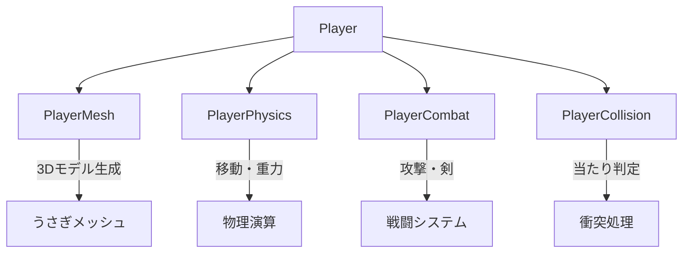
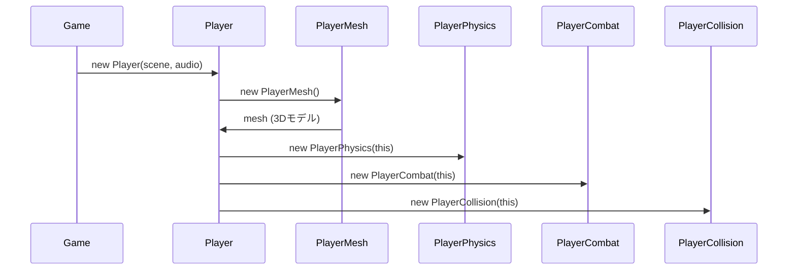
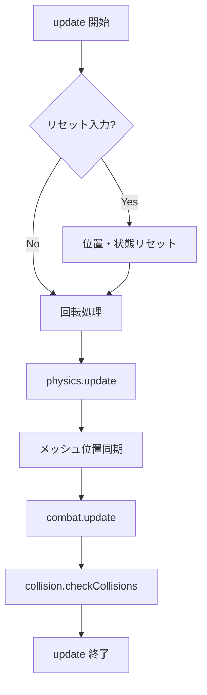
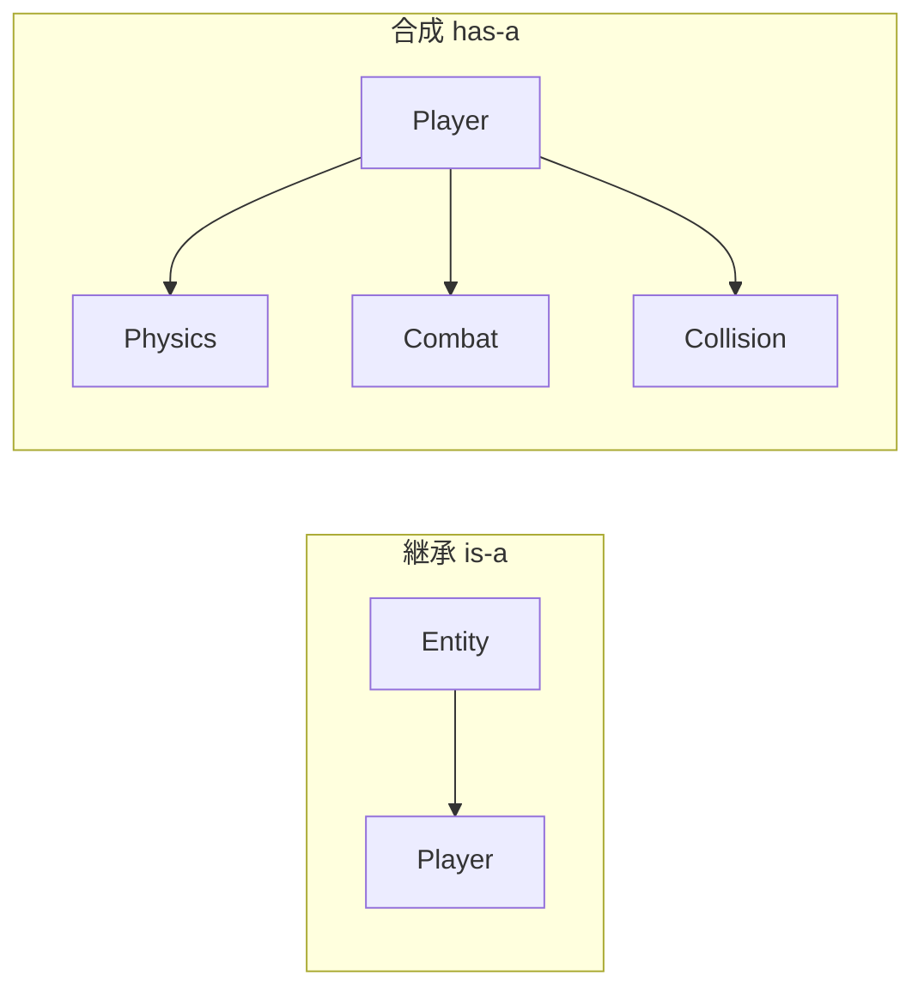
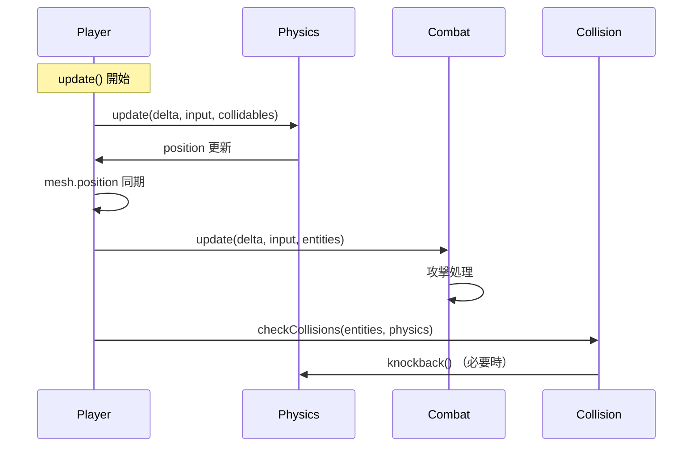

---
tags:
  - 設計パターン編
  - JavaScript
  - コンポーネント
  - 合成
  - 責務分割
chapter: 3
status: 完了
prev: "[[02_エンティティ管理_EntityManager.js]]"
next: "[[04_3Dグラフィックス編/_MOC_3Dグラフィックス編]]"
source_file: src/Player.js
created: 2025-11-23
---

# 第3章: プレイヤーの設計 - Player.js

> [!abstract] この章の概要
> プレイヤーキャラクターを実装する `Player.js` を読み解きます。コンポーネントベースの設計と責務分割（Separation of Concerns）を学びます。

---

## この章で学ぶこと

- [ ] コンポーネントベース設計を理解する
- [ ] 継承と合成の違いを理解する
- [ ] 責務分割（SoC）を理解する
- [ ] プレイヤーの更新フローを理解する

---

## この章で学ぶパラダイム

> [!info] パラダイム
> - **コンポーネントベース**: 機能をコンポーネントに分割し、合成する
> - **合成（Composition）**: 「〜を持つ」関係で機能を構築
> - 関連: [[07_付録/05_パラダイム早見表#コンポーネントベース|パラダイム早見表]]

---

## ファイルの役割

> [!note] `Player.js` の役割
> このファイルは **プレイヤーキャラクターの統括者** です。
> - 4つのコンポーネントを持ち、連携させる
> - 入力を受け取り、各コンポーネントに委譲
> - プレイヤーの状態（位置、向き）を管理

---

## コンポーネント構成



| コンポーネント | 責務 | ファイル |
|--------------|------|---------|
| `PlayerMesh` | 3Dモデルの生成 | PlayerMesh.js |
| `PlayerPhysics` | 移動、重力、ジャンプ | PlayerPhysics.js |
| `PlayerCombat` | 攻撃、剣の表示 | PlayerCombat.js |
| `PlayerCollision` | 敵との衝突判定 | PlayerCollision.js |

---

## コード全体

```javascript
import * as THREE from 'three';
import { PlayerMesh } from './PlayerMesh.js';
import { PlayerPhysics } from './PlayerPhysics.js';
import { PlayerCombat } from './PlayerCombat.js';
import { PlayerCollision } from './PlayerCollision.js';

export class Player {
    constructor(scene, audioManager) {
        this.scene = scene;
        this.audioManager = audioManager;
        this.position = new THREE.Vector3(0, 0, 0);

        this.mesh = this.buildCharacter();
        this.mesh.position.copy(this.position);
        this.mesh.rotation.y = 0;
        this.scene.add(this.mesh);

        // Components
        this.physics = new PlayerPhysics(this);
        this.combat = new PlayerCombat(this);
        this.collision = new PlayerCollision(this);
    }

    buildCharacter() {
        return new PlayerMesh().create();
    }

    update(delta, input, time, collidables, entities) {
        // Emergency Reset
        if (input.reset) {
            this.position.set(0, 0.5, 0);
            this.physics.reset();
            this.mesh.rotation.y = 0;
        }

        // Rotation
        const rotationSpeed = 3.0;
        const rotationDir = (input.rotateLeft ? 1 : 0) - (input.rotateRight ? 1 : 0);
        this.mesh.rotation.y += rotationDir * rotationSpeed * delta;

        // Physics Update
        this.physics.update(delta, input, collidables);

        // Sync Mesh Position
        this.mesh.position.copy(this.position);

        // Combat Update
        this.combat.update(delta, input, entities);

        // Check Collisions
        this.checkCollisions(entities);
    }

    checkCollisions(entities) {
        this.collision.checkCollisions(entities, this.physics);
    }

    isSaveable() {
        return false;
    }
}
```

---

## コード解説

### セクション1: import とコンストラクタ

```javascript
import { PlayerMesh } from './PlayerMesh.js';
import { PlayerPhysics } from './PlayerPhysics.js';
import { PlayerCombat } from './PlayerCombat.js';
import { PlayerCollision } from './PlayerCollision.js';

export class Player {
    constructor(scene, audioManager) {
        this.scene = scene;
        this.audioManager = audioManager;
        this.position = new THREE.Vector3(0, 0, 0);

        this.mesh = this.buildCharacter();
        this.mesh.position.copy(this.position);
        this.mesh.rotation.y = 0;
        this.scene.add(this.mesh);

        // Components
        this.physics = new PlayerPhysics(this);
        this.combat = new PlayerCombat(this);
        this.collision = new PlayerCollision(this);
    }
```

> [!info] コンポーネントの初期化
> 各コンポーネントは `this`（Player 自身）を受け取ります。
> これにより、コンポーネントから Player のプロパティにアクセスできます。

**初期化の流れ:**



---

### セクション2: メッシュの生成

```javascript
    buildCharacter() {
        return new PlayerMesh().create();
    }
```

> [!tip] ファクトリパターンの活用
> `PlayerMesh` はうさぎの 3D モデルを生成するファクトリです。
> 詳細は [[04_3Dグラフィックス編/01_キャラクター構築_PlayerMesh.js|PlayerMesh.js の章]] で学びます。

---

### セクション3: update メソッド

```javascript
    update(delta, input, time, collidables, entities) {
        // Emergency Reset
        if (input.reset) {
            this.position.set(0, 0.5, 0);
            this.physics.reset();
            this.mesh.rotation.y = 0;
        }

        // Rotation (Manual)
        const rotationSpeed = 3.0;
        const rotationDir = (input.rotateLeft ? 1 : 0) - (input.rotateRight ? 1 : 0);
        this.mesh.rotation.y += rotationDir * rotationSpeed * delta;

        // Physics Update
        this.physics.update(delta, input, collidables);

        // Sync Mesh Position
        this.mesh.position.copy(this.position);

        // Combat Update
        this.combat.update(delta, input, entities);

        // Check Collisions
        this.checkCollisions(entities);
    }
```

**更新フロー:**



**回転計算の仕組み:**

```javascript
const rotationDir = (input.rotateLeft ? 1 : 0) - (input.rotateRight ? 1 : 0);
// rotateLeft のみ: 1 - 0 = 1（左回転）
// rotateRight のみ: 0 - 1 = -1（右回転）
// 両方または両方なし: 0（回転なし）

this.mesh.rotation.y += rotationDir * rotationSpeed * delta;
// delta を掛けることでフレームレート非依存に
```

---

### セクション4: 衝突チェック

```javascript
    checkCollisions(entities) {
        this.collision.checkCollisions(entities, this.physics);
    }
```

> [!info] 委譲（Delegation）
> Player は衝突判定の詳細を知らず、`PlayerCollision` に **委譲** しています。
> これにより、衝突ロジックの変更が Player に影響しません。

---

## コンポーネントベース設計

### 継承 vs 合成



| 比較項目 | 継承 | 合成 |
|---------|------|------|
| 関係 | 〜**である**（is-a） | 〜を**持つ**（has-a） |
| 柔軟性 | 低い（1つの親のみ） | 高い（複数組み合わせ可） |
| 結合度 | 強い | 弱い |
| 変更の影響 | 親の変更が子に影響 | コンポーネント単位で独立 |

> [!tip] 「継承より合成」の原則
> オブジェクト指向では、可能なら継承より合成を選ぶべきとされています。
> Player は Entity を**継承しない**代わりに、機能を**合成**しています。

---

### 責務分割（Separation of Concerns）

> [!info] SoC とは
> 各コンポーネントが **1つの責務** だけを担当する設計原則です。

**もし全部 Player.js に書いたら：**

```javascript
// ❌ すべてが Player.js に集中
class Player {
    // 3Dモデル生成（数百行）
    createHead() { ... }
    createBody() { ... }
    createEars() { ... }

    // 物理演算（数百行）
    applyGravity() { ... }
    handleJump() { ... }
    checkGrounded() { ... }

    // 戦闘（数百行）
    attack() { ... }
    showSword() { ... }

    // 衝突（数百行）
    checkCollisions() { ... }
}
// 合計: 1000行以上の巨大クラス
```

**コンポーネント分割後：**

```javascript
// ✅ 責務ごとに分割
class Player { /* 63行 - 統括のみ */ }
class PlayerMesh { /* 150行 - 見た目のみ */ }
class PlayerPhysics { /* 80行 - 物理のみ */ }
class PlayerCombat { /* 60行 - 戦闘のみ */ }
class PlayerCollision { /* 40行 - 衝突のみ */ }
```

**メリット:**

| メリット | 説明 |
|---------|------|
| 可読性 | 各ファイルが短く、理解しやすい |
| 保守性 | バグの特定が容易 |
| テスト | コンポーネント単位でテスト可能 |
| 再利用 | Physics を別キャラに流用可能 |
| 並行開発 | 複数人で同時開発しやすい |

---

## コンポーネント間の連携



> [!tip] Player が「指揮者」
> Player 自身は詳細処理をせず、各コンポーネントを呼び出す「指揮者」の役割です。
> これを **ファサードパターン**（Facade Pattern）とも呼びます。

---

## 実験してみよう

> [!question] やってみよう

### 実験1: コンポーネントの動作確認

```javascript
// Player.js の update() 内に追加
console.log('Position:', this.position);
console.log('Rotation:', this.mesh.rotation.y);
```

### 実験2: 回転速度を変更

```javascript
// rotationSpeed を変更
const rotationSpeed = 5.0;  // 3.0 → 5.0（速くなる）
```

### 実験3: コンポーネントの無効化

```javascript
// combat の更新をコメントアウト
// this.combat.update(delta, input, entities);
// → 攻撃できなくなる
```

---

## よくある疑問

> [!question] Q: なぜ Player は Entity を継承しないのですか？
> A: Player は EntityManager に追加されますが、専用の保存処理があるため、Entity の `isSaveable()` を false にしています。継承しても問題ありませんが、このプロジェクトでは合成を選択しています。

> [!question] Q: コンポーネントに this を渡すのは安全ですか？
> A: はい、JavaScript では this は参照なので、コンポーネント内から Player のプロパティを読み書きできます。ただし、循環参照に注意が必要です。

> [!question] Q: フレームレート非依存とは何ですか？
> A: `delta`（前フレームからの経過時間）を掛けることで、60fps でも 30fps でも同じ速度で動作します。
> ```javascript
> // delta なし: 60fps で速く、30fps で遅い
> this.mesh.rotation.y += rotationSpeed;
>
> // delta あり: fps に関係なく一定速度
> this.mesh.rotation.y += rotationSpeed * delta;
> ```

---

## 設計パターンのまとめ

このファイルで使われているパターン：

| パターン | 説明 |
|---------|------|
| **コンポーネントベース** | 機能をコンポーネントに分割 |
| **合成（Composition）** | 継承ではなく has-a 関係で構築 |
| **委譲（Delegation）** | 処理をコンポーネントに任せる |
| **ファサード** | 複雑さを隠し、シンプルな入口を提供 |

---

## まとめ

この章で学んだこと：

- ✅ 機能をコンポーネントに分割する設計
- ✅ 継承（is-a）と合成（has-a）の違い
- ✅ 責務分割で保守性を向上
- ✅ Player が指揮者として各コンポーネントを連携
- ✅ delta を使ったフレームレート非依存の更新

> [!success] 設計パターン編 完了！
> おめでとうございます！設計パターン編が完了しました。
> 次は [[04_3Dグラフィックス編/_MOC_3Dグラフィックス編|04 3Dグラフィックス編]] に進んで、3Dモデルの構築方法を学びましょう。

---

## 関連リンク

- [[02_エンティティ管理_EntityManager.js|前の章: エンティティ管理]]
- [[04_3Dグラフィックス編/_MOC_3Dグラフィックス編|次のセクション: 3Dグラフィックス編]]
- [[03_設計パターン編/_MOC_設計パターン編|セクション目次に戻る]]
- [[07_付録/05_パラダイム早見表|パラダイム早見表]]
