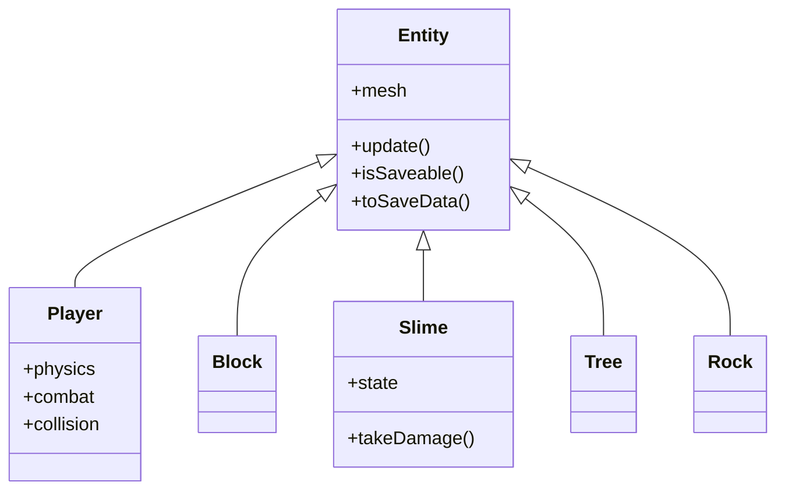
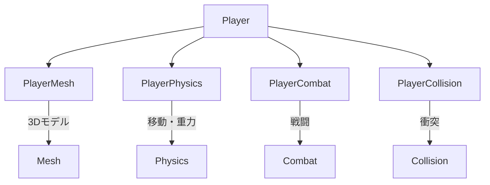

---
tags:
  - MOC
  - 設計パターン
  - オブジェクト指向
  - コンポーネント
  - 関数型
created: 2025-11-23
updated: 2025-11-23
---

# 03 設計パターン編

> [!abstract] 概要
> このプロジェクトで使用されている設計パターンを学びます。オブジェクト指向、関数型、コンポーネントベースなど、複数のパラダイムを横断的に理解します。

---

## この章で学ぶパラダイム

| パラダイム | 章 | ファイル |
|-----------|-----|---------|
| **オブジェクト指向（OOP）** | 01 | Entity.js |
| **OOP + 関数型** | 02 | EntityManager.js |
| **コンポーネントベース** | 03 | Player.js |

---

## 章一覧

| 章 | タイトル | 対象ファイル | 学習内容 | パラダイム | 状態 |
|----|---------|-------------|---------|-----------|------|
| 01 | [[01_エンティティの基礎_Entity.js]] | `src/Entity.js` | クラス、継承、ポリモーフィズム | **OOP** | 🟢 |
| 02 | [[02_エンティティ管理_EntityManager.js]] | `src/EntityManager.js` | 配列操作、for...of | **OOP + 関数型** | 🟢 |
| 03 | [[03_プレイヤーの設計_Player.js]] | `src/Player.js` | 責務分割、疎結合設計 | **コンポーネント** | 🟢 |

---

## この章で身につくこと

- [ ] JavaScriptのクラス構文を理解する
- [ ] 継承とポリモーフィズムを理解する
- [ ] 関数型の配列操作（filter/map/forEach）を理解する
- [ ] コンポーネント分割の考え方を理解する
- [ ] 複数のパラダイムを組み合わせる設計を理解する

---

## 前提知識

> [!info] この章を始める前に
> - [[02_Three.js入門編/_MOC_Three.js入門編\|02 Three.js入門編]] を完了している
> - オブジェクトと関数を理解している

---

## 設計の全体像

### クラス継承の構造



### コンポーネント分割（Player）



---

## パラダイムの比較

### オブジェクト指向 vs 関数型

```javascript
// オブジェクト指向的アプローチ（Entity.js）
class Entity {
    update() { /* ... */ }
}

// 関数型的アプローチ（EntityManager.js）
entities
    .filter(e => e.shouldRemove)
    .forEach(e => this.remove(e));
```

> [!tip] このプロジェクトの特徴
> OOPでデータ構造を定義し、関数型で操作するハイブリッドスタイル

---

## キーワード

#class #extends #constructor #ポリモーフィズム #継承 #コンポーネント #filter #map #forEach

---

## ナビゲーション

| 前 | 次 |
|----|-----|
| [[02_Three.js入門編/_MOC_Three.js入門編\|02 Three.js入門編]] | [[04_3Dグラフィックス編/_MOC_3Dグラフィックス編\|04 3Dグラフィックス編]] |

---

## 関連リンク

- [[_MOC_入門レベル\|目次に戻る]]
- [[07_付録/01_JavaScript基礎リファレンス\|JavaScript基礎リファレンス]]
- [[07_付録/05_パラダイム早見表\|パラダイム早見表]]
