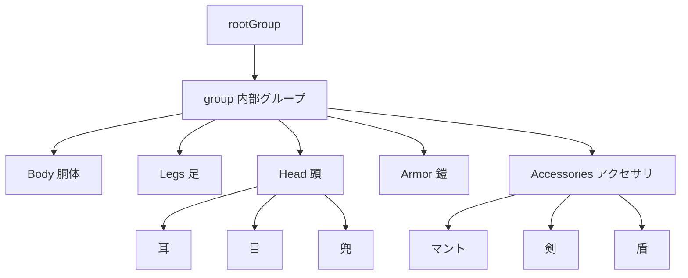
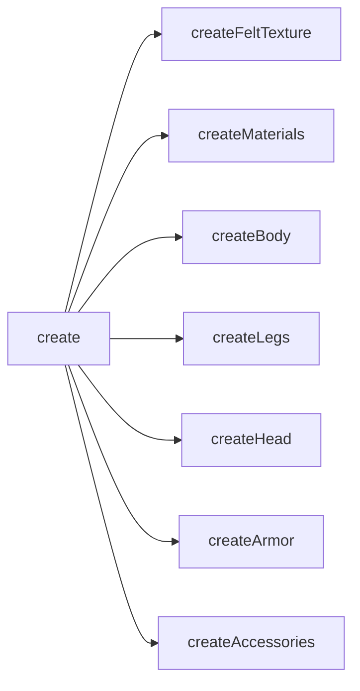
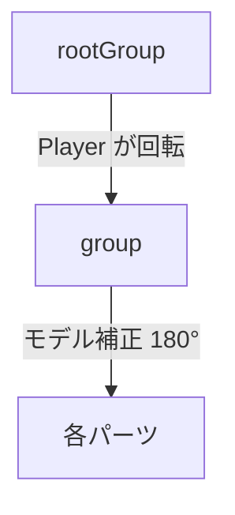
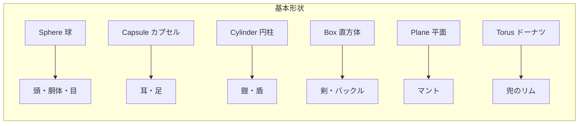
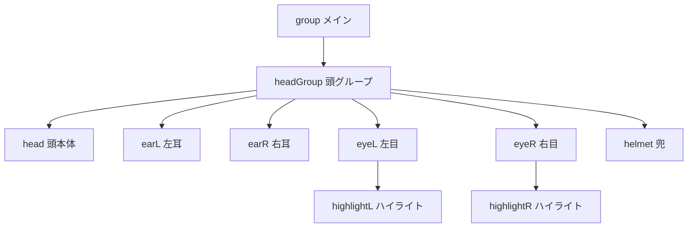
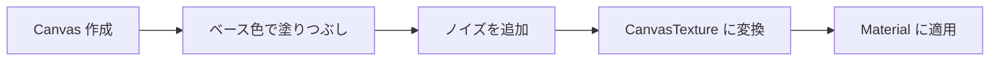
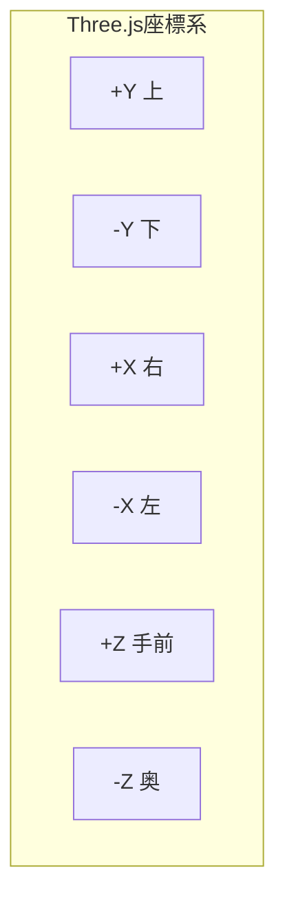

---
tags:
  - 3Dグラフィックス編
  - Three.js
  - Geometry
  - Material
  - Mesh
  - プロシージャルテクスチャ
chapter: 1
status: 完了
prev: "[[03_設計パターン編/03_プレイヤーの設計_Player.js]]"
next: "[[05_ゲームメカニクス編/_MOC_ゲームメカニクス編]]"
source_file: src/PlayerMesh.js
created: 2025-11-23
---

# 第1章: キャラクター構築 - PlayerMesh.js

> [!abstract] この章の概要
> うさぎパラディンの 3D モデルを構築する `PlayerMesh.js` を読み解きます。Three.js の Geometry、Material、Mesh の組み合わせ方とプロシージャルテクスチャを学びます。

---

## この章で学ぶこと

- [ ] Three.js の Geometry（形状）を理解する
- [ ] Three.js の Material（質感）を理解する
- [ ] Mesh と Group の関係を理解する
- [ ] プロシージャルテクスチャの作成方法を理解する
- [ ] 3D モデルのパーツ分割を理解する

---

## この章で学ぶパラダイム

> [!info] パラダイム
> - **ファクトリパターン**: `create()` メソッドでオブジェクトを生成
> - **プロシージャル生成**: コードでテクスチャを動的に生成
> - 関連: [[07_付録/02_Three.js概念図解|Three.js概念図解]]

---

## ファイルの役割

> [!note] `PlayerMesh.js` の役割
> このファイルは **うさぎパラディンの3Dモデル工場** です。
> - フェルト質感のうさぎを生成
> - 鎧、兜、剣、盾を装備
> - 複数のパーツを Group でまとめて返す

---

## キャラクターの構成



---

## コード構造の概要



| メソッド | 役割 |
|---------|------|
| `create()` | 全体を組み立てて返す |
| `createFeltTexture()` | フェルト風テクスチャを生成 |
| `createMaterials()` | 全マテリアルを作成 |
| `createBody()` | 胴体を作成 |
| `createLegs()` | 足とブーツを作成 |
| `createHead()` | 頭、耳、目、兜を作成 |
| `createArmor()` | 鎧、肩当て、ベルトを作成 |
| `createAccessories()` | マント、剣、盾を作成 |

---

## コード解説

### セクション1: create() - 組み立て

```javascript
export class PlayerMesh {
    create() {
        const group = new THREE.Group();

        // Textures
        const textures = {
            whiteFelt: this.createFeltTexture('#ffffff'),
            pinkFelt: this.createFeltTexture('#FFB6C1'),
            blueFelt: this.createFeltTexture('#0000ff')
        };

        // Materials
        const materials = this.createMaterials(textures);

        // Build Character Parts
        this.createBody(group, materials);
        this.createLegs(group, materials);
        this.createHead(group, materials);
        this.createArmor(group, materials);
        this.createAccessories(group, materials);

        // Rotate inner group to face -Z (North)
        group.rotation.y = Math.PI;

        // Create a root group to return
        const rootGroup = new THREE.Group();
        rootGroup.add(group);

        return rootGroup;
    }
```

> [!info] THREE.Group とは
> `Group` は複数の Mesh をまとめるコンテナです。
> Group を移動・回転すると、中の全 Mesh が一緒に動きます。

**2重グループの理由:**



> [!tip] なぜ2重にするのか
> モデルは +Z 方向（南）を向いて作られていますが、ゲームでは -Z 方向（北）が前方です。
> 内部グループで 180° 回転しておくことで、Player が回転させても正しく動作します。

---

### セクション2: マテリアルの作成

```javascript
    createMaterials(textures) {
        return {
            whiteFelt: new THREE.MeshStandardMaterial({
                map: textures.whiteFelt,
                bumpMap: textures.whiteFelt,
                bumpScale: 0.02,
                roughness: 1.0
            }),
            metal: new THREE.MeshStandardMaterial({
                color: 0x888888,
                roughness: 0.4,
                metalness: 0.6
            }),
            blueCloth: new THREE.MeshStandardMaterial({
                map: textures.blueFelt,
                side: THREE.DoubleSide,
                roughness: 0.9
            }),
            leather: new THREE.MeshStandardMaterial({
                color: 0x8B4513,
                roughness: 0.8
            }),
            // ... 他のマテリアル
        };
    }
```

**MeshStandardMaterial のパラメータ:**

| パラメータ | 説明 | 値の範囲 |
|-----------|------|---------|
| `color` | 基本色 | 16進数 (0xRRGGBB) |
| `map` | テクスチャ画像 | Texture オブジェクト |
| `bumpMap` | 凹凸マップ | Texture オブジェクト |
| `bumpScale` | 凹凸の強さ | 0.0 〜 1.0 |
| `roughness` | 粗さ（低いと光沢） | 0.0 〜 1.0 |
| `metalness` | 金属感 | 0.0 〜 1.0 |
| `side` | 描画面 | FrontSide / BackSide / DoubleSide |

**マテリアルの使い分け:**

| マテリアル | 用途 | 特徴 |
|-----------|------|------|
| `whiteFelt` | うさぎの体 | フェルト質感、凹凸あり |
| `metal` | 鎧、兜 | 金属光沢 |
| `leather` | ベルト | 革の質感 |
| `blueCloth` | マント | 布、両面描画 |

---

### セクション3: Geometry の種類

```javascript
    createBody(group, materials) {
        const bodyGeo = new THREE.SphereGeometry(0.4, 32, 32);
        const body = new THREE.Mesh(bodyGeo, materials.whiteFelt);
        body.position.y = 0.5;
        body.castShadow = true;
        group.add(body);
    }
```

**使用している Geometry:**

| Geometry | 説明 | パラメータ |
|----------|------|-----------|
| `SphereGeometry` | 球体 | (半径, 横分割, 縦分割) |
| `CapsuleGeometry` | カプセル | (半径, 長さ, 横分割, 縦分割) |
| `CylinderGeometry` | 円柱 | (上半径, 下半径, 高さ, 分割) |
| `BoxGeometry` | 直方体 | (幅, 高さ, 奥行き) |
| `PlaneGeometry` | 平面 | (幅, 高さ) |
| `TorusGeometry` | ドーナツ | (半径, 太さ, 分割, 分割) |



---

### セクション4: 頭部の構築（詳細例）

```javascript
    createHead(group, materials) {
        const headGroup = new THREE.Group();
        headGroup.position.y = 0.95;
        group.add(headGroup);

        // Head Base
        const headGeo = new THREE.SphereGeometry(0.35, 32, 32);
        const head = new THREE.Mesh(headGeo, materials.whiteFelt);
        head.castShadow = true;
        headGroup.add(head);

        // Ears
        const earGeo = new THREE.CapsuleGeometry(0.08, 0.45, 4, 8);
        const earL = new THREE.Mesh(earGeo, materials.whiteFelt);
        earL.position.set(-0.12, 0.4, 0);
        earL.rotation.z = 0.1;
        headGroup.add(earL);

        // ... 右耳、内耳、目、鼻、口、兜
    }
```

**階層構造:**



> [!tip] サブグループの利点
> 頭を `headGroup` にまとめることで：
> - 頭全体をまとめて位置調整
> - 目のハイライトを目に追加（相対位置）
> - 将来的に頭だけ動かすアニメーションが可能

---

### セクション5: プロシージャルテクスチャ

```javascript
    createFeltTexture(colorHex) {
        const canvas = document.createElement('canvas');
        canvas.width = 512;
        canvas.height = 512;
        const ctx = canvas.getContext('2d');

        // Base color
        ctx.fillStyle = colorHex;
        ctx.fillRect(0, 0, 512, 512);

        // Noise (felt texture)
        for (let i = 0; i < 50000; i++) {
            const x = Math.random() * 512;
            const y = Math.random() * 512;
            const opacity = Math.random() * 0.1 + 0.05;
            ctx.fillStyle = `rgba(0, 0, 0, ${opacity})`;
            ctx.fillRect(x, y, 2, 2);

            const x2 = Math.random() * 512;
            const y2 = Math.random() * 512;
            const opacity2 = Math.random() * 0.1 + 0.05;
            ctx.fillStyle = `rgba(255, 255, 255, ${opacity2})`;
            ctx.fillRect(x2, y2, 2, 2);
        }

        const texture = new THREE.CanvasTexture(canvas);
        texture.wrapS = THREE.RepeatWrapping;
        texture.wrapT = THREE.RepeatWrapping;
        return texture;
    }
```

> [!info] プロシージャルテクスチャとは
> 画像ファイルを使わず、**コードで動的に生成** するテクスチャです。

**生成の流れ:**



**ノイズの効果:**

```
ベース色のみ:        ノイズ追加後:
┌────────────┐       ┌────────────┐
│            │       │ ·  ·    ·  │
│  均一な白  │  →    │ ·    ·  · │
│            │       │   ·  ·    │
└────────────┘       └────────────┘
                     (フェルトの質感)
```

---

### セクション6: 影の設定

```javascript
body.castShadow = true;    // 影を落とす
ground.receiveShadow = true; // 影を受ける（Game.js で設定）
```

| プロパティ | 説明 |
|-----------|------|
| `castShadow` | このオブジェクトが影を落とす |
| `receiveShadow` | このオブジェクトが影を受ける |

> [!warning] 影はパフォーマンスに影響
> すべてのオブジェクトに影を設定すると重くなります。
> 重要なオブジェクト（キャラクター等）のみ設定するのがベストです。

---

## Mesh の作成パターン

### 基本パターン

```javascript
// 1. Geometry を作成
const geo = new THREE.SphereGeometry(0.4, 32, 32);

// 2. Material を作成（または既存を使用）
const mat = new THREE.MeshStandardMaterial({ color: 0xffffff });

// 3. Mesh を作成
const mesh = new THREE.Mesh(geo, mat);

// 4. 位置・回転・スケールを設定
mesh.position.set(0, 1, 0);
mesh.rotation.x = Math.PI / 4;
mesh.scale.set(1, 0.5, 1);

// 5. Group に追加
group.add(mesh);
```

### 変形パターン（scale 活用）

```javascript
// 足の先を平たくする
const footGeo = new THREE.SphereGeometry(0.12, 16, 16);
const foot = new THREE.Mesh(footGeo, materials.metal);
foot.scale.set(1, 0.6, 1.5);  // Y を縮小、Z を拡大
```

```
元の球:          scale 後:
  ●              ◯──
               (平たく長い)
```

---

## 座標系の理解



| 軸 | 正方向 | 負方向 |
|----|-------|-------|
| X | 右 | 左 |
| Y | 上 | 下 |
| Z | 手前（南） | 奥（北） |

> [!tip] position.set(x, y, z)
> ```javascript
> mesh.position.set(-0.15, 0.25, 0);
> //                 ↑      ↑     ↑
> //                左    上    中央
> ```

---

## 実験してみよう

> [!question] やってみよう

### 実験1: 色を変える

```javascript
// createMaterials() 内
whiteFelt: new THREE.MeshStandardMaterial({
    map: textures.whiteFelt,
    color: 0xFFAAAA,  // 追加: ピンク系に
    // ...
})
```

### 実験2: サイズを変える

```javascript
// createBody() 内
const bodyGeo = new THREE.SphereGeometry(0.6, 32, 32);  // 0.4 → 0.6
```

### 実験3: パーツを非表示

```javascript
// createAccessories() の最後に
// group.add(swordGroup);  // コメントアウトで剣を消す
```

### 実験4: フェルトのノイズ量を変更

```javascript
// createFeltTexture() 内
for (let i = 0; i < 100000; i++) {  // 50000 → 100000
```

---

## よくある疑問

> [!question] Q: なぜ Material を共有するのですか？
> A: 同じ Material を複数の Mesh で使い回すことで、**メモリを節約** し、**パフォーマンスが向上** します。

> [!question] Q: 32 という数字は何ですか？
> A: Geometry の分割数（セグメント数）です。大きいほど滑らかですが、頂点数が増えて重くなります。

> [!question] Q: DoubleSide はいつ使いますか？
> A: マントのような薄い面を両面から見える必要があるときに使います。通常は FrontSide（表面のみ）で十分です。

---

## 設計のポイント

### ファクトリパターン

```javascript
// Player.js から呼び出し
buildCharacter() {
    return new PlayerMesh().create();
}
```

> [!tip] ファクトリパターンの利点
> - 生成ロジックを分離
> - 将来、異なるキャラクターに差し替え可能
> - テストが容易

### パーツ分割の考え方

| 分割基準 | 例 |
|---------|-----|
| 機能単位 | 頭、胴体、足 |
| マテリアル | フェルト部、金属部 |
| アニメーション | 動く部分、動かない部分 |

---

## まとめ

この章で学んだこと：

- ✅ Geometry + Material = Mesh の構成
- ✅ Group で複数 Mesh を階層化
- ✅ 様々な Geometry（Sphere, Capsule, Cylinder, Box, Plane, Torus）
- ✅ MeshStandardMaterial のパラメータ
- ✅ プロシージャルテクスチャで動的に質感を生成
- ✅ scale で基本形状を変形

> [!success] 3Dグラフィックス編 完了！
> おめでとうございます！3Dグラフィックス編が完了しました。
> 次は [[05_ゲームメカニクス編/_MOC_ゲームメカニクス編|05 ゲームメカニクス編]] に進んで、物理演算や戦闘システムを学びましょう。

---

## 関連リンク

- [[03_設計パターン編/03_プレイヤーの設計_Player.js|前の章: プレイヤーの設計]]
- [[05_ゲームメカニクス編/_MOC_ゲームメカニクス編|次のセクション: ゲームメカニクス編]]
- [[04_3Dグラフィックス編/_MOC_3Dグラフィックス編|セクション目次に戻る]]
- [[07_付録/02_Three.js概念図解|Three.js概念図解]]
