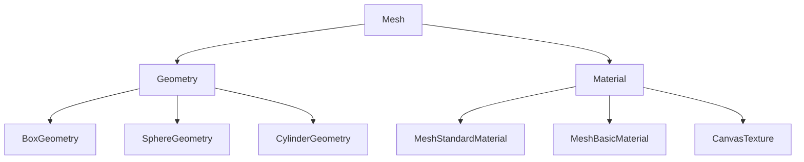
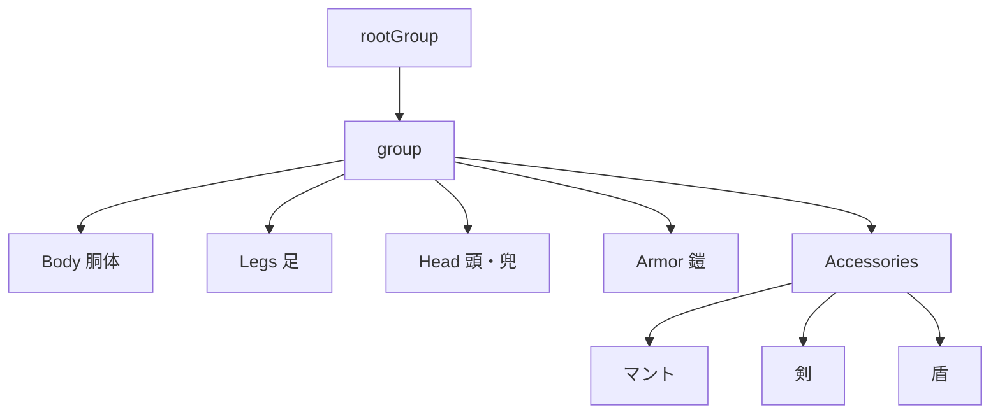

---
tags:
  - MOC
  - 3Dグラフィックス
  - Three.js
  - メッシュ
  - マテリアル
  - プロシージャル
created: 2025-11-23
---

# 04 3Dグラフィックス編

> [!abstract] 概要
> Three.jsを使って3Dキャラクターを構築する方法を学びます。ジオメトリ、マテリアル、メッシュの組み合わせ方を理解します。

---

## 章一覧

| 章 | タイトル | 対象ファイル | 学習内容 | 状態 |
|----|---------|-------------|---------|------|
| 01 | [[01_キャラクター構築_PlayerMesh.js]] | `src/PlayerMesh.js` | Geometry、Material、Mesh、Group、プロシージャルテクスチャ | 🟢 |

---

## この章で身につくこと

- [ ] Three.jsのGeometry（形状）を理解する
- [ ] Three.jsのMaterial（質感）を理解する
- [ ] Mesh（メッシュ）の作成方法を理解する
- [ ] Groupで複数のメッシュをまとめる方法を理解する
- [ ] プロシージャルテクスチャの作成方法を理解する

---

## 前提知識

> [!info] この章を始める前に
> - [[03_設計パターン編/_MOC_設計パターン編\|03 設計パターン編]] を完了している
> - Three.jsの基本概念を理解している

---

## 3Dオブジェクトの構成

---

## キャラクター構成図

---

## キーワード

#Geometry #Material #Mesh #Group #Texture #Canvas #プロシージャル

---

## ナビゲーション

| 前 | 次 |
|----|-----|
| [[03_設計パターン編/_MOC_設計パターン編\|03 設計パターン編]] | [[05_ゲームメカニクス編/_MOC_ゲームメカニクス編\|05 ゲームメカニクス編]] |

---

## 関連リンク

- [[_MOC_入門レベル\|目次に戻る]]
- [[07_付録/02_Three.js概念図解\|Three.js概念図解]]
