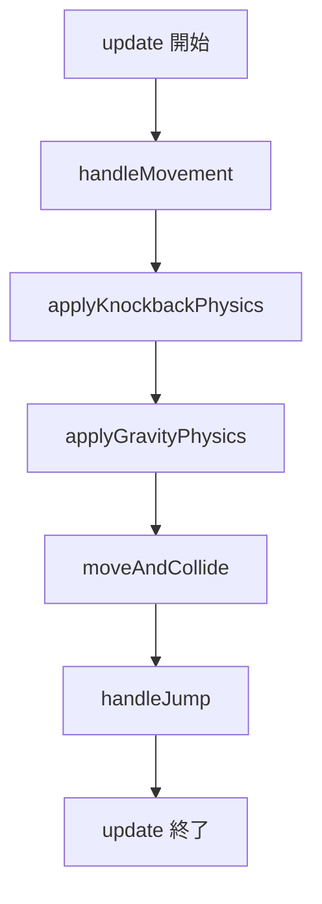
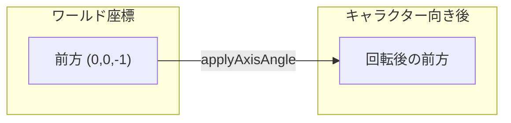
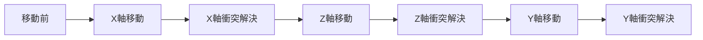
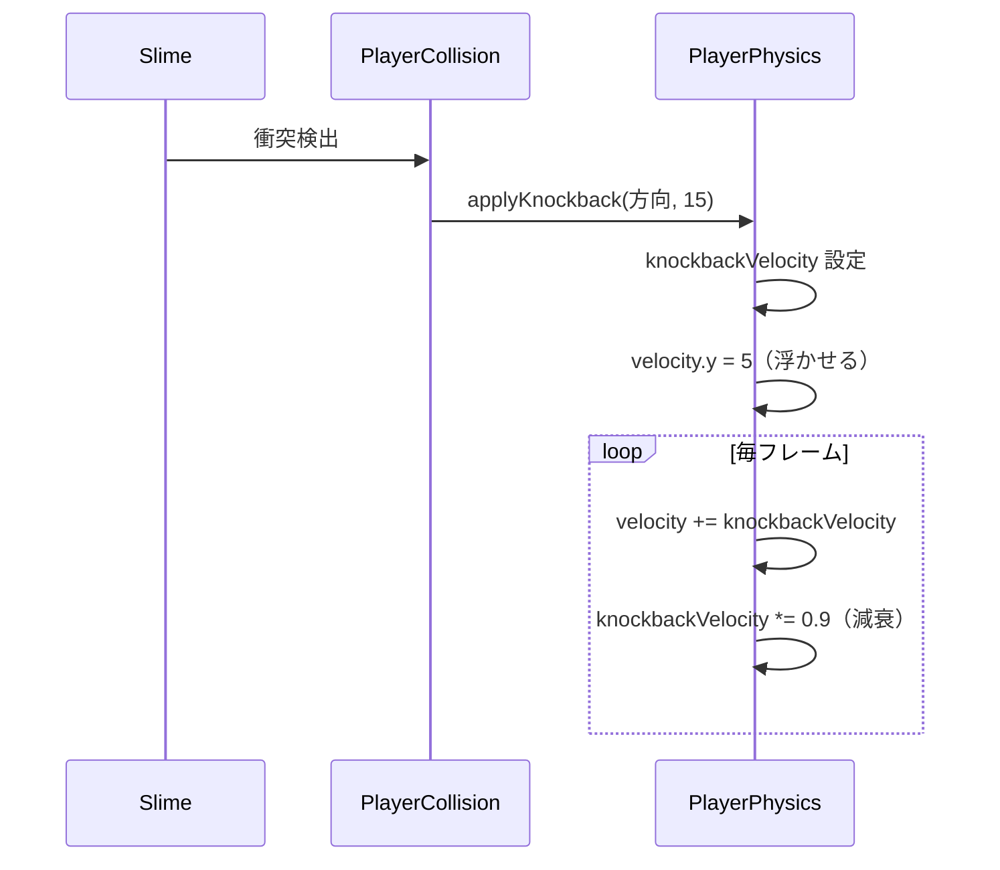

---
tags:
  - ゲームメカニクス編
  - JavaScript
  - 物理演算
  - Vector3
  - 衝突判定
  - AABB
chapter: 1
status: 完了
prev: "[[04_3Dグラフィックス編/01_キャラクター構築_PlayerMesh.js]]"
next: "[[02_戦闘システム_PlayerCombat.js]]"
source_file: src/PlayerPhysics.js
created: 2025-11-23
---

# 第1章: 物理演算 - PlayerPhysics.js

> [!abstract] この章の概要
> プレイヤーの移動、重力、衝突判定を処理する `PlayerPhysics.js` を読み解きます。ベクトル演算と AABB 衝突判定を学びます。

---

## この章で学ぶこと

- [ ] Vector3 によるベクトル演算を理解する
- [ ] 重力と速度の関係を理解する
- [ ] AABB（軸平行境界ボックス）衝突判定を理解する
- [ ] ノックバック処理を理解する

---

## この章で学ぶパラダイム

> [!info] パラダイム
> - **数学的アプローチ**: ベクトル演算、物理シミュレーション
> - **関数型**: `filter()` で衝突オブジェクトを抽出
> - 関連: [[07_付録/05_パラダイム早見表|パラダイム早見表]]

---

## ファイルの役割

> [!note] `PlayerPhysics.js` の役割
> このファイルは **プレイヤーの物理エンジン** です。
> - 移動速度の計算
> - 重力の適用
> - ブロックとの衝突判定と解決
> - ジャンプとノックバックの処理

---

## 物理演算の流れ



---

## コード解説

### セクション1: 初期化

```javascript
export class PlayerPhysics {
    constructor(player) {
        this.player = player;
        this.velocity = new THREE.Vector3(0, 0, 0);
        this.knockbackVelocity = new THREE.Vector3(0, 0, 0);
        this.onGround = true;
        this.gravity = -30.0;
        this.jumpStrength = 15.0;
        this.speed = 10.0;
    }
```

| プロパティ | 型 | 説明 |
|-----------|-----|------|
| `velocity` | Vector3 | 現在の速度 |
| `knockbackVelocity` | Vector3 | ノックバック速度 |
| `onGround` | boolean | 地面に接地しているか |
| `gravity` | number | 重力加速度（負の値=下向き） |
| `jumpStrength` | number | ジャンプの初速 |
| `speed` | number | 移動速度 |

---

### セクション2: 移動処理

```javascript
    handleMovement(delta, input) {
        // キャラクターの向きに基づいた前方・右方向ベクトル
        const forward = new THREE.Vector3(0, 0, -1)
            .applyAxisAngle(new THREE.Vector3(0, 1, 0), this.player.mesh.rotation.y);
        const right = new THREE.Vector3(1, 0, 0)
            .applyAxisAngle(new THREE.Vector3(0, 1, 0), this.player.mesh.rotation.y);

        // 移動ベクトルを計算
        const moveVector = new THREE.Vector3()
            .addScaledVector(forward, -input.z)
            .addScaledVector(right, input.x);

        // 正規化して速度を適用
        const lengthSq = moveVector.lengthSq();
        const scale = lengthSq > 0 ? this.speed / Math.sqrt(lengthSq) : 0;

        this.velocity.x = moveVector.x * scale;
        this.velocity.z = moveVector.z * scale;
    }
```

**ベクトル回転の仕組み:**



> [!info] applyAxisAngle とは
> `applyAxisAngle(axis, angle)` は、指定した軸を中心にベクトルを回転させます。
> Y軸（0,1,0）を中心に `rotation.y` だけ回転させることで、キャラクターの向きに合わせた移動方向を得ます。

**正規化の理由:**

```javascript
// 斜め移動時、速度が √2 倍になるのを防ぐ
// 例: x=1, z=1 → 長さ = √2 ≈ 1.41
// 正規化後 → 長さ = 1 → 速度一定
```

---

### セクション3: 重力処理

```javascript
    applyGravityPhysics(delta) {
        this.velocity.y += this.gravity * delta;
    }
```

> [!info] 物理の基本公式
> ```
> 速度の変化 = 加速度 × 時間
> v = v₀ + a × t
> ```
> `gravity`（-30）を毎フレーム `delta` 時間分だけ加算することで、自然な落下を実現。

**重力の動作:**

| フレーム | velocity.y | 説明 |
|---------|-----------|------|
| 0 | 0 | 静止 |
| 1 | -0.5 | 落下開始（delta=0.016 想定） |
| 2 | -1.0 | 加速 |
| 3 | -1.5 | さらに加速 |

---

### セクション4: 衝突判定と解決

```javascript
    moveAndCollide(delta, collidables) {
        const playerRadius = 0.3;
        const playerHeight = 1.0;
        const stepHeight = 0.1;

        // 軸ごとに解決する関数
        const resolveAxis = (axis) => {
            this.player.position[axis] += this.velocity[axis] * delta;

            // 衝突を検出
            const collisions = this.checkCollisions(collidables, playerRadius, playerHeight)
                .filter(block => this.player.position.y < block.position.y + 0.5 - stepHeight);

            // 衝突を解決
            collisions.forEach(block => {
                const dir = Math.sign(this.velocity[axis]);
                const wallPos = block.position[axis] - (dir * (0.5 + playerRadius + 0.001));

                if (dir > 0) this.player.position[axis] = Math.min(this.player.position[axis], wallPos);
                if (dir < 0) this.player.position[axis] = Math.max(this.player.position[axis], wallPos);
            });

            if (collisions.length > 0) this.velocity[axis] = 0;
        };

        resolveAxis('x');
        resolveAxis('z');
        // ... Y軸の処理
    }
```

**軸分離解決法:**



> [!tip] なぜ軸ごとに処理するのか
> 3軸同時に処理すると、壁に沿ってスライドできなくなります。
> 軸ごとに処理することで、壁に当たっても別軸の移動は継続できます。

---

### セクション5: AABB 衝突判定

```javascript
    checkCollisions(collidables, radius, height) {
        if (!collidables) return [];

        const playerBox = new THREE.Box3();
        const center = this.player.position;
        playerBox.min.set(center.x - radius, center.y, center.z - radius);
        playerBox.max.set(center.x + radius, center.y + height * 1.7, center.z + radius);

        return collidables.filter(obj => {
            const blockPos = obj.position;
            const blockBox = new THREE.Box3();
            blockBox.min.set(blockPos.x - 0.5, blockPos.y - 0.5, blockPos.z - 0.5);
            blockBox.max.set(blockPos.x + 0.5, blockPos.y + 0.5, blockPos.z + 0.5);
            return playerBox.intersectsBox(blockBox);
        });
    }
```

> [!info] AABB（Axis-Aligned Bounding Box）とは
> 軸に平行な境界ボックスによる衝突判定。回転しない箱同士の衝突チェックは非常に高速です。

**AABB の構造:**

```
      max (x+0.5, y+0.5, z+0.5)
        ┌───────┐
        │       │
        │   ●   │  ← ブロック中心
        │       │
        └───────┘
      min (x-0.5, y-0.5, z-0.5)
```

**intersectsBox の条件:**

```javascript
// 2つのボックスが交差する条件
// 全ての軸で範囲が重なっている
box1.min.x <= box2.max.x && box1.max.x >= box2.min.x &&
box1.min.y <= box2.max.y && box1.max.y >= box2.min.y &&
box1.min.z <= box2.max.z && box1.max.z >= box2.min.z
```

---

### セクション6: ジャンプ処理

```javascript
    handleJump(input) {
        const canJump = this.onGround && input.jump;
        this.velocity.y = canJump ? this.jumpStrength : this.velocity.y;
        this.onGround = canJump ? false : this.onGround;

        if (canJump && this.player.audioManager) {
            this.player.audioManager.playJump();
        }
    }
```

> [!tip] 三項演算子の活用
> `if-else` を使わず、三項演算子で簡潔に書いています。
> ```javascript
> // 従来
> if (canJump) {
>     this.velocity.y = this.jumpStrength;
>     this.onGround = false;
> }
> // 三項演算子
> this.velocity.y = canJump ? this.jumpStrength : this.velocity.y;
> ```

---

### セクション7: ノックバック

```javascript
    applyKnockback(direction, strength) {
        this.knockbackVelocity.copy(direction).multiplyScalar(strength);
        this.velocity.y = 5.0;
        this.onGround = false;
    }

    applyKnockbackPhysics(delta) {
        this.velocity.x += this.knockbackVelocity.x;
        this.velocity.z += this.knockbackVelocity.z;

        // 摩擦で減衰
        this.knockbackVelocity.multiplyScalar(0.9);
    }
```

**ノックバックの流れ:**



---

## ベクトル演算まとめ

| メソッド | 説明 | 例 |
|---------|------|-----|
| `set(x,y,z)` | 値を設定 | `v.set(1, 0, 0)` |
| `copy(v)` | コピー | `v1.copy(v2)` |
| `add(v)` | 加算 | `v1.add(v2)` |
| `sub(v)` | 減算 | `v1.sub(v2)` |
| `multiplyScalar(s)` | スカラー倍 | `v.multiplyScalar(2)` |
| `normalize()` | 正規化（長さ1に） | `v.normalize()` |
| `length()` | 長さを取得 | `v.length()` |
| `applyAxisAngle(axis, angle)` | 軸回転 | 移動方向の計算 |

---

## 実験してみよう

> [!question] やってみよう

### 実験1: 重力を変更

```javascript
this.gravity = -60.0;  // 2倍の重力（月→地球？）
```

### 実験2: ジャンプ力を変更

```javascript
this.jumpStrength = 25.0;  // 高くジャンプ
```

### 実験3: ノックバックを確認

```javascript
// applyKnockback 内に追加
console.log('Knockback:', direction, strength);
```

---

## まとめ

この章で学んだこと：

- ✅ Vector3 でベクトル演算（加算、スカラー倍、回転）
- ✅ 重力 = 速度に加速度を加算
- ✅ AABB で高速な衝突判定
- ✅ 軸分離法で衝突を解決
- ✅ 摩擦による減衰（ノックバック）

> [!success] 次のステップ
> [[02_戦闘システム_PlayerCombat.js]] に進んで、ステートパターンによる戦闘システムを学びましょう。

---

## 関連リンク

- [[04_3Dグラフィックス編/01_キャラクター構築_PlayerMesh.js|前の章: キャラクター構築]]
- [[02_戦闘システム_PlayerCombat.js|次の章: 戦闘システム]]
- [[05_ゲームメカニクス編/_MOC_ゲームメカニクス編|セクション目次に戻る]]
