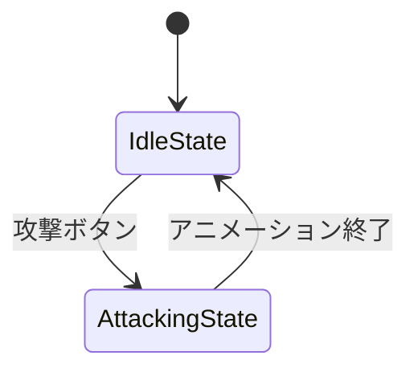
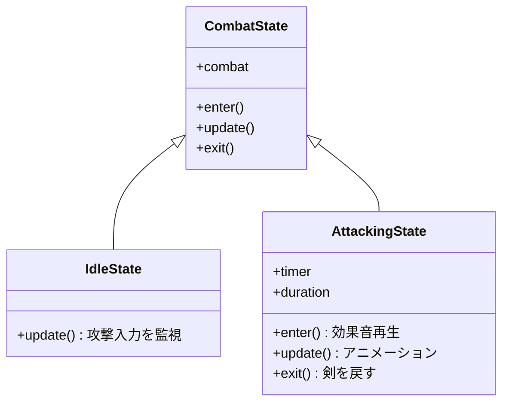
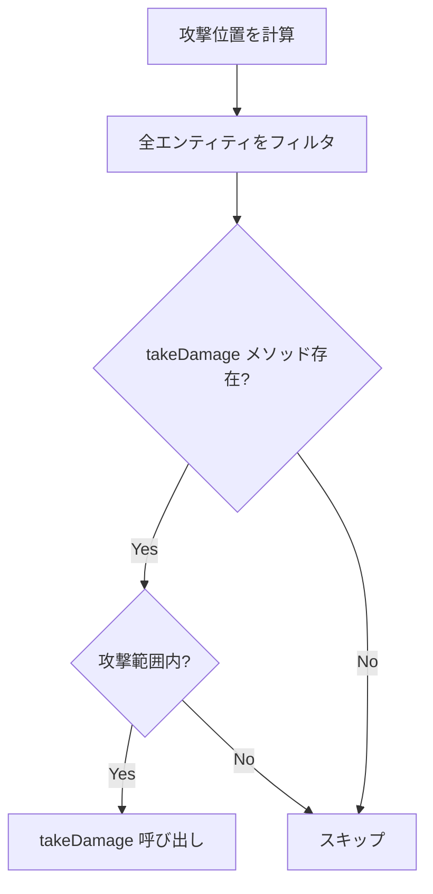

---
tags:
  - ゲームメカニクス編
  - JavaScript
  - ステートパターン
  - 戦闘
  - アニメーション
chapter: 2
status: 完了
prev: "[[01_物理演算_PlayerPhysics.js]]"
next: "[[03_敵キャラクター_Slime.js]]"
source_file: src/PlayerCombat.js
created: 2025-11-23
---

# 第2章: 戦闘システム - PlayerCombat.js

> [!abstract] この章の概要
> プレイヤーの攻撃処理を管理する `PlayerCombat.js` を読み解きます。ステートパターンによる状態管理と攻撃アニメーションを学びます。

---

## この章で学ぶこと

- [ ] ステートパターンを理解する
- [ ] 状態遷移の実装を理解する
- [ ] 三角波関数によるアニメーションを理解する
- [ ] ポリモーフィックな攻撃判定を理解する

---

## この章で学ぶパラダイム

> [!info] パラダイム
> - **ステートパターン**: 状態をオブジェクトとして表現
> - **ポリモーフィズム**: `takeDamage` を持つエンティティへの攻撃
> - 関連: [[07_付録/05_パラダイム早見表#ステートパターン|パラダイム早見表]]

---

## ファイルの役割

> [!note] `PlayerCombat.js` の役割
> このファイルは **戦闘状態マシン** です。
> - 待機状態と攻撃状態を管理
> - 剣の振りアニメーション
> - 敵への攻撃判定

---

## ステートパターンの構造





---

## コード解説

### セクション1: ステートの基底クラス

```javascript
class CombatState {
    constructor(combatSystem) {
        this.combat = combatSystem;
    }
    enter() { }
    update(delta, input, entities) { }
    exit() { }
}
```

| メソッド | 呼ばれるタイミング |
|---------|------------------|
| `enter()` | 状態に入ったとき |
| `update()` | 毎フレーム |
| `exit()` | 状態から出るとき |

> [!info] ステートパターンとは
> オブジェクトの振る舞いを **状態クラス** に委譲するパターンです。
> if-else の連鎖を避け、状態ごとの処理を整理できます。

---

### セクション2: 待機状態

```javascript
class IdleState extends CombatState {
    update(delta, input, entities) {
        if (input.attack) {
            this.combat.setState(new AttackingState(this.combat));
        }
    }
}
```

**待機状態の責務:**
- 攻撃入力を監視
- 攻撃入力があれば `AttackingState` へ遷移

---

### セクション3: 攻撃状態

```javascript
class AttackingState extends CombatState {
    constructor(combatSystem) {
        super(combatSystem);
        this.timer = 0;
        this.duration = 0.4;  // 攻撃時間（秒）
    }

    enter() {
        if (this.combat.player.audioManager) {
            this.combat.player.audioManager.playAttack();
        }
    }

    update(delta, input, entities) {
        this.timer += delta;
        const progress = this.timer / this.duration;

        // 三角波でアニメーション
        const triangleWave = 1 - Math.abs(progress * 2 - 1);
        this.combat.sword.rotation.x = this.combat.baseSwordRotation + triangleWave * (Math.PI / 2);

        // 攻撃判定ウィンドウ（0.2〜0.6）
        if (progress > 0.2 && progress < 0.6) {
            this.combat.checkAttackCollision(entities);
        }

        // 終了判定
        if (this.timer >= this.duration) {
            this.combat.setState(new IdleState(this.combat));
        }
    }

    exit() {
        this.combat.sword.rotation.x = this.combat.baseSwordRotation;
    }
}
```

---

### 三角波アニメーションの解説

```javascript
const triangleWave = 1 - Math.abs(progress * 2 - 1);
```

**progress と triangleWave の関係:**

| progress | progress*2-1 | abs() | 1-abs() |
|----------|-------------|-------|---------|
| 0.0 | -1.0 | 1.0 | 0.0 |
| 0.25 | -0.5 | 0.5 | 0.5 |
| 0.5 | 0.0 | 0.0 | **1.0** |
| 0.75 | 0.5 | 0.5 | 0.5 |
| 1.0 | 1.0 | 1.0 | 0.0 |

```
triangleWave
1.0 |      /\
    |     /  \
0.5 |    /    \
    |   /      \
0.0 |__/________\__
    0  0.25 0.5 0.75 1.0  progress
```

> [!tip] if文なしのアニメーション
> 三角波関数を使うことで、「振り下ろし→振り上げ」を **if 文なし** で実現しています。
> progress=0.5 で最大（振り下ろし完了）、その後戻ります。

---

### セクション4: PlayerCombat クラス

```javascript
export class PlayerCombat {
    constructor(player) {
        this.player = player;
        this.sword = this.player.mesh.getObjectByName('sword');
        this.baseSwordRotation = Math.PI / 4;

        this.currentState = new IdleState(this);
    }

    setState(newState) {
        if (this.currentState) this.currentState.exit();
        this.currentState = newState;
        this.currentState.enter();
    }

    update(delta, input, entities) {
        this.currentState.update(delta, input, entities);
    }
```

> [!info] getObjectByName
> Three.js の `getObjectByName('sword')` は、メッシュ階層から名前でオブジェクトを検索します。
> PlayerMesh.js で `swordGroup.name = 'sword'` と設定しています。

---

### セクション5: 攻撃判定

```javascript
    checkAttackCollision(entities) {
        if (!entities) return;

        const attackRange = 2.0;
        const forward = new THREE.Vector3(0, 0, -1)
            .applyAxisAngle(new THREE.Vector3(0, 1, 0), this.player.mesh.rotation.y);
        const attackPos = this.player.position.clone()
            .add(forward.multiplyScalar(1.0));

        // ポリモーフィックな攻撃判定
        entities
            .filter(e => e.takeDamage && e.position.distanceTo(attackPos) < attackRange)
            .forEach(e => {
                e.takeDamage();
                if (this.player.audioManager) this.player.audioManager.playEnemyDeath();
            });
    }
}
```

**攻撃判定の流れ:**



> [!info] ポリモーフィズムの活用
> `e.takeDamage` の存在チェックにより、ダメージを受けられるエンティティのみを対象にします。
> Block には `takeDamage` がないのでスキップされ、Slime には呼び出されます。

---

## ステートパターン vs if-else

**if-else で書いた場合:**

```javascript
// ❌ 状態が増えると複雑に
update(delta, input) {
    if (this.state === 'idle') {
        if (input.attack) {
            this.state = 'attacking';
            this.timer = 0;
            this.playAttackSound();
        }
    } else if (this.state === 'attacking') {
        this.timer += delta;
        // アニメーション処理...
        if (this.timer >= 0.4) {
            this.state = 'idle';
            this.resetSword();
        }
    } else if (this.state === 'blocking') {
        // ...
    } else if (this.state === 'stunned') {
        // ...
    }
}
```

**ステートパターンで書いた場合:**

```javascript
// ✅ 状態ごとにクラスを分離
class IdleState extends CombatState {
    update() { /* 待機処理 */ }
}
class AttackingState extends CombatState {
    update() { /* 攻撃処理 */ }
}
class BlockingState extends CombatState {
    update() { /* 防御処理 */ }
}
```

| 比較項目 | if-else | ステートパターン |
|---------|---------|----------------|
| 可読性 | 状態が増えると低下 | 状態ごとに整理 |
| 拡張性 | 修正が広範囲 | 新クラス追加のみ |
| テスト | 全体をテスト | 状態単位でテスト |

---

## 実験してみよう

> [!question] やってみよう

### 実験1: 攻撃時間を変更

```javascript
// AttackingState の constructor
this.duration = 0.8;  // 0.4 → 0.8（ゆっくり）
```

### 実験2: 攻撃範囲を変更

```javascript
// checkAttackCollision
const attackRange = 4.0;  // 2.0 → 4.0（広範囲）
```

### 実験3: 攻撃音を確認

```javascript
// AttackingState の enter に追加
console.log('攻撃開始！');
```

---

## よくある疑問

> [!question] Q: なぜ攻撃判定にウィンドウ（0.2〜0.6）があるのですか？
> A: 振り始めと振り終わりでは当たらないようにするためです。剣が振り下ろされている最中（中盤）のみ判定することで、自然な戦闘感を実現します。

> [!question] Q: setState で exit → enter の順番は重要ですか？
> A: はい、重要です。現在の状態のクリーンアップ（exit）を先に行い、次の状態の初期化（enter）を後に行うことで、状態の整合性を保ちます。

---

## まとめ

この章で学んだこと：

- ✅ ステートパターンで状態を管理
- ✅ `enter()`/`update()`/`exit()` のライフサイクル
- ✅ 三角波関数で滑らかなアニメーション
- ✅ `filter` でダメージ対象を抽出（ポリモーフィズム）
- ✅ 攻撃判定ウィンドウで自然な戦闘

> [!success] 次のステップ
> [[03_敵キャラクター_Slime.js]] に進んで、敵のステートマシンと継承を学びましょう。

---

## 関連リンク

- [[01_物理演算_PlayerPhysics.js|前の章: 物理演算]]
- [[03_敵キャラクター_Slime.js|次の章: 敵キャラクター]]
- [[05_ゲームメカニクス編/_MOC_ゲームメカニクス編|セクション目次に戻る]]
