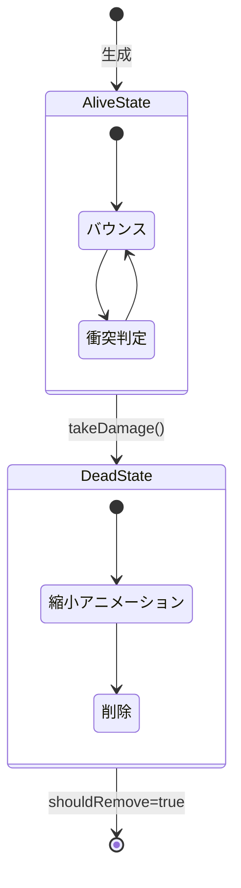
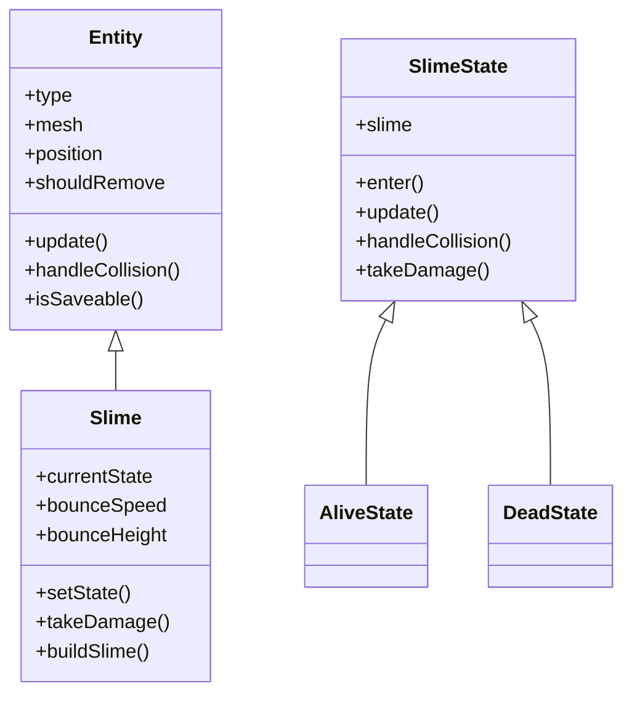
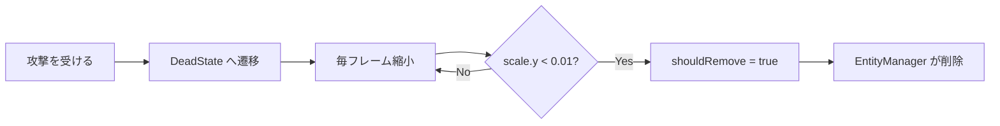

---
tags:
  - ゲームメカニクス編
  - JavaScript
  - ステートパターン
  - 継承
  - 敵AI
chapter: 3
status: 完了
prev: "[[02_戦闘システム_PlayerCombat.js]]"
next: "[[06_システム編/_MOC_システム編]]"
source_file: src/Slime.js
created: 2025-11-23
---

# 第3章: 敵キャラクター - Slime.js

> [!abstract] この章の概要
> 敵キャラクター「スライム」を実装する `Slime.js` を読み解きます。Entity の継承、ステートパターン、三角関数によるアニメーションを学びます。

---

## この章で学ぶこと

- [ ] Entity を継承した敵の実装を理解する
- [ ] 敵のステートパターン（生存/死亡）を理解する
- [ ] sin 関数によるバウンスアニメーションを理解する
- [ ] セーブ可能なエンティティの実装を理解する

---

## この章で学ぶパラダイム

> [!info] パラダイム
> - **継承**: Entity を拡張して敵を作成
> - **ステートパターン**: 生存状態と死亡状態を管理
> - **ポリモーフィズム**: `handleCollision`, `takeDamage`, `isSaveable` のオーバーライド
> - 関連: [[07_付録/05_パラダイム早見表|パラダイム早見表]]

---

## ファイルの役割

> [!note] `Slime.js` の役割
> このファイルは **敵キャラクターの実装** です。
> - Entity を継承した具体的な敵
> - 生存/死亡の2状態を持つ
> - バウンスアニメーションで生き生きと動く
> - プレイヤーとの衝突でノックバック

---

## 状態遷移



---

## クラス構造



---

## コード解説

### セクション1: Slime クラスの定義

```javascript
export class Slime extends Entity {
    constructor(x, z) {
        super();  // Entity の constructor を呼ぶ
        this.type = 'Slime';
        this.position = new THREE.Vector3(x, 0.5, z);
        this.originalY = 0.5;
        this.mesh = this.buildSlime();
        this.mesh.position.copy(this.position);

        // メッシュから Entity への参照
        this.mesh.userData.entity = this;

        // アニメーション設定
        this.timeOffset = Math.random() * 100;
        this.bounceSpeed = 3.0;
        this.bounceHeight = 0.3;

        this.currentState = new AliveState(this);
    }
```

| プロパティ | 説明 |
|-----------|------|
| `originalY` | 基準となる Y 座標 |
| `timeOffset` | アニメーションのランダムオフセット |
| `bounceSpeed` | バウンスの速さ |
| `bounceHeight` | バウンスの高さ |

> [!tip] timeOffset の役割
> 複数のスライムが同時に同じ動きをしないよう、ランダムなオフセットを加えています。
> これにより、各スライムが独自のタイミングで跳ねます。

---

### セクション2: 状態管理メソッド

```javascript
    setState(newState) {
        this.currentState = newState;
        this.currentState.enter();
    }

    handleCollision(player, physics) {
        this.currentState.handleCollision(player, physics);
    }

    update(delta, input, time) {
        this.currentState.update(delta, time);
    }

    takeDamage() {
        this.currentState.takeDamage();
    }
```

> [!info] 状態への委譲
> すべての処理を `currentState` に委譲しています。
> Slime 自身は「今どの状態か」を知っていますが、状態固有の処理は知りません。

---

### セクション3: AliveState（生存状態）

```javascript
class AliveState extends SlimeState {
    update(delta, time) {
        // バウンスアニメーション
        const bounce = Math.sin((time + this.slime.timeOffset) * this.slime.bounceSpeed);

        // Y位置の変化
        const heightFactor = (bounce + 1) * 0.5;  // 0〜1 に正規化
        this.slime.mesh.position.y = this.slime.originalY + heightFactor * this.slime.bounceHeight;

        // スクワッシュ＆ストレッチ
        const scaleY = 0.8 + (bounce * 0.1);
        const scaleXZ = 1.0 - (bounce * 0.05);
        this.slime.mesh.scale.set(scaleXZ, scaleY, scaleXZ);

        // 論理位置を同期
        this.slime.position.copy(this.slime.mesh.position);
    }

    handleCollision(player, physics) {
        const collisionRange = 0.8;
        const dist = player.position.distanceTo(this.slime.mesh.position);

        if (dist < collisionRange) {
            const knockbackDir = player.position.clone()
                .sub(this.slime.mesh.position).normalize();
            physics.applyKnockback(knockbackDir, 15.0);
        }
    }

    takeDamage() {
        this.slime.setState(new DeadState(this.slime));
    }
}
```

---

### sin 関数によるアニメーション

```javascript
const bounce = Math.sin((time + this.slime.timeOffset) * this.slime.bounceSpeed);
```

**sin 関数の特性:**

```
 1 |    /\      /\
   |   /  \    /  \
 0 |--/----\--/----\--
   | /      \/      \
-1 |/
   0   π   2π  3π  4π   time
```

| time | sin(time) | 状態 |
|------|-----------|------|
| 0 | 0 | 中間 |
| π/2 | 1 | 最高点 |
| π | 0 | 中間 |
| 3π/2 | -1 | 最低点 |
| 2π | 0 | 中間 |

**heightFactor の正規化:**

```javascript
const heightFactor = (bounce + 1) * 0.5;
// bounce: -1〜1
// bounce + 1: 0〜2
// (bounce + 1) * 0.5: 0〜1
```

---

### スクワッシュ＆ストレッチ

> [!info] アニメーションの原則
> 「スクワッシュ＆ストレッチ」は伝統的なアニメーションの原則です。
> 物体が跳ねるとき、着地時に潰れ、上昇時に伸びることで生命感が出ます。

```javascript
const scaleY = 0.8 + (bounce * 0.1);   // 0.7〜0.9
const scaleXZ = 1.0 - (bounce * 0.05); // 0.95〜1.05
```

```
上昇時 (bounce=1):     着地時 (bounce=-1):
    ▲                      ━━━
   /|\                    /   \
    │                     ━━━━━
```

---

### セクション4: DeadState（死亡状態）

```javascript
class DeadState extends SlimeState {
    update(delta, time) {
        // 死亡アニメーション: 縮小
        const shrinkSpeed = 2.0;
        this.slime.mesh.scale.subScalar(shrinkSpeed * delta);

        if (this.slime.mesh.scale.y <= 0.01) {
            this.slime.mesh.scale.set(0, 0, 0);
            this.slime.shouldRemove = true;
        }
    }

    handleCollision(player, physics) {
        // 死亡中は衝突しない
    }

    takeDamage() {
        // 既に死亡している
    }
}
```

**死亡アニメーションの流れ:**



---

### セクション5: セーブ機能

```javascript
    isSaveable() {
        // 生存しているスライムのみ保存
        return this.currentState instanceof AliveState;
    }

    toSaveData() {
        return {
            type: 'slime',
            x: this.position.x,
            z: this.position.z
        };
    }

    static fromSaveData(data) {
        return new Slime(data.x, data.z);
    }
```

> [!info] instanceof の活用
> `this.currentState instanceof AliveState` で、現在の状態が AliveState かどうかを判定します。
> 死亡中のスライムはセーブしません。

---

## Entity との継承関係

```javascript
// Entity.js（基底クラス）
export class Entity {
    constructor() {
        this.type = 'Entity';
        this.mesh = null;
        this.shouldRemove = false;
    }

    update(delta, input, time, collidables, entities) { }
    handleCollision(player, physics) { }
    isSaveable() { return false; }
    toSaveData() { return null; }
}

// Slime.js（派生クラス）
export class Slime extends Entity {
    constructor(x, z) {
        super();  // Entity の初期化
        this.type = 'Slime';  // オーバーライド
        // Slime 固有の初期化...
    }

    // メソッドをオーバーライド
    update(delta, input, time) { ... }
    handleCollision(player, physics) { ... }
    isSaveable() { return this.currentState instanceof AliveState; }
    toSaveData() { return { type: 'slime', x: ..., z: ... }; }
}
```

---

## 3Dモデルの構築

```javascript
    buildSlime() {
        const group = new THREE.Group();

        // フェルトテクスチャ
        const greenFeltTex = this.createFeltTexture('#32CD32');
        const greenFelt = new THREE.MeshStandardMaterial({
            map: greenFeltTex,
            bumpMap: greenFeltTex,
            bumpScale: 0.02,
            roughness: 1.0
        });

        // 本体（やや潰れた球）
        const bodyGeo = new THREE.SphereGeometry(0.4, 32, 32);
        const body = new THREE.Mesh(bodyGeo, greenFelt);
        body.scale.set(1, 0.8, 1);
        group.add(body);

        // 目（黒い球）
        // ...

        return group;
    }
```

---

## 実験してみよう

> [!question] やってみよう

### 実験1: バウンス速度を変更

```javascript
this.bounceSpeed = 6.0;  // 3.0 → 6.0（速くなる）
```

### 実験2: バウンス高さを変更

```javascript
this.bounceHeight = 0.6;  // 0.3 → 0.6（高く跳ねる）
```

### 実験3: 死亡アニメーション速度を変更

```javascript
// DeadState の update 内
const shrinkSpeed = 0.5;  // 2.0 → 0.5（ゆっくり消える）
```

### 実験4: 衝突範囲を変更

```javascript
const collisionRange = 1.5;  // 0.8 → 1.5（広い範囲で衝突）
```

---

## よくある疑問

> [!question] Q: なぜ Entity を継承するのですか？
> A: EntityManager が全てのエンティティを統一的に扱えるようにするためです。`update()`, `handleCollision()`, `isSaveable()` などの共通インターフェースを持つことで、ポリモーフィズムが機能します。

> [!question] Q: mesh.userData.entity は何に使いますか？
> A: レイキャスト（マウスで3Dオブジェクトを選択）などで、メッシュから元のエンティティを逆引きするために使います。

> [!question] Q: スライムが移動しないのはなぜですか？
> A: このバージョンでは、スライムは固定位置で跳ねるだけです。追従AIを追加するには、AliveState の update でプレイヤーに向かう移動処理を追加します。

---

## まとめ

この章で学んだこと：

- ✅ Entity を継承して敵を作成
- ✅ ステートパターンで生存/死亡を管理
- ✅ sin 関数でバウンスアニメーション
- ✅ スクワッシュ＆ストレッチで生命感
- ✅ `instanceof` で状態を判定
- ✅ セーブ可能なエンティティの実装

> [!success] ゲームメカニクス編 完了！
> おめでとうございます！ゲームメカニクス編が完了しました。
> 次は [[06_システム編/_MOC_システム編|06 システム編]] に進んで、セーブ機能などのシステムを学びましょう。

---

## 関連リンク

- [[02_戦闘システム_PlayerCombat.js|前の章: 戦闘システム]]
- [[06_システム編/_MOC_システム編|次のセクション: システム編]]
- [[05_ゲームメカニクス編/_MOC_ゲームメカニクス編|セクション目次に戻る]]
- [[03_設計パターン編/01_エンティティの基礎_Entity.js|Entity.js の章]]
