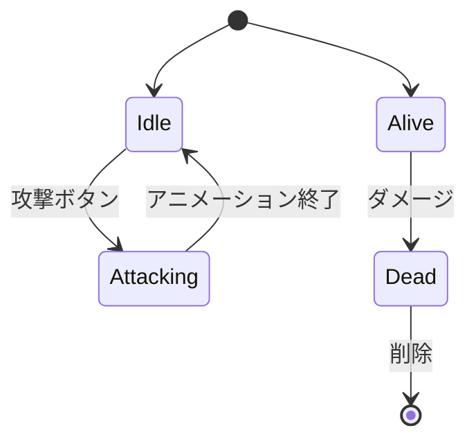
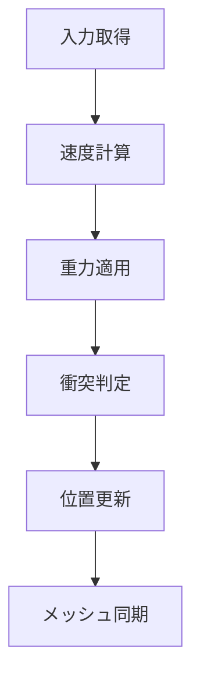

---
tags:
  - MOC
  - ゲームメカニクス
  - 物理演算
  - 戦闘
  - AI
created: 2025-11-23
---

# 05 ゲームメカニクス編

> [!abstract] 概要
> ゲームの核心部分である物理演算、戦闘システム、敵AIの実装を学びます。

---

## 章一覧

| 章 | タイトル | 対象ファイル | 学習内容 | 状態 |
|----|---------|-------------|---------|------|
| 01 | [[01_物理演算_PlayerPhysics.js]] | `src/PlayerPhysics.js` | ベクトル、重力、衝突判定（AABB） | 🟢 |
| 02 | [[02_戦闘システム_PlayerCombat.js]] | `src/PlayerCombat.js` | ステートパターン、アニメーション | 🟢 |
| 03 | [[03_敵キャラクター_Slime.js]] | `src/Slime.js` | 敵AI、ステートマシン、継承の実践 | 🟢 |

---

## この章で身につくこと

- [ ] ベクトル演算の基礎を理解する
- [ ] 重力と速度の実装方法を理解する
- [ ] AABB衝突判定を理解する
- [ ] ステートパターンを理解する
- [ ] 敵AIの基本的な実装方法を理解する

---

## 前提知識

> [!info] この章を始める前に
> - [[04_3Dグラフィックス編/_MOC_3Dグラフィックス編\|04 3Dグラフィックス編]] を完了している
> - クラスと継承を理解している

---

## ステートパターン

---

## 物理演算の流れ

---

## キーワード

#Vector3 #重力 #AABB #衝突判定 #ステートパターン #AI

---

## ナビゲーション

| 前 | 次 |
|----|-----|
| [[04_3Dグラフィックス編/_MOC_3Dグラフィックス編\|04 3Dグラフィックス編]] | [[06_システム編/_MOC_システム編\|06 システム編]] |

---

## 関連リンク

- [[_MOC_入門レベル\|目次に戻る]]
- [[07_付録/03_用語集\|用語集]]
