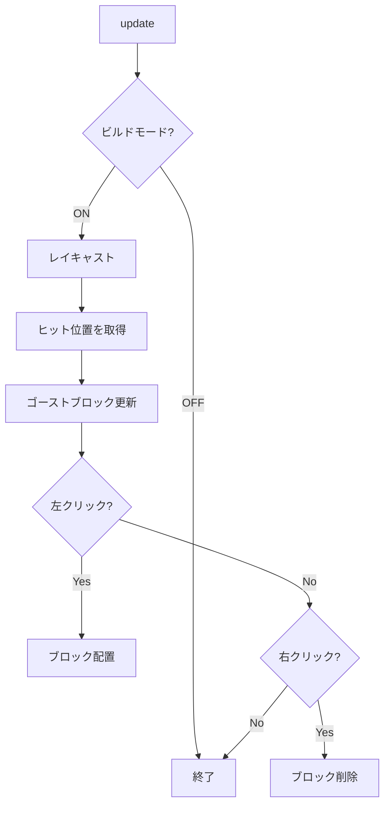
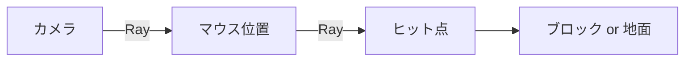

---
tags:
  - システム編
  - JavaScript
  - レイキャスト
  - Three.js
  - ブロック配置
chapter: 1
status: 完了
prev: "[[05_ゲームメカニクス編/03_敵キャラクター_Slime.js]]"
next: "[[02_セーブ機能_SaveManager.js]]"
source_file: src/BuildSystem.js
created: 2025-11-23
---

# 第1章: ビルドシステム - BuildSystem.js

> [!abstract] この章の概要
> ブロックの配置・削除を管理する `BuildSystem.js` を読み解きます。レイキャストによるマウスピッキングを学びます。

---

## この章で学ぶこと

- [ ] レイキャスト（Raycasting）を理解する
- [ ] マウス座標から3D空間への変換を理解する
- [ ] グリッドスナップの実装を理解する
- [ ] ゴーストブロック（プレビュー）の実装を理解する

---

## ファイルの役割

> [!note] `BuildSystem.js` の役割
> このファイルは **マインクラフト風ビルドモード** を実現します。
> - ビルドモードの ON/OFF 切り替え
> - マウス位置からブロック配置位置を計算
> - ゴーストブロックでプレビュー表示
> - ブロックの配置と削除

---

## 処理の流れ



---

## コード解説

### セクション1: レイキャスト

```javascript
getRaycastHit(input) {
    const raycaster = new THREE.Raycaster();
    raycaster.setFromCamera(
        new THREE.Vector2(input.mouse.x, input.mouse.y),
        this.camera
    );

    // 地面との交差判定
    const groundPlane = new THREE.Plane(new THREE.Vector3(0, 1, 0), 0);
    const target = new THREE.Vector3();
    raycaster.ray.intersectPlane(groundPlane, target);

    // オブジェクトとの交差判定
    const intersects = raycaster.intersectObjects(interactables, true);
    // ...
}
```

> [!info] レイキャストとは
> カメラから画面上の点を通る「光線（Ray）」を飛ばし、3Dオブジェクトとの交差を検出する技術です。



---

### セクション2: グリッドスナップ

```javascript
updateGhostBlock(hit) {
    const point = hit.point;
    const normal = hit.face.normal;

    // ヒット面の法線方向に少しずらす
    const targetPos = point.clone().add(normal.clone().multiplyScalar(0.5));

    // グリッドにスナップ（整数に丸める）
    const gridX = Math.round(targetPos.x);
    const gridY = Math.round(targetPos.y);
    const gridZ = Math.round(targetPos.z);

    this.ghostBlock.position.set(gridX, gridY, gridZ);
}
```

**法線を使う理由:**

```
   配置位置
      ↓
   ┌───┐
   │   │ ← ヒット面の法線方向にずらす
───┴───┴───
   ↑
 ヒット点
```

---

### セクション3: ブロック配置

```javascript
handleBlockPlacement(input, hit) {
    if (input.placeBlock && this.buildCooldown <= 0) {
        const block = new Block(gridX, gridY, gridZ, 'dirt');
        this.entityManager.add(block);
        this.collidables.push(block.mesh);
        this.buildCooldown = 0.2;  // 連打防止
    }
}
```

---

### セクション4: ゴーストブロック

```javascript
createGhostBlock() {
    const geometry = new THREE.BoxGeometry(1, 1, 1);
    const material = new THREE.MeshBasicMaterial({
        color: 0x00FF00,
        transparent: true,
        opacity: 0.5,
        wireframe: true
    });
    const mesh = new THREE.Mesh(geometry, material);
    mesh.visible = false;
    return mesh;
}
```

> [!tip] ユーザビリティの向上
> 半透明のワイヤーフレームで配置予定位置を表示することで、ユーザーが正確に配置できます。

---

## 実験してみよう

> [!question] やってみよう

### 実験1: ゴーストブロックの色を変更
```javascript
color: 0xFF0000,  // 赤に変更
```

### 実験2: クールダウンを変更
```javascript
this.buildCooldown = 0.05;  // 連射可能に
```

---

## まとめ

- ✅ Raycaster でマウス位置から3D空間への変換
- ✅ 法線ベクトルで配置位置を計算
- ✅ `Math.round()` でグリッドスナップ
- ✅ クールダウンで連打防止

> [!success] 次のステップ
> [[02_セーブ機能_SaveManager.js]] に進んで、データ永続化を学びましょう。

---

## 関連リンク

- [[05_ゲームメカニクス編/03_敵キャラクター_Slime.js|前の章]]
- [[02_セーブ機能_SaveManager.js|次の章]]
- [[06_システム編/_MOC_システム編|セクション目次]]
