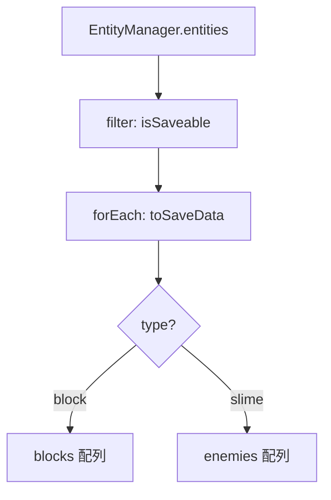

---
tags:
  - システム編
  - JavaScript
  - LocalStorage
  - JSON
  - データ永続化
chapter: 2
status: 完了
prev: "[[01_ビルドシステム_BuildSystem.js]]"
next: "[[03_サウンド_AudioManager.js]]"
source_file: src/SaveManager.js
created: 2025-11-23
---

# 第2章: セーブ機能 - SaveManager.js

> [!abstract] この章の概要
> ゲームの進行状況を保存・復元する `SaveManager.js` を読み解きます。LocalStorage と JSON によるデータ永続化を学びます。

---

## この章で学ぶこと

- [ ] LocalStorage の使い方を理解する
- [ ] JSON によるデータ変換を理解する
- [ ] ポリモーフィズムを活用したセーブ設計を理解する
- [ ] エンティティの復元方法を理解する

---

## ファイルの役割

> [!note] `SaveManager.js` の役割
> このファイルは **データ永続化** を担当します。
> - クイックセーブ / ロード（Kキー / Lキー）
> - スロット式セーブ（UIから）
> - プレイヤー位置、ブロック、敵の保存と復元

---

## セーブデータの構造

```javascript
const saveData = {
    timestamp: Date.now(),
    summary: "Player at 5, -10",
    player: {
        position: [x, y, z],
        rotation: 0.5
    },
    blocks: [
        { type: 'block', x: 1, y: 1, z: 1, colorKey: 'dirt' },
        // ...
    ],
    enemies: [
        { type: 'slime', x: 5, z: 10 },
        // ...
    ]
};
```

---

## コード解説

### セクション1: セーブデータの作成

```javascript
_createSaveData(summary) {
    const saveData = {
        timestamp: Date.now(),
        summary: summary,
        player: {
            position: this.game.player.position.toArray(),
            rotation: this.game.player.mesh.rotation.y
        },
        blocks: [],
        enemies: []
    };

    // ポリモーフィズムでセーブ対象を抽出
    this.game.entityManager.entities
        .filter(entity => entity.isSaveable && entity.isSaveable())
        .forEach(entity => {
            const data = entity.toSaveData();
            if (data.type === 'block') saveData.blocks.push(data);
            else if (data.type === 'slime') saveData.enemies.push(data);
        });

    return saveData;
}
```

> [!info] ポリモーフィズムの活用
> `isSaveable()` と `toSaveData()` は Entity で定義され、各サブクラスでオーバーライドされています。
> SaveManager はエンティティの具体的な型を知らなくても、セーブ対象を判別できます。



---

### セクション2: LocalStorage への保存

```javascript
quickSave() {
    const saveData = this._createSaveData('Quick Save');
    try {
        const json = JSON.stringify(saveData);
        localStorage.setItem(this.quickKey, json);
        this.game.showNotification("Quick Save Successful!");
    } catch (e) {
        console.error("Failed to quick save:", e);
    }
}
```

> [!info] LocalStorage とは
> ブラウザにデータを永続保存する API です。
> - **容量**: 約 5MB
> - **形式**: 文字列のみ（オブジェクトは JSON.stringify が必要）
> - **有効期限**: なし（明示的に削除するまで残る）

| メソッド | 説明 |
|---------|------|
| `setItem(key, value)` | データを保存 |
| `getItem(key)` | データを取得 |
| `removeItem(key)` | データを削除 |
| `key(index)` | インデックスからキーを取得 |
| `length` | 保存されている項目数 |

---

### セクション3: データの復元

```javascript
_restoreSaveData(saveData) {
    // プレイヤー復元
    this.game.player.position.fromArray(saveData.player.position);
    this.game.player.mesh.rotation.y = saveData.player.rotation;

    // 既存のセーブ対象エンティティを削除
    const entitiesToRemove = this.game.entityManager.entities
        .filter(e => e.isSaveable && e.isSaveable());
    entitiesToRemove.forEach(e => {
        e.shouldRemove = true;
        this.game.entityManager.remove(e);
    });

    // ブロック復元
    saveData.blocks.forEach(blockData => {
        const block = Block.fromSaveData(blockData);
        this.game.entityManager.add(block);
        this.game.collidables.push(block.mesh);
    });

    // 敵復元
    saveData.enemies.forEach(enemyData => {
        const slime = Slime.fromSaveData(enemyData);
        this.game.entityManager.add(slime);
    });
}
```

> [!tip] static fromSaveData
> `Block.fromSaveData()` や `Slime.fromSaveData()` はファクトリメソッドです。
> セーブデータからインスタンスを再構築します。

---

### セクション4: スロット管理

```javascript
getSlots() {
    const slots = [];
    for (let i = 0; i < localStorage.length; i++) {
        const key = localStorage.key(i);
        if (key.startsWith(this.prefix)) {
            const data = JSON.parse(localStorage.getItem(key));
            slots.push({
                id: key.replace(this.prefix, ''),
                timestamp: data.timestamp,
                summary: data.summary
            });
        }
    }
    return slots.sort((a, b) => b.timestamp - a.timestamp);
}
```

---

## JSON の基本

```javascript
// オブジェクト → JSON文字列
const json = JSON.stringify({ x: 1, y: 2 });
// '{"x":1,"y":2}'

// JSON文字列 → オブジェクト
const obj = JSON.parse('{"x":1,"y":2}');
// { x: 1, y: 2 }
```

> [!warning] JSON の制限
> - 関数は保存できない
> - undefined は保存できない
> - 循環参照があるとエラー

---

## 実験してみよう

> [!question] やってみよう

### 実験1: セーブデータを確認
```javascript
// ブラウザのコンソールで
console.log(localStorage.getItem('gemini_3d_quick_save'));
```

### 実験2: 全セーブを削除
```javascript
localStorage.clear();
```

---

## まとめ

- ✅ `JSON.stringify` / `JSON.parse` でオブジェクト ↔ 文字列変換
- ✅ `localStorage` でブラウザにデータ永続化
- ✅ ポリモーフィズム（`isSaveable`, `toSaveData`）で柔軟なセーブ設計
- ✅ `fromSaveData` でエンティティを復元

> [!success] 次のステップ
> [[03_サウンド_AudioManager.js]] に進んで、Web Audio API を学びましょう。

---

## 関連リンク

- [[01_ビルドシステム_BuildSystem.js|前の章]]
- [[03_サウンド_AudioManager.js|次の章]]
- [[06_システム編/_MOC_システム編|セクション目次]]
