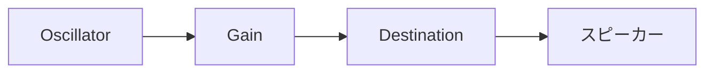

---
tags:
  - システム編
  - JavaScript
  - WebAudioAPI
  - Oscillator
  - 効果音
chapter: 3
status: 完了
prev: "[[02_セーブ機能_SaveManager.js]]"
next: "[[07_付録/_MOC_付録]]"
source_file: src/AudioManager.js
created: 2025-11-23
---

# 第3章: サウンド - AudioManager.js

> [!abstract] この章の概要
> 効果音を生成・再生する `AudioManager.js` を読み解きます。Web Audio API によるプログラム的な音声合成を学びます。

---

## この章で学ぶこと

- [ ] Web Audio API の基本を理解する
- [ ] Oscillator による波形生成を理解する
- [ ] Gain（音量）の制御を理解する
- [ ] 周波数変化によるサウンドデザインを理解する

---

## ファイルの役割

> [!note] `AudioManager.js` の役割
> このファイルは **効果音のプログラム生成** を担当します。
> - ジャンプ、攻撃、ヒット、敵死亡の効果音
> - 音声ファイルを使わず、コードで音を生成
> - ミュート機能

---

## Web Audio API の構造



| ノード | 役割 |
|-------|------|
| `Oscillator` | 波形を生成（音源） |
| `Gain` | 音量を調整 |
| `Destination` | 出力先（スピーカー） |

---

## コード解説

### セクション1: 初期化

```javascript
export class AudioManager {
    constructor() {
        this.ctx = new (window.AudioContext || window.webkitAudioContext)();
        this.isMuted = false;
    }

    resumeContext() {
        if (this.ctx.state === 'suspended') {
            this.ctx.resume();
        }
    }
}
```

> [!warning] AudioContext の制限
> ブラウザはユーザー操作なしでの音声再生を制限します。
> `resumeContext()` でユーザー操作後に AudioContext を再開します。

---

### セクション2: ジャンプ音

```javascript
playJump() {
    if (this.isMuted) return;
    this.resumeContext();

    const osc = this.ctx.createOscillator();
    const gain = this.ctx.createGain();

    osc.connect(gain);
    gain.connect(this.ctx.destination);

    osc.type = 'sine';
    osc.frequency.setValueAtTime(200, this.ctx.currentTime);
    osc.frequency.linearRampToValueAtTime(400, this.ctx.currentTime + 0.1);

    gain.gain.setValueAtTime(0.2, this.ctx.currentTime);
    gain.gain.exponentialRampToValueAtTime(0.01, this.ctx.currentTime + 0.2);

    osc.start();
    osc.stop(this.ctx.currentTime + 0.2);
}
```

**ジャンプ音の設計:**

```
周波数: 200Hz → 400Hz（上昇）
   ↗ ピッチが上がる = ジャンプ感

音量: 0.2 → 0.01（フェードアウト）
```

---

### セクション3: 波形タイプ

| type | 説明 | 用途 |
|------|------|------|
| `sine` | 正弦波（滑らか） | ジャンプ |
| `triangle` | 三角波（やや硬い） | 攻撃 |
| `sawtooth` | ノコギリ波（ざらざら） | ヒット |
| `square` | 矩形波（電子的） | 敵死亡 |

```
sine:     ∿∿∿∿
triangle: /\/\/\
sawtooth: /|/|/|
square:   ▐▌▐▌▐▌
```

---

### セクション4: 各効果音の特徴

```javascript
// 攻撃音: 高→低（振り下ろし感）
playAttack() {
    osc.type = 'triangle';
    osc.frequency.setValueAtTime(400, this.ctx.currentTime);
    osc.frequency.exponentialRampToValueAtTime(100, this.ctx.currentTime + 0.15);
}

// ヒット音: 低く重い
playHit() {
    osc.type = 'sawtooth';
    osc.frequency.setValueAtTime(100, this.ctx.currentTime);
    osc.frequency.exponentialRampToValueAtTime(50, this.ctx.currentTime + 0.2);
}

// 敵死亡: 短い電子音
playEnemyDeath() {
    osc.type = 'square';
    osc.frequency.setValueAtTime(200, this.ctx.currentTime);
    osc.frequency.exponentialRampToValueAtTime(50, this.ctx.currentTime + 0.1);
}
```

---

## 周波数変化メソッド

| メソッド | 説明 |
|---------|------|
| `setValueAtTime(value, time)` | 指定時刻に値を設定 |
| `linearRampToValueAtTime(value, time)` | 直線的に変化 |
| `exponentialRampToValueAtTime(value, time)` | 指数的に変化（0不可） |

```
linear:        exponential:
  /              ___/
 /              /
/             _/
```

---

## 実験してみよう

> [!question] やってみよう

### 実験1: ジャンプ音のピッチを変更
```javascript
osc.frequency.linearRampToValueAtTime(800, ...);  // 400 → 800
```

### 実験2: 新しい効果音を追加
```javascript
playCollect() {
    const osc = this.ctx.createOscillator();
    osc.type = 'sine';
    osc.frequency.setValueAtTime(600, this.ctx.currentTime);
    osc.frequency.linearRampToValueAtTime(1200, this.ctx.currentTime + 0.1);
    // ...
}
```

---

## まとめ

- ✅ `AudioContext` で Web Audio API を初期化
- ✅ `Oscillator` で波形を生成
- ✅ `Gain` で音量を制御
- ✅ `frequency.rampToValueAtTime` でピッチを変化
- ✅ 波形タイプ（sine, triangle, sawtooth, square）で音色を変更

> [!success] システム編 完了！
> おめでとうございます！システム編が完了しました。
> 次は [[07_付録/_MOC_付録|07 付録]] でリファレンス資料を確認しましょう。

---

## 関連リンク

- [[02_セーブ機能_SaveManager.js|前の章]]
- [[07_付録/_MOC_付録|次のセクション: 付録]]
- [[06_システム編/_MOC_システム編|セクション目次]]
