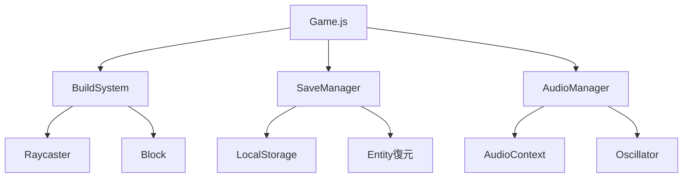

---
tags:
  - MOC
  - システム
  - ビルド
  - セーブ
  - オーディオ
created: 2025-11-23
---

# 06 システム編

> [!abstract] 概要
> ゲームを支えるシステム機能（ブロック配置、セーブ/ロード、サウンド）の実装を学びます。

---

## 章一覧

| 章 | タイトル | 対象ファイル | 学習内容 | 状態 |
|----|---------|-------------|---------|------|
| 01 | [[01_ビルドシステム_BuildSystem.js]] | `src/BuildSystem.js` | レイキャスト、マウス入力、ブロック配置 | 🟢 |
| 02 | [[02_セーブ機能_SaveManager.js]] | `src/SaveManager.js` | LocalStorage、JSON、データ永続化 | 🟢 |
| 03 | [[03_サウンド_AudioManager.js]] | `src/AudioManager.js` | Web Audio API、効果音生成 | 🟢 |

---

## この章で身につくこと

- [ ] Raycasting（レイキャスト）を理解する
- [ ] マウス座標の3D空間への変換を理解する
- [ ] LocalStorageによるデータ保存を理解する
- [ ] JSONによるデータ変換を理解する
- [ ] Web Audio APIの基本を理解する

---

## 前提知識

> [!info] この章を始める前に
> - [[05_ゲームメカニクス編/_MOC_ゲームメカニクス編\|05 ゲームメカニクス編]] を完了している
> - ベクトルと3D空間の概念を理解している

---

## システム構成

---

## キーワード

#Raycaster #LocalStorage #JSON #WebAudioAPI #Oscillator

---

## ナビゲーション

| 前 | 次 |
|----|-----|
| [[05_ゲームメカニクス編/_MOC_ゲームメカニクス編\|05 ゲームメカニクス編]] | [[07_付録/_MOC_付録\|07 付録]] |

---

## 関連リンク

- [[_MOC_入門レベル\|目次に戻る]]
- [[07_付録/03_用語集\|用語集]]
