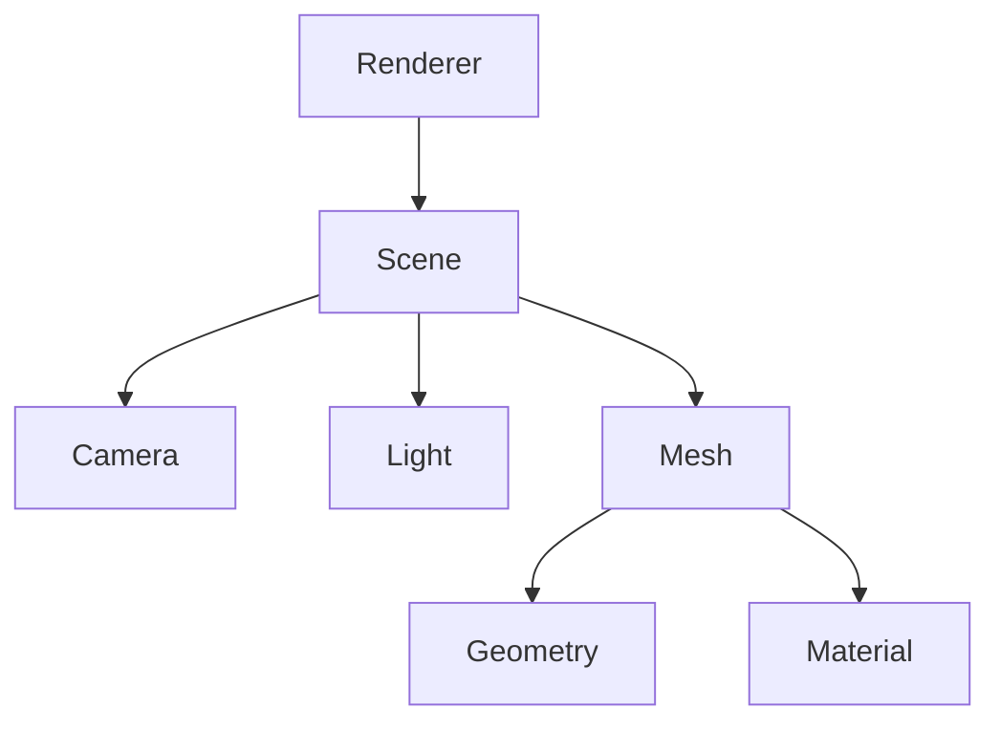
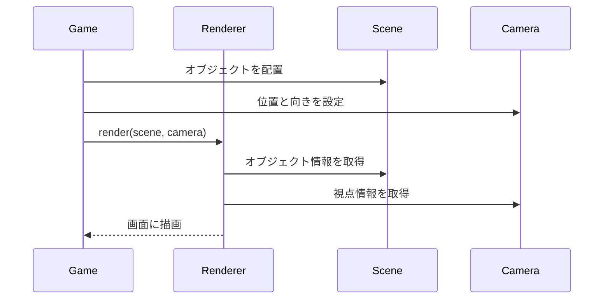
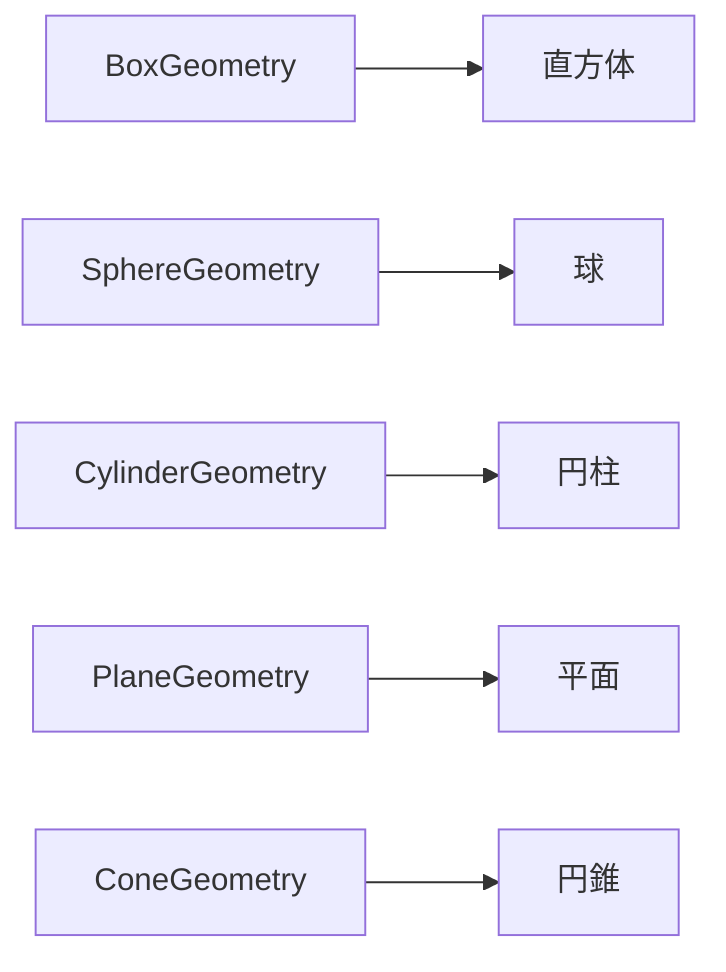
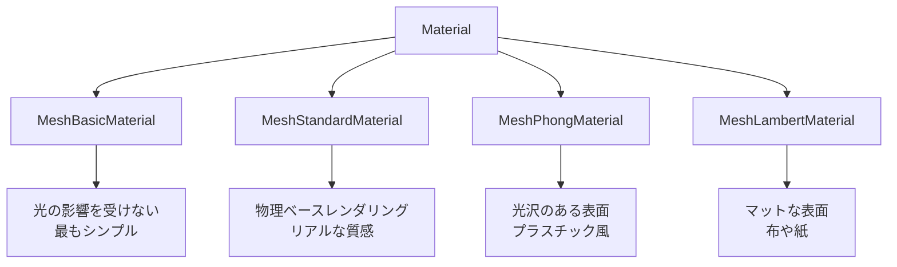
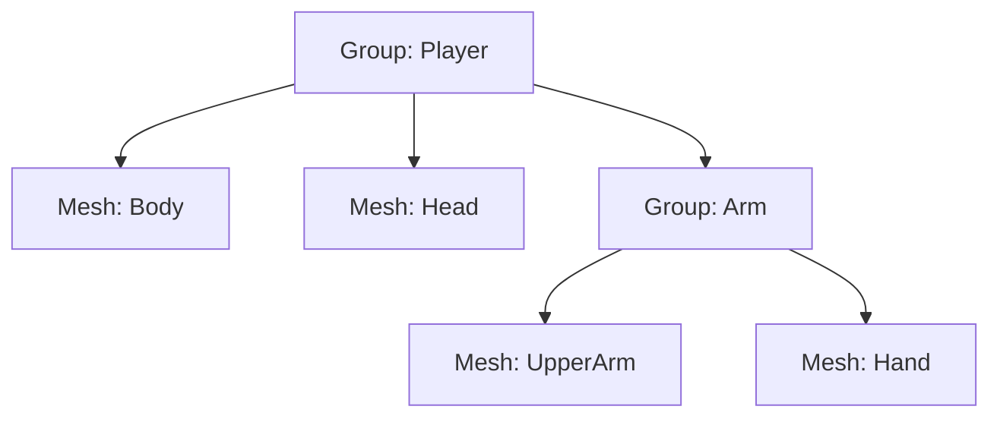
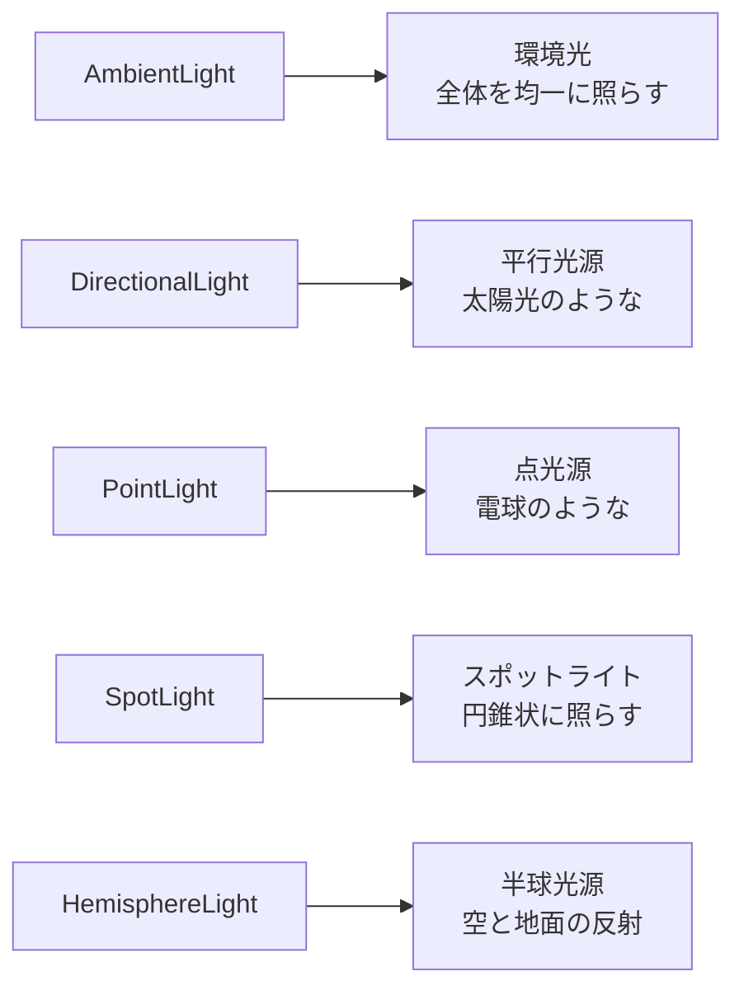
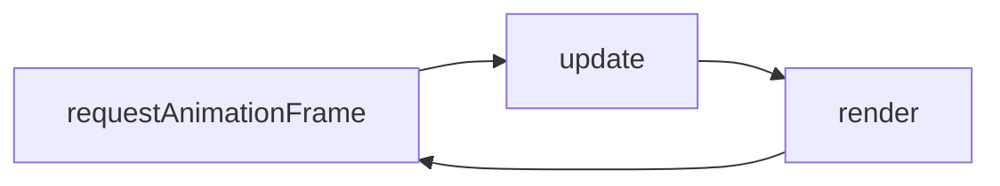
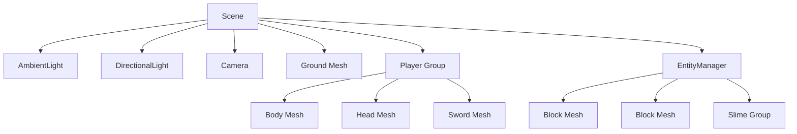

---
tags:
  - 付録
  - Three.js
  - 図解
  - 3Dグラフィックス
status: 完了
created: 2025-11-23
---

# Three.js 概念図解

> [!abstract] 概要
> Three.js の主要概念を図解で説明します。3D グラフィックスの基本を視覚的に理解しましょう。

---

## Three.js の基本構造



| 要素 | 役割 | 例え |
|------|------|------|
| **Renderer** | 画面に描画する | 映写機 |
| **Scene** | 全てのオブジェクトを含む | 舞台 |
| **Camera** | どこから見るか | 観客の目 |
| **Light** | 光を当てる | 照明 |
| **Mesh** | 表示される物体 | 役者 |
| **Geometry** | 形状 | 役者の体型 |
| **Material** | 見た目（色、質感） | 役者の衣装 |

---

## レンダリングの流れ



---

## 座標系

### Three.js の座標系（右手系）

```
        Y（上）
        │
        │
        │
        └───────── X（右）
       ╱
      ╱
     Z（手前）
```

| 軸 | 正の方向 | 負の方向 |
|----|---------|---------|
| X | 右 | 左 |
| Y | 上 | 下 |
| Z | 手前（カメラ側） | 奥 |

> [!warning] 注意
> 3D ソフトによって座標系が異なることがあります。Three.js は Y が上の右手系です。

---

## Vector3（3次元ベクトル）

### 位置の表現

```javascript
const position = new THREE.Vector3(x, y, z);
```

```
           (0, 2, 0)
              │
              │ Y=2
              │
    (-2,0,0)──┼──(2,0,0)
              │
              │
           (0,-2,0)
```

### よく使うメソッド

| メソッド | 説明 |
|---------|------|
| `add(v)` | ベクトルを加算 |
| `sub(v)` | ベクトルを減算 |
| `multiplyScalar(s)` | スカラー倍 |
| `normalize()` | 長さを1にする |
| `length()` | ベクトルの長さ |
| `distanceTo(v)` | 2点間の距離 |
| `clone()` | コピーを作成 |
| `copy(v)` | 値をコピー |

```javascript
// 例: プレイヤーからの方向ベクトル
const direction = enemy.position.clone()
    .sub(player.position)
    .normalize();
```

---

## Geometry（形状）

### 基本形状



### コード例

```javascript
// 箱（幅, 高さ, 奥行き）
new THREE.BoxGeometry(1, 1, 1);

// 球（半径, 横分割数, 縦分割数）
new THREE.SphereGeometry(0.5, 32, 32);

// 円柱（上半径, 下半径, 高さ, 分割数）
new THREE.CylinderGeometry(0.5, 0.5, 1, 32);

// 平面（幅, 高さ）
new THREE.PlaneGeometry(10, 10);
```

---

## Material（材質）

### 材質の種類



### プロパティ

| プロパティ | 説明 | 対応Material |
|-----------|------|-------------|
| `color` | 基本色 | 全て |
| `map` | テクスチャ | 全て |
| `transparent` | 透明を有効化 | 全て |
| `opacity` | 不透明度（0〜1） | 全て |
| `wireframe` | ワイヤーフレーム表示 | 全て |
| `roughness` | 粗さ（0:鏡面〜1:マット） | Standard |
| `metalness` | 金属感（0〜1） | Standard |
| `emissive` | 発光色 | Standard, Phong |

```javascript
// 例: 半透明の緑色
new THREE.MeshStandardMaterial({
    color: 0x00ff00,
    transparent: true,
    opacity: 0.5,
    roughness: 0.8
});
```

---

## Mesh（メッシュ）

### 構成

```
Mesh = Geometry + Material
```

```javascript
const geometry = new THREE.BoxGeometry(1, 1, 1);
const material = new THREE.MeshStandardMaterial({ color: 0xff0000 });
const mesh = new THREE.Mesh(geometry, material);
scene.add(mesh);
```

### 変換プロパティ

```javascript
// 位置
mesh.position.set(x, y, z);
mesh.position.x = 5;

// 回転（ラジアン）
mesh.rotation.set(rx, ry, rz);
mesh.rotation.y = Math.PI / 4;  // 45度

// スケール
mesh.scale.set(sx, sy, sz);
mesh.scale.multiplyScalar(2);  // 2倍に
```

---

## Group（グループ）

### 階層構造



```javascript
const playerGroup = new THREE.Group();
playerGroup.add(body);
playerGroup.add(head);
playerGroup.add(armGroup);

// グループごと移動・回転できる
playerGroup.position.set(0, 0, 5);
playerGroup.rotation.y = Math.PI;  // 後ろ向き
```

> [!tip] 階層の利点
> - 親を動かすと子も一緒に動く
> - 関節のような相対的な動きが簡単に実現できる

---

## Camera（カメラ）

### PerspectiveCamera（透視投影）

```
        ╱│╲
       ╱ │ ╲
      ╱  │  ╲  near
     ╱   │   ╲
    ╱    │    ╲
   ╱     │     ╲
  ╱      │      ╲
 ╱       │       ╲  far
╱────────┼────────╲
```

```javascript
new THREE.PerspectiveCamera(
    fov,     // 視野角（度）
    aspect,  // アスペクト比（width / height）
    near,    // 近クリップ面
    far      // 遠クリップ面
);

// 例
const camera = new THREE.PerspectiveCamera(75, 16/9, 0.1, 1000);
```

| パラメータ | 説明 | 推奨値 |
|-----------|------|--------|
| fov | 視野角（広いほど広角） | 60〜75 |
| aspect | 画面のアスペクト比 | window.innerWidth / innerHeight |
| near | これより近いものは描画しない | 0.1 |
| far | これより遠いものは描画しない | 1000〜10000 |

---

## Light（光源）

### 光源の種類



### コード例

```javascript
// 環境光（全体を薄く照らす）
const ambient = new THREE.AmbientLight(0xffffff, 0.4);

// 平行光源（影を落とせる）
const directional = new THREE.DirectionalLight(0xffffff, 0.8);
directional.position.set(5, 10, 5);

// 点光源
const point = new THREE.PointLight(0xff0000, 1, 10);
point.position.set(0, 2, 0);
```

---

## Raycaster（レイキャスト）

### 仕組み

```
カメラ ────────────────────────→ Ray（光線）
         ↓
    マウス位置を通過
         ↓
    オブジェクトと交差判定
```

```javascript
const raycaster = new THREE.Raycaster();
const mouse = new THREE.Vector2();

// マウス座標を正規化（-1〜1）
mouse.x = (event.clientX / window.innerWidth) * 2 - 1;
mouse.y = -(event.clientY / window.innerHeight) * 2 + 1;

// レイを設定
raycaster.setFromCamera(mouse, camera);

// 交差判定
const intersects = raycaster.intersectObjects(objects);
if (intersects.length > 0) {
    const hitObject = intersects[0].object;
    const hitPoint = intersects[0].point;
}
```

---

## アニメーションループ



```javascript
function animate() {
    requestAnimationFrame(animate);

    // 更新処理
    const delta = clock.getDelta();
    player.update(delta);

    // 描画
    renderer.render(scene, camera);
}
animate();
```

> [!info] requestAnimationFrame
> ブラウザの描画タイミングに合わせて関数を呼び出します（通常60fps）。
> `setInterval` より効率的で、タブが非アクティブ時は自動で停止します。

---

## シーングラフの全体像



---

## 関連リンク

- [[01_JavaScript基礎リファレンス|前: JavaScript基礎]]
- [[03_用語集|次: 用語集]]
- [[_MOC_付録|付録に戻る]]
- [Three.js Documentation](https://threejs.org/docs/)
