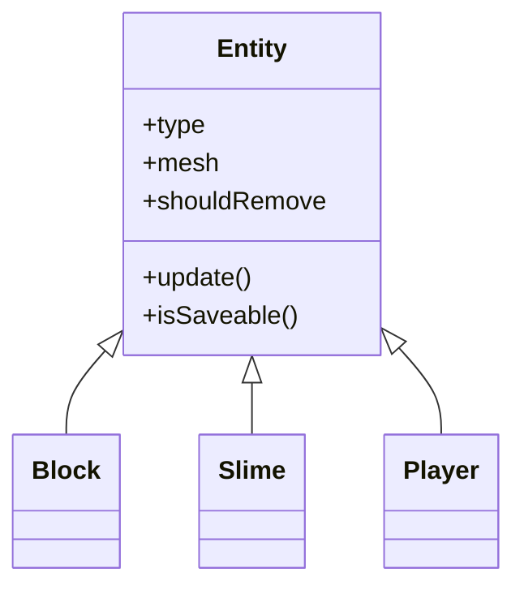
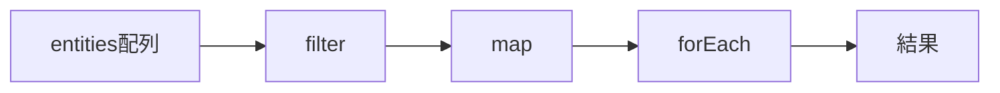
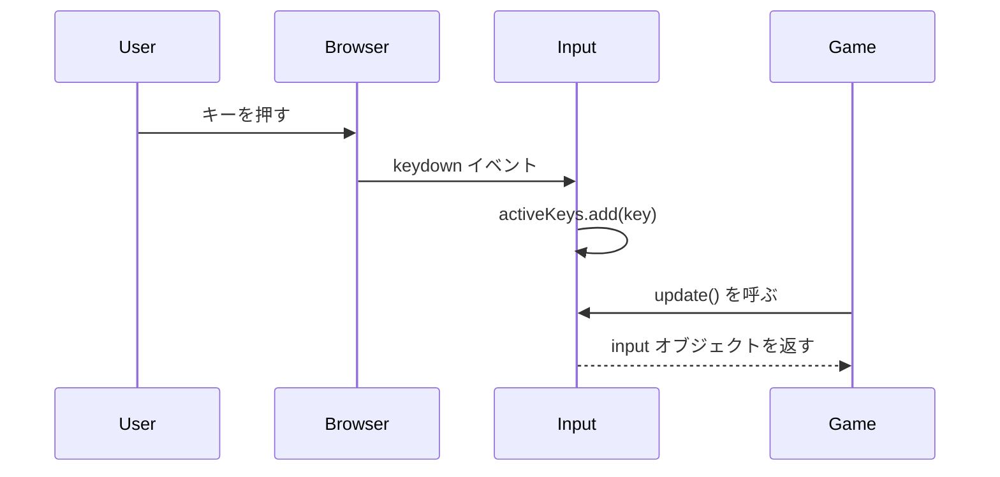
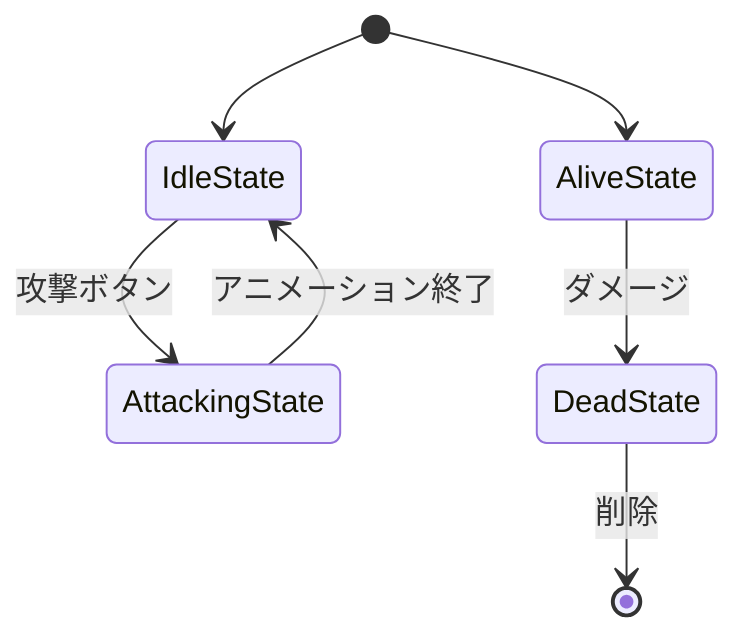
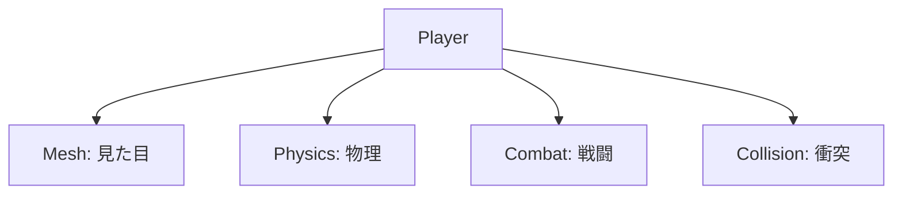
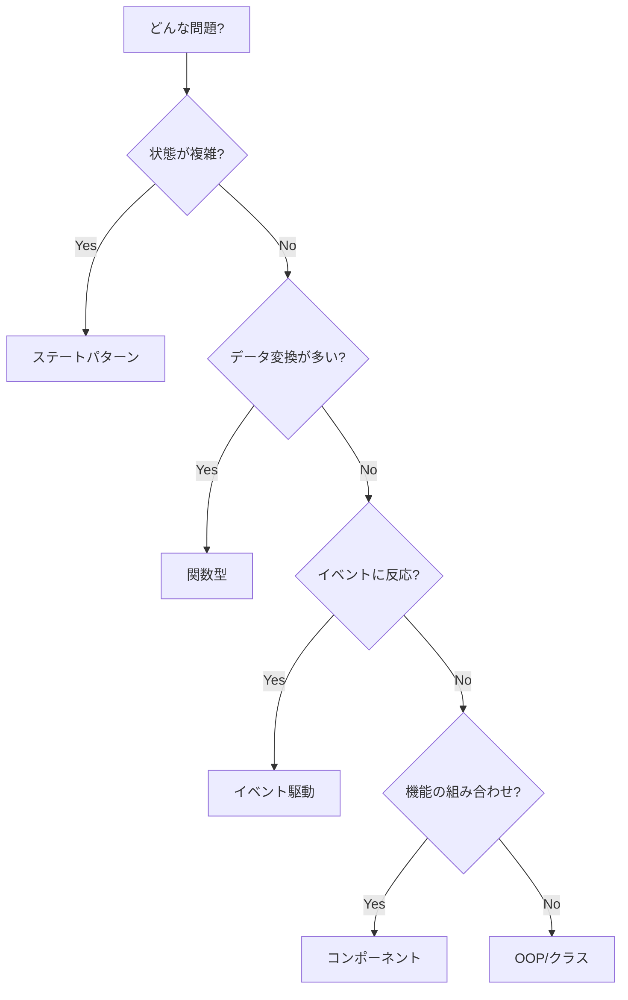

---
tags:
  - 付録
  - パラダイム
  - 設計パターン
  - リファレンス
status: 完了
created: 2025-11-23
---

# パラダイム早見表

> [!abstract] 概要
> 本プロジェクトで使用されているプログラミングパラダイム（設計手法）を一覧にまとめています。各パラダイムの特徴と使用箇所を確認できます。

---

## パラダイム一覧

| パラダイム | 特徴 | 主な使用箇所 |
|-----------|------|-------------|
| オブジェクト指向 | データと処理をクラスにまとめる | Entity, Player |
| 関数型 | データ変換を関数の連鎖で表現 | EntityManager |
| イベント駆動 | イベント発生時に処理を実行 | Input |
| データ駆動 | 設定をデータとして定義 | Input (keyMap) |
| ステートパターン | 状態をオブジェクトとして管理 | PlayerCombat, Slime |
| コンポーネントベース | 機能を部品として組み合わせる | Player |

---

## オブジェクト指向プログラミング (OOP)

> [!info] 特徴
> データ（プロパティ）と処理（メソッド）をクラスとしてまとめ、継承やポリモーフィズムで再利用性を高める。

### 本プロジェクトでの使用



### コード例

```javascript
// 基底クラス
class Entity {
    constructor() {
        this.type = 'Entity';
        this.shouldRemove = false;
    }

    update(delta) { }
    isSaveable() { return false; }
}

// 派生クラス（継承）
class Slime extends Entity {
    constructor(x, z) {
        super();  // 親の初期化
        this.type = 'Slime';
    }

    // オーバーライド
    update(delta) {
        // スライム固有の処理
    }

    isSaveable() {
        return this.isAlive;  // 条件付きで true
    }
}
```

### 関連章
- [[03_設計パターン編/01_エンティティの基礎_Entity.js]]
- [[05_ゲームメカニクス編/03_敵キャラクター_Slime.js]]

---

## 関数型プログラミング

> [!info] 特徴
> 副作用を避け、データの変換を関数の連鎖（メソッドチェーン）で表現する。

### 本プロジェクトでの使用



### コード例

```javascript
// 関数型スタイル（宣言的）
const aliveEnemies = entities
    .filter(e => e.type === 'Slime')
    .filter(e => e.isAlive)
    .map(e => ({ name: e.name, hp: e.hp }));

// 命令型スタイル（比較用）
const aliveEnemies = [];
for (const e of entities) {
    if (e.type === 'Slime' && e.isAlive) {
        aliveEnemies.push({ name: e.name, hp: e.hp });
    }
}
```

### よく使う高階関数

| 関数 | 用途 | 戻り値 |
|------|------|--------|
| `filter` | 条件に合う要素を抽出 | 新しい配列 |
| `map` | 各要素を変換 | 新しい配列 |
| `forEach` | 各要素に処理を実行 | undefined |
| `find` | 条件に合う最初の要素 | 要素 or undefined |
| `some` | いずれかが条件を満たすか | boolean |
| `every` | 全てが条件を満たすか | boolean |

### 関連章
- [[03_設計パターン編/02_エンティティ管理_EntityManager.js]]

---

## イベント駆動

> [!info] 特徴
> イベント（キー入力、クリックなど）が発生したときに登録された処理（コールバック）を実行する。

### 本プロジェクトでの使用



### コード例

```javascript
// イベントリスナーの登録
window.addEventListener('keydown', (event) => {
    this.activeKeys.add(event.code);
});

window.addEventListener('keyup', (event) => {
    this.activeKeys.delete(event.code);
});

// イベント発生時にコールバックが呼ばれる
```

### 関連章
- [[02_Three.js入門編/02_入力システム_Input.js]]

---

## データ駆動

> [!info] 特徴
> 動作を決める設定値やルールをデータ（オブジェクトや配列）として定義し、コードの変更なしに動作を変更できるようにする。

### 本プロジェクトでの使用

```javascript
// キーマップをデータとして定義
const keyMap = {
    'KeyW': 'forward',
    'KeyS': 'backward',
    'KeyA': 'left',
    'KeyD': 'right',
    'Space': 'jump',
    'ShiftLeft': 'attack'
};

// データを使って入力を判定
update() {
    const input = {};
    for (const [code, action] of Object.entries(this.keyMap)) {
        input[action] = this.activeKeys.has(code);
    }
    return input;
}
```

### 利点

| 利点 | 説明 |
|------|------|
| 設定変更が容易 | キー配置を変えるのにコード修正不要 |
| 保守性が高い | if文の羅列を避けられる |
| 拡張が容易 | 新しいアクションを追加しやすい |

### 関連章
- [[02_Three.js入門編/02_入力システム_Input.js]]

---

## ステートパターン

> [!info] 特徴
> オブジェクトの状態を別のクラス（State）として表現し、状態ごとの振る舞いをカプセル化する。if-else の連鎖を避けられる。

### 本プロジェクトでの使用



### コード例

```javascript
// 状態の基底クラス
class CombatState {
    constructor(combat) {
        this.combat = combat;
    }
    enter() { }   // 状態に入ったとき
    update() { }  // 毎フレーム
    exit() { }    // 状態から出るとき
}

// 具体的な状態
class IdleState extends CombatState {
    update(delta, input) {
        if (input.attack) {
            this.combat.setState(new AttackingState(this.combat));
        }
    }
}

class AttackingState extends CombatState {
    enter() {
        this.playAttackSound();
    }
    update(delta) {
        // アニメーション処理
        if (this.isComplete) {
            this.combat.setState(new IdleState(this.combat));
        }
    }
}
```

### if-else との比較

```javascript
// ❌ if-else（状態が増えると複雑に）
update() {
    if (this.state === 'idle') {
        if (input.attack) this.state = 'attacking';
    } else if (this.state === 'attacking') {
        // 攻撃処理
    } else if (this.state === 'blocking') {
        // 防御処理
    }
}

// ✅ ステートパターン（状態ごとに整理）
update() {
    this.currentState.update(delta, input);
}
```

### 関連章
- [[05_ゲームメカニクス編/02_戦闘システム_PlayerCombat.js]]
- [[05_ゲームメカニクス編/03_敵キャラクター_Slime.js]]

---

## コンポーネントベース

> [!info] 特徴
> 機能を独立した部品（コンポーネント）として実装し、組み合わせてオブジェクトを構成する。継承よりも柔軟。

### 本プロジェクトでの使用



### コード例

```javascript
class Player {
    constructor(game) {
        // 各機能をコンポーネントとして保持
        this.mesh = new PlayerMesh();
        this.physics = new PlayerPhysics(this);
        this.combat = new PlayerCombat(this);
        this.collision = new PlayerCollision(this);
    }

    update(delta, input) {
        // 各コンポーネントに処理を委譲
        this.physics.update(delta, input);
        this.combat.update(delta, input);
        this.collision.checkCollision();
    }
}
```

### 継承との比較

```javascript
// ❌ 継承チェーン（深くなると複雑）
class Entity { }
class MovableEntity extends Entity { }
class CombatEntity extends MovableEntity { }
class Player extends CombatEntity { }

// ✅ コンポーネント（組み合わせ自由）
class Player {
    physics = new PhysicsComponent();
    combat = new CombatComponent();
}

class NPC {
    physics = new PhysicsComponent();
    // combat は持たない
}
```

### 関連章
- [[03_設計パターン編/03_プレイヤーの設計_Player.js]]

---

## パラダイムの選択指針



| 状況 | 推奨パラダイム |
|------|---------------|
| 複数の状態を持つオブジェクト | ステートパターン |
| 配列のフィルタリング・変換 | 関数型 |
| ユーザー入力の処理 | イベント駆動 |
| 設定値が多い | データ駆動 |
| 機能を自由に組み合わせたい | コンポーネント |
| データと処理をまとめたい | OOP |

> [!tip] パラダイムの組み合わせ
> 実際のプロジェクトでは、複数のパラダイムを組み合わせて使います。
> 「どれか一つ」ではなく、状況に応じて最適なものを選びましょう。

---

## 関連リンク

- [[04_トラブルシューティング|前: トラブルシューティング]]
- [[_MOC_付録|付録に戻る]]
- [[_MOC_入門レベル|目次に戻る]]
