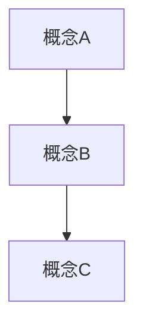

---
tags:
  - セクション名
  - キーワード1
  - キーワード2
chapter: N
status: 未着手
prev: "[[前の章へのリンク]]"
next: "[[次の章へのリンク]]"
source_file: src/ファイル名.js
created: YYYY-MM-DD
---

# 第N章: タイトル

> [!abstract] この章の概要
> この章では〇〇について学びます。

---

## この章で学ぶこと

- [ ] 学習目標1
- [ ] 学習目標2
- [ ] 学習目標3

---

## 前提知識

> [!info] この章を始める前に
> - 前提条件1
> - 前提条件2

---

## ファイルの役割

> [!note] `ファイル名.js` の役割
> このファイルは〇〇を担当しています。
> - 主な責務1
> - 主な責務2

---

## コード解説

### セクション1: タイトル

```javascript
// コードをここに貼り付け
```

> [!tip] ポイント
> このコードのポイントを説明

**解説:**

| 行 | コード | 説明 |
|----|--------|------|
| 1 | `const x = ...` | 〇〇を定義している |
| 2 | `function...` | △△の処理を行う |

---

### セクション2: タイトル

```javascript
// コードをここに貼り付け
```

**解説:**

詳しい説明をここに書く。

> [!warning] 注意
> この部分を変更すると〇〇が起きます。

---

## 重要な概念

### 概念名

説明文。



> [!info] 補足
> 追加の説明や参考情報

---

## 実験してみよう

> [!question] やってみよう
> 以下の実験を行って、動作を確認してみましょう。

### 実験1: 〇〇を変更する

1. `ファイル名.js` を開く
2. N行目の `値` を `新しい値` に変更する
3. ブラウザで動作を確認する

**期待される結果:**
- 〇〇が変化する

### 実験2: △△を試す

1. 手順1
2. 手順2

---

## よくある疑問

> [!question] Q: なぜ〇〇するのですか？
> A: 〇〇だからです。△△という理由もあります。

> [!question] Q: □□とは何ですか？
> A: □□は〇〇のことです。詳しくは[[07_付録/03_用語集#□□|用語集]]を参照してください。

---

## まとめ

この章で学んだこと：

- ✅ 学習内容1
- ✅ 学習内容2
- ✅ 学習内容3

> [!success] 達成！
> この章を完了しました。次は[[次の章へのリンク]]に進みましょう。

---

## 関連リンク

- [[前の章へのリンク|前の章: 前の章タイトル]]
- [[次の章へのリンク|次の章: 次の章タイトル]]
- [[_MOC_セクション名|セクション目次に戻る]]
- [[_MOC_入門レベル|入門レベル目次に戻る]]

---

## 参考資料

- [外部リンク1](URL)
- [外部リンク2](URL)
