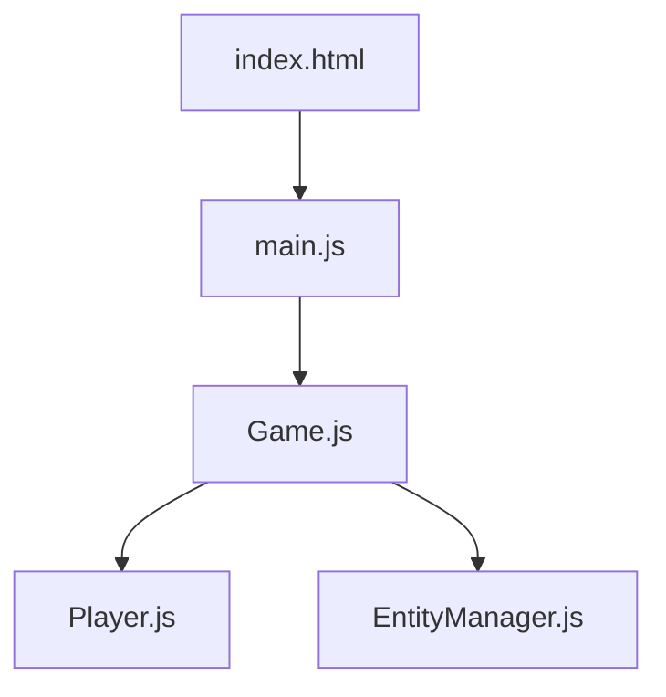

# フォルダ構成計画

## 概要

Obsidianの機能を最大限活用し、ナビゲーションしやすい構造を設計する。

---

## フォルダ構成

```
入門レベル/
├── 00_はじめに/
│   ├── 00_このドキュメントについて.md
│   ├── 01_学習の進め方.md
│   ├── 02_開発環境セットアップ.md
│   └── 03_プロジェクト概要.md
│
├── 01_基礎編/
│   ├── _MOC_基礎編.md                    ← Map of Contents
│   ├── 01_HTMLの基礎_index.html.md
│   ├── 02_パッケージ管理_package.json.md
│   └── 03_エントリーポイント_main.js.md
│
├── 02_Three.js入門編/
│   ├── _MOC_Three.js入門編.md
│   ├── 01_ゲームの心臓部_Game.js.md
│   └── 02_入力システム_Input.js.md
│
├── 03_オブジェクト指向編/
│   ├── _MOC_オブジェクト指向編.md
│   ├── 01_エンティティの基礎_Entity.js.md
│   ├── 02_エンティティ管理_EntityManager.js.md
│   └── 03_プレイヤーの設計_Player.js.md
│
├── 04_3Dグラフィックス編/
│   ├── _MOC_3Dグラフィックス編.md
│   └── 01_キャラクター構築_PlayerMesh.js.md
│
├── 05_ゲームメカニクス編/
│   ├── _MOC_ゲームメカニクス編.md
│   ├── 01_物理演算_PlayerPhysics.js.md
│   ├── 02_戦闘システム_PlayerCombat.js.md
│   └── 03_敵キャラクター_Slime.js.md
│
├── 06_システム編/
│   ├── _MOC_システム編.md
│   ├── 01_ビルドシステム_BuildSystem.js.md
│   ├── 02_セーブ機能_SaveManager.js.md
│   └── 03_サウンド_AudioManager.js.md
│
├── 07_付録/
│   ├── _MOC_付録.md
│   ├── 01_JavaScript基礎リファレンス.md
│   ├── 02_Three.js概念図解.md
│   ├── 03_用語集.md
│   └── 04_トラブルシューティング.md
│
├── Plans/
│   ├── 入門ドキュメント計画.md
│   └── フォルダ構成計画.md
│
└── _MOC_入門レベル.md                    ← 最上位のMap of Contents
```

---

## Obsidian機能の活用

### 1. MOC（Map of Contents）

各セクションに `_MOC_xxx.md` を配置し、関連ドキュメントへのリンクをまとめる。

**例: `_MOC_基礎編.md`**
```markdown
# 基礎編

## 概要
HTMLとJavaScriptの基本を学び、プロジェクトの構造を理解する。

## 章一覧
- [[01_HTMLの基礎_index.html]]
- [[02_パッケージ管理_package.json]]
- [[03_エントリーポイント_main.js]]

## 関連
- 前: [[00_はじめに/_MOC_はじめに|はじめに]]
- 次: [[02_Three.js入門編/_MOC_Three.js入門編|Three.js入門編]]
```

### 2. 内部リンク `[[]]`

ドキュメント間を相互リンクで接続する。

```markdown
詳しくは [[03_用語集#AABB|AABB]] を参照してください。
```

### 3. 埋め込み `![[]]`

コード例や図を別ファイルから埋め込む。

```markdown
![[コード例/Game.js_初期化部分]]
```

### 4. Callout（注釈ブロック）

重要な情報を視覚的に強調する。

```markdown
> [!tip] ヒント
> この値を変更すると、ジャンプの高さが変わります。

> [!warning] 注意
> この行を削除するとエラーになります。

> [!info] 補足
> Three.jsのドキュメントも参照してください。

> [!question] 考えてみよう
> なぜここでawaitを使わないのでしょうか？
```

### 5. タグ

各ドキュメントにタグを付けて検索性を向上。

```markdown
---
tags:
  - 基礎
  - HTML
  - 入門
---
```

### 6. フロントマター（メタデータ）

進捗管理やナビゲーション情報を記録。

```markdown
---
tags:
  - Three.js
  - ゲームループ
chapter: 4
status: 未着手
prev: "[[03_エントリーポイント_main.js]]"
next: "[[02_入力システム_Input.js]]"
source_file: src/Game.js
---
```

### 7. Mermaid図

フローチャートやクラス図を描画。

```markdown

```

### 8. コードブロックとハイライト

行番号付きコードブロックとハイライト。

````markdown
```javascript {1,3-5}
// 1行目と3-5行目をハイライト
const game = new Game();
game.start();
```
````

---

## ファイル命名規則

| 要素 | ルール | 例 |
|------|--------|-----|
| フォルダ | `NN_セクション名` | `01_基礎編` |
| MOCファイル | `_MOC_セクション名.md` | `_MOC_基礎編.md` |
| 章ファイル | `NN_タイトル_ソースファイル名.md` | `01_HTMLの基礎_index.html.md` |
| 付録ファイル | `NN_タイトル.md` | `01_JavaScript基礎リファレンス.md` |

---

## ナビゲーション設計

### 最上位MOC（`_MOC_入門レベル.md`）

```markdown
# 入門レベル - 目次

## 学習ロードマップ


## セクション一覧

| セクション | 内容 | 状態 |
|-----------|------|------|
| [[00_はじめに/_MOC_はじめに\|00 はじめに]] | 環境構築、学習の進め方 | 🔴 未着手 |
| [[01_基礎編/_MOC_基礎編\|01 基礎編]] | HTML、npm、ES Modules | 🔴 未着手 |
| [[02_Three.js入門編/_MOC_Three.js入門編\|02 Three.js入門編]] | シーン、カメラ、入力 | 🔴 未着手 |
| [[03_オブジェクト指向編/_MOC_オブジェクト指向編\|03 オブジェクト指向編]] | クラス、継承、設計 | 🔴 未着手 |
| [[04_3Dグラフィックス編/_MOC_3Dグラフィックス編\|04 3Dグラフィックス編]] | メッシュ、マテリアル | 🔴 未着手 |
| [[05_ゲームメカニクス編/_MOC_ゲームメカニクス編\|05 ゲームメカニクス編]] | 物理、戦闘、AI | 🔴 未着手 |
| [[06_システム編/_MOC_システム編\|06 システム編]] | ビルド、セーブ、音声 | 🔴 未着手 |
| [[07_付録/_MOC_付録\|07 付録]] | リファレンス、用語集 | 🔴 未着手 |

## 進捗状況
- 🔴 未着手
- 🟡 執筆中
- 🟢 完了
- 🔵 レビュー中
```

---

## 検討事項

- [ ] この構成で問題ないか
- [ ] フォルダ名・ファイル名の調整が必要か
- [ ] 追加したいセクションや章があるか

---

## 更新履歴

| 日付 | 内容 |
|------|------|
| 2025-11-23 | 初版作成 |
