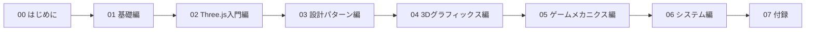

---
tags:
  - MOC
  - 入門
  - 目次
created: 2025-11-23
updated: 2025-11-23
---
# 入門レベル - 目次

![[unnamed.png]]

> [!abstract] 概要
> このドキュメントは、**フェルトうさぎパラディン**（3Dゲーム）のソースコードを通じて、プログラミングを実践的に学ぶための入門書です。

---

## 学習ロードマップ



---

## このプロジェクトで学べるパラダイム

| パラダイム | 説明 | 主な章 |
|-----------|------|--------|
| **オブジェクト指向（OOP）** | クラス、継承、ポリモーフィズム | 03, 04, 05 |
| **関数型（FP）** | filter/map/forEach、高階関数 | 02, 03, 05 |
| **イベント駆動** | イベントリスナー、コールバック | 02, 06 |
| **ステートパターン** | 状態遷移、状態マシン | 05 |
| **コンポーネントベース** | 責務分割、疎結合 | 03 |
| **データ駆動** | 設定オブジェクト、マッピング | 02 |

---

## セクション一覧

| セクション | 内容 | 章数 | 状態 |
|-----------|------|------|------|
| [[00_はじめに/_MOC_はじめに\|00 はじめに]] | 環境構築、学習の進め方 | 4 | 🟢 |
| [[01_基礎編/_MOC_基礎編\|01 基礎編]] | HTML、npm、ES Modules | 3 | 🟢 |
| [[02_Three.js入門編/_MOC_Three.js入門編\|02 Three.js入門編]] | シーン、カメラ、入力システム | 2 | 🟢 |
| [[03_設計パターン編/_MOC_設計パターン編\|03 設計パターン編]] | OOP、関数型、コンポーネント | 3 | 🟢 |
| [[04_3Dグラフィックス編/_MOC_3Dグラフィックス編\|04 3Dグラフィックス編]] | メッシュ、マテリアル構築 | 1 | 🟢 |
| [[05_ゲームメカニクス編/_MOC_ゲームメカニクス編\|05 ゲームメカニクス編]] | 物理演算、戦闘、AI | 3 | 🟢 |
| [[06_システム編/_MOC_システム編\|06 システム編]] | ビルド、セーブ、音声 | 3 | 🟢 |
| [[07_付録/_MOC_付録\|07 付録]] | リファレンス、用語集 | 5 | 🟢 |

---

## パラダイム別学習パス

興味のあるパラダイムに集中して学ぶこともできます。

### オブジェクト指向を深く学びたい

```
Entity.js → Player.js → Slime.js → SaveManager.js
```

### 関数型プログラミングを学びたい

```
Game.js → EntityManager.js → PlayerPhysics.js
```

### ステートパターンを学びたい

```
PlayerCombat.js → Slime.js
```

### イベント駆動を学びたい

```
Input.js → BuildSystem.js → SaveLoadUI.js
```

---

## 進捗状況

| アイコン | 意味 |
|----------|------|
| 🔴 | 未着手 |
| 🟡 | 執筆中 |
| 🟢 | 完了 |
| 🔵 | レビュー中 |

---

## クイックリンク

### よく参照するページ
- [[07_付録/03_用語集\|用語集]]
- [[07_付録/04_トラブルシューティング\|トラブルシューティング]]
- [[07_付録/01_JavaScript基礎リファレンス\|JavaScript基礎]]
- [[07_付録/05_パラダイム早見表\|パラダイム早見表]]

### プロジェクト管理
- [[Plans/タスク管理\|タスク管理]]
- [[Plans/入門ドキュメント計画\|計画書]]
- [[Plans/フォルダ構成計画\|フォルダ構成]]

---

## 対象読者

> [!info] このドキュメントの対象者
> - プログラミングを始めたばかりの方
> - JavaScriptを学びたい方
> - 3Dゲーム開発に興味がある方
> - Three.jsを学びたい方
> - 設計パターンを実践的に学びたい方

---

## 学習の進め方

1. **00_はじめに** で開発環境を整える
2. **01_基礎編** でプロジェクトの構造を理解する
3. **02_Three.js入門編** 以降で、コードを読みながら実践的に学ぶ
4. わからない用語は **07_付録/用語集** を参照
5. パラダイムの全体像は **07_付録/パラダイム早見表** を参照
6. 実際にコードを変更して、動作を確認する

> [!tip] ヒント
> 各章には「実験してみよう」セクションがあります。実際に値を変えて動作を確認することで、理解が深まります。

---

## ソースコードの場所

```
プロジェクトルート/
└── src/           ← メインソースコード
    ├── main.js
    ├── Game.js
    ├── Player.js
    └── ...
```

---

## 更新履歴

| 日付 | 内容 |
|------|------|
| 2025-11-23 | 初版作成 |
| 2025-11-23 | 改訂: マルチパラダイム対応、設計パターン編に名称変更 |
