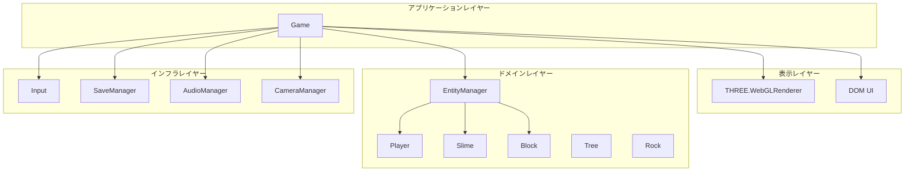
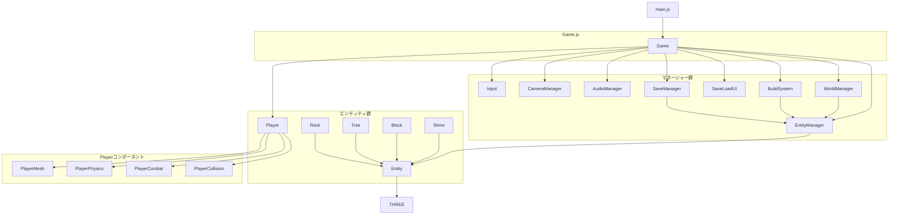
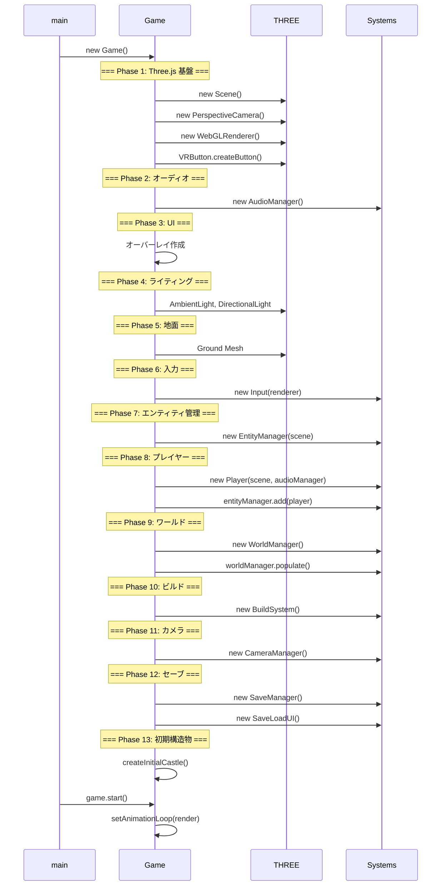
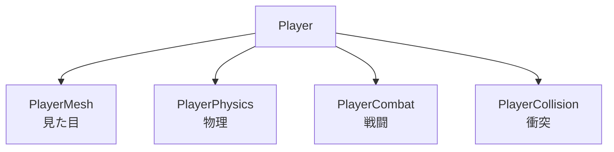
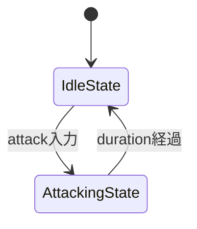
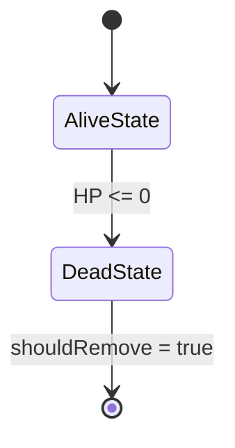
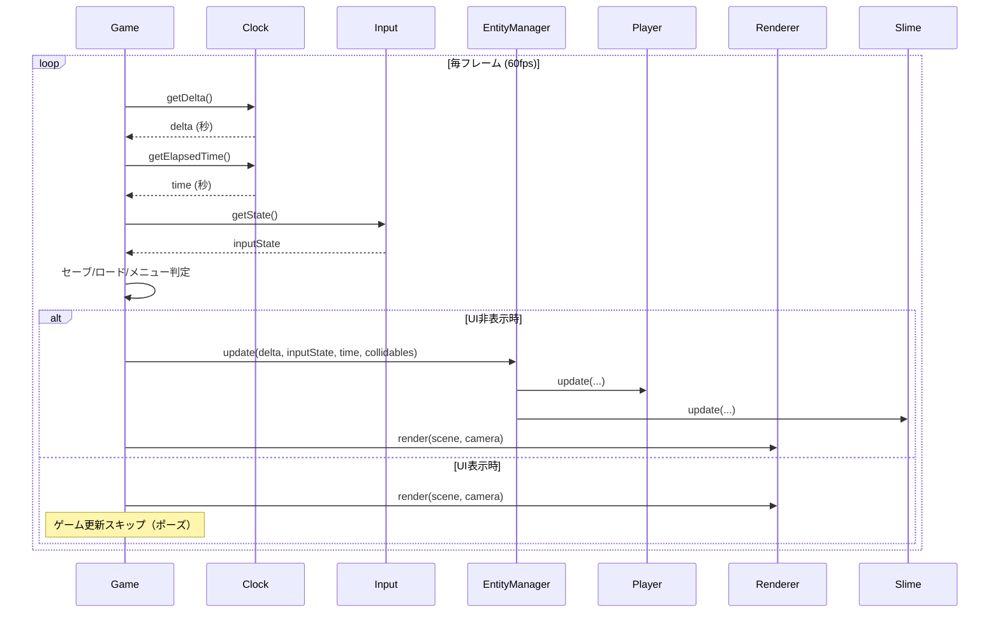
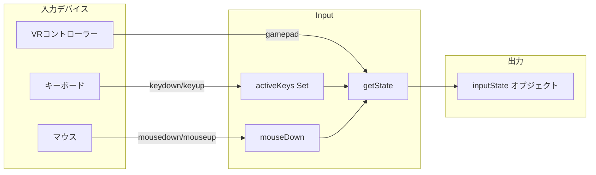
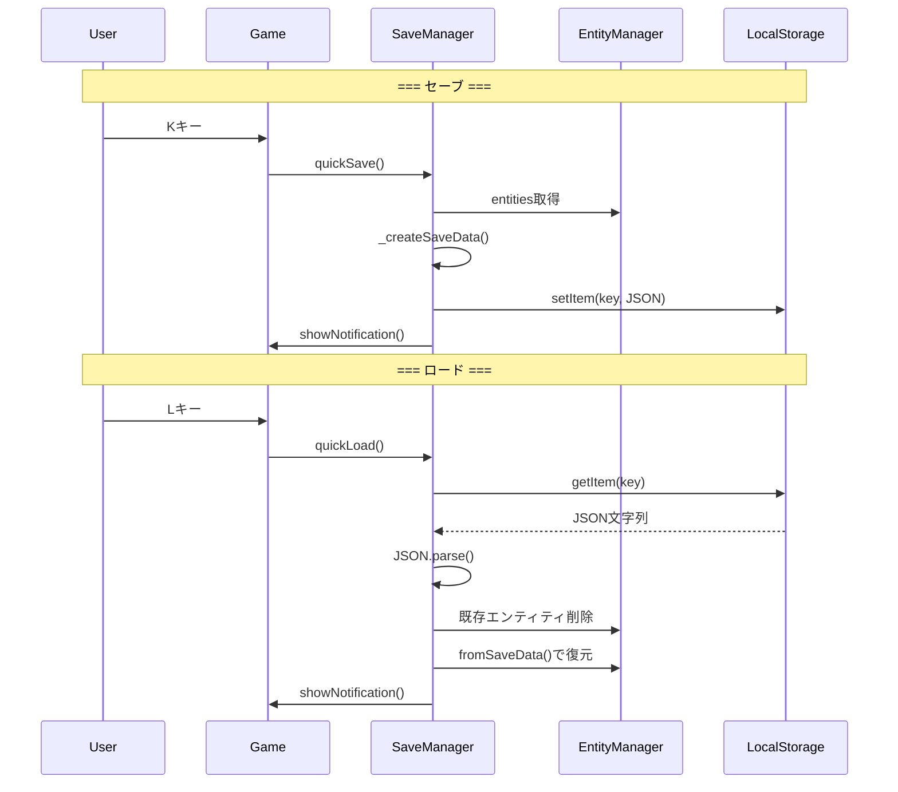

# 02. アーキテクチャ設計

> [!abstract] 概要
> 本ドキュメントはシステム全体の構造、クラス間の依存関係、採用している設計パターンを定義します。どこから実装を始めるか、どの順序で構築するかの指針となります。

---

## レイヤードアーキテクチャ

本システムは4層のレイヤードアーキテクチャを採用しています。



### レイヤー定義

| レイヤー | 責務 | 含まれるクラス |
|---------|------|--------------|
| **表示** | 画面描画、DOM操作 | THREE.WebGLRenderer, SaveLoadUI |
| **アプリケーション** | ゲーム全体の制御、メインループ | Game |
| **ドメイン** | ゲームロジック、エンティティ | Entity, Player, Slime, Block, Tree, Rock, EntityManager |
| **インフラ** | 入出力、永続化、音声 | Input, SaveManager, AudioManager, CameraManager |

### 依存ルール

```
上位レイヤー → 下位レイヤー（OK）
下位レイヤー → 上位レイヤー（NG）
```

---

## クラス依存関係図

### 全体図



### import 関係詳細

| ファイル | import元 |
|---------|---------|
| main.js | Game |
| Game.js | THREE, VRButton, Player, Input, EntityManager, AudioManager, CameraManager, WorldManager, BuildSystem, SaveManager, SaveLoadUI, Block |
| Player.js | THREE, PlayerMesh, PlayerPhysics, PlayerCombat, PlayerCollision |
| Slime.js | THREE, Entity |
| Block.js | THREE, Entity |
| Tree.js | THREE, Entity |
| Rock.js | THREE, Entity |
| EntityManager.js | THREE |
| Input.js | （なし） |
| CameraManager.js | THREE |
| AudioManager.js | （なし） |
| SaveManager.js | Block, Slime |
| SaveLoadUI.js | （なし） |
| WorldManager.js | Tree, Rock, Slime |
| BuildSystem.js | THREE, Block |

---

## 初期化順序

Game コンストラクタでの初期化順序は以下の通りです。**この順序は依存関係により厳密に決まっています。**



### 初期化順序表

| 順序 | 対象 | 依存先 | 理由 |
|-----|------|-------|------|
| 1 | Scene | - | 全ての3Dオブジェクトの親 |
| 2 | Camera | - | レンダリングに必要 |
| 3 | Renderer | - | WebGL描画エンジン |
| 4 | AudioManager | - | Player が参照 |
| 5 | Overlay | - | ユーザーインタラクション待ち |
| 6 | Lights | Scene | Scene に追加 |
| 7 | Ground | Scene | Scene に追加 |
| 8 | Input | Renderer | VR入力で renderer.xr を参照 |
| 9 | EntityManager | Scene | メッシュを Scene に追加 |
| 10 | Player | Scene, AudioManager | 両方を参照 |
| 11 | WorldManager | EntityManager | エンティティを追加 |
| 12 | BuildSystem | Scene, Camera, EntityManager | 全てを参照 |
| 13 | CameraManager | Camera, Player, Renderer | 全てを参照 |
| 14 | SaveManager | Game (this) | Game 全体を参照 |
| 15 | SaveLoadUI | Game, SaveManager | 両方を参照 |

---

## 設計パターン一覧

### 採用パターン

| パターン | 適用箇所 | 目的 |
|---------|---------|------|
| **コンポーネント** | Player | 機能分離（Mesh, Physics, Combat, Collision） |
| **ステート** | PlayerCombat, Slime | 状態ごとの振る舞いカプセル化 |
| **マネージャー** | EntityManager, AudioManager, SaveManager, CameraManager | リソースの一元管理 |
| **ファクトリメソッド** | Block.fromSaveData(), Slime.fromSaveData() | セーブデータからの復元 |
| **テンプレートメソッド** | Entity.update(), Entity.isSaveable() | 基底クラスでインターフェース定義 |
| **オブザーバー（簡易）** | addEventListener | イベント駆動 |
| **データ駆動** | Input.keyMap | キー設定をデータで定義 |

### パターン適用図

#### コンポーネントパターン（Player）



#### ステートパターン（PlayerCombat）



#### ステートパターン（Slime）



---

## データフロー

### ゲームループ内のデータフロー



### 入力データフロー



### セーブ/ロードデータフロー



---

## ファイル責務一覧

| ファイル | 責務 | 依存度 |
|---------|------|--------|
| **main.js** | エントリーポイント | 最小 |
| **Game.js** | 全体統合、メインループ | 最大 |
| **Entity.js** | エンティティ基底定義 | 最小 |
| **EntityManager.js** | エンティティ管理 | 小 |
| **Player.js** | プレイヤー統合 | 中 |
| **PlayerMesh.js** | 3Dモデル生成 | 小 |
| **PlayerPhysics.js** | 物理演算 | 小 |
| **PlayerCombat.js** | 戦闘ロジック | 小 |
| **PlayerCollision.js** | 衝突判定 | 小 |
| **Slime.js** | 敵AI、ステート管理 | 小 |
| **Block.js** | ブロックエンティティ | 小 |
| **Tree.js** | 木オブジェクト | 小 |
| **Rock.js** | 岩オブジェクト | 小 |
| **Input.js** | 入力統合 | 小 |
| **CameraManager.js** | カメラ制御 | 小 |
| **WorldManager.js** | ワールド生成 | 小 |
| **BuildSystem.js** | 建築機能 | 中 |
| **SaveManager.js** | 永続化 | 中 |
| **SaveLoadUI.js** | セーブUI | 小 |
| **AudioManager.js** | 音声生成 | 最小 |

---

## 拡張ポイント

### 新しいエンティティを追加する場合

1. `Entity` を継承した新クラスを作成
2. `update()` をオーバーライド
3. `isSaveable()` で `true` を返す（保存対象の場合）
4. `toSaveData()` でシリアライズ
5. `static fromSaveData()` でデシリアライズ
6. `SaveManager._restoreSaveData()` に復元処理を追加
7. `WorldManager` または `BuildSystem` で生成

### 新しい入力アクションを追加する場合

1. `Input.keyMap` にキーマッピング追加
2. `Input.getState()` の戻り値に追加
3. `Game.render()` または各システムで処理

### 新しいシステムを追加する場合

1. 新クラスファイルを作成
2. `Game` コンストラクタで初期化
3. 必要に応じて `Game.render()` から `update()` 呼び出し

---

## 関連ドキュメント

- [[01_プロジェクト概要|前: プロジェクト概要]]
- [[03_クラス設計|次: クラス設計]]
- [[_MOC_設計書|設計書目次]]

---

## 更新履歴

| 日付 | 内容 |
|------|------|
| 2025-11-23 | 初版作成 |
