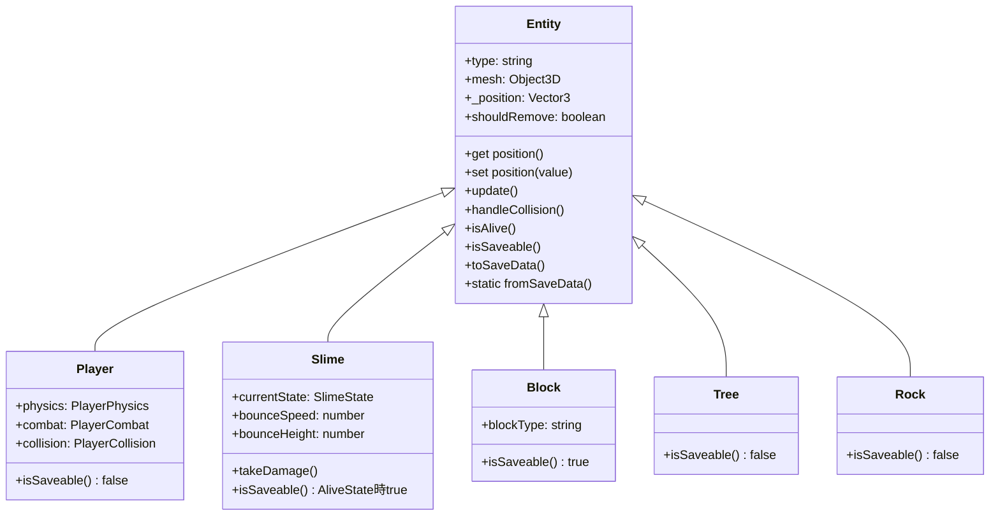
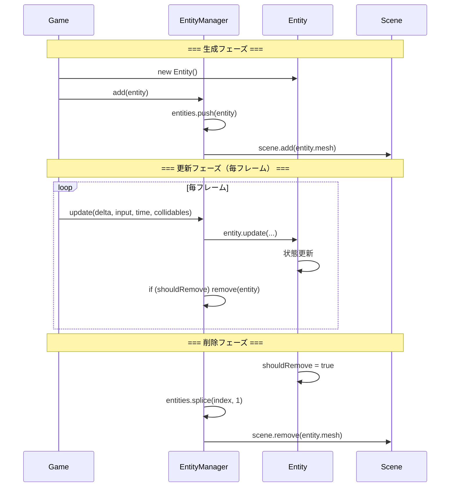
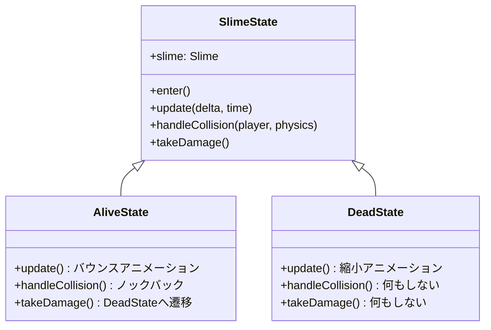
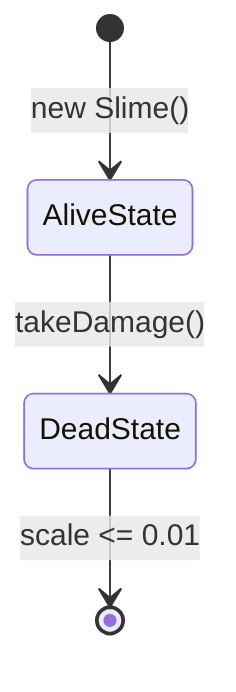

# 04. エンティティシステム設計

> [!abstract] 概要
> 本ドキュメントはEntityの継承関係、ライフサイクル、多態的な振る舞いを定義します。

---

## Entity継承ツリー



---

## Entity基底クラス詳細

### プロパティ初期値

| プロパティ | 型 | 初期値 |
|-----------|-----|--------|
| type | string | `'Entity'` |
| mesh | Object3D \| null | `null` |
| _position | THREE.Vector3 | `new THREE.Vector3()` |
| shouldRemove | boolean | `false` |

### positionアクセサ

```javascript
get position() {
    return this._position;
}

set position(value) {
    this._position.copy(value);
    if (this.mesh) {
        this.mesh.position.copy(value);
    }
}
```

**設計意図**: positionを設定するとmeshの位置も自動同期される

---

## エンティティライフサイクル



---

## 削除フラグパターン

### shouldRemoveの使い方

```javascript
// 1. エンティティ側で削除フラグを立てる
class Slime extends Entity {
    takeDamage() {
        // HPが0になったら
        this.shouldRemove = true;
    }
}

// 2. EntityManagerが削除を実行
class EntityManager {
    update(delta, input, time, collidables) {
        for (const entity of this.entities) {
            entity.update(delta, input, time, collidables, this.entities);

            // 削除フラグチェック
            if (entity.shouldRemove) {
                this.remove(entity);
            }
        }
    }
}
```

**設計意図**: ループ中に即座に削除すると配列の整合性が崩れる。フラグを立てて後処理で削除。

---

## 多態的セーブ/ロード

### インターフェース定義

| メソッド | 戻り値 | 用途 |
|---------|--------|------|
| `isSaveable()` | boolean | セーブ対象かどうか |
| `toSaveData()` | object | シリアライズ |
| `static fromSaveData(data)` | Entity | デシリアライズ |

### 各クラスの実装

#### Player

```javascript
isSaveable() {
    return false; // SaveManagerで別途保存
}
```

#### Slime

```javascript
isSaveable() {
    return this.currentState instanceof AliveState; // 生存時のみ
}

toSaveData() {
    return {
        type: 'slime',
        x: this.position.x,
        z: this.position.z
    };
}

static fromSaveData(data) {
    return new Slime(data.x, data.z);
}
```

#### Block

```javascript
isSaveable() {
    return true; // 常にセーブ対象
}

toSaveData() {
    return {
        type: 'block',
        x: this.mesh.position.x,
        y: this.mesh.position.y,
        z: this.mesh.position.z,
        blockType: this.blockType
    };
}

static fromSaveData(data) {
    return new Block(data.x, data.y, data.z, data.blockType);
}
```

#### Tree / Rock

```javascript
isSaveable() {
    return false; // ワールド生成で自動配置
}
```

---

## Slimeのステートパターン

### 状態クラス



### 状態遷移図



### AliveState動作

| 処理 | 詳細 |
|------|------|
| バウンス | `Math.sin((time + timeOffset) * bounceSpeed)` |
| Y座標 | `originalY + heightFactor * bounceHeight` |
| スケール | Y: 0.8 + bounce * 0.1, XZ: 1.0 - bounce * 0.05 |
| 衝突 | 距離 < 0.8 でノックバック |

### DeadState動作

| 処理 | 詳細 |
|------|------|
| 縮小 | `scale.subScalar(2.0 * delta)` |
| 削除 | `scale.y <= 0.01` で `shouldRemove = true` |

---

## EntityManagerの処理フロー

### add(entity)

```
1. entities配列に追加
2. entity.meshが存在すればscene.add()
```

### remove(entity)

```
1. indexOf()で配列内位置を検索
2. 見つかればsplice()で削除
3. entity.meshが存在すればscene.remove()
```

### update(delta, input, time, collidables)

```
for each entity:
    1. entity.update() があれば呼び出し
    2. entity.shouldRemove なら remove()
```

---

## mesh.userData.entity パターン

### 目的

レイキャストでメッシュがヒットした時、対応するエンティティを取得する。

### 実装

```javascript
// エンティティ作成時
this.mesh.userData.entity = this;

// レイキャスト結果から取得
const hit = raycaster.intersectObjects(objects)[0];
const entity = hit.object.userData.entity;
if (entity && entity.type === 'Block') {
    // ブロック削除処理
}
```

---

## 関連ドキュメント

- [[03_クラス設計|前: クラス設計]]
- [[05_プレイヤーシステム設計|次: プレイヤーシステム設計]]
- [[_MOC_設計書|設計書目次]]

---

## 更新履歴

| 日付 | 内容 |
|------|------|
| 2025-11-23 | 初版作成 |
