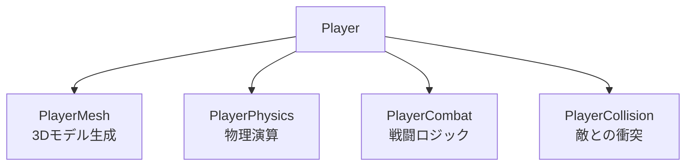
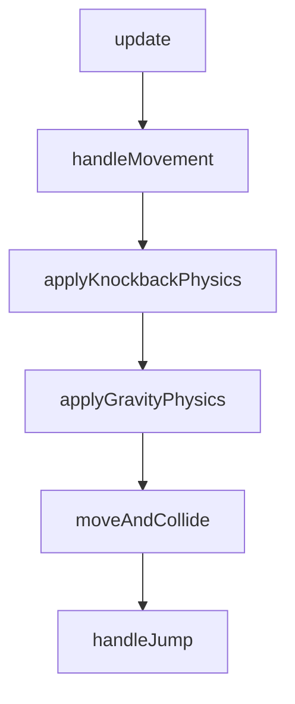
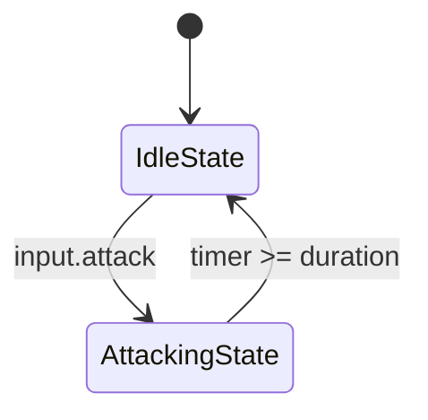

# 05. プレイヤーシステム設計

> [!abstract] 概要
> 本ドキュメントはプレイヤーのコンポーネント構成、物理演算、戦闘システム、衝突判定を定義します。

---

## コンポーネント構成



### Player.update() の処理順序

```javascript
update(delta, input, time, collidables, entities) {
    // 1. 緊急リセット（Rキー）
    if (input.reset) {
        this.position.set(0, 0.5, 0);
        this.physics.reset();
        this.mesh.rotation.y = 0;
    }

    // 2. 回転処理
    const rotationSpeed = 3.0;
    const rotationDir = (input.rotateLeft ? 1 : 0) - (input.rotateRight ? 1 : 0);
    this.mesh.rotation.y += rotationDir * rotationSpeed * delta;

    // 3. 物理演算
    this.physics.update(delta, input, collidables);

    // 4. メッシュ同期
    this.mesh.position.copy(this.position);

    // 5. 戦闘更新
    this.combat.update(delta, input, entities);

    // 6. 敵との衝突チェック
    this.checkCollisions(entities);
}
```

---

## PlayerPhysics

### 定数値

| 定数 | 値 | 単位 | 説明 |
|------|-----|------|------|
| gravity | -30.0 | m/s² | 重力加速度 |
| jumpStrength | 15.0 | m/s | ジャンプ初速 |
| speed | 10.0 | m/s | 移動速度 |
| playerRadius | 0.3 | m | 衝突判定半径 |
| playerHeight | 1.0 | m | 衝突判定高さ |
| stepHeight | 0.1 | m | 段差許容高さ |
| knockbackFriction | 0.9 | - | ノックバック減衰 |

### 更新処理フロー



### handleMovement

```javascript
// 1. プレイヤーの向きベクトルを計算
const forward = new THREE.Vector3(0, 0, -1)
    .applyAxisAngle(new THREE.Vector3(0, 1, 0), this.player.mesh.rotation.y);
const right = new THREE.Vector3(1, 0, 0)
    .applyAxisAngle(new THREE.Vector3(0, 1, 0), this.player.mesh.rotation.y);

// 2. 入力に基づく移動ベクトル
const moveVector = new THREE.Vector3()
    .addScaledVector(forward, -input.z)  // W=-1, S=+1
    .addScaledVector(right, input.x);    // A=-1, D=+1

// 3. 正規化して速度適用
const lengthSq = moveVector.lengthSq();
const scale = lengthSq > 0 ? this.speed / Math.sqrt(lengthSq) : 0;
this.velocity.x = moveVector.x * scale;
this.velocity.z = moveVector.z * scale;
```

### AABB衝突判定

```javascript
checkCollisions(collidables, radius, height) {
    // プレイヤーのバウンディングボックス
    const playerBox = new THREE.Box3();
    playerBox.min.set(center.x - radius, center.y, center.z - radius);
    playerBox.max.set(center.x + radius, center.y + height * 1.7, center.z + radius);

    // 各collidableとの交差判定
    return collidables.filter(obj => {
        const blockBox = new THREE.Box3();
        blockBox.min.set(pos.x - 0.5, pos.y - 0.5, pos.z - 0.5);
        blockBox.max.set(pos.x + 0.5, pos.y + 0.5, pos.z + 0.5);
        return playerBox.intersectsBox(blockBox);
    });
}
```

### 着地判定

```javascript
// 落下中かつ以前はブロックより上にいた場合
const isFalling = this.velocity.y < 0;
const wasAbove = previousY >= block.position.y + 0.5;

if (isFalling && wasAbove) {
    this.player.position.y = block.position.y + 0.5;
    this.velocity.y = 0;
    this.onGround = true;
}
```

### applyKnockback

```javascript
applyKnockback(direction, strength) {
    this.knockbackVelocity.copy(direction).multiplyScalar(strength);
    this.velocity.y = 5.0;  // 上方向に飛ばす
    this.onGround = false;
}
```

---

## PlayerCombat

### ステートパターン



### 定数値

| 定数 | 値 | 説明 |
|------|-----|------|
| baseSwordRotation | Math.PI / 4 | 剣の基本角度（45度） |
| attackDuration | 0.4 | 攻撃持続時間（秒） |
| attackRange | 2.0 | 攻撃判定範囲（m） |
| hitWindowStart | 0.2 | ヒット判定開始（進捗率） |
| hitWindowEnd | 0.6 | ヒット判定終了（進捗率） |

### AttackingState

```javascript
class AttackingState extends CombatState {
    constructor(combatSystem) {
        super(combatSystem);
        this.timer = 0;
        this.duration = 0.4;
    }

    enter() {
        // 攻撃音再生
        this.combat.player.audioManager.playAttack();
    }

    update(delta, input, entities) {
        this.timer += delta;
        const progress = this.timer / this.duration;

        // 三角波による剣のアニメーション
        const triangleWave = 1 - Math.abs(progress * 2 - 1);
        this.combat.sword.rotation.x =
            this.combat.baseSwordRotation + triangleWave * (Math.PI / 2);

        // ヒット判定ウィンドウ（20%〜60%）
        if (progress > 0.2 && progress < 0.6) {
            this.combat.checkAttackCollision(entities);
        }

        // 攻撃終了
        if (this.timer >= this.duration) {
            this.combat.setState(new IdleState(this.combat));
        }
    }

    exit() {
        // 剣を元の角度に戻す
        this.combat.sword.rotation.x = this.combat.baseSwordRotation;
    }
}
```

### 攻撃判定アルゴリズム

```javascript
checkAttackCollision(entities) {
    const attackRange = 2.0;

    // プレイヤー前方の攻撃位置を計算
    const forward = new THREE.Vector3(0, 0, -1)
        .applyAxisAngle(new THREE.Vector3(0, 1, 0), this.player.mesh.rotation.y);
    const attackPos = this.player.position.clone()
        .add(forward.multiplyScalar(1.0));

    // ダメージ可能なエンティティをフィルタ
    entities
        .filter(e => e.takeDamage && e.position.distanceTo(attackPos) < attackRange)
        .forEach(e => {
            e.takeDamage();
            this.player.audioManager.playEnemyDeath();
        });
}
```

---

## PlayerCollision

### 敵との衝突チェック

```javascript
checkCollisions(entities, physics) {
    entities
        .filter(e => e.handleCollision)
        .forEach(e => e.handleCollision(this.player, physics));
}
```

### Slime衝突時の処理（AliveState）

```javascript
handleCollision(player, physics) {
    const collisionRange = 0.8;
    const dist = player.position.distanceTo(this.slime.mesh.position);

    if (dist < collisionRange) {
        // ノックバック方向を計算
        const knockbackDir = player.position.clone()
            .sub(this.slime.mesh.position).normalize();

        // ノックバック適用
        physics.applyKnockback(knockbackDir, 15.0);

        // 被弾音
        player.audioManager.playHit();
    }
}
```

---

## 剣の取得方法

```javascript
// PlayerMeshで剣を作成時に名前を設定
sword.name = 'sword';
rightArm.add(sword);

// PlayerCombatで取得
this.sword = this.player.mesh.getObjectByName('sword');
```

---

## 関連ドキュメント

- [[04_エンティティシステム設計|前: エンティティシステム設計]]
- [[06_ゲームループ・入力設計|次: ゲームループ・入力設計]]
- [[_MOC_設計書|設計書目次]]

---

## 更新履歴

| 日付 | 内容 |
|------|------|
| 2025-11-23 | 初版作成 |
