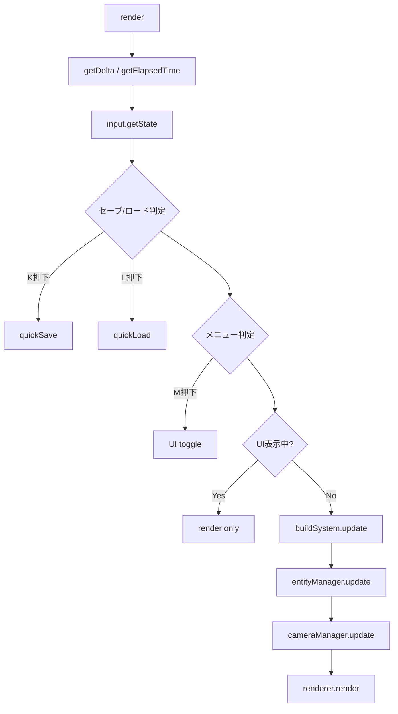
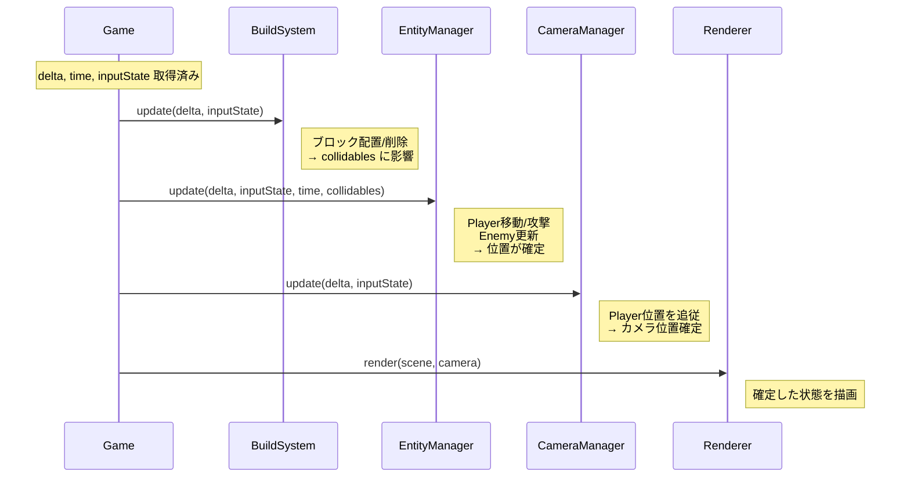
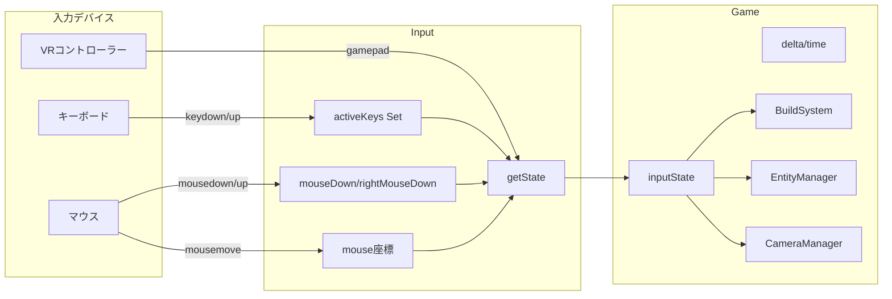

# 06. ゲームループ・入力設計

> [!abstract] 概要
> 本ドキュメントはメインゲームループの処理順序、入力システムのキーマッピング、VR対応を定義します。

---

## ゲームループ概要

### setAnimationLoop

```javascript
// Game.start()
this.renderer.setAnimationLoop(this.render.bind(this));
```

Three.jsの`setAnimationLoop`を使用。VR対応のため`requestAnimationFrame`ではなくこちらを使用。

### render() 処理順序



### 詳細フロー

```javascript
render() {
    try {
        // 1. 時間取得
        const delta = this.clock.getDelta();      // 前フレームからの経過秒数
        const time = this.clock.getElapsedTime(); // ゲーム開始からの累計秒数

        // 2. 入力状態取得
        const inputState = this.input.getState();

        // 3. クイックセーブ（Kキー、1秒クールダウン）
        if (inputState.save && time - this.lastSaveTime > 1.0) {
            this.saveManager.quickSave();
            this.lastSaveTime = time;
        }

        // 4. クイックロード（Lキー、1秒クールダウン）
        if (inputState.load && time - this.lastLoadTime > 1.0) {
            this.saveManager.quickLoad();
            this.lastLoadTime = time;
        }

        // 5. メニュートグル（Mキー、0.5秒クールダウン）
        if (inputState.menu && time - this.lastMenuTime > 0.5) {
            if (this.saveLoadUI.isVisible) {
                this.saveLoadUI.hide();
            } else {
                this.saveLoadUI.show();
            }
            this.lastMenuTime = time;
        }

        // 6. ポーズ判定
        if (this.saveLoadUI.isVisible) {
            this.renderer.render(this.scene, this.camera);
            return; // ゲーム更新をスキップ
        }

        // 7. システム更新
        this.buildSystem.update(delta, inputState);
        this.entityManager.update(delta, inputState, time, this.collidables);
        this.cameraManager.update(delta, inputState);

        // 8. 描画
        this.renderer.render(this.scene, this.camera);

    } catch (e) {
        console.error("Game Loop Error:", e);
        this.renderer.setAnimationLoop(null); // ループ停止
        alert("Game Crashed: " + e.message);
    }
}
```

---

## クールダウン機構

### 目的

キー押下の連続検出を防ぐためのクールダウンタイマー。

### 実装

| アクション | クールダウン | 変数 |
|-----------|------------|------|
| クイックセーブ | 1.0秒 | `lastSaveTime` |
| クイックロード | 1.0秒 | `lastLoadTime` |
| メニュートグル | 0.5秒 | `lastMenuTime` |

```javascript
// 判定式
if (inputState.action && time - this.lastActionTime > cooldown) {
    // 処理実行
    this.lastActionTime = time;
}
```

---

## 更新順序の依存関係



**更新順序の重要性**:

1. **BuildSystem → EntityManager**: ブロック配置で collidables が変化 → Player物理に影響
2. **EntityManager → CameraManager**: Player位置確定 → カメラが追従
3. **全システム → Renderer**: 全ての状態確定後に描画

---

## Input クラス

### プロパティ

| プロパティ | 型 | 初期値 | 説明 |
|-----------|-----|--------|------|
| renderer | WebGLRenderer | - | VR入力取得用 |
| activeKeys | Set\<string\> | `new Set()` | 押下中のアクション |
| mouseDown | boolean | `false` | 左クリック状態 |
| rightMouseDown | boolean | `false` | 右クリック状態 |
| mouse | {x, y} | `{x: 0, y: 0}` | 正規化マウス座標 |

### keyMap（データ駆動設計）

```javascript
this.keyMap = {
    // 移動
    'w': 'forward',         'arrowup': 'forward',    'up': 'forward',
    's': 'backward',        'arrowdown': 'backward', 'down': 'backward',
    'a': 'rotateLeft',      'arrowleft': 'rotateLeft', 'left': 'rotateLeft',
    'd': 'rotateRight',     'arrowright': 'rotateRight', 'right': 'rotateRight',

    // アクション
    ' ': 'jump',            // スペースキー
    'f': 'attack',

    // システム
    'b': 'toggleBuildMode',
    'v': 'toggleView',
    'k': 'save',
    'l': 'load',
    'm': 'menu'
};
```

### キーマッピング表

| キー | アクション | 用途 |
|------|-----------|------|
| W / ↑ | forward | 前進 |
| S / ↓ | backward | 後退 |
| A / ← | rotateLeft | 左回転 |
| D / → | rotateRight | 右回転 |
| Space | jump | ジャンプ |
| F | attack | 攻撃 |
| B | toggleBuildMode | 建築モード切替 |
| V | toggleView | FPS/TPS切替 |
| K | save | クイックセーブ |
| L | load | クイックロード |
| M | menu | データメニュー |
| 左クリック | attack, placeBlock | 攻撃/ブロック配置 |
| 右クリック | removeBlock | ブロック削除 |

---

## イベントリスナー

### キーボード

```javascript
// keydown
window.addEventListener('keydown', (e) => {
    const key = e.key.toLowerCase();
    if (this.keyMap[key]) {
        this.activeKeys.add(this.keyMap[key]);
    }
    // スクロール防止
    if ([' ', 'arrowup', 'arrowdown', 'arrowleft', 'arrowright'].includes(key)) {
        e.preventDefault();
    }
});

// keyup
window.addEventListener('keyup', (e) => {
    const key = e.key.toLowerCase();
    if (this.keyMap[key]) {
        this.activeKeys.delete(this.keyMap[key]);
    }
});
```

### マウス

```javascript
// mousedown
window.addEventListener('mousedown', (e) => {
    if (e.button === 0) this.mouseDown = true;      // 左
    if (e.button === 2) this.rightMouseDown = true; // 右
});

// mouseup
window.addEventListener('mouseup', (e) => {
    if (e.button === 0) this.mouseDown = false;
    if (e.button === 2) this.rightMouseDown = false;
});

// mousemove
window.addEventListener('mousemove', (e) => {
    // 正規化座標（-1 〜 +1）
    this.mouse.x = (e.clientX / window.innerWidth) * 2 - 1;
    this.mouse.y = -(e.clientY / window.innerHeight) * 2 + 1;
});

// コンテキストメニュー無効化
window.addEventListener('contextmenu', e => e.preventDefault());
```

### マウス座標の正規化

```
画面左端: x = -1
画面右端: x = +1
画面上端: y = +1
画面下端: y = -1

式: x = (clientX / width) * 2 - 1
    y = -(clientY / height) * 2 + 1
```

---

## getState() 戻り値

### inputState オブジェクト構造

```javascript
{
    // 移動（-1, 0, +1）
    x: number,              // 左右（VRのみ）
    z: number,              // 前後（W=-1, S=+1）

    // 回転（boolean）
    rotateLeft: boolean,    // A/← 押下中
    rotateRight: boolean,   // D/→ 押下中

    // アクション（boolean）
    jump: boolean,          // Space 押下中
    attack: boolean,        // F/左クリック

    // システム（boolean）
    toggleBuildMode: boolean,
    toggleView: boolean,
    save: boolean,
    load: boolean,
    menu: boolean,

    // 建築（boolean）
    placeBlock: boolean,    // 左クリック
    removeBlock: boolean,   // 右クリック

    // マウス座標
    mouse: { x: number, y: number }
}
```

### 移動ベクトル計算

```javascript
// z軸: 前後
state.z += this.activeKeys.has('backward') ? 1 : 0;
state.z -= this.activeKeys.has('forward') ? 1 : 0;
// 結果: forward=-1, backward=+1, 両方または無入力=0
```

---

## VR入力対応

### handleVRInput(state)

```javascript
handleVRInput(state) {
    const session = this.renderer.xr.getSession();
    if (!session) return; // VRセッションがなければ何もしない

    for (const source of session.inputSources) {
        if (!source.gamepad) continue;

        // アナログスティック
        const axes = source.gamepad.axes;
        if (axes.length >= 4) {
            const deadzone = 0.1;
            if (Math.abs(axes[2]) > deadzone) state.x += axes[2];
            if (Math.abs(axes[3]) > deadzone) state.z += axes[3];
        }

        // ボタン
        const buttons = source.gamepad.buttons;
        if (buttons[0]?.pressed) state.attack = true; // トリガー
        if (buttons[1]?.pressed) state.jump = true;   // グリップ
    }
}
```

### VRコントローラーマッピング

| ボタン/軸 | インデックス | アクション |
|----------|-------------|-----------|
| トリガー | buttons[0] | attack |
| グリップ | buttons[1] | jump |
| スティックX | axes[2] | 左右移動 |
| スティックY | axes[3] | 前後移動 |
| デッドゾーン | 0.1 | 不感帯 |

---

## THREE.Clock

### 使用メソッド

| メソッド | 戻り値 | 用途 |
|---------|--------|------|
| `getDelta()` | float | 前フレームからの経過秒数 |
| `getElapsedTime()` | float | 開始からの累計秒数 |

### 初期化

```javascript
this.clock = new THREE.Clock();
```

`new Clock()` 時に自動でタイマー開始。

---

## ポーズ機能

### 実装

```javascript
if (this.saveLoadUI.isVisible) {
    this.renderer.render(this.scene, this.camera);
    return; // 更新処理をスキップ
}
```

### 効果

- UI表示中はゲームロジック停止
- 描画は継続（静止画ではない）
- Player/Enemy/物理 全て一時停止

---

## エラーハンドリング

### ゲームループのtry-catch

```javascript
try {
    // ゲームループ処理
} catch (e) {
    console.error("Game Loop Error:", e);
    this.renderer.setAnimationLoop(null); // ループ停止
    alert("Game Crashed: " + e.message);  // ユーザー通知
}
```

**目的**: 無限エラーログを防ぎ、ユーザーに異常を通知

---

## ウィンドウリサイズ

### イベント登録

```javascript
window.addEventListener('resize', this.onWindowResize.bind(this));
```

### onWindowResize()

```javascript
onWindowResize() {
    this.cameraManager.resize(window.innerWidth, window.innerHeight);
    this.renderer.setSize(window.innerWidth, window.innerHeight);
}
```

---

## スタートオーバーレイ

### 目的

AudioContext のユーザーインタラクション要件を満たす。

### 実装

```javascript
const overlay = document.createElement('div');
// スタイル設定...
overlay.innerHTML = 'Click to Start<br>...';
document.body.appendChild(overlay);

overlay.addEventListener('click', () => {
    overlay.style.display = 'none';
    this.audioManager.resumeContext();
    window.focus();
});
```

### バックアップ起動

```javascript
window.addEventListener('keydown', () => {
    this.audioManager.resumeContext();
}, { once: true });
```

---

## データフロー図



---

## 関連ドキュメント

- [[05_プレイヤーシステム設計|前: プレイヤーシステム設計]]
- [[07_セーブシステム設計|次: セーブシステム設計]]
- [[_MOC_設計書|設計書目次]]

---

## 更新履歴

| 日付 | 内容 |
|------|------|
| 2025-11-23 | 初版作成 |
