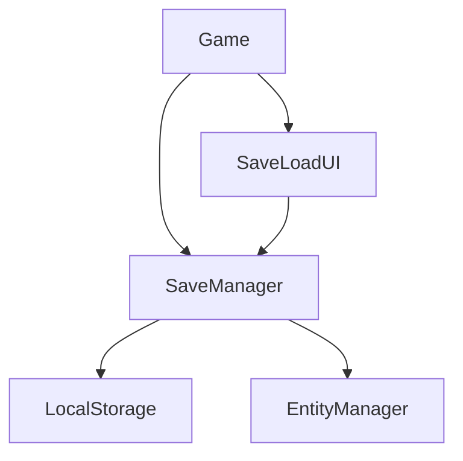
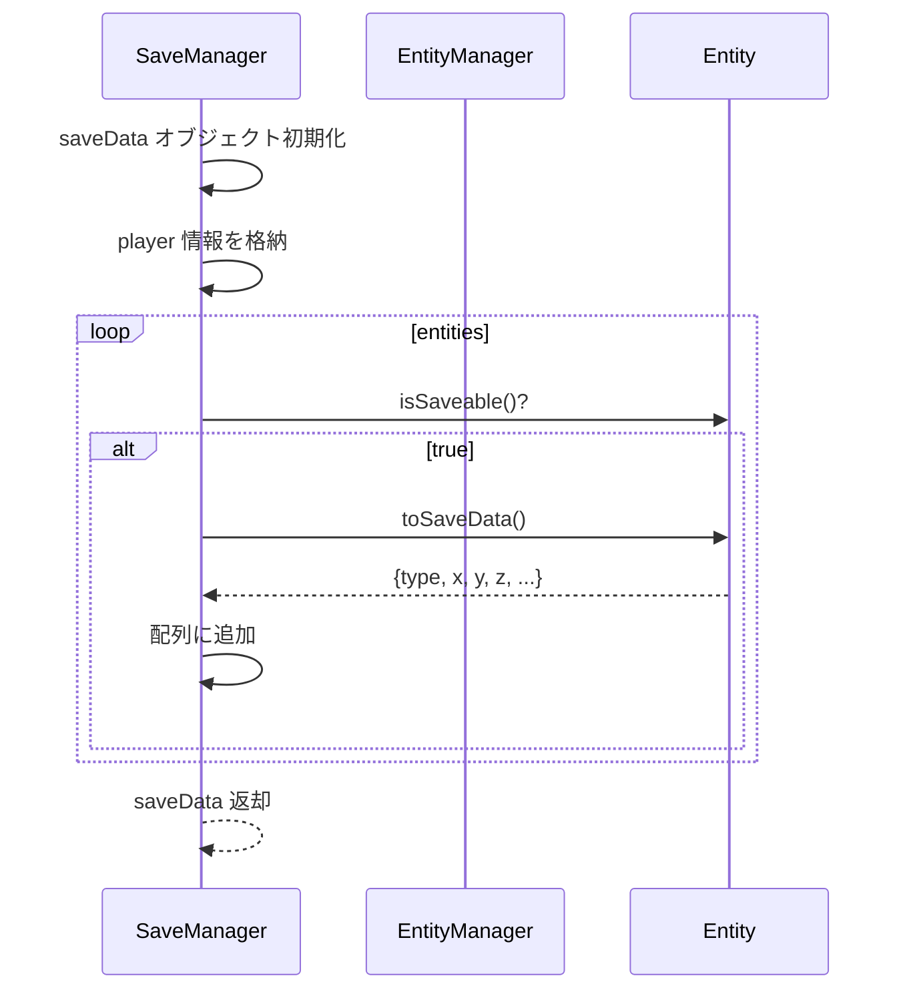
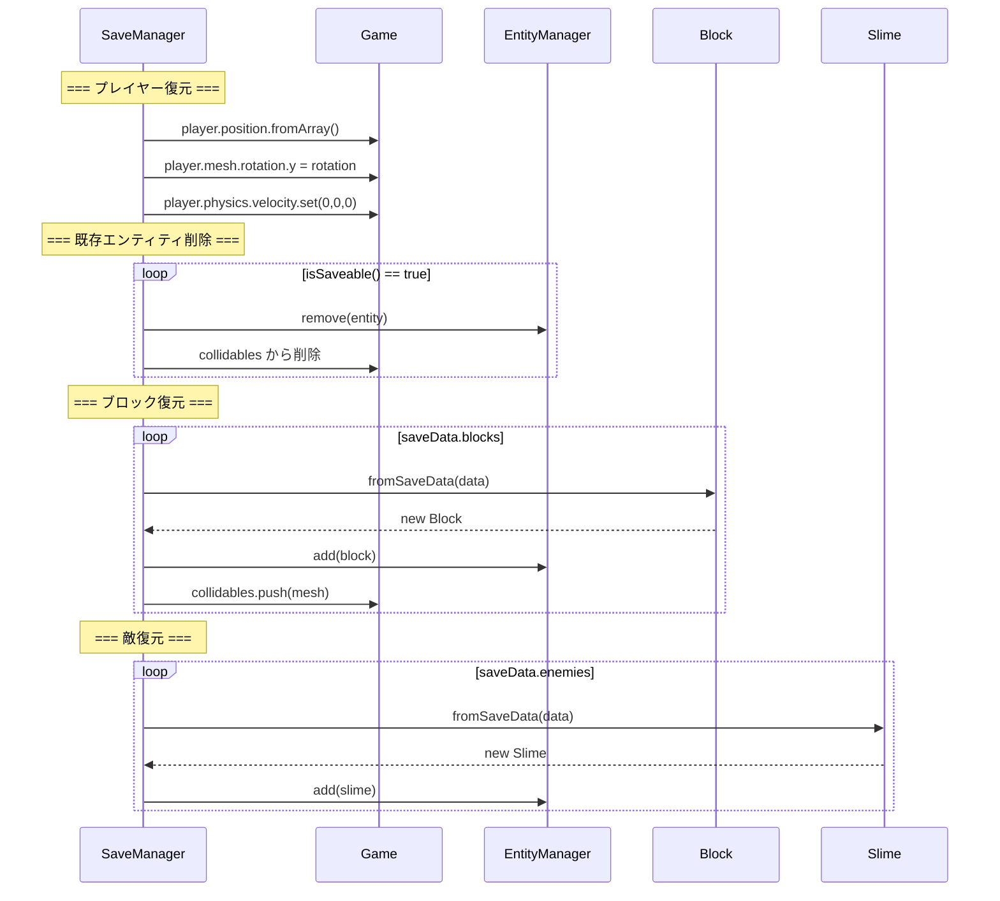
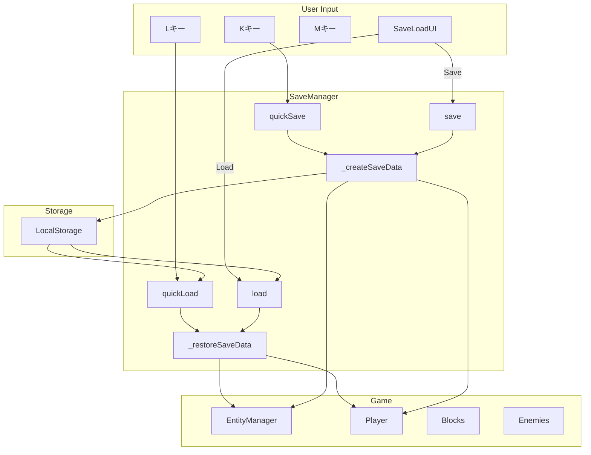

# 07. セーブシステム設計

> [!abstract] 概要
> 本ドキュメントはセーブデータの構造、永続化フロー、UIコンポーネントを定義します。

---

## システム概要

### 構成クラス



| クラス | 責務 |
|-------|------|
| SaveManager | データのシリアライズ/デシリアライズ、LocalStorage操作 |
| SaveLoadUI | セーブ/ロードのGUI |

### 機能一覧

| 機能 | キー | クールダウン | 説明 |
|------|-----|------------|------|
| クイックセーブ | K | 1.0秒 | 単一スロットに即座保存 |
| クイックロード | L | 1.0秒 | クイックセーブから復元 |
| データメニュー | M | 0.5秒 | 複数スロット管理UI |

---

## SaveManager クラス

### プロパティ

| プロパティ | 型 | 値 | 説明 |
|-----------|-----|-----|------|
| game | Game | - | ゲームインスタンス参照 |
| prefix | string | `'gemini_3d_save_'` | スロットセーブのキープレフィックス |
| quickKey | string | `'gemini_3d_quick_save'` | クイックセーブのキー |

### メソッド一覧

| メソッド | 戻り値 | 説明 |
|---------|--------|------|
| `_createSaveData(summary)` | object | セーブデータ生成 |
| `_restoreSaveData(saveData)` | void | セーブデータから復元 |
| `quickSave()` | void | クイックセーブ実行 |
| `quickLoad()` | void | クイックロード実行 |
| `getSlots()` | array | 全スロット情報取得 |
| `save(slotId)` | boolean | 指定スロットに保存 |
| `load(slotId)` | boolean | 指定スロットから読込 |
| `delete(slotId)` | void | 指定スロット削除 |

---

## セーブデータ構造

### JSON形式

```javascript
{
    "timestamp": 1700000000000,      // Date.now()
    "summary": "Player at 5, -10",   // 表示用サマリー

    "player": {
        "position": [x, y, z],       // Vector3.toArray()
        "rotation": 1.57             // mesh.rotation.y
    },

    "blocks": [
        {
            "type": "block",
            "x": 0, "y": 1, "z": 0,
            "blockType": "stone_dark"
        }
    ],

    "enemies": [
        {
            "type": "slime",
            "x": 5.5,
            "z": -3.2
        }
    ]
}
```

### フィールド詳細

| フィールド | 型 | 用途 |
|-----------|-----|------|
| timestamp | number | ソート用、表示用 |
| summary | string | UI表示用の説明 |
| player.position | number[3] | プレイヤー座標 |
| player.rotation | number | プレイヤーY軸回転 |
| blocks | array | 配置済みブロック |
| enemies | array | 生存中の敵 |

---

## セーブフロー

### _createSaveData(summary)



### 実装コード

```javascript
_createSaveData(summary) {
    const saveData = {
        timestamp: Date.now(),
        summary: summary,
        player: {
            position: this.game.player.position.toArray(),
            rotation: this.game.player.mesh.rotation.y
        },
        blocks: [],
        enemies: []
    };

    // 多態的セーブ
    this.game.entityManager.entities
        .filter(entity => typeof entity.isSaveable === 'function' && entity.isSaveable())
        .forEach(entity => {
            const data = entity.toSaveData();
            if (data.type === 'block') {
                saveData.blocks.push(data);
            } else if (data.type === 'slime') {
                saveData.enemies.push(data);
            }
        });

    return saveData;
}
```

---

## ロードフロー

### _restoreSaveData(saveData)



### 実装コード

```javascript
_restoreSaveData(saveData) {
    // 1. プレイヤー復元
    if (saveData.player) {
        this.game.player.position.fromArray(saveData.player.position);
        this.game.player.mesh.rotation.y = saveData.player.rotation;
        this.game.player.physics.velocity.set(0, 0, 0);
        this.game.player.physics.onGround = false;
    }

    // 2. 既存セーブ対象エンティティを削除
    const entitiesToRemove = this.game.entityManager.entities.filter(e =>
        typeof e.isSaveable === 'function' && e.isSaveable()
    );

    entitiesToRemove.forEach(e => {
        e.shouldRemove = true;
        if (e.mesh) {
            const idx = this.game.collidables.indexOf(e.mesh);
            if (idx > -1) this.game.collidables.splice(idx, 1);
        }
    });

    entitiesToRemove.forEach(e => this.game.entityManager.remove(e));

    // 3. ブロック復元
    if (saveData.blocks) {
        saveData.blocks.forEach(blockData => {
            const block = Block.fromSaveData(blockData);
            this.game.entityManager.add(block);
            this.game.collidables.push(block.mesh);
        });
    }

    // 4. 敵復元
    if (saveData.enemies) {
        saveData.enemies.forEach(enemyData => {
            const slime = Slime.fromSaveData(enemyData);
            this.game.entityManager.add(slime);
        });
    }
}
```

---

## 削除対象の判定

### isSaveable() による分類

| エンティティ | isSaveable() | 削除対象 | 理由 |
|-------------|-------------|---------|------|
| Player | false | No | 別途復元 |
| Block | true | Yes | ユーザー配置 |
| Slime (Alive) | true | Yes | 動的生成 |
| Slime (Dead) | false | No | 既に死亡 |
| Tree | false | No | ワールド固定 |
| Rock | false | No | ワールド固定 |

### 設計意図

- Tree/Rock はワールド生成時に配置される固定オブジェクト
- ロード時に削除すると初期配置が失われる
- `isSaveable() = false` で保護

---

## LocalStorage キー設計

### キー命名規則

| 用途 | キー形式 | 例 |
|------|---------|-----|
| クイックセーブ | 固定値 | `gemini_3d_quick_save` |
| スロットセーブ | prefix + ID | `gemini_3d_save_1700000000000` |

### スロットID生成

```javascript
// 新規スロット作成時
const id = Date.now().toString(); // タイムスタンプをIDとして使用
```

---

## クイックセーブ/ロード

### quickSave()

```javascript
quickSave() {
    const summary = `Quick Save at ${new Date().toLocaleTimeString()}`;
    const saveData = this._createSaveData(summary);
    try {
        const json = JSON.stringify(saveData);
        localStorage.setItem(this.quickKey, json);
        console.log("Quick Save Successful!");
        this.game.showNotification("Quick Save Successful!");
    } catch (e) {
        console.error("Failed to quick save:", e);
        this.game.showNotification("Failed to quick save: " + e.message, 4000);
    }
}
```

### quickLoad()

```javascript
quickLoad() {
    const json = localStorage.getItem(this.quickKey);
    if (!json) {
        this.game.showNotification("No quick save found.");
        return;
    }
    try {
        const saveData = JSON.parse(json);
        this._restoreSaveData(saveData);
        console.log("Quick Load Successful!");
        this.game.showNotification("Quick Load Successful!");
    } catch (e) {
        console.error("Failed to quick load:", e);
        this.game.showNotification("Failed to quick load: " + e.message, 4000);
    }
}
```

---

## スロット管理

### getSlots()

```javascript
getSlots() {
    const slots = [];
    for (let i = 0; i < localStorage.length; i++) {
        const key = localStorage.key(i);
        if (key.startsWith(this.prefix)) {
            try {
                const data = JSON.parse(localStorage.getItem(key));
                slots.push({
                    id: key.replace(this.prefix, ''),
                    timestamp: data.timestamp,
                    summary: data.summary || 'Unknown Location'
                });
            } catch (e) {
                console.warn(`Failed to parse save slot ${key}`, e);
            }
        }
    }
    return slots.sort((a, b) => b.timestamp - a.timestamp); // 新しい順
}
```

### スロット情報オブジェクト

```javascript
{
    id: "1700000000000",        // スロットID
    timestamp: 1700000000000,   // 保存時刻
    summary: "Player at 5, -10" // 表示用サマリー
}
```

---

## SaveLoadUI クラス

### プロパティ

| プロパティ | 型 | 初期値 | 説明 |
|-----------|-----|--------|------|
| game | Game | - | ゲーム参照 |
| saveManager | SaveManager | - | セーブマネージャ参照 |
| isVisible | boolean | false | 表示状態 |
| container | HTMLDivElement | - | UIルート要素 |

### メソッド

| メソッド | 説明 |
|---------|------|
| `show()` | UIを表示、リスト更新 |
| `hide()` | UIを非表示 |
| `refreshList()` | スロット一覧を再描画 |
| `createSlotElement(slot, isNew)` | スロット行要素を生成 |

---

## UI構造

### レイアウト

```
┌─────────────────────────────────────┐
│          Data Management            │  <- Header
├─────────────────────────────────────┤
│ + New Save              [Save New]  │  <- 新規作成行
├─────────────────────────────────────┤
│ Slot 1700000000000                  │
│ 2024/1/15 12:30 - Player at 5, -10  │
│              [Overwrite][Load][Delete]│
├─────────────────────────────────────┤
│ Slot 1699999999999                  │
│ 2024/1/15 10:00 - Quick Save...     │
│              [Overwrite][Load][Delete]│
├─────────────────────────────────────┤
│               [Close]               │  <- 閉じるボタン
└─────────────────────────────────────┘
```

### コンテナスタイル

```javascript
this.container.style.position = 'absolute';
this.container.style.top = '50%';
this.container.style.left = '50%';
this.container.style.transform = 'translate(-50%, -50%)';
this.container.style.width = '700px';
this.container.style.height = '600px';
this.container.style.backgroundColor = 'rgba(20, 20, 30, 0.95)';
this.container.style.border = '2px solid #444';
this.container.style.borderRadius = '10px';
this.container.style.zIndex = '1000';
```

### ボタンカラー

| ボタン | 背景色 | 用途 |
|-------|--------|------|
| Save New | #27ae60 (緑) | 新規作成 |
| Overwrite | #f39c12 (オレンジ) | 上書き保存 |
| Load | #2980b9 (青) | 読み込み |
| Delete | #c0392b (赤) | 削除 |
| Close | #555 (グレー) | 閉じる |

---

## createSlotElement(slot, isNew)

### 構造

```javascript
createSlotElement(slot, isNew = false) {
    const item = document.createElement('div');
    // ... スタイル設定 ...

    // ホバー効果
    item.onmouseover = () => item.style.backgroundColor = '#222';
    item.onmouseout = () => item.style.backgroundColor = 'transparent';

    // 情報表示
    const info = document.createElement('div');
    if (isNew) {
        info.innerHTML = `<strong>+ New Save</strong>`;
    } else {
        const date = new Date(slot.timestamp).toLocaleString();
        info.innerHTML = `<strong>Slot ${slot.id}</strong><br>
                         <span style="font-size: 12px; color: #aaa">
                         ${date} - ${slot.summary}</span>`;
    }

    // アクションボタン
    const actions = document.createElement('div');
    // Save/Load/Delete ボタン追加

    return item;
}
```

### ボタンイベント

```javascript
// 保存ボタン
saveBtn.onclick = (e) => {
    e.stopPropagation();
    const id = isNew ? Date.now().toString() : slot.id;
    if (this.saveManager.save(id)) {
        this.refreshList();
        if (isNew) this.game.showNotification("New save created!");
    }
};

// 読込ボタン
loadBtn.onclick = (e) => {
    e.stopPropagation();
    if (this.saveManager.load(slot.id)) {
        this.hide();
    }
};

// 削除ボタン
deleteBtn.onclick = (e) => {
    e.stopPropagation();
    this.saveManager.delete(slot.id);
    this.refreshList();
};
```

---

## Entity側の実装

### Block

```javascript
isSaveable() {
    return true;
}

toSaveData() {
    return {
        type: 'block',
        x: this.mesh.position.x,
        y: this.mesh.position.y,
        z: this.mesh.position.z,
        blockType: this.blockType
    };
}

static fromSaveData(data) {
    return new Block(data.x, data.y, data.z, data.blockType);
}
```

### Slime

```javascript
isSaveable() {
    return this.currentState instanceof AliveState;
}

toSaveData() {
    return {
        type: 'slime',
        x: this.position.x,
        z: this.position.z
    };
}

static fromSaveData(data) {
    return new Slime(data.x, data.z);
}
```

---

## エラーハンドリング

### LocalStorage容量超過

```javascript
try {
    localStorage.setItem(key, json);
} catch (e) {
    // QuotaExceededError
    this.game.showNotification("Failed to save: " + e.message, 4000);
}
```

### 破損データ対応

```javascript
try {
    const data = JSON.parse(localStorage.getItem(key));
    // ...
} catch (e) {
    console.warn(`Failed to parse save slot ${key}`, e);
    // スキップして続行
}
```

---

## データフロー全体図



---

## 関連ドキュメント

- [[06_ゲームループ・入力設計|前: ゲームループ・入力設計]]
- [[08_3Dグラフィックス設計|次: 3Dグラフィックス設計]]
- [[_MOC_設計書|設計書目次]]

---

## 更新履歴

| 日付 | 内容 |
|------|------|
| 2025-11-23 | 初版作成 |
