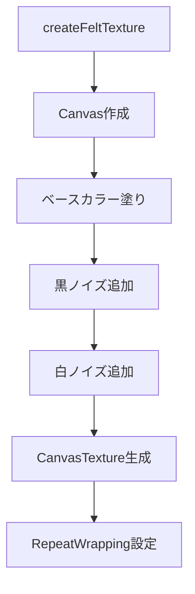
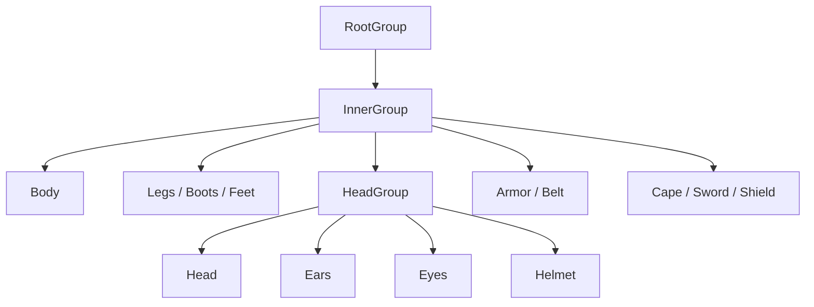

# 08. 3Dグラフィックス設計

> [!abstract] 概要
> 本ドキュメントはメッシュ生成アルゴリズム、フェルトテクスチャ、シーン構成を定義します。

---

## フェルトテクスチャ生成

### アルゴリズム概要

Canvas APIを使用して手続き的にフェルト風テクスチャを生成。



### 実装コード

```javascript
createFeltTexture(colorHex) {
    const canvas = document.createElement('canvas');
    canvas.width = 256;  // Block用（Player用は512）
    canvas.height = 256;
    const ctx = canvas.getContext('2d');

    // 1. ベースカラー塗りつぶし
    ctx.fillStyle = colorHex;
    ctx.fillRect(0, 0, 256, 256);

    // 2. 黒ノイズ（影の凹凸）
    for (let i = 0; i < 5000; i++) {
        const x = Math.random() * 256;
        const y = Math.random() * 256;
        const opacity = Math.random() * 0.1 + 0.05; // 5-15%
        ctx.fillStyle = `rgba(0, 0, 0, ${opacity})`;
        ctx.fillRect(x, y, 2, 2);
    }

    // 3. 白ノイズ（光の凹凸）
    for (let i = 0; i < 5000; i++) {
        const x = Math.random() * 256;
        const y = Math.random() * 256;
        const opacity = Math.random() * 0.1 + 0.05;
        ctx.fillStyle = `rgba(255, 255, 255, ${opacity})`;
        ctx.fillRect(x, y, 2, 2);
    }

    // 4. テクスチャ化
    const texture = new THREE.CanvasTexture(canvas);
    texture.wrapS = THREE.RepeatWrapping;
    texture.wrapT = THREE.RepeatWrapping;
    return texture;
}
```

### パラメータバリエーション

| 用途 | キャンバスサイズ | ノイズ数 |
|------|--------------|---------|
| PlayerMesh | 512×512 | 50,000 × 2 |
| Block | 256×256 | 5,000 × 2 |
| Slime | 256×256 | 10,000 × 2 |
| Rock | 256×256 | 10,000 × 2 |

---

## PlayerMesh（プレイヤーモデル）

### 構造



### 向き補正

```javascript
// モデルは+Z方向を向いて構築されている
// ゲームの前方は-Z方向なので180度回転
group.rotation.y = Math.PI;

// ルートグループで包んで外部からの回転操作を分離
const rootGroup = new THREE.Group();
rootGroup.add(group);
return rootGroup;
```

### マテリアル定義

| 名前 | 種別 | パラメータ |
|------|------|-----------|
| whiteFelt | MeshStandard | map: フェルトテクスチャ, bumpScale: 0.02, roughness: 1.0 |
| pinkFelt | MeshStandard | map: #FFB6C1テクスチャ, bumpScale: 0.01, roughness: 1.0 |
| blueFelt | MeshStandard | map: #0000FFテクスチャ, bumpScale: 0.01, roughness: 0.9, doubleSide |
| metal | MeshStandard | color: #888888, roughness: 0.4, metalness: 0.6 |
| darkMetal | MeshStandard | color: #333333, roughness: 0.5, metalness: 0.8 |
| leather | MeshStandard | color: #8B4513, roughness: 0.8 |
| black | MeshStandard | color: #111111, roughness: 0.8 |
| plasticBlack | MeshStandard | color: #000000, roughness: 0.1, metalness: 0.1 |
| highlightMat | MeshBasic | color: #FFFFFF |

### パーツ別ジオメトリ

#### Body（胴体）

```javascript
const bodyGeo = new THREE.SphereGeometry(0.4, 32, 32);
const body = new THREE.Mesh(bodyGeo, materials.whiteFelt);
body.position.y = 0.5;
body.castShadow = true;
```

#### Legs（脚）

```javascript
const legGeo = new THREE.CapsuleGeometry(0.1, 0.5, 4, 8);
// 左脚
legL.position.set(-0.15, 0.25, 0);
// 右脚
legR.position.set(0.15, 0.25, 0);

// ブーツ
const bootGeo = new THREE.CapsuleGeometry(0.12, 0.15, 4, 8);
// 足
const footGeo = new THREE.SphereGeometry(0.12, 16, 16);
foot.scale.set(1, 0.6, 1.5); // 平たく伸ばす
```

#### Head（頭部）

```javascript
// 頭グループ
headGroup.position.y = 0.95;

// 頭本体
const headGeo = new THREE.SphereGeometry(0.35, 32, 32);

// 耳
const earGeo = new THREE.CapsuleGeometry(0.08, 0.45, 4, 8);
earL.position.set(-0.12, 0.4, 0);
earL.rotation.z = 0.1;

// 耳内側（ピンク）
const innerEarGeo = new THREE.CapsuleGeometry(0.05, 0.35, 4, 8);
innerEarL.position.set(-0.12, 0.4, 0.06);

// 目
const eyeGeo = new THREE.SphereGeometry(0.05, 32, 32);
eyeL.position.set(-0.13, 0.05, 0.32);

// 目のハイライト
const highlightGeo = new THREE.SphereGeometry(0.015);
highlightL.position.set(-0.02, 0.02, 0.04); // 目に対する相対位置

// 鼻
const noseGeo = new THREE.SphereGeometry(0.02);
nose.position.set(0, -0.02, 0.34);

// 口
const mouthGeo = new THREE.CylinderGeometry(0.005, 0.005, 0.05);
mouthL.position.set(-0.02, -0.08, 0.32);
mouthL.rotation.z = 0.5;
mouthL.rotation.x = 1.5;
```

#### Helmet（ヘルメット）

```javascript
// 半球ヘルメット
const helmetGeo = new THREE.SphereGeometry(0.36, 32, 16, 0, Math.PI * 2, 0, Math.PI * 0.5);
helmet.position.y = 0.1;

// ヘルメットの縁
const rimGeo = new THREE.TorusGeometry(0.36, 0.03, 8, 32);
rim.rotation.x = Math.PI / 2;
rim.position.y = 0.1;

// ボルト（48個）
const boltGeo = new THREE.SphereGeometry(0.01);
for (let i = 0; i < 48; i++) {
    const angle = (i / 48) * Math.PI * 2;
    bolt.position.set(
        Math.cos(angle) * 0.40,
        0.12,
        Math.sin(angle) * 0.40
    );
}
```

#### Armor（鎧）

```javascript
// 胸当て
const armorGeo = new THREE.CylinderGeometry(0.41, 0.41, 0.3, 32);
armor.position.y = 0.65;

// 襟
const collarGeo = new THREE.TorusGeometry(0.41, 0.03, 8, 32);
collar.position.y = 0.8;
collar.rotation.x = Math.PI / 2;

// 胸のリベット（王家の紋章パターン）
const positions = [
    { x: 0, y: 0.65 },     // 中心
    { x: 0, y: 0.68 }, { x: 0, y: 0.62 },
    { x: -0.04, y: 0.65 }, { x: 0.04, y: 0.65 },
    // ... 13点配置
];
positions.forEach(pos => {
    const z = Math.sqrt(0.41 * 0.41 - pos.x * pos.x);
    bolt.position.set(pos.x, pos.y, z);
});

// 肩当て
const shoulderGeo = new THREE.SphereGeometry(0.16, 16, 16, 0, Math.PI * 2, 0, Math.PI * 0.75);
shoulderL.position.set(-0.35, 0.65, 0);
shoulderL.rotation.z = 0.5;

// ベルト
const beltGeo = new THREE.CylinderGeometry(0.42, 0.42, 0.08, 32);
belt.position.y = 0.45;

// バックル
const buckleGeo = new THREE.BoxGeometry(0.1, 0.1, 0.05);
buckle.position.set(0, 0.45, 0.4);
```

#### Accessories（装飾品）

```javascript
// ケープ
const capeGeo = new THREE.PlaneGeometry(0.6, 0.8);
cape.position.set(0, 0.8, -0.35);
cape.rotation.x = THREE.MathUtils.degToRad(10);
cape.rotation.y = THREE.MathUtils.degToRad(180);

// 剣（Sword）
const swordGroup = new THREE.Group();
swordGroup.position.set(0.5, 0.6, 0.3);
swordGroup.rotation.x = Math.PI / 4;
swordGroup.name = 'sword'; // PlayerCombatから参照

// 柄
const handleGeo = new THREE.CylinderGeometry(0.02, 0.02, 0.2);
// 鍔
const guardGeo = new THREE.BoxGeometry(0.2, 0.02, 0.05);
guard.position.y = 0.1;
// 刃
const bladeGeo = new THREE.BoxGeometry(0.06, 0.6, 0.02);
blade.position.y = 0.4;

// 盾
const shieldGeo = new THREE.CylinderGeometry(0.3, 0.3, 0.05, 32);
shield.position.set(-0.4, 0.6, 0.3);
shield.rotation.z = Math.PI / 2;
shield.rotation.y = Math.PI / 2;
```

---

## Slime（スライム）

### 構造

```javascript
// メイングループ
const group = new THREE.Group();

// 胴体（扁平球）
const bodyGeo = new THREE.SphereGeometry(0.4, 32, 32);
body.scale.set(1, 0.8, 1); // Y方向を80%に

// 目
const eyeGeo = new THREE.SphereGeometry(0.08, 16, 16);
eyeL.position.set(-0.15, 0.1, 0.3);
eyeR.position.set(0.15, 0.1, 0.3);

// 目のハイライト
const highlightGeo = new THREE.SphereGeometry(0.02);
highlightL.position.set(-0.03, 0.03, 0.07);
```

### アニメーションパラメータ

| パラメータ | 値 | 説明 |
|-----------|-----|------|
| timeOffset | random() * 100 | 位相ずらし |
| bounceSpeed | 3.0 | バウンス速度 |
| bounceHeight | 0.3 | バウンス高さ |
| originalY | 0.5 | 基準Y座標 |

### バウンスアニメーション

```javascript
// AliveState.update()
const bounce = Math.sin((time + this.slime.timeOffset) * this.slime.bounceSpeed);

// Y座標
const heightFactor = (bounce + 1) * 0.5; // 0〜1に正規化
this.slime.mesh.position.y = this.slime.originalY + heightFactor * this.slime.bounceHeight;

// スケール（スクワッシュ＆ストレッチ）
const scaleY = 0.8 + (bounce * 0.1);    // 0.7〜0.9
const scaleXZ = 1.0 - (bounce * 0.05);  // 0.95〜1.05
this.slime.mesh.scale.set(scaleXZ, scaleY, scaleXZ);
```

### カラー

- 本体: #32CD32（ライムグリーン）
- 目: #000000（プラスチックブラック）
- ハイライト: #FFFFFF

---

## Block（ブロック）

### ジオメトリ

```javascript
const geometry = new THREE.BoxGeometry(1, 1, 1);
```

### カラーマップ

```javascript
const colorMap = {
    'stone':      '#808080',  // グレー
    'stone_dark': '#555555',  // ダークグレー
    'wood':       '#A0522D',  // シエナ
    'leaves':     '#228B22',  // フォレストグリーン
    'default':    '#8B4513'   // サドルブラウン（土）
};
```

### マテリアル設定

```javascript
const material = new THREE.MeshStandardMaterial({
    map: texture,
    bumpMap: texture,
    bumpScale: 0.05,
    roughness: 0.9
});

mesh.castShadow = true;
mesh.receiveShadow = true;
```

---

## Tree（木）

### 構造

```javascript
const group = new THREE.Group();
group.position.set(x, 0, z);

// 幹
const trunkGeo = new THREE.CylinderGeometry(0.2, 0.3, 2, 8);
const trunkMat = new THREE.MeshStandardMaterial({ color: 0x8B4513 });
trunk.position.y = 1;

// 葉（円錐）
const leavesGeo = new THREE.ConeGeometry(1.5, 3, 8);
const leavesMat = new THREE.MeshStandardMaterial({ color: 0x228B22 });
leaves.position.y = 3;
```

### 衝突判定パラメータ

| パラメータ | 値 |
|-----------|-----|
| obstacleRadius | 0.3 |
| obstacleHeight | position.y + 10.0 |
| playerRadius | 0.4 |

---

## Rock（岩）

### ジオメトリ

```javascript
// 12面体で低ポリ岩風
const rockGeo = new THREE.DodecahedronGeometry(0.5 * scale, 0);

// ランダム回転でバリエーション
rock.rotation.set(
    Math.random() * Math.PI,
    Math.random() * Math.PI,
    Math.random() * Math.PI
);

// 地面に埋め込み
rock.position.y = 0.3 * scale;
```

### カラー

- #808080（グレー）

---

## シーン構成

### ライティング

```javascript
// 環境光
const ambientLight = new THREE.AmbientLight(0x404040, 2);

// 平行光源（太陽）
const directionalLight = new THREE.DirectionalLight(0xffffff, 2);
directionalLight.position.set(5, 10, 7.5);
directionalLight.castShadow = true;
```

### 地面

```javascript
const groundGeo = new THREE.PlaneGeometry(100, 100);
const groundMat = new THREE.MeshStandardMaterial({ color: 0x999999 });
const ground = new THREE.Mesh(groundGeo, groundMat);
ground.rotation.x = -Math.PI / 2;
ground.receiveShadow = true;
```

### 背景色

```javascript
this.scene.background = new THREE.Color(0x87CEEB); // スカイブルー
```

### カメラ設定

```javascript
const camera = new THREE.PerspectiveCamera(
    75,                              // FOV
    window.innerWidth / window.innerHeight, // アスペクト比
    0.1,                             // near
    1000                             // far
);
camera.position.set(0, 1.6, 3);      // VR標準高さ
```

---

## レンダラー設定

```javascript
const renderer = new THREE.WebGLRenderer({ antialias: true });
renderer.setSize(window.innerWidth, window.innerHeight);
renderer.xr.enabled = true;
renderer.shadowMap.enabled = true;
```

---

## mesh.userData.entity パターン

### 目的

レイキャストでヒットしたメッシュから対応するエンティティを逆引きする。

### 実装

```javascript
// エンティティ作成時
this.mesh.userData.entity = this;

// BuildSystemでの使用例
const intersects = raycaster.intersectObjects(objects);
const hit = intersects[0];
const entity = hit.object.userData.entity;
if (entity && entity.type === 'Block') {
    // ブロック削除処理
}
```

---

## 初期城生成

### アルゴリズム

```javascript
createInitialCastle() {
    const castleX = -10;
    const castleZ = -10;
    const size = 8;
    const height = 6;

    // 座標生成
    const coordinates = [];
    for (let y = 1; y <= height; y++) {
        for (let x = 0; x < size; x++) {
            for (let z = 0; z < size; z++) {
                coordinates.push({ x, y, z });
            }
        }
    }

    coordinates
        .filter(({ x, z }) => x === 0 || x === size - 1 || z === 0 || z === size - 1) // 壁のみ
        .filter(({ x, y, z }) => !(y > 2 && (x + z) % 3 === 0)) // 窓穴
        .forEach(({ x, y, z }) => {
            const block = new Block(castleX + x, y, castleZ + z, 'stone_dark');
            this.entityManager.add(block);
            this.collidables.push(block.mesh);
        });
}
```

### パラメータ

| パラメータ | 値 | 説明 |
|-----------|-----|------|
| castleX | -10 | 城の左下X座標 |
| castleZ | -10 | 城の左下Z座標 |
| size | 8 | 城の幅・奥行き |
| height | 6 | 城の高さ |
| 窓条件 | y > 2 && (x + z) % 3 === 0 | 3階以上で3ブロック間隔 |

---

## 関連ドキュメント

- [[07_セーブシステム設計|前: セーブシステム設計]]
- [[09_UI設計|次: UI設計]]
- [[_MOC_設計書|設計書目次]]

---

## 更新履歴

| 日付 | 内容 |
|------|------|
| 2025-11-23 | 初版作成 |
