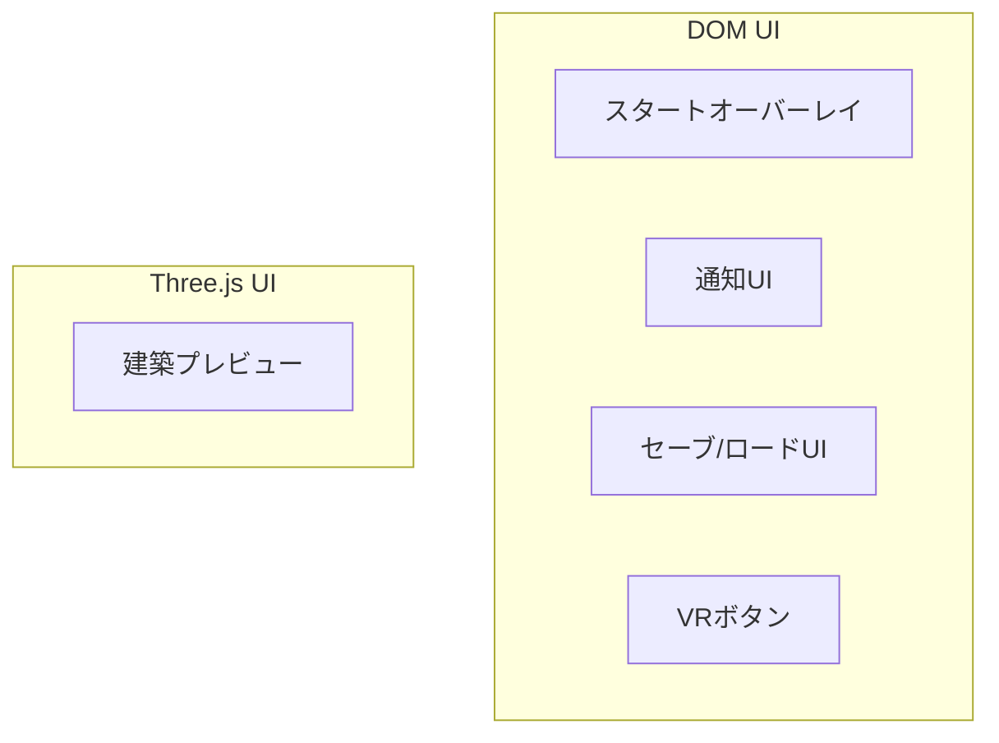
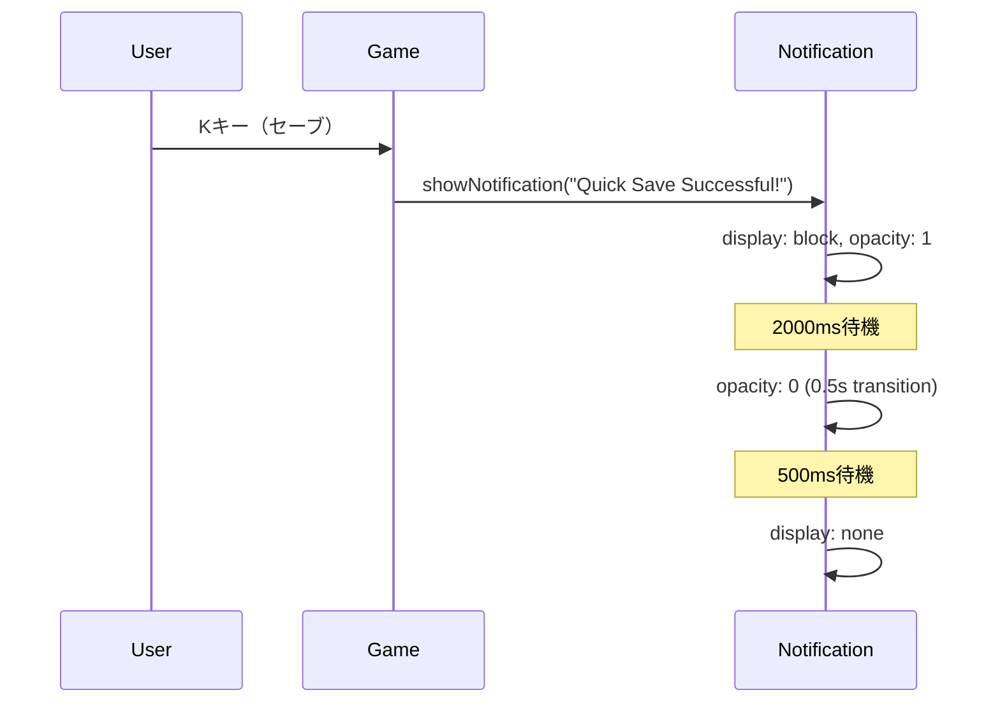

# 09. UI設計

> [!abstract] 概要
> 本ドキュメントはゲーム内UIコンポーネント（オーバーレイ、通知、セーブUI）を定義します。

---

## UI構成概要



| コンポーネント | 責務 | 生成場所 |
|--------------|------|---------|
| スタートオーバーレイ | ゲーム開始、AudioContext起動 | Game constructor |
| 通知UI | 一時メッセージ表示 | Game.createNotificationUI() |
| セーブ/ロードUI | データ管理ダイアログ | SaveLoadUI constructor |
| VRボタン | VRモード開始 | VRButton.createButton() |
| 建築プレビュー | ブロック配置位置表示 | BuildSystem constructor |

---

## スタートオーバーレイ

### 目的

1. ユーザーインタラクションを待ってAudioContextを起動
2. 操作説明を表示

### 実装

```javascript
// Game constructor内
const overlay = document.createElement('div');

// スタイル
overlay.style.position = 'absolute';
overlay.style.top = '0';
overlay.style.left = '0';
overlay.style.width = '100%';
overlay.style.height = '100%';
overlay.style.backgroundColor = 'rgba(0,0,0,0.7)';
overlay.style.color = 'white';
overlay.style.display = 'flex';
overlay.style.justifyContent = 'center';
overlay.style.alignItems = 'center';
overlay.style.fontSize = '24px';
overlay.style.cursor = 'pointer';

// 内容
overlay.innerHTML = `Click to Start<br>
<span style="font-size: 16px">
WASD/Arrows to Move | Space to Jump | Click to Attack<br>
B: Build Mode | K: Quick Save | L: Quick Load | M: Data Menu
</span>`;

document.body.appendChild(overlay);
```

### イベントハンドラ

```javascript
overlay.addEventListener('click', () => {
    overlay.style.display = 'none';
    this.audioManager.resumeContext();
    window.focus();
});

// バックアップ起動（キーボード操作でも開始可能）
window.addEventListener('keydown', () => {
    this.audioManager.resumeContext();
}, { once: true });
```

### スタイル詳細

| プロパティ | 値 |
|-----------|-----|
| position | absolute |
| top, left | 0 |
| width, height | 100% |
| backgroundColor | rgba(0,0,0,0.7) |
| color | white |
| display | flex |
| justifyContent | center |
| alignItems | center |
| fontSize | 24px |
| cursor | pointer |

---

## 通知UI

### 目的

セーブ/ロード完了などの一時メッセージを表示。

### 実装

```javascript
// Game.createNotificationUI()
createNotificationUI() {
    this.notification = document.createElement('div');

    // スタイル
    this.notification.style.position = 'absolute';
    this.notification.style.top = '20px';
    this.notification.style.right = '20px';
    this.notification.style.padding = '10px 20px';
    this.notification.style.backgroundColor = 'rgba(0, 0, 0, 0.7)';
    this.notification.style.color = 'white';
    this.notification.style.borderRadius = '5px';
    this.notification.style.fontFamily = 'sans-serif';
    this.notification.style.display = 'none';
    this.notification.style.transition = 'opacity 0.5s';

    document.body.appendChild(this.notification);
}
```

### 表示メソッド

```javascript
showNotification(message, duration = 2000) {
    this.notification.innerText = message;
    this.notification.style.display = 'block';
    this.notification.style.opacity = '1';

    // 既存タイマーをクリア
    if (this.notificationTimeout) clearTimeout(this.notificationTimeout);

    // フェードアウト開始
    this.notificationTimeout = setTimeout(() => {
        this.notification.style.opacity = '0';

        // 完全に非表示
        setTimeout(() => {
            this.notification.style.display = 'none';
        }, 500);
    }, duration);
}
```

### タイミング



### スタイル詳細

| プロパティ | 値 |
|-----------|-----|
| position | absolute |
| top | 20px |
| right | 20px |
| padding | 10px 20px |
| backgroundColor | rgba(0, 0, 0, 0.7) |
| color | white |
| borderRadius | 5px |
| fontFamily | sans-serif |
| display | none (初期) |
| transition | opacity 0.5s |

---

## セーブ/ロードUI（SaveLoadUI）

### 構造

```
┌──────────────────────────────────────┐
│          Data Management             │  Header (h2)
├──────────────────────────────────────┤
│ ┌──────────────────────────────────┐ │
│ │ + New Save          [Save New]   │ │  新規スロット
│ ├──────────────────────────────────┤ │
│ │ Slot 1700000000000               │ │
│ │ 2024/1/15 12:30 - Player at 5,-10│ │  既存スロット
│ │        [Overwrite][Load][Delete] │ │
│ ├──────────────────────────────────┤ │
│ │ Slot 1699999999999               │ │
│ │ 2024/1/15 10:00 - Quick Save...  │ │
│ │        [Overwrite][Load][Delete] │ │
│ └──────────────────────────────────┘ │  List (overflow-y: auto)
├──────────────────────────────────────┤
│              [Close]                 │  閉じるボタン
└──────────────────────────────────────┘
```

### コンテナスタイル

```javascript
this.container.style.position = 'absolute';
this.container.style.top = '50%';
this.container.style.left = '50%';
this.container.style.transform = 'translate(-50%, -50%)';
this.container.style.width = '700px';
this.container.style.height = '600px';
this.container.style.backgroundColor = 'rgba(20, 20, 30, 0.95)';
this.container.style.border = '2px solid #444';
this.container.style.borderRadius = '10px';
this.container.style.display = 'none';
this.container.style.flexDirection = 'column';
this.container.style.padding = '20px';
this.container.style.color = '#eee';
this.container.style.fontFamily = 'sans-serif';
this.container.style.zIndex = '1000';
this.container.style.boxShadow = '0 0 20px rgba(0,0,0,0.8)';
```

### 表示/非表示

```javascript
show() {
    this.isVisible = true;
    this.container.style.display = 'flex';
    this.refreshList();
}

hide() {
    this.isVisible = false;
    this.container.style.display = 'none';
}
```

### リスト更新

```javascript
refreshList() {
    this.container.innerHTML = '';

    // ヘッダー
    const header = document.createElement('h2');
    header.innerText = 'Data Management';
    header.style.textAlign = 'center';
    header.style.marginTop = '0';
    this.container.appendChild(header);

    // リストコンテナ
    const list = document.createElement('div');
    list.style.flex = '1';
    list.style.overflowY = 'auto';
    list.style.marginTop = '10px';
    list.style.border = '1px solid #333';
    list.style.backgroundColor = '#111';
    this.container.appendChild(list);

    // 新規スロット（常に最上部）
    const newSlot = this.createSlotElement(
        { id: 'new', summary: 'Create New Save Data', timestamp: null },
        true
    );
    list.appendChild(newSlot);

    // 既存スロット
    const slots = this.saveManager.getSlots();
    slots.forEach(slot => {
        list.appendChild(this.createSlotElement(slot));
    });

    // 閉じるボタン
    const closeBtn = document.createElement('button');
    closeBtn.innerText = 'Close';
    closeBtn.style.marginTop = '15px';
    closeBtn.style.padding = '10px';
    closeBtn.style.backgroundColor = '#555';
    closeBtn.style.color = 'white';
    closeBtn.style.border = 'none';
    closeBtn.style.cursor = 'pointer';
    closeBtn.style.fontSize = '16px';
    closeBtn.onclick = () => this.hide();
    this.container.appendChild(closeBtn);
}
```

### スロット要素生成

```javascript
createSlotElement(slot, isNew = false) {
    const item = document.createElement('div');

    // スタイル
    item.style.display = 'flex';
    item.style.justifyContent = 'space-between';
    item.style.alignItems = 'center';
    item.style.padding = '15px';
    item.style.borderBottom = '1px solid #333';
    item.style.transition = 'background-color 0.2s';

    // ホバー効果
    item.onmouseover = () => item.style.backgroundColor = '#222';
    item.onmouseout = () => item.style.backgroundColor = 'transparent';

    // 情報部分
    const info = document.createElement('div');
    if (isNew) {
        info.innerHTML = `<strong>+ New Save</strong>`;
    } else {
        const date = new Date(slot.timestamp).toLocaleString();
        info.innerHTML = `<strong>Slot ${slot.id}</strong><br>
            <span style="font-size: 12px; color: #aaa">
            ${date} - ${slot.summary}</span>`;
    }
    item.appendChild(info);

    // アクションボタン
    const actions = document.createElement('div');
    actions.style.display = 'flex';
    actions.style.gap = '8px';
    // ... ボタン追加
    item.appendChild(actions);

    return item;
}
```

### ボタンスタイル

| ボタン | 背景色 | 用途 |
|-------|--------|------|
| Save New | #27ae60 | 新規保存 |
| Overwrite | #f39c12 | 上書き保存 |
| Load | #2980b9 | 読み込み |
| Delete | #c0392b | 削除 |
| Close | #555 | 閉じる |

共通スタイル:
```javascript
button.style.padding = '5px 10px';
button.style.cursor = 'pointer';
button.style.color = 'white';
button.style.border = 'none';
button.style.borderRadius = '3px';
```

---

## 建築プレビュー（BuildSystem）

### 目的

ブロック配置位置をワイヤーフレームで表示。

### 実装

```javascript
// BuildSystem constructor内
const previewGeo = new THREE.BoxGeometry(1, 1, 1);
const previewMat = new THREE.MeshBasicMaterial({
    color: 0x00ff00,    // 緑
    wireframe: true,
    transparent: true,
    opacity: 0.5
});
this.preview = new THREE.Mesh(previewGeo, previewMat);
this.preview.visible = false;
this.scene.add(this.preview);
```

### 表示制御

```javascript
// BuildSystem.update()内
if (this.buildMode && intersects.length > 0) {
    // 配置位置を計算
    const pos = intersects[0].point.clone()
        .add(intersects[0].face.normal);
    this.preview.position.set(
        Math.round(pos.x),
        Math.round(pos.y),
        Math.round(pos.z)
    );
    this.preview.visible = true;
} else {
    this.preview.visible = false;
}
```

### プレビュースタイル

| プロパティ | 値 |
|-----------|-----|
| geometry | BoxGeometry(1, 1, 1) |
| color | 0x00ff00 (緑) |
| wireframe | true |
| transparent | true |
| opacity | 0.5 |

---

## VRボタン

### 生成

```javascript
document.body.appendChild(VRButton.createButton(this.renderer));
```

Three.jsの標準VRButton を使用。VR対応ブラウザで「ENTER VR」ボタンを表示。

---

## index.html エラーハンドラ

### 実装

```html
<div id="error-container" style="
    display: none;
    position: fixed;
    top: 0;
    left: 0;
    width: 100%;
    height: 100%;
    background: rgba(0,0,0,0.9);
    color: #ff6b6b;
    padding: 20px;
    font-family: monospace;
    overflow: auto;
    z-index: 9999;
">
    <h1>Error Occurred</h1>
    <pre id="error-message"></pre>
</div>
```

### JavaScriptハンドラ

```javascript
window.addEventListener('error', (event) => {
    const container = document.getElementById('error-container');
    const message = document.getElementById('error-message');
    container.style.display = 'block';
    message.textContent = `${event.message}\n\nFile: ${event.filename}\nLine: ${event.lineno}`;
});
```

### スタイル詳細

| プロパティ | 値 |
|-----------|-----|
| display | none (初期) → block (エラー時) |
| position | fixed |
| background | rgba(0,0,0,0.9) |
| color | #ff6b6b (赤) |
| padding | 20px |
| fontFamily | monospace |
| zIndex | 9999 |

---

## Z-Index階層

| 要素 | z-index |
|------|---------|
| エラーコンテナ | 9999 |
| SaveLoadUI | 1000 |
| スタートオーバーレイ | (デフォルト) |
| 通知UI | (デフォルト) |

---

## UI状態管理

### ポーズ機能との連携

```javascript
// Game.render()内
if (this.saveLoadUI.isVisible) {
    // UI表示中はゲーム更新をスキップ
    this.renderer.render(this.scene, this.camera);
    return;
}
```

### 状態フラグ

| クラス | プロパティ | 型 | 用途 |
|-------|-----------|-----|------|
| SaveLoadUI | isVisible | boolean | UI表示状態 |
| BuildSystem | buildMode | boolean | 建築モード |

---

## 関連ドキュメント

- [[08_3Dグラフィックス設計|前: 3Dグラフィックス設計]]
- [[10_データ定義書|次: データ定義書]]
- [[_MOC_設計書|設計書目次]]

---

## 更新履歴

| 日付 | 内容 |
|------|------|
| 2025-11-23 | 初版作成 |
