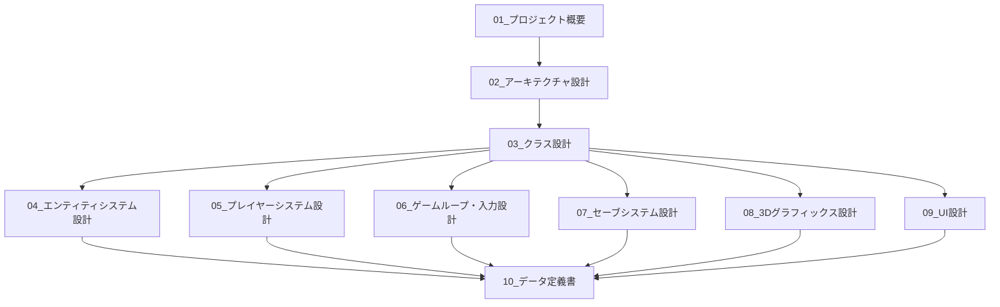

# 設計書 - フェルトうさぎパラディン

> [!abstract] 概要
> 本設計書は「フェルトうさぎパラディン（Felt Rabbit Paladin WebXR）」プロジェクトを**一から再構築可能なレベル**で文書化したものです。

---

## 目的

**このドキュメント群だけを読んで、同じアプリケーションを実装できる**

- コードを見なくても、同等の機能を持つアプリケーションを新規実装できる
- 全てのクラス、メソッド、プロパティの仕様が明確に定義されている
- 数値定数、座標、色など全てのマジックナンバーが文書化されている

---

## プロジェクト概要

| 項目 | 値 |
|------|-----|
| **プロジェクト名** | Felt Rabbit Paladin WebXR |
| **総ソースコード** | 約2,200行（20ファイル） |
| **主要技術** | Three.js, Vite, Web Audio API, WebXR |
| **対象プラットフォーム** | Web（デスクトップ）、VR |

---

## ドキュメント一覧

### 基盤ドキュメント

| 番号 | タイトル | 内容 | 状態 |
|-----|---------|------|------|
| 00 | [[ドキュメント作成計画]] | 設計書作成の計画と品質基準 | 🟢 |
| 01 | [[01_プロジェクト概要]] | 技術スタック、環境構築、起動方法 | 🟢 |
| 02 | [[02_アーキテクチャ設計]] | レイヤー構造、依存関係図、設計パターン | 🟢 |

### コア設計ドキュメント

| 番号 | タイトル | 内容 | 状態 |
|-----|---------|------|------|
| 03 | [[03_クラス設計]] | 全クラスの詳細仕様 | 🟢 |
| 04 | [[04_エンティティシステム設計]] | Entity継承関係、ライフサイクル | 🟢 |
| 05 | [[05_プレイヤーシステム設計]] | コンポーネント構成、物理・戦闘・衝突 | 🟢 |

### システム設計ドキュメント

| 番号 | タイトル | 内容 | 状態 |
|-----|---------|------|------|
| 06 | [[06_ゲームループ・入力設計]] | メインループ、入力マッピング | 🟢 |
| 07 | [[07_セーブシステム設計]] | データ構造、永続化フロー | 🟢 |

### グラフィックス・UI設計ドキュメント

| 番号 | タイトル | 内容 | 状態 |
|-----|---------|------|------|
| 08 | [[08_3Dグラフィックス設計]] | メッシュ生成、テクスチャ、シーン構成 | 🟢 |
| 09 | [[09_UI設計]] | 通知、セーブUI、オーバーレイ | 🟢 |

### リファレンス

| 番号 | タイトル | 内容 | 状態 |
|-----|---------|------|------|
| 10 | [[10_データ定義書]] | 全定数、設定値、キーマップ | 🟢 |

---

## 推奨読み順

### 全体把握から詳細へ

### 実装順序（推奨）

1. **環境構築**: 01_プロジェクト概要 → package.json, index.html
2. **基本構造**: 02_アーキテクチャ設計 → main.js, Game.js スケルトン
3. **エンティティ基盤**: 04_エンティティシステム設計 → Entity.js, EntityManager.js
4. **入力システム**: 06_ゲームループ・入力設計 → Input.js
5. **プレイヤー**: 05_プレイヤーシステム設計 → Player*.js
6. **3D描画**: 08_3Dグラフィックス設計 → メッシュ生成
7. **敵・環境**: 04_エンティティシステム設計 → Slime.js, Block.js, etc.
8. **システム**: 07_セーブシステム設計 → SaveManager.js
9. **UI**: 09_UI設計 → オーバーレイ、通知

---

## ソースファイル対応表

| ソースファイル | 主な解説ドキュメント |
|--------------|-------------------|
| main.js | [[01_プロジェクト概要]] |
| Game.js | [[02_アーキテクチャ設計]], [[06_ゲームループ・入力設計]] |
| Entity.js | [[04_エンティティシステム設計]] |
| EntityManager.js | [[04_エンティティシステム設計]] |
| Player.js | [[05_プレイヤーシステム設計]] |
| PlayerMesh.js | [[08_3Dグラフィックス設計]] |
| PlayerPhysics.js | [[05_プレイヤーシステム設計]] |
| PlayerCombat.js | [[05_プレイヤーシステム設計]] |
| PlayerCollision.js | [[05_プレイヤーシステム設計]] |
| Slime.js | [[04_エンティティシステム設計]] |
| Block.js | [[04_エンティティシステム設計]] |
| Tree.js | [[04_エンティティシステム設計]] |
| Rock.js | [[04_エンティティシステム設計]] |
| Input.js | [[06_ゲームループ・入力設計]] |
| CameraManager.js | [[03_クラス設計]] |
| WorldManager.js | [[03_クラス設計]] |
| BuildSystem.js | [[03_クラス設計]] |
| SaveManager.js | [[07_セーブシステム設計]] |
| SaveLoadUI.js | [[09_UI設計]] |
| AudioManager.js | [[03_クラス設計]] |

---

## 凡例

| 記号 | 意味 |
|------|------|
| 🟢 | 完成 |
| 🟡 | 作成中 |
| 🔴 | 未着手 |

---

## 作成情報

| 項目 | 値 |
|------|-----|
| **作成者** | Claude Code |
| **作成日** | 2025-11-23 |
| **ソース解析手法** | リバースエンジニアリング |

---

## 更新履歴

| 日付 | 内容 |
|------|------|
| 2025-11-23 | 初版作成（フェーズ1完了） |
| 2025-11-23 | 全ドキュメント完成（00-10） |
