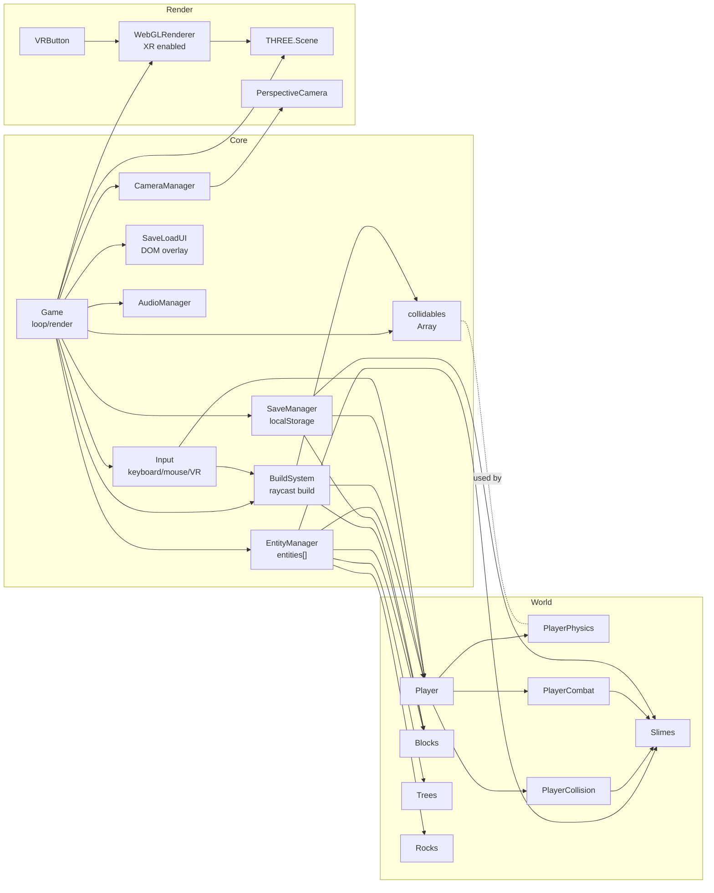

英名: ArchitectureDiagram.md

# アーキテクチャ図

ゲーム全体の構成をMermaidで図示します（主要コンポーネント間の依存・データ流れ）。

- Coreがゲームループと状態管理、Worldがエンティティ群、RenderがThree.js/VR周りを担当します。
- `collidables` は物理専用の共有リストで、BlocksとRocksが初期登録されます。
- Save/Loadはプレイヤー状態とBlock/Slimeの永続化に限られています。
