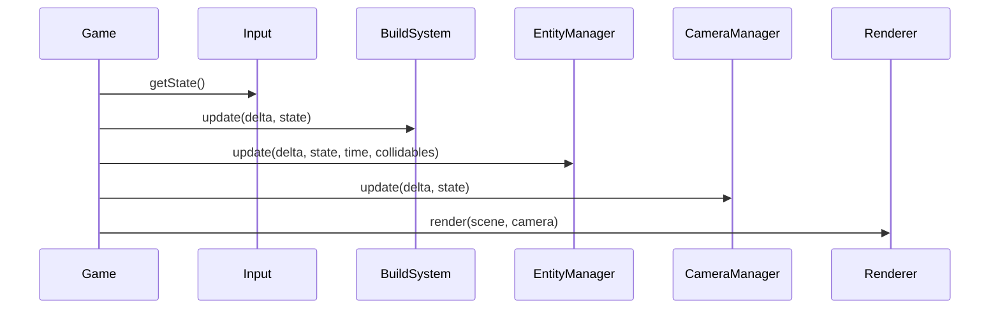
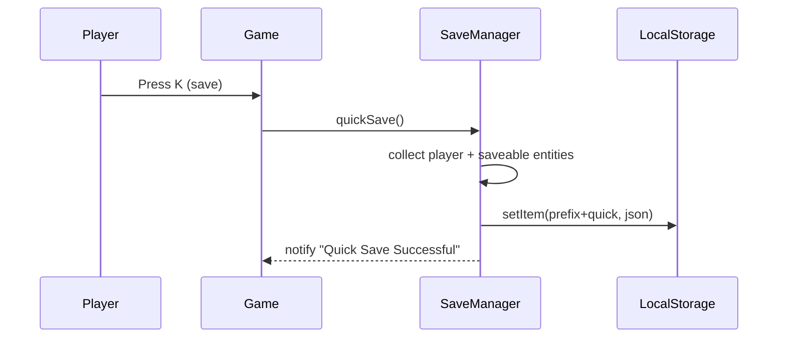
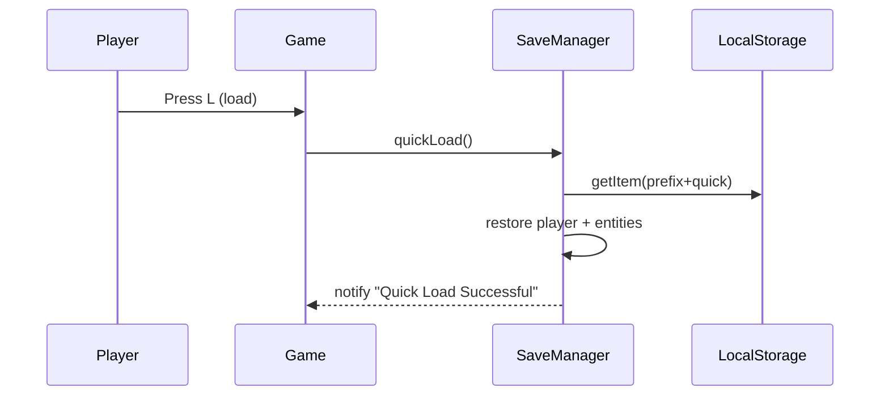
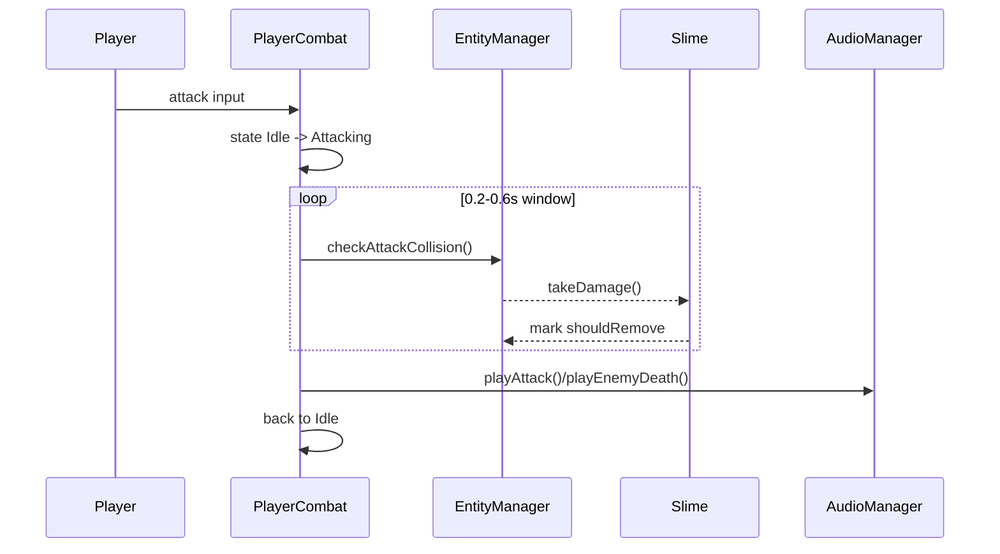
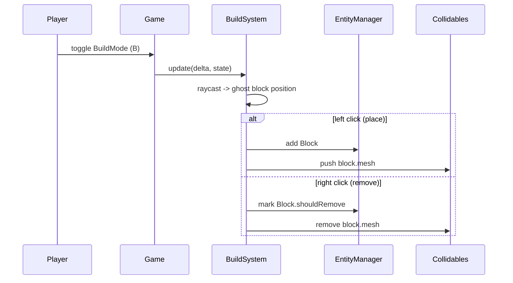

英名: SequenceDiagrams.md

# Sequence Diagrams

## Game Loop (per frame)

```mermaid
sequenceDiagram
    participant Game
    participant Input
    participant BuildSystem
    participant EntityManager
    participant CameraManager
    participant Renderer

    Game->>Input: getState()
    Game->>BuildSystem: update(delta, state)
    Game->>EntityManager: update(delta, state, time, collidables)
    Game->>CameraManager: update(delta, state)
    Game->>Renderer: render(scene, camera)
```

## Save (Quick Save)

```mermaid
sequenceDiagram
    participant Player
    participant Game
    participant SaveManager
    participant LocalStorage

    Player->>Game: Press K (save)
    Game->>SaveManager: quickSave()
    SaveManager->>SaveManager: collect player + saveable entities
    SaveManager->>LocalStorage: setItem(prefix+quick, json)
    SaveManager-->>Game: notify "Quick Save Successful"
```

## Load (Quick Load)

```mermaid
sequenceDiagram
    participant Player
    participant Game
    participant SaveManager
    participant LocalStorage

    Player->>Game: Press L (load)
    Game->>SaveManager: quickLoad()
    SaveManager->>LocalStorage: getItem(prefix+quick)
    SaveManager->>SaveManager: restore player + entities
    SaveManager-->>Game: notify "Quick Load Successful"
```

## Attack

```mermaid
sequenceDiagram
    participant Player
    participant PlayerCombat
    participant EntityManager
    participant Slime
    participant AudioManager

    Player->>PlayerCombat: attack input
    PlayerCombat->>PlayerCombat: state Idle -> Attacking
    loop 0.2-0.6s window
        PlayerCombat->>EntityManager: checkAttackCollision()
        EntityManager-->>Slime: takeDamage()
        Slime-->>EntityManager: mark shouldRemove
    end
    PlayerCombat->>AudioManager: playAttack()/playEnemyDeath()
    PlayerCombat->>PlayerCombat: back to Idle
```

## Build (Place/Remove Block)

```mermaid
sequenceDiagram
    participant Player
    participant Game
    participant BuildSystem
    participant EntityManager
    participant Collidables

    Player->>Game: toggle BuildMode (B)
    Game->>BuildSystem: update(delta, state)
    BuildSystem->>BuildSystem: raycast -> ghost block position
    alt left click (place)
        BuildSystem->>EntityManager: add Block
        BuildSystem->>Collidables: push block.mesh
    else right click (remove)
        BuildSystem->>EntityManager: mark Block.shouldRemove
        BuildSystem->>Collidables: remove block.mesh
    end
```

