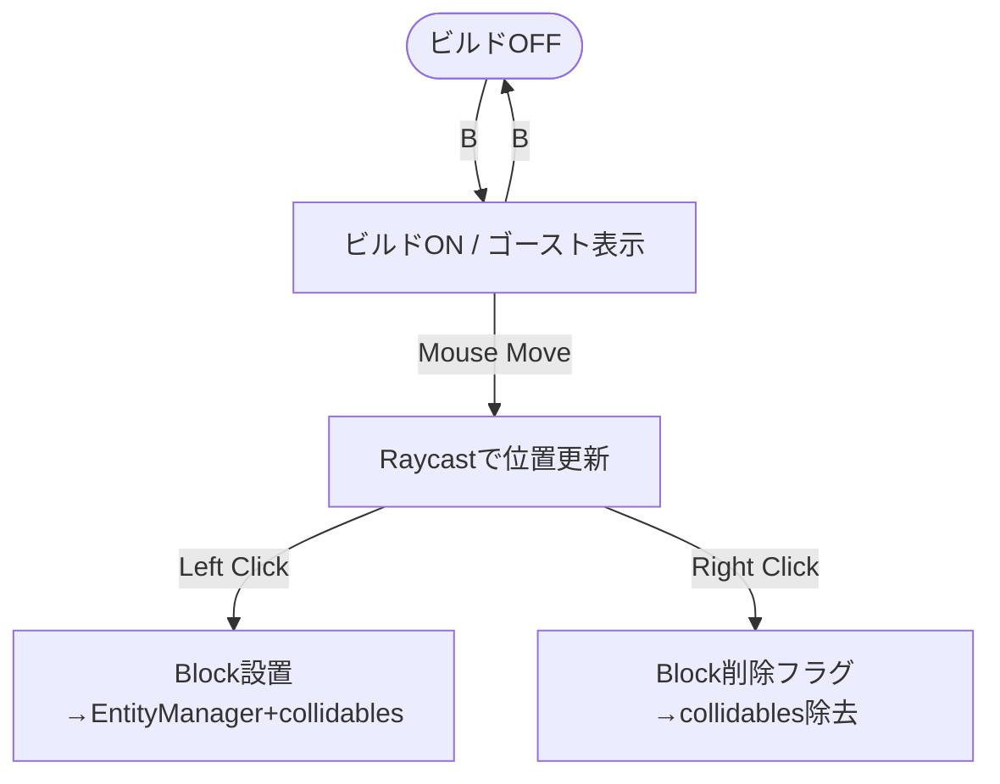
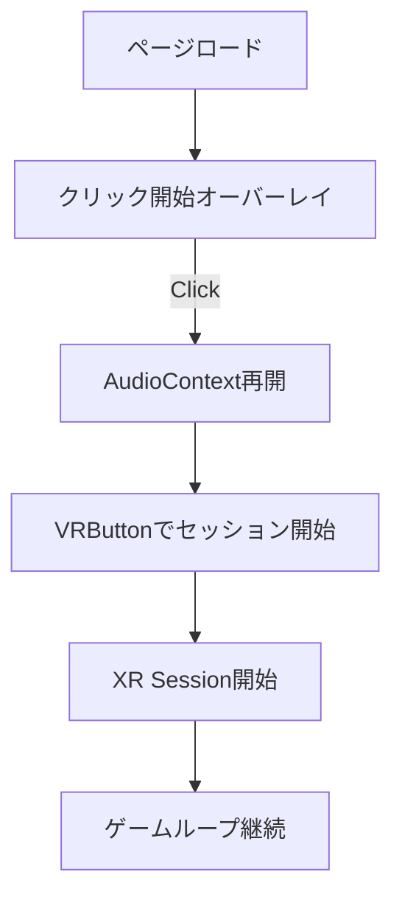

英名: Flows.md

# UX Flows

主要なユーザーフローをMermaidで表現します。

## セーブUIフロー
```mermaid
flowchart TD
  Start([プレイ中]) -->|Press M| Open[セーブ/ロードUI表示]
  Open -->|Select Slot + Save| Save[save(slotId)] --> Notify[通知表示]
  Open -->|Select Slot + Load| Load[load(slotId)] --> Notify
  Open -->|Delete Slot| Delete[delete(slotId)] --> Notify
  Open -->|Press M| Close([UIを閉じる])
```

## ビルドモードフロー


## VR起動フロー


