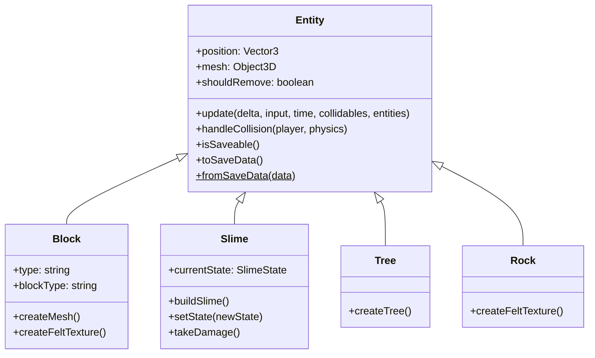

# エンティティシステム

## クラス階層
すべてのゲームオブジェクトは `Entity` クラスを継承する。

## エンティティ詳細

### 1. Block (ブロック)
- **役割**: プレイヤーが配置・破壊可能な建築ブロック。
- **種類**: `stone`, `stone_dark`, `wood`, `leaves` (デフォルトは土)。
- **テクスチャ**: Canvas APIを使用して動的にフェルト風テクスチャを生成。
- **セーブ**: `isSaveable()` が `true`。座標とタイプを保存。

### 2. Slime (スライム)
- **役割**: 敵キャラクター。
- **AI**: State Pattern (`AliveState`, `DeadState`) を使用。
  - `AliveState`: 跳ねるアニメーション (`Math.sin` 利用)。プレイヤーと接触するとノックバックを与える。
  - `DeadState`: 死亡アニメーション（縮小）。完了後に削除フラグ (`shouldRemove`) を立てる。
- **外観**: Three.js のプリミティブ (`SphereGeometry`) を組み合わせたグループ。
- **セーブ**: 生存している場合のみ保存。

### 3. Tree (木)
- **役割**: 静的な障害物。
- **衝突判定**: 円柱状の当たり判定を持つ。プレイヤーが近づくと押し返す (`pushAmount`) 処理を `handleCollision` で実装。
- **セーブ**: 対象外（ワールド生成時に配置されるため）。

### 4. Rock (岩)
- **役割**: 静的な障害物。
- **外観**: `DodecahedronGeometry` を使用したローポリゴン風の岩。
- **セーブ**: 対象外。

## EntityManager
- シーン内の全エンティティを配列で管理。
- `update()` メソッドで全エンティティの更新と、`shouldRemove` フラグが立ったエンティティの削除を行う。
- `add()` / `remove()` でエンティティの追加・削除とシーンへの反映を行う。
